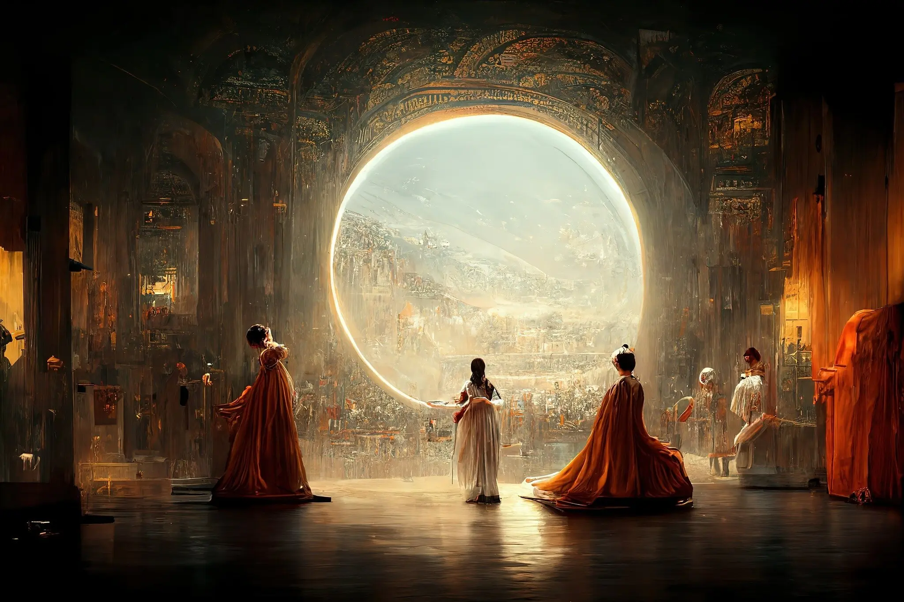

今年随着Stable Diffusion的大火，于是调研了一下当前市场上的相关产品。

<!-- more -->

# 市场上的产品

## **DALL-E**（[https://labs.openai.com/](https://labs.openai.com/ "https://labs.openai.com/")）

2021年1月5日，OpenAI公司发布的第一代AI绘图工具。只需要一句简单的描述语言就可以生成图片。

需要购买credit来使用DALL-E。

## Midjourney（[https://www.midjourney.com/](https://www.midjourney.com/ "https://www.midjourney.com/")）

Midjourney是由Midjourney公司于2022年7月12日公开的文本生成图像服务。第五版的alpha模型于2023年3月15日发布。

大部分工作Midjourney都通过Discord来完成。Discord有Bot，你可以把它理解为机器人，或者插件，允许第三方在Discord提供的接口下独自开发。Midjourney通过在Discord上创建了自己的服务器，并创建了大量的频道，以及开发了自己的机器人，来向用户提供服务。

### 使用教程

账号注册之后，进入新手的newbie频道就可以快速生成图片：

在newbie频道，输入`/`命令可以显示所有的命令：

当你输入`/imagine + 提示词`，再回车，相当于把Prompt提交给bot，接着会进入生成过程。

完成之后会让你从4张图中选择，你可以从4张图中选择一张来U（Upscale，放大像素并提升细节），或者V（Variation，基于所选图片来延伸变形），1-4代表着左上到右下的4张照片。

比如点击U2，就生成了最终的图

还可以做变形、网页打开原图，给出反馈等操作。

目前免费额度已经被取消，用户需要以包月或者包年购买的方式来使用Midjourney。

2022年8月底，美国科罗拉多州博览会的美术大赛公布了获奖结果，一幅名为《太空歌剧院（Théâtre D’opéra Spatial）》的作品在“数字艺术”类别中摘得了桂冠。

获奖之后，这幅作品被爆料是作者用AI生成的，Midjourney就是背后的AI。Midjourney在8月底只有30左右用户，到了9月底就达到了150万用户。这次美术大赛时间对他们用户带来了巨大的增长。

## Stable Diffusion（[https://stablediffusionweb.com/](https://stablediffusionweb.com/ "https://stablediffusionweb.com/")）

Stable Diffusion是2022年由Stability AI公司发布的图像生成模型。相比于DALL-E和Midjourney，Stable Diffusion的代码和模型都是公开的，用户可以在大多数配备有GPU的电脑上运行。

有其他开发者为Stable Diffusion做了一个Web UI：

与DALL-E和Midjourney不同，Stable Diffusion支持更加专业的参数调整来生成图片。包括文生图、图生图等。

## DreamStudio（[https://dreamstudio.ai/generate](https://dreamstudio.ai/generate "https://dreamstudio.ai/generate")）

DreamStudio是Stability AI公司自己发布的Stable Diffusion商业版。类似Midjourney，不需要搭建环境，在网页中直接生成图片。

## 文心一言（[https://yiyan.baidu.com/](https://yiyan.baidu.com/ "https://yiyan.baidu.com/")）

文心一言是百度于2023年3月发布的生成式AI产品，与GPT-3相比，文心一言除了进行文字问答，还可以生成图像。

作画能力相比于3月份有了长足的进步，当时车水马龙的效果是这样的：

## 文心一格（[https://yige.baidu.com/](https://yige.baidu.com/ "https://yige.baidu.com/")）

文心一格是百度于2022年8月19日发布的专业图片生成平台。

与Midjourney类似，文心一格也是通过简单的描述来生成图像，并且功能更加丰富。比如它可以“选择AI画师”从而改变图片的类型，“上传参考图”限制生成图片的范围，还可以通过“画面风格”、“修饰词”、“艺术家”、“不希望出现的内容”进一步控制出图效果。

文心一格在保持主要功能简单的基础上保留一定的灵活性，同时又不像Stable Diffusion那样晦涩难懂。

## 小库AI云（[https://cloud.xkool.ai/](https://cloud.xkool.ai/ "https://cloud.xkool.ai/")）

小库AI云是小库科技于2023年5月7日发布的AIGC产品。这是一款专注于建筑设计领域的生成式AI。

这是一款专注于建筑设计领域的生成式AI，用户可以生成建筑室外和室内设计器。平台提供了建筑领域丰富的模型，以及其他用户分享的设计作品。

## GRAVITI Diffus（[https://webui.graviti.com/](https://webui.graviti.com/ "https://webui.graviti.com/")）

Graviti Diffus基本上是Stable Diffusion的SAAS版，即在云端部署了一个Stable Diffusion，用户界面于Stable Diffusion Web UI保持一致。用户付费之后即可以在网页上使用Stable Diffusion，免去购买硬件以及部署环境的步骤。

使用方式与Stable Diffusion一模一样。

## Try Your AI（[https://tryyourai.com/](https://tryyourai.com/ "https://tryyourai.com/")）

Try Your AI公司未知。与Graviti Diffus类似，是Stable Diffusion的套壳产品，相比与Stable Diffusion优化了用户界面，简化了操作步骤。

## 绘创AI（[https://www.origins.chat/](https://www.origins.chat/ "https://www.origins.chat/")）

绘创AI是海南笛卡尔科技公司的平台。

提供了包括文生图、图片上色、局部重绘、模特穿衣、图像放大、图像擦除、一键抠图、人体姿势设计等功能。

底层技术极大概率是Stable Diffusion。通过对Stable Diffusion功能的抽取包装，给用户提供低门槛的使用体验。

## 爱作画（[https://www.aizuohua.com/](https://www.aizuohua.com/ "https://www.aizuohua.com/")）

与其他平台类似，也是基于Stable Diffusion二次开发的平台。

## 无界AI（[https://www.wujieai.com/](https://www.wujieai.com/ "https://www.wujieai.com/")）

无界AI也是对Stable Diffusion的包装，但是更为专业。

其中“AI创作”模块是一个更低门槛的Stable Diffusion界面，删除了难懂的参数配置，只保留了描述、画面大小、模型选择等功能。并且可以选择夜间生成图片来降低费用。

“AI专业版”是一个完全云端的Stable Diffusion Web UI，用户可以根据需求选择不同的GPU配置。

还包含一个“咒语生成器”，帮助用户生成prompt。

## rundiffusion（[https://rundiffusion.com/](https://rundiffusion.com/ "https://rundiffusion.com/")）

与前文无界AI的“AI专业版”一样，也是一个完全云端的Stable Diffusion Web UI。相当于是卖云服务。

## seaart（[https://www.seaart.ai/](https://www.seaart.ai/ "https://www.seaart.ai/")）

也是基于Stable Diffusion的二次开发

