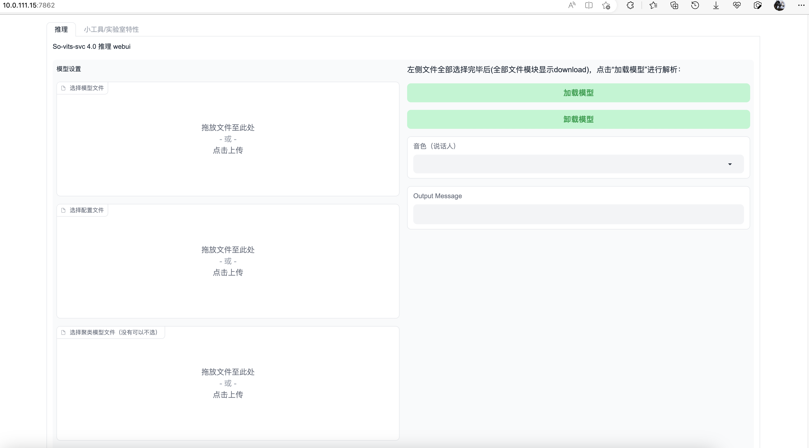
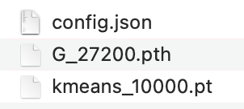

So Vits Svc是一个用来模拟人声的开源项目，可以将您训练好的声音模型，用于生成类似微软云希、抖音文字转语音等效果。

so-vits-svc是基于VITS的开源项目，VITS（Variational Inference with adversarial learning for end-to-end Text-to-Speech）是一种结合变分推理（variational inference）、标准化流（normalizing flows）和对抗训练的高表现力语音合成模型。

VITS通过隐变量而非频谱串联起来语音合成中的声学模型和声码器，在隐变量上进行随机建模并利用随机时长预测器，提高了合成语音的多样性，输入同样的文本，能够合成不同声调和韵律的语音。

<!-- more -->

# 安装

**下载代码：**

```Bash
git clone https://github.com/svc-develop-team/so-vits-svc.git
```


**安装依赖：**

python版本需要3.8.9

使用conda来创建虚拟环境：

```Bash
conda create --name venv python=3.8
```

激活虚拟环境：

```Bash
conda activate venv
```

安装依赖：

```Bash
pip install -r requirements.txt
```


**准备工作：**

1. 下载[`checkpoint_best_legacy_500.pt`](https://ibm.box.com/s/z1wgl1stco8ffooyatzdwsqn2psd9lrr)，放在`hubert`目录中。
2. 下载[G_0.pth](https://huggingface.co/spaces/sayashi/vits-uma-genshin-honkai/resolve/main/model/G_0.pth)和[D_0.pth](https://huggingface.co/spaces/sayashi/vits-uma-genshin-honkai/resolve/main/model/D_0.pth)，放在`logs/44k`目录下。
3. 如果需要使用NSF-HIFIGAN增强器，下载预训练的NSF-HIFIGAN语音编码器：[nsf_hifigan_20221211.zip](https://github.com/openvpi/vocoders/releases/download/nsf-hifigan-v1/nsf_hifigan_20221211.zip)。解压之后放在`pretrain/nsf_hifigan`目录下。

# 模型训练

1. 收集素材
2. 分离人声与伴奏

```Bash
spleeter separate -o qhc/ -p spleeter:2stems qhc.wav
```
3. 音频切分

```Bash
sox vocals.wav cut/output.wav trim 0 10 : newfile : restart
```
4. 预处理

**重采样至44100Hz单声道**

```Bash
python resample.py
```

**自动划分训练集、验证集，以及自动生成配置文件**

```Bash
python preprocess_flist_config.py --speech_encoder vec768l12

```

speech_encoder拥有三个选择

```Bash
vec768l12
vec256l9
hubertsoft
```

如果省略speech_encoder参数，默认值为vec768l12

**生成hubert与f0**

```Bash
python preprocess_hubert_f0.py --f0_predictor dio

```

f0_predictor拥有四个选择

```Bash
crepe
dio
pm
harvest
```

如果训练集过于嘈杂，请使用crepe处理f0

如果省略f0_predictor参数，默认值为dio

尚若需要浅扩散功能（可选），需要增加--use_diff参数，比如

```Bash
python preprocess_hubert_f0.py --f0_predictor dio --use_diff
```

执行完以上步骤后 dataset 目录便是预处理完成的数据，可以删除 dataset_raw 文件夹了

**此时可以在生成的config.json与diffusion.yaml修改部分参数**

- `keep_ckpts`：训练时保留最后几个模型，`0`为保留所有，默认只保留最后`3`个
- `all_in_mem`：加载所有数据集到内存中，某些平台的硬盘IO过于低下、同时内存容量 **远大于** 数据集体积时可以启用

    
5. 模型训练

尚若需要浅扩散功能，需要训练扩散模型，扩散模型训练方法为:

```Bash
python train_diff.py -c configs/diffusion.yaml
```

主模型训练

```Bash
python train.py -c configs/config.json -m 44k
```

模型训练结束后，模型文件保存在`logs/44k`目录下，扩散模型在`logs/44k/diffusion`下

    

    

# 使用

执行命令：

```Bash
python webUI.py
```

> 如果要程序监听`0.0.0.0`，修改webUI.py，将最后一行的`app.launch()`改成`app.launch(server_name="0.0.0.0")`

启动成功后输出一下文字：


浏览器打开服务器的`7682`端口：



## 加载模型

准备训练好的孙燕姿模型：



在webUI中分别设置好模型文件、配置文件、聚类模型文件，之后点击“加载模型”：


## 处理原始歌曲（人声和伴奏分离）

so-vits-svc的工作是使用模型将一段语音中其他人的声音替换成模型中的音色。

主要注意的是，模型推理过程中，歌曲不应该包含伴奏，因为伴奏属于“噪音”，会影响模型的推理效果，因为模型替换的是歌手的“声音”，并非伴奏。

对于歌曲人声和伴奏的分离，有两个方案：一种是使用`Ultimate Vocal Remover`，这个是一个商业软件，效果应该是最好的。另一种是使用开源库Spleeter，这是我采用的方案。

首先安装spleeter：

```Bash
pip3 install spleeter
```

接着运行命令，对qhc.wav进行分离操作：

```Bash
spleeter separate -o qhc/ -p spleeter:2stems qhc.wav
```


输出了两个文件，vocals.wav是清唱的声音，而accompaniment.wav则为伴奏。

至此，原始歌曲就处理好了。

## 歌曲推理

将vocals.wav文件添加到音频转音频页面中：


调整参数


这里推理歌曲会有两个问题，就是声音沙哑和跑调，二者必居其一。

F0均值滤波(池化)参数开启后可以有效改善沙哑问题，但有概率导致跑调，而降低该值则可以减少跑调的概率，但又会出现声音沙哑的问题。

基本上，推理过程就是在这两个参数之间不断地调整。

所以每一次推理都需要认真的听一下歌曲有什么问题，然后调整参数的值。


推理结束之后，下载输出的音频，格式同样也是wav格式。最后使用ffmpeg工具将推理出来的清唱与之前分离出来的伴奏音乐accompaniment.wav进行合并：

```Bash
ffmpeg -i accompaniment.wav -i syz-qhc.wav -filter_complex amix=inputs=2:duration=first:dropout_transition=2 -f mp3 output.mp3
```

输出的output.mp3就是最后的成果。

## 附录：

切分音频：

```Bash
ffmpeg -i vocals.wav -f segment -segment_time 10 -c copy output/out%04d.wav
```


> https://www.cnblogs.com/v3ucn/p/17389882.html
> https://openai.wiki/so-vits-svc.html