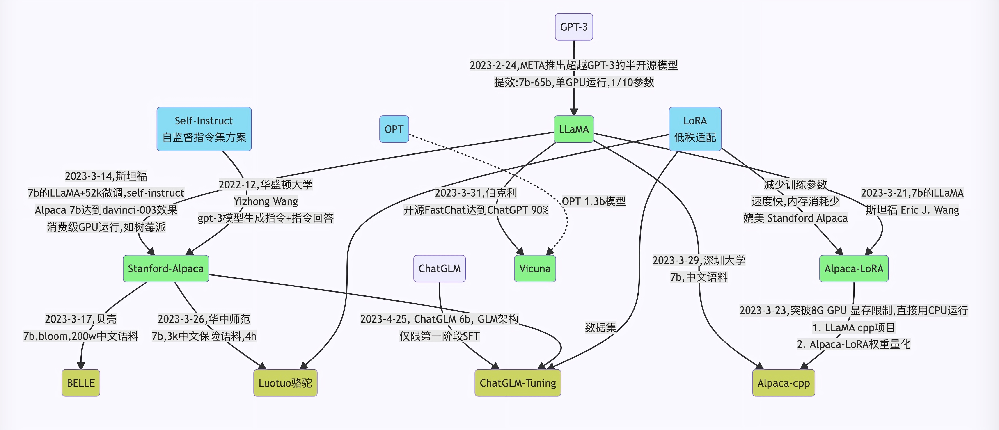

随着ChatGPT的火爆，大语言模型领域又开始热闹起来。不过GPT-3.5和GPT-4并没有开源，随着Meta开源了LLaMA模型，相关的开源模型逐渐开始走进人们视野。

<!-- more -->



# LLaMA

Meta“泄露”的大语言模型。`magnet:?xt=urn:btih:ZXXDAUWYLRUXXBHUYEMS6Q5CE5WA3LVA&dn=LLaMA`


# llama cpp

用于LLaMA模型推理的纯C++版本，可以在CPU环境下运行LLaMA模型。包括LLaMA以及Alpaca等衍生的模型。

[`https://github.com/ggerganov/llama.cpp`](https://github.com/ggerganov/llama.cpp)


## 编译

clone代码：

```Bash
git clone https://github.com/ggerganov/llama.cpp
cd llama.cpp
```

使用`make`来编译：

```Bash
make
```

或者使用`cmake`来编译：

```Bash
mkdir build
cd build
cmake ..
cmake --build . --config Release
```


## BLAS编译使用

编译时支持BLAS

### OpenBLAS

使用`make`：

```Bash
make LLAMA_OPENBLAS=1

```

使用`cmake`：

```Bash
mkdir build
cd build
cmake .. -DLLAMA_BLAS=ON -DLLAMA_BLAS_VENDOR=OpenBLAS
cmake --build . --config Release
```


### cuBLAS

cuBLAS使用CUDA来加速算法。

使用`make`：

```Bash
make LLAMA_CUBLAS=1

```

使用`cmake`：

```Bash
mkdir build
cd build
cmake .. -DLLAMA_CUBLAS=ON
cmake --build . --config Release
```

使用GPU，需要在运行时加上`-ngl`参数，指定多少layer保存在GPU上


## 运行llama模型

准备数据并运行

```Bash
# obtain the original LLaMA model weights and place them in ./models
ls ./models
65B 30B 13B 7B tokenizer_checklist.chk tokenizer.model

# install Python dependencies
python3 -m pip install -r requirements.txt

# convert the 7B model to ggml FP16 format
python3 convert.py models/7B/

# quantize the model to 4-bits (using q4_0 method)
./quantize ./models/7B/ggml-model-f16.bin ./models/7B/ggml-model-q4_0.bin q4_0

# run the inference
./main -m ./models/7B/ggml-model-q4_0.bin -n 128
```

推理的典型用法：

```Bash
./main -m ./models/7B/ggml-model-q4_0.bin -p "Building a website can be done in 10 simple steps:" -n 512
```

# alpaca

Alpaca是在LLaMA上进行微调的。而为了训练这个语言模型，科学家们使用OpenAI的 “text-davinci-003 “模型，生成了52K高质量的自我指导数据。有了这个数据集，他们使用HuggingFace的训练框架对LLaMA模型进行了微调。

[`https://github.com/tatsu-lab/stanford_alpaca`](https://github.com/tatsu-lab/stanford_alpaca)


## 运行

可以使用llama.cpp来运行。下载ggml的[Alpaca模型](https://huggingface.co/Sosaka/Alpaca-native-4bit-ggml/blob/main/ggml-alpaca-7b-q4.bin)，放到`./models`目录。接着执行：

```Bash
./examples/alpaca.sh
```


# alpaca-lora

在消费级GPU上微调“基于LLaMA的Alpaca”。

[`https://github.com/tloen/alpaca-lora`](https://github.com/tloen/alpaca-lora)


# Chinese-LLaMA-Alpaca

Chinese LLaMA(也称中文LLaMA，有7B和13B两个版本)，相当于在原版LLaMA的基础上扩充了中文词表并使用了中文数据进行二次预训练，进一步提升了中文基础语义理解能力，同时，在中文LLaMA的基础上，且用中文指令数据进行指令精调得Chinese-Alpaca(也称中文Alpaca，同样也有7B和13B两个版本)

[`https://github.com/ymcui/Chinese-LLaMA-Alpaca`](https://github.com/ymcui/Chinese-LLaMA-Alpaca)


## 运行

下载中文模型。

### 手动模型合并与转换

[手动模型合并与转换 · ymcui/Chinese-LLaMA-Alpaca Wiki (github.com)](https://github.com/ymcui/Chinese-LLaMA-Alpaca/wiki/手动模型合并与转换)

1. 将原版LLaMA模型转换为HF格式

    请使用[🤗transformers](https://huggingface.co/docs/transformers/installation#install-from-source)提供的脚本[convert_llama_weights_to_hf.py](https://github.com/huggingface/transformers/blob/main/src/transformers/models/llama/convert_llama_weights_to_hf.py)，将原版LLaMA模型转换为HuggingFace格式。

```Bash
python src/transformers/models/llama/convert_llama_weights_to_hf.py \
    --input_dir path_to_original_llama_root_dir \
    --model_size 7B \
    --output_dir path_to_original_llama_hf_dir
```
2. 合并LoRA权重，生成模型权重

    这一步骤会对原版LLaMA模型（HF格式）扩充中文词表，合并LoRA权重并生成全量模型权重。此处可以选择输出PyTorch版本权重（`.pth`文件）或者输出HuggingFace版本权重（`.bin`文件）。

    `.pth`文件可用于：

    - [使用llama.cpp工具进行量化和部署](https://github.com/ymcui/Chinese-LLaMA-Alpaca/wiki/llama.cpp量化部署)

    `.bin`文件可用于：

    - [使用Transformers进行推理](https://github.com/ymcui/Chinese-LLaMA-Alpaca/wiki/使用Transformers推理)
    - [使用text-generation-webui搭建界面](https://github.com/ymcui/Chinese-LLaMA-Alpaca/wiki/使用text-generation-webui搭建界面)

```Bash
python scripts/merge_llama_with_chinese_lora.py \
    --base_model path_to_original_llama_hf_dir \
    --lora_model path_to_chinese_llama_or_alpaca_lora \
    --output_type [pth|huggingface] \
    --output_dir path_to_output_dir 
```

### llama.cpp量化部署

[llama.cpp量化部署 · ymcui/Chinese-LLaMA-Alpaca Wiki (github.com)](https://github.com/ymcui/Chinese-LLaMA-Alpaca/wiki/llama.cpp量化部署)

1. 生成量化版本的模型

```Bash
# 将上述.pth模型权重转换为ggml的FP16格式，生成文件路径为zh-models/7B/ggml-model-f16.bin。
python convert.py zh-models/7B/
# 进一步对FP16模型进行4-bit量化，生成量化模型文件路径为zh-models/7B/ggml-model-q4_0.bin。
./quantize ./zh-models/7B/ggml-model-f16.bin ./zh-models/7B/ggml-model-q4_0.bin q4_0

```
2. 加载并启动模型

```Bash
./main -m zh-models/7B/ggml-model-q4_0.bin --color -f prompts/alpaca.txt -ins -c 2048 --temp 0.2 -n 256 --repeat_penalty 1.1

```

# BELLE

BELLE是链家推出的模型，也是对LLaMA的微调。

[`https://github.com/LianjiaTech/BELLE`](https://github.com/LianjiaTech/BELLE)


# ChatGLM-6B

ChatGLM-6B 是一个开源的、支持中英双语的对话语言模型，基于 [General Language Model (GLM)](https://github.com/THUDM/GLM) 架构，具有 62 亿参数。结合模型量化技术，用户可以在消费级的显卡上进行本地部署（INT4 量化级别下最低只需 6GB 显存）。 ChatGLM-6B 使用了和 ChatGPT 相似的技术，针对中文问答和对话进行了优化。经过约 1T 标识符的中英双语训练，辅以监督微调、反馈自助、人类反馈强化学习等技术的加持，62 亿参数的 ChatGLM-6B 已经能生成相当符合人类偏好的回答。

[`https://github.com/THUDM/ChatGLM-6B`](https://github.com/THUDM/ChatGLM-6B)


模型地址：

`https://huggingface.co/THUDM/chatglm-6b`

## 模型推理

1. clone代码

```Bash
git clone https://github.com/THUDM/ChatGLM-6B.git
```
2. 使用pip安装依赖：

```Bash
pip install -r requirements.txt
```
3. clone模型

```Bash
git clone https://huggingface.co/THUDM/chatglm-6b
```
4. 运行程序demo

    有3种方式来运行程序：

    1. 命令行方式

```Bash
python cli_demo.py
```
    2. 网页方式1

```Bash
python web_demo.py
```
    3. 网页方式2

```Bash
streamlit run web_demo2.py
```


# GLM-130B

GLM-130B是一个具有1300亿个参数的大模型。支持中英双语，性能出众。

[`https://github.com/THUDM/GLM-130B`](https://github.com/THUDM/GLM-130B)


但是硬件要求较高，没有部署测试

|**Hardware**|**GPU Memory**|**Quantization**|**Weight Offload**|
|-|-|-|-|
|8 * A100|40 GB|No|No|
|8 * V100|32 GB|No|Yes (BMInf)|
|8 * V100|32 GB|INT8|No|
|8 * RTX 3090|24 GB|INT8|No|
|4 * RTX 3090|24 GB|INT4|No|
|8 * RTX 2080 Ti|11 GB|INT4|No|


# RWKV

RWKV根据新的深度学习模型架构，以循环神经网络RNN为基础魔改而来。

[`https://github.com/BlinkDL/RWKV-LM`](https://github.com/BlinkDL/RWKV-LM)


模型地址：

[`https://huggingface.co/BlinkDL/rwkv-4-raven`](https://huggingface.co/BlinkDL/rwkv-4-raven)


## 运行

```Bash
# 克隆ChatRWKV项目
git clone https://github.com/BlinkDL/ChatRWKV.git

# 创建虚拟地址
conda create --name chatrwkv python=3.10
# 激活虚拟地址
conda activate chatrwkv

# 安装依赖
cd ChatRWKV/
pip install -r requirements.txt
pip install numpy
pip install torch

# 创建模型文件夹
mkdir models
# 在models文件夹中放置RWKV-4-Raven-7B-v10x-Eng49%-Chn50%-Other1%-20230423-ctx4096.pth文件

# 修改v2/chat.py文件
args.strategy = 'cpu fp32'
CHAT_LANG = 'Chinese'
args.MODEL_NAME = '/home/ubuntu/ChatRWKV/models/RWKV-4-Raven-7B-v10x-Eng49%-Chn50%-Other1%-20230423-ctx4096.pth'

# 执行chat.py
python v2/chat.py


```


> https://blog.csdn.net/v_JULY_v/article/details/129709105