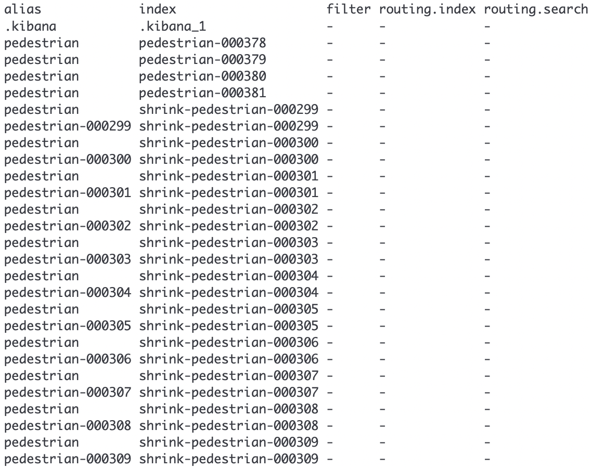
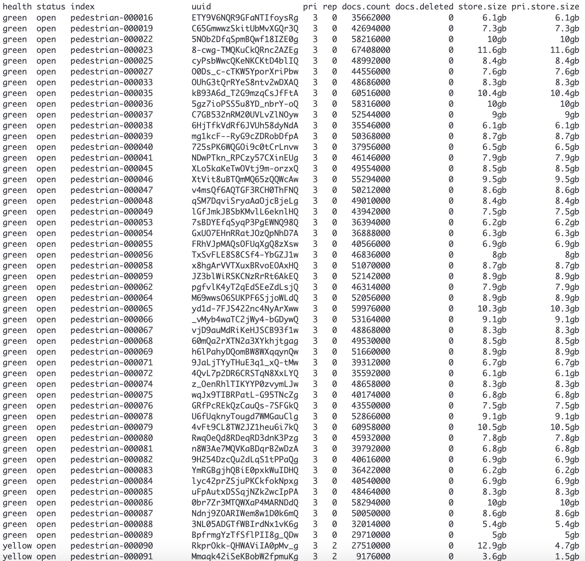
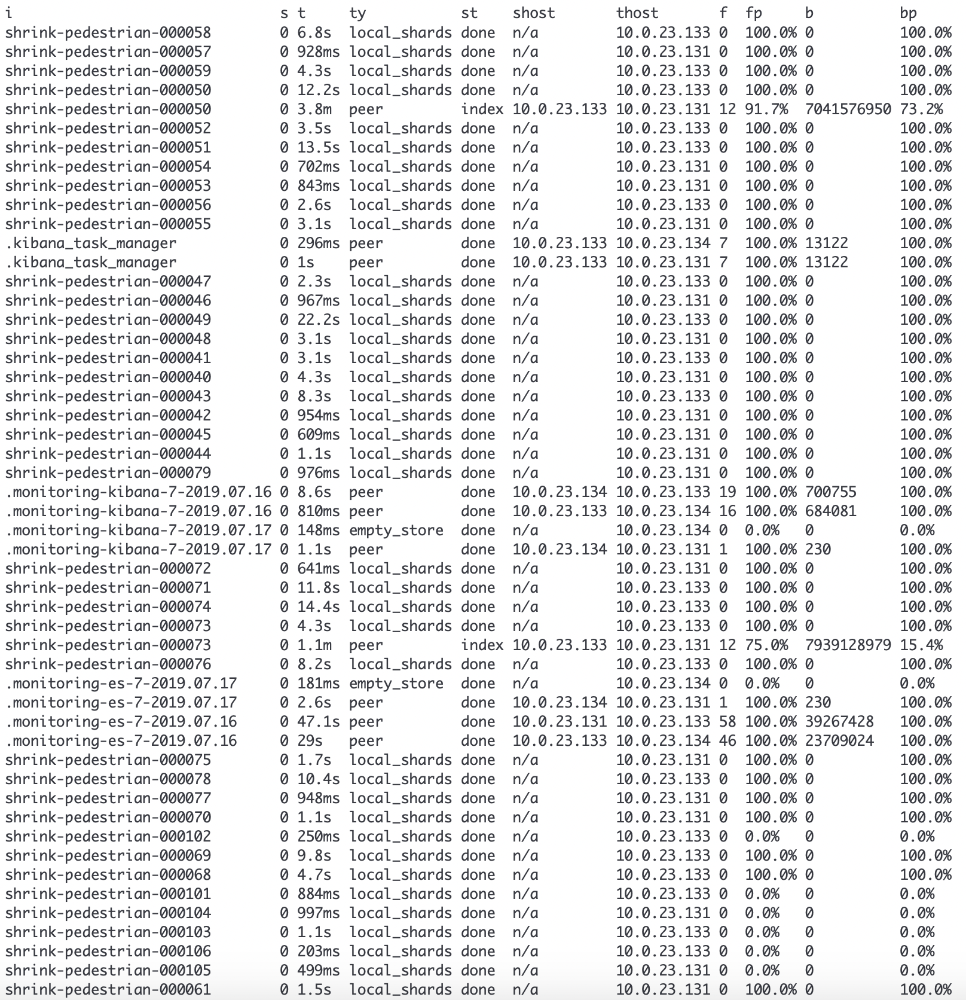
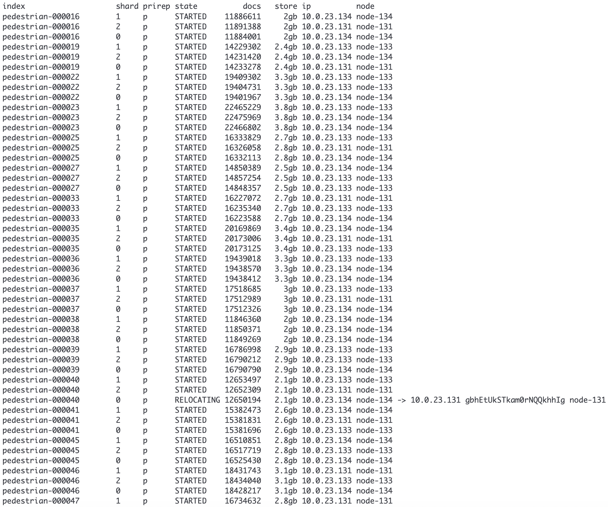
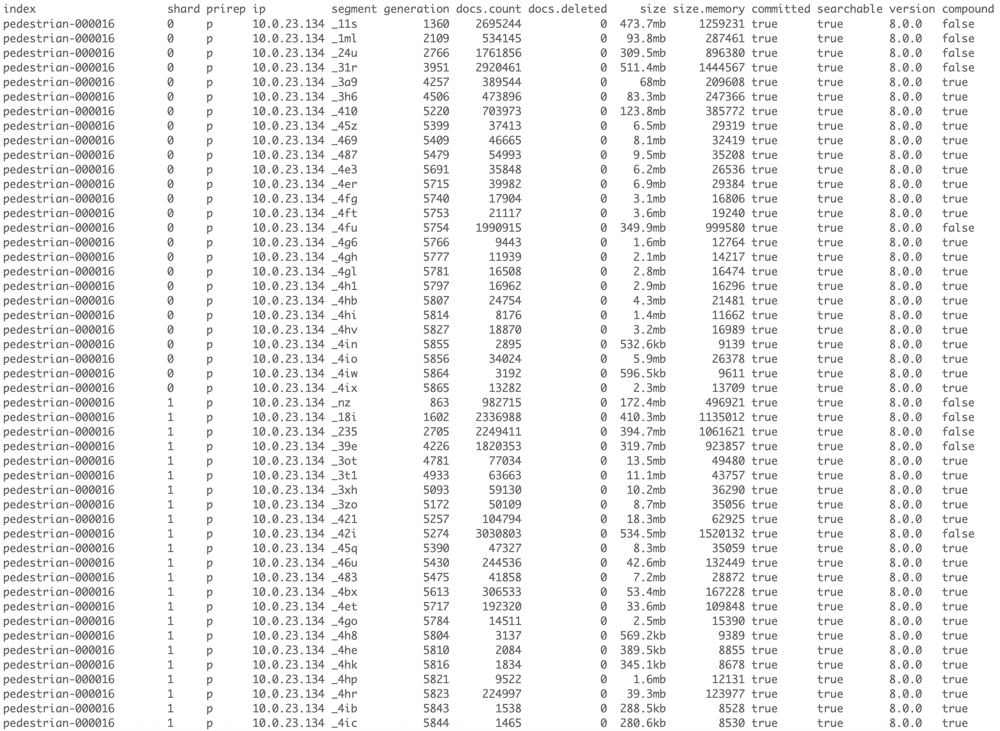
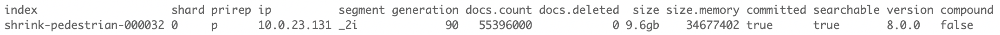
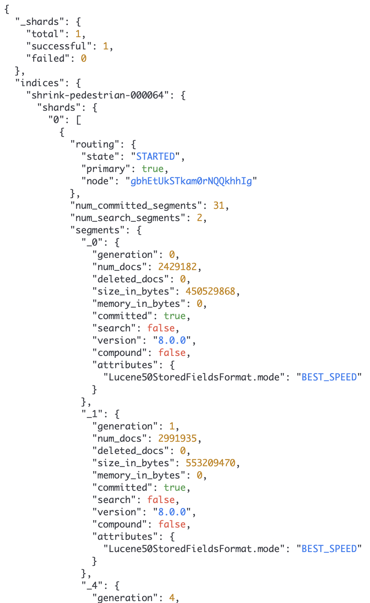
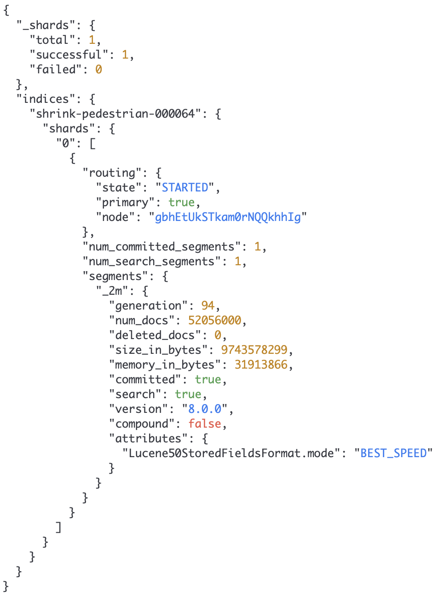
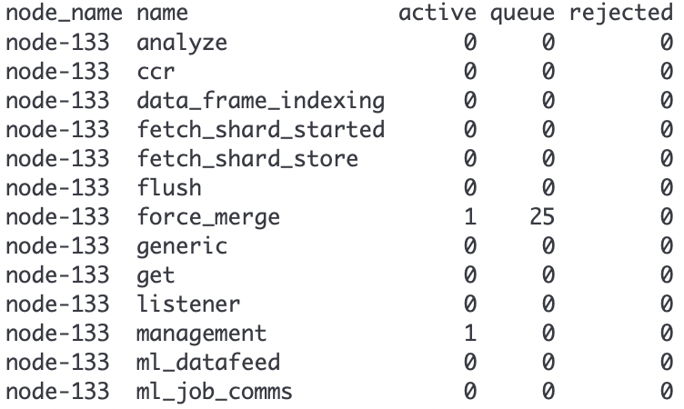

在前面的文章中，我们学习了海量数据下使用热冷数据分离的方法来提高ElasticSearch的检索性能。使用这种机制好处非常明显，能够极大地提高查询频率高的数据的检索性能。不过它也带来了集群管理的复杂度的提升：大量的索引、索引相关的分片以及副本、分片的迁移以及合并、段合并。因此需要我们对Elasticsearch的运行进行一定的监控，以确保数据的正常存储以及检索。

cat指令是比较基本的查看指令。本文是对cat指令的学习整理。

<!-- more -->

## cat指令的通用参数

- `v`

    在请求的时候加入`v`参数，可以返回更详细的信息

- `help`

    在请求的时候加入`help`参数，可以返回每个字段（每一列）的说明

- `headers`
    
    在请求的时候加入`h`参数，可以返回指定的几列。
    
    比如：`curl "http://10.0.23.133:9200/_cat/nodes?v&h=ip,port,heapPercent,name"`，返回`ip`,`port`,`heapPercent`,`name`四个列。
    
    也可以使用通配符，比如`/_cat/thread_pool?h=ip,queue*`，获得所有以`queue`开头的列

- 数字格式

    可以添加不同的参数来改变数字格式：
    
    比如`curl "http://10.0.23.133:9200/_cat/indices?v&bytes=b"`返回以`Bytes`为单位的数值，`curl "http://10.0.23.133:9200/_cat/indices?v&bytes=m"`返回以`Megabytes`为单位的数值。
    
    - 如果改变的是时间单位，使用`time`参数
    - 如果改变的是大小单位，使用`size`参数
    - 如果改变的是字节单位，使用`bytes`参数

- 返回数据的格式

    在请求的时候加入`format`参数可以指定返回数据的格式。可以从`text`、`json`、`smile`、`yaml`、`cbor`中选择。

- 排序

    在请求的时候加入`s`参数可以按指定的列排序。在列的后面加上`:desc`则按列降序排列，在列的后面加上`:asc`则按列升序排列。
    
    比如：`curl "http://10.0.23.133:9200/_cat/indices?v&s=store.size:desc"`

## cat aliases

`/_cat/aliases`指令显示当前的所有的别名

命令示例：

`curl "http://10.0.23.133:9200/_cat/aliases?v&s=index"`



如果只查看某几个别名，可以在url后直接加上别名：

`curl "http://10.0.23.133:9200/_cat/aliases/pedestrian`

## cat allocation

`/_cat/allocation`指令显示每个节点中被分配了多少个分片，以及使用了多少磁盘空间

示例：

`curl "http://10.0.23.133:9200/_cat/allocation?v"`

## cat count

`/_cat/count`指令显示整个集群有多少文档，或者一个索引有多少文档。

示例：

```
curl "http://10.0.23.133:9200/_cat/count?v"
curl "http://10.0.23.133:9200/_cat/count/pedestrian?v"
```

## cat fielddata

`/_cat/fielddata`指令显示集群中每个节点有多少内存被`fielddata`所使用。

示例：

```
curl "http://10.0.23.133:9200/_cat/fielddata?v"
```

## cat health

`/_cat/health`指令显示集群的健康度。

```
curl "http://10.0.23.133:9200/_cat/health?v"
```

指令返回集群状态、节点数量、分片数、未分配分片的数量等信息。使用该指令可以监控各个节点的状态、集群状态的变化。如果长时间出现未分配的分片，我们需要去查询出了什么问题。

## cat indices

`/_cat/indices`指令用于查询索引的状态。

指令返回索引的分片数量，文档数量，被删除的文档数，主分片的大小，分片总的大小。

```
curl "http://10.0.23.131:9200/_cat/indices/pede*?v&s=index"
```



## cat master

`/_cat/master`指令仅仅显示主节点的id，ip，名称。

示例：

`curl "http://10.0.23.133:9200/_cat/master?v"`

## cat nodeattrs

`/_cat/nodeattrs`指令显示节点的属性。

示例：

`curl "http://10.0.23.133:9200/_cat/nodeattrs?v"`

指令返回node、id（默认无）、pid（默认无）、host、ip、port（默认无）、属性以及属性值。

## cat nodes

`/_cat/nodes`指令显示集群中各个节点的信息。包含堆使用率、内存使用率、CPU使用率、系统负载等。

示例：

`curl "http://10.0.23.133:9200/_cat/nodes?v"`

## cat pending tasks

`/_cat/pending_tasks`指令显示集群中等待执行的任务

示例：

`curl "http://10.0.23.133:9200/_cat/pending_tasks?v"`

## cat plugins

`/_cat/plugins`指令显示正在运行的插件。

示例：

`curl "http://10.0.23.133:9200/_cat/plugins?v"`

## cat recovery

`/_cat/recovery`指令显示了索引分片恢复的视图，包括正在执行和已经完成的任务。

recovery过程发生在索引分片从集群的一个节点移动到另一个节点。这个移动操作会发生在：快照恢复、副本发生改变、节点故障、节点启动。节点启动被称为本地存储恢复，节点启动时从磁盘中加载数据分片。

示例：

```
curl "http://10.0.23.131:9200/_cat/recovery/pede*?v&h=i,s,t,ty,st,shost,thost,f,fp,b,bp"
```



从上图中，我们可以看到，有许多数据分片正在执行节点间的迁移，一些分片已经迁移完毕。

## cat shards

`/_cat/shards`指令显示索引拥有的数据分片，分片所在的节点，以及分片的文档数量与大小。

示例：

```
curl "http://10.0.23.131:9200/_cat/shards/pede*?v&s=index"
```



从上图中，我们可以看出其中一个分配正在进行迁移，它的状态为`RELOCATING`。

当一个分配新建的时候，它的状态为`INITIALIZING`。当一个分配无法被分配，它的状态为`UNASSIGNED`。

## cat segments

`/_cat/segments`指令显示索引中分片的segment信息。

示例：

```
curl "http://10.0.23.131:9200/_cat/segments/pedestrian-*?v&s=index"
```



从上面的图片，我们可以看到一个分片就拥有许许多多的segment。

当某个索引完成`force merge`之后，分片中的segment就会变为一个。如下图所示，`shrink-pedestrian-000032`经过`shrink`以及`force merge`，它就只拥有一个分片以及一个segment。

```
curl "http://10.0.23.131:9200/_cat/segments/shrink-pedestrian-000032?v&s=index"
```



我们还可以使用下面的指令来查看索引中segment的详细信息：

```
curl "http://10.0.23.131:9200/shrink-pedestrian-000064/_segments"
```



当`shrink-pedestrian-000064`完成`force merge`之后，就只剩下一个segment




## cat thread_pool

`/_cat/thread_pool`指令显示集群中每个节点的线程池信息。默认返回正在执行的、排队中的、被拒绝的任务。

示例：

```
curl "http://10.0.23.131:9200/_cat/thread_pool?v"

```



## cat templates

`/_cat/templates`指令显示了索引模板的信息

示例：

`curl "http://10.0.23.133:9200/_cat/templates?v"`

## cat repositories

`_cat/repositories`指令显示了注册在集群中的快照仓库

示例：

`curl "http://10.0.23.133:9200/_cat/repositories?v"`

## cat snapshots

`_cat/snapshots`指令显示了某个仓库下的所有快照

示例：

`curl "http://10.0.23.133:9200/_cat/snapshots/repo1?v`


> https://www.elastic.co/guide/en/elasticsearch/reference/current/cat.html


