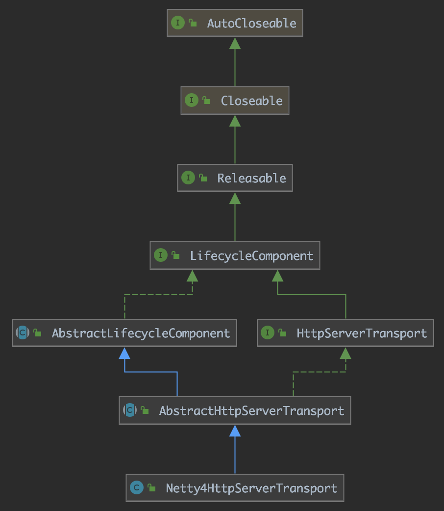
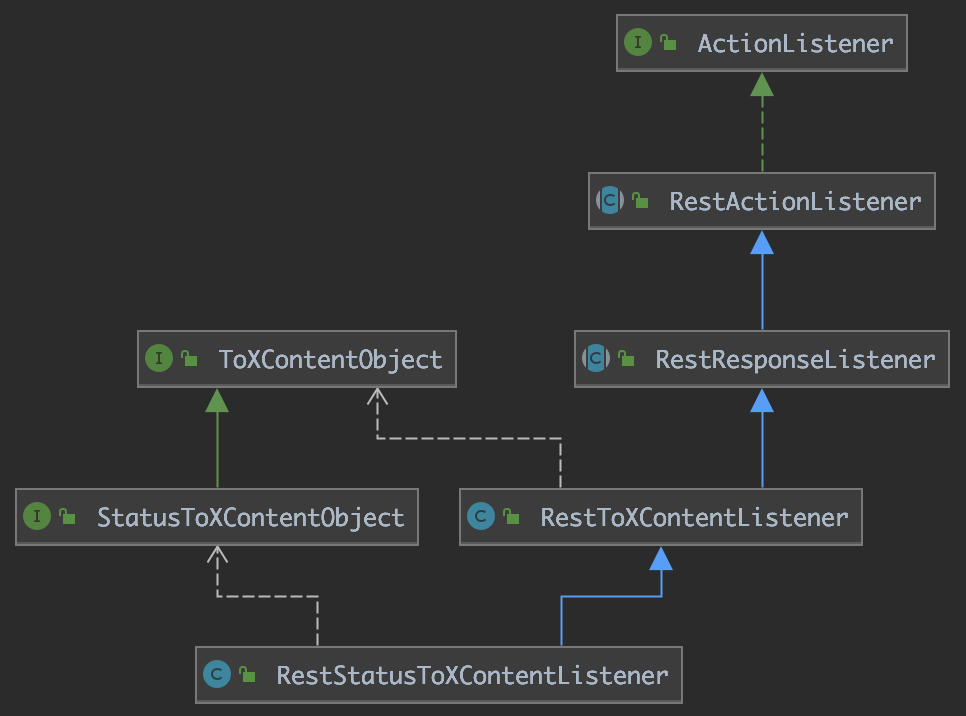
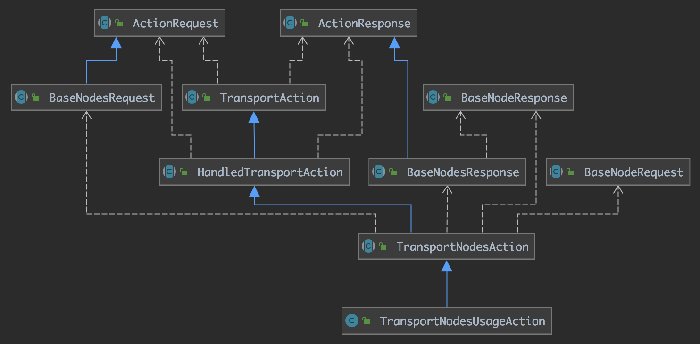
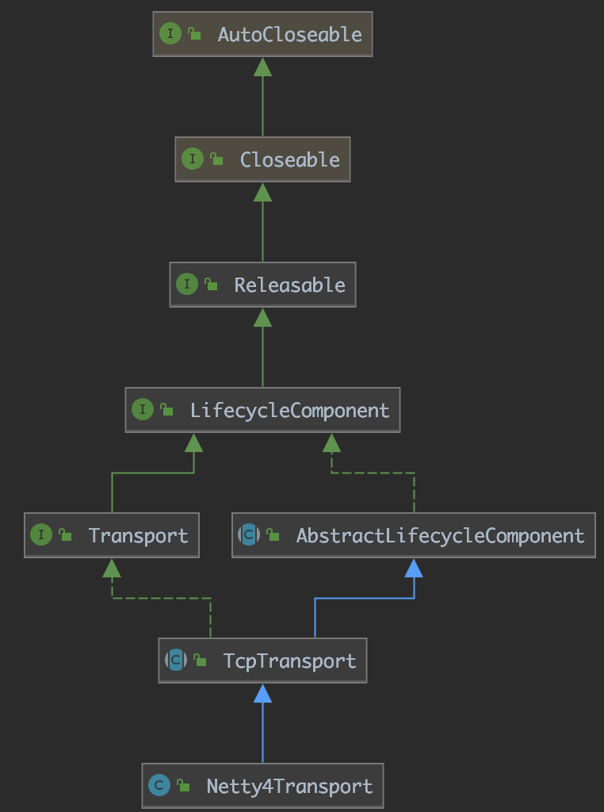

`Elasticsearch`作为一个的分布式搜索引擎，能迅速发展并且流行，一个很大的原因是它大大降低了搜索引擎的使用门槛。想象一下，如果要为我们的后台系统开发一个搜索服务，需要从`lucene`开始开发，那将是一项巨大的工程。之所以`Elasticsearch`能达到很高的易用性，就在于它将底层的`lucene`进行了包装，与用户通过`http`请求来交互，屏蔽了诸如数据分片、副本、分布式存储检索、缓存、日志等一系列细节，基本能做到`Elasticsearch`宣称的开箱即用的易用程度。

`transport`是其中比较重要的一个模块，用户通过`transport`模块和`Elasticsearch`进行交互，`Elasticsearch`多个节点之间也通过`transport`模块传输信息。

在[基于faiss的分布式特征向量搜索系统][1]一文中，我提到了整个系统是基于`Elasticsearch`的框架完成的。本文是对`transport`网络模块学习的一个总结。

<!-- more -->

# HttpServerTransport

`HttpServerTransport`定义了用户请求处理的接口，具体的实现是`Netty4HttpServerTransport`。

为了灵活性，`Elasticsearch`设计了一套简单的插件系统，同一个功能模块可以开发不同的实现，方便地进行替换。具体到网络模块，可以继承`NetworkPlugin`类，在继承类中定义`HttpServerTransport`和`Transport`的实现。其中`Transport`是定义`Elasticsearch`节点之间通信的接口。目前`Elasticsearch`在`transport-netty4`中实现了整个网络模块。

## Netty4HttpServerTransport

顾名思义，目前`Elasticsearch`是基于`netty4`来构建整个网络模块的。`Netty4HttpServerTransport`用于构建一个处理用户http请求的网络服务，继承关系如图所示：



其主要的构建过程在`doStart()`方法中，熟悉`netty`使用的话可以很容易地理解其中的步骤：对网络参数进行一系列配置，然后设置一个`childHandler`：`HttpChannelHandler`。

`HttpChannelHandler`中设置针对http的编解码器、http消息的压缩器、跨域请求的处理器、pipeline处理器（用于请求的按序返回响应），以及最重要的请求处理器`Netty4HttpRequestHandler`。

## http请求的处理

http请求处理方法经过了如下调用:

```java
Netty4HttpRequestHandler.channelRead0
    AbstractHttpServerTransport.incomingRequest
        handleIncomingRequest
            dispatchRequest
                Dispatcher.dispatchRequest
```

其中`Dispatcher`是http请求的"调度器"，其实现类是`RestController`，`dispatchRequest`方法如下所示：

```java
@Override
public void dispatchRequest(RestRequest request, RestChannel channel, ThreadContext threadContext) {
    if (request.rawPath().equals("/favicon.ico")) {
        handleFavicon(request, channel);
        return;
    }
    try {
        tryAllHandlers(request, channel, threadContext);
    } catch (Exception e) {
        try {
            channel.sendResponse(new BytesRestResponse(channel, e));
        } catch (Exception inner) {
            inner.addSuppressed(e);
            logger.error(() ->
                new ParameterizedMessage("failed to send failure response for uri [{}]", request.uri()), inner);
        }
    }
}
```

首先对图标进行了一个特殊处理。接着调用`tryAllHandlers`尝试所有的http请求处理器（`handler`）:

```java
Iterator<MethodHandlers> allHandlers = getAllHandlers(request);
for (Iterator<MethodHandlers> it = allHandlers; it.hasNext(); ) {
    final Optional<RestHandler> mHandler = Optional.ofNullable(it.next()).flatMap(mh -> mh.getHandler(request.method()));
    requestHandled = dispatchRequest(request, channel, client, mHandler);
    if (requestHandled) {
        break;
    }
}

// If request has not been handled, fallback to a bad request error.
if (requestHandled == false) {
    handleBadRequest(request, channel);
}
```

`RestController`中维护了所有的http请求处理器（`handler`）。以搜索请求的处理器`RestSearchAction`为例：

```java
public RestSearchAction(Settings settings, RestController controller) {
    super(settings);
    controller.registerHandler(GET, "/_search", this);
    controller.registerHandler(POST, "/_search", this);
    controller.registerHandler(GET, "/{index}/_search", this);
    controller.registerHandler(POST, "/{index}/_search", this);

    // Deprecated typed endpoints.
    controller.registerHandler(GET, "/{index}/{type}/_search", this);
    controller.registerHandler(POST, "/{index}/{type}/_search", this);
}
```

它在函数构造的时候会调用`registerHandler`函数向`RestController`注册处理器（`handler`）。

`RestController`在`tryAllHandlers`方法处理请求时，根据请求的路径和`method`在所有的`handler`中筛选匹配的`handler`。然后调用`dispatchRequest`方法依次使用匹配的`handler`来处理请求，直到请求处理成功。如果所有的`handler`都处理失败则调用`handleBadRequest`方法返回`400`错误信息。

`dispatchRequest`方法首先检查http的一些请求参数，比如`ContentType`、请求体的格式等。最后调用`handler`的`handleRequest`方法来处理请求。

`handleRequest`方法位于抽象类`BaseRestHandler`中，它主要的功能是检查请求参数、增加统计数据、调用方法`prepareRequest`获取请求的具体处理方法，然后调用这个方法。

`prepareRequest`是一个抽象方法，具体的实现在各个具体的`handler`中。还是以`RestSearchAction`为例，它在`prepareRequest`中返回的方法如下：

```java
return channel -> client.search(searchRequest, new RestStatusToXContentListener<>(channel));
```

即调用`NodeClient`的`search`方法：

```java
public void search(final SearchRequest request, final ActionListener<SearchResponse> listener) {
    execute(SearchAction.INSTANCE, request, listener);
}
```

分析调用关系可以知道`execute`方法最终调用的`NodeClient`中的`executeLocally`方法：

```java
public <    Request extends ActionRequest,
            Response extends ActionResponse
        > Task executeLocally(Action<Response> action, Request request, ActionListener<Response> listener) {
    return transportAction(action).execute(request, listener);
}
```

`Elasticsearch`在这里有一个设计，它将不同类型的请求抽象成`Action`，请求的处理抽象成`TransportAction`。以搜索请求为例，它`Action`的实现类是`SearchAction`，`TransportAction`的实现类是`TransportSearchAction`。其他的请求也以这样的设计来分别实现不同的`Action`和`TransportAction`。`Action`和`TransportAction`的绑定操作在`ActionModule`的`setupActions`方法中，在程序启动时会调用该方法完成所有请求`Action`的绑定。

所以上面的`executeLocally`方法中就容易理解了。`transportAction`方法根据`Action`找到对应的`TransportAction`，这里就是`TransportSearchAction`，然后调用`execute`方法执行处理操作。

`execute`方法中新建一个`RequestFilterChain`，然后调用其中的`proceed`方法。`RequestFilterChain`的目的是为了在请求的处理之前先执行过滤器操作（比如安全性验证等），最后执行`doExecute`。

`doExecute`是一个抽象函数，由各个具体的实现类（比如`TransportSearchAction`）来实现。

## 返回Response

前面我们分析了用户的http请求是如何经过调度一步一步的到达相应的处理类，现在我们来看看请求处理完之后是如何返回处理结果的。

还是以搜索请求为例，我们在前面看到它`prepareRequest`函数中传入了一个`RestStatusToXContentListener`实例，来看一下它的继承关系：



上溯`RestStatusToXContentListener`的继承关系，它最初的源头是`ActionListener`。

`ActionListener`定义了处理response和failure的方法。请求处理结束之后会生成一个结果，调用`ActionListener`的`onResponse`方法返回结果。

对于不同的请求，响应的返回过程会有一些相同和不同点。下面来分析一下响应是如何被返回的。

首先`onResponse`方法的实现在`RestActionListener`中，它调用了抽闲方法`processResponse`，`processResponse`的实现在`RestResponseListener`中：

```java
protected final void processResponse(Response response) throws Exception {
    channel.sendResponse(buildResponse(response));
}
```

它调用抽象方法`buildResponse`构造返回数据，然后调用`channel.sendResponse`发送数据。

对于`buildResponse`，不同的请求会有不同的实现，还是以`RestStatusToXContentListener`为例，它的实现在`RestToXContentListener`中：

```java
@Override
public RestResponse buildResponse(Response response) throws Exception {
    return buildResponse(response, channel.newBuilder());
}

public RestResponse buildResponse(Response response, XContentBuilder builder) throws Exception {
    assert response.isFragment() == false;
    response.toXContent(builder, channel.request());
    return new BytesRestResponse(getStatus(response), builder);
}

protected RestStatus getStatus(Response response) {
    return RestStatus.OK;
}
```

可以看到，这里返回数据按格式解析成二进制数据。

# Transport

`Transport`是网络模块中第二个重要的接口，它定义了`Elasticsearch`节点之间的通信。

`Elasticsearch`一个重要的特征就是它是一个分布式的搜索引擎，它可以将索引和搜索等操作分配到多个节点中进行，这样就可以充分利用多个节点的存储与计算资源。

## 节点之间的请求

在分析`Transport`之前，先来分析一下`Elasticsearch`是如何向各个节点发送请求的。为了简单起见，我们以`节点使用统计接口`为例（`url`:`/_nodes/usage`），它所实现的`TransportAction`是`TransportNodesUsageAction`，继承关系如下：



`节点使用统计接口`需要向所有节点发送请求，针对这种情况`Elasticsearch`开发了一个抽象类`TransportNodesAction`。`TransportNodesAction`有四个抽象方法：

```java
protected abstract NodesResponse newResponse(NodesRequest request, List<NodeResponse> responses, List<FailedNodeException> failures);

protected abstract NodeRequest newNodeRequest(String nodeId, NodesRequest request);

protected abstract NodeResponse newNodeResponse();

protected abstract NodeResponse nodeOperation(NodeRequest request);
```

这里涉及4种泛型：

- `NodesRequest`：用户给出的请求
- `NodesResponse`：返回给用户的响应
- `NodeRequest`：对各个节点的请求
- `NodeResponse`：各个节点返回的响应

理清了这四种泛型，我们就能明白`TransportNodesAction`四个抽象方法的用途了：

- `newResponse`：生成返回给用户的响应
- `newNodeRequest`：生成对各个节点的请求
- `newNodeResponse`：生成节点的响应实例，将各个节点的响应填充到生成的这个实例中
- `nodeOperation`：定义节点收到请求后的操作

这四个抽象类的具体使用在下文分析。

### AsyncAction

上文我们分析过，请求最后的处理在`TransportAction`的抽象方法`doExecute`，这个`doExecute`方法是由各个处理类自己实现的。`TransportNodesUsageAction`的`doExecute`方法在父类`TransportNodesAction`中定义：新建`AsyncAction`示例，并调用其`start()`方法：

```java
AsyncAction(Task task, NodesRequest request, ActionListener<NodesResponse> listener) {
    this.task = task;
    this.request = request;
    this.listener = listener;
    if (request.concreteNodes() == null) {
        resolveRequest(request, clusterService.state());
        assert request.concreteNodes() != null;
    }
    this.responses = new AtomicReferenceArray<>(request.concreteNodes().length);
}

void start() {
    final DiscoveryNode[] nodes = request.concreteNodes();
    if (nodes.length == 0) {
        // nothing to notify
        threadPool.generic().execute(() -> listener.onResponse(newResponse(request, responses)));
        return;
    }
    TransportRequestOptions.Builder builder = TransportRequestOptions.builder();
    if (request.timeout() != null) {
        builder.withTimeout(request.timeout());
    }
    for (int i = 0; i < nodes.length; i++) {
        final int idx = i;
        final DiscoveryNode node = nodes[i];
        final String nodeId = node.getId();
        try {
            TransportRequest nodeRequest = newNodeRequest(nodeId, request);
            if (task != null) {
                nodeRequest.setParentTask(clusterService.localNode().getId(), task.getId());
            }

            transportService.sendRequest(node, transportNodeAction, nodeRequest, builder.build(),
                    new TransportResponseHandler<NodeResponse>() {
                        @Override
                        public NodeResponse read(StreamInput in) throws IOException {
                            NodeResponse nodeResponse = newNodeResponse();
                            nodeResponse.readFrom(in);
                            return nodeResponse;
                        }

                        @Override
                        public void handleResponse(NodeResponse response) {
                            onOperation(idx, response);
                        }

                        @Override
                        public void handleException(TransportException exp) {
                            onFailure(idx, node.getId(), exp);
                        }

                        @Override
                        public String executor() {
                            return ThreadPool.Names.SAME;
                        }
                    });
        } catch (Exception e) {
            onFailure(idx, nodeId, e);
        }
    }
}
```

我们来分析这个方法，可以达到管中窥豹的效果。

首先调用`concreteNodes`方法获取请求涉及的节点。涉及的节点是在构造`AsyncAction`时调用`resolveRequest`方法解析并设置的。如果节点为空，则直接返回空响应。

接着遍历涉及的节点，向每个节点发送请求：调用`newNodeRequest`方法生成对节点的请求，然后调用`TransportService`的`sendRequest`方法向节点发送请求。

`sendRequest`方法的调用关系如下：

```java
TransportServivce.sendRequest
    TransportServivce.getConnection
    TransportServivce.sendRequest
        TransportServivce.sendRequestInternal
            Transport.Connection.sendRequest
```

主要的流程就是根据节点获取与节点的连接，然后调用`sendRequest`方法向节点发送数据。

发送数据的过程根据节点类型的不同有所不同。

本地节点的发送流程如下：

```java
TransportService.sendLocalRequest
    RequestHandlerRegistry.processMessageReceived
        NodeTransportHandler.messageReceived
```

`NodeTransportHandler.messageReceived`中调用`nodeOperation`处理请求、生成节点响应，然后返回响应。

远程节点的发送流程如下：

```java
NodeChannels.sendRequest
    OutboundHandler.sendRequest
        OutboundHandler.sendMessage
            OutboundHandler.internalSend
                Netty4TcpChannel.sendMessage
```

可以看到，对远程节点的请求最终通过netty的方法发送给相应的节点。

## Netty4Transport

通过前面对节点的请求分析，我们对`Elasticsearch`的分布式请求有了初步的认识。下面我们来看看响应这个请求的网络服务是如何构建的。

`Netty4Transport`是`Transport`的实现类，其继承关系如下：



先看看它的初始化过程：

```java
 protected void doStart() {
    boolean success = false;
    try {
        ThreadFactory threadFactory = daemonThreadFactory(settings, TRANSPORT_WORKER_THREAD_NAME_PREFIX);
        eventLoopGroup = new NioEventLoopGroup(workerCount, threadFactory);
        clientBootstrap = createClientBootstrap(eventLoopGroup);
        if (NetworkService.NETWORK_SERVER.get(settings)) {
            for (ProfileSettings profileSettings : profileSettings) {
                createServerBootstrap(profileSettings, eventLoopGroup);
                bindServer(profileSettings);
            }
        }
        super.doStart();
        success = true;
    } finally {
        if (success == false) {
            doStop();
        }
    }
}
```

其初始化过程并不复杂：

1. 创建一个客户端
2. 根据配置创建服务端并绑定ip和端口

服务端的创建和上文提到的`Netty4HttpServerTransport`类似，配置相关的参数并设置请求处理的`handler`：`Netty4MessageChannelHandler`。


## 节点请求的处理

节点响应最初到达`Netty4MessageChannelHandler`的`channelRead`方法，这是由`netty`调用的。响应数据经过如下的调用：

```java
Netty4MessageChannelHandler.channelRead
    TcpTransport.inboundMessage
        InboundHandler.inboundMessage
            InboundHandler.messageReceived
                InboundHandler.handleRequest
```

`InboundHandler.handleRequest`方法首先调用`getRequestHandler`获取请求的`handler`。这个`handler`是`TransportNodesAction`构造的时候注册的：

```
this.transportNodeAction = actionName + "[n]";
transportService.registerRequestHandler(transportNodeAction, nodeRequest, nodeExecutor, new NodeTransportHandler());
```

它在原来的`actionName`后加上`[n]`以此来表示这是对节点的请求。

然后启动新线程执行`RequestHandler`线程。调用关系如下：

```java
RequestHandlerRegistry.processMessageReceived
    NodeTransportHandler.messageReceived
```

`processMessageReceived`方法调用之前注册的`NodeTransportHandler`中的`messageReceived`方法，`messageReceived`方法调用`nodeOperation`处理请求、生成节点响应，然后返回响应。

## 节点响应的处理

节点响应最初到达`Netty4MessageChannelHandler`的`channelRead`方法，这是由`netty`调用的。响应数据经过如下的调用：

```java
Netty4MessageChannelHandler.channelRead
    TcpTransport.inboundMessage
        InboundHandler.inboundMessage
            InboundHandler.messageReceived
                InboundHandler.handleResponse
                    ContextRestoreResponseHandler.read
                        TransportResponseHandler.read
                    ContextRestoreResponseHandler.handleResponse
                        TransportResponseHandler.handleResponse
```

首先经过`TransportResponseHandler.read`方法，在前面的`AsyncAction.start`方法中，我们看到`read`方法以匿名类的方式定义：首先调用`newNodeResponse`生成节点响应实例，然后调用`readFrom`将二进制数据转化并填充到响应中。

得到响应之后，接着调用`TransportResponseHandler.handleResponse`方法，它调用`onOperation`来处理生成的响应数据：

```java
private void onOperation(int idx, NodeResponse nodeResponse) {
    responses.set(idx, nodeResponse);
    if (counter.incrementAndGet() == responses.length()) {
        finishHim();
    }
}
```

将响应数据保存到`responses`中，`responses`是一个数据对象。

如果所有节点的响应都返回了，则调用`finishHim`方法来处理各个节点的响应数据：

```java
private void finishHim() {
    NodesResponse finalResponse;
    try {
        finalResponse = newResponse(request, responses);
    } catch (Exception e) {
        logger.debug("failed to combine responses from nodes", e);
        listener.onFailure(e);
        return;
    }
    listener.onResponse(finalResponse);
}
```

`finishHim`方法调用`newResponse`将各个节点的响应数据汇总成一个最终的响应。然后调用`listener.onResponse`方法将响应返回给用户。


# 总结

transport网络模块是`Elasticsearch`分布式系统的基础，了解了它的工作原理，对于`Elasticsearch`整体架构会有进一步的理解。同时对于其他工具的开发也会有很大的借鉴意义。


[1]: /articles/Java/基于faiss的分布式特征向量搜索系统.html
