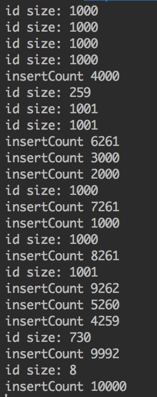

基于ElasticSearch的搜索功能开发过程中，数据的实时同步是一个非常关键的步骤。

从代码的解耦角度来考虑，业务代码不会直接往ES写数据，而仅仅是查询ES。业务代码将数据更新到Mysql，然后由单独的同步程序同步到ES。我们采用的方式如下：

1. 使用阿里开源的[canal](https://github.com/alibaba/canal)监听mysql的binlog
2. 将binlog解析过的数据发送到Kafka
3. 同步程序从Kafka中读数据
4. 构造数据插入到ES中

<!-- more -->

这个流程的问题是：binlog每次输出单条数据，这样每次都只能往ES中插入或更新单条数据。在并发量大的场景下，ES的插入或修改出现瓶颈。

这个问题的解决方法是将单个的数据插入修改合并成批量操作，ES提供了`BulkRequest`方法来批量插入或更新数据。

## HystrixCollapser

为了不对原先的流程大幅度修改，我们引入了Hystrix。Hystrix提供了请求合并功能，详见[Hystrix(七)——请求合并][1]。

首先新建一个示例来说明Hystrix请求合并的使用。以插入过程为例，首先继承`HystrixCollapser`创建一个命令合并器：

```java
public class InsertCommandCollapser extends HystrixCollapser<Void, Void, String> {
    private String id;

    public InsertCommandCollapser(String id) {
        super(
                Setter.withCollapserKey(HystrixCollapserKey.Factory.asKey("InsertCommandCollapser"))
                .andCollapserPropertiesDefaults(
                        HystrixCollapserProperties.Setter()
                                .withTimerDelayInMilliseconds(5)
                                .withMaxRequestsInBatch(1000)
                )
                .andScope(Scope.GLOBAL)
        );
        this.id = id;
    }

    /**
     * 获取请求参数
     * @return
     */
    @Override
    public String getRequestArgument() {
        return id;
    }

    /**
     * 合并请求，产生批量命令的具体实现
     * @param collapsedRequests
     * @return
     */
    @Override
    protected HystrixCommand<Void> createCommand(Collection<CollapsedRequest<Void, String>> collapsedRequests) {
        List<String> ids = collapsedRequests.stream().map(CollapsedRequest::getArgument).collect(Collectors.toList());
        return new InsertBatchCommand(ids);
    }

    /**
     * 批量命令结果返回后的处理，需要实现将批量结果拆分并传递给合并前的各原子请求命令的逻辑中
     * @param batchResponse
     * @param collapsedRequests
     */
    @Override
    protected void mapResponseToRequests(Void batchResponse, Collection<CollapsedRequest<Void, String>> collapsedRequests) {
        for (CollapsedRequest<Void, String> collapsedRequest : collapsedRequests) {
            collapsedRequest.setResponse(batchResponse);
        }
    }
}
```

新建`InsertBatchCommand`作为执行批量操作的命令

```java
public class InsertBatchCommand extends HystrixCommand<Void> {
    private List<String> ids;
    private static final AtomicInteger insertCount = new AtomicInteger(0);
    private static Random random = new Random();

    public InsertBatchCommand(List<String> ids) {
        super(
                Setter.withGroupKey(HystrixCommandGroupKey.Factory.asKey("InsertBatchCommand"))
                        .andCommandKey(HystrixCommandKey.Factory.asKey("insertAll"))
                        .andCommandPropertiesDefaults(
                                HystrixCommandProperties.Setter()
                                        .withExecutionIsolationStrategy(HystrixCommandProperties.ExecutionIsolationStrategy.SEMAPHORE)
                                        .withExecutionIsolationSemaphoreMaxConcurrentRequests(10000)
                                        .withExecutionTimeoutEnabled(false)
                                        .withCircuitBreakerEnabled(false)
                        )
        );
        this.ids = ids;
    }

    @Override
    protected Void run() throws Exception {
        if (ids != null && !ids.isEmpty()) {
            System.out.println("id size: " + ids.size());
            System.out.println("insertCount " + insertCount.addAndGet(ids.size()));
        }
        // 随机延时
        Thread.sleep(random.nextInt(1000));
        return null;
    }
}
```

测试请求合并的效果：

```java
public class CollapserTest {
    private ExecutorService pool = Executors.newFixedThreadPool(10);

    class MyThread implements Runnable {
        private String uid;

        public MyThread(String uid) {
            this.uid = uid;
        }

        @Override
        public void run() {
            boolean currentThreadInitialized = HystrixRequestContext.isCurrentThreadInitialized();
            if (!currentThreadInitialized) {
                HystrixRequestContext.initializeContext();
            }

            InsertCommandCollapser insertCommandCollapser = new InsertCommandCollapser(uid);
            insertCommandCollapser.queue();
        }
    }

    public void run() {
        for (int i = 0; i < 10000; i++) {
            pool.execute(new MyThread(String.valueOf(i)));
        }
    }

    public static void main(String[] args) {
        CollapserTest main = new CollapserTest();
        main.run();
    }
}
```

如上所示，启动10000个线程来插入10000个id，结果如下图所示：



可以看到，通过调用`InsertCommandCollapser`，`InsertBatchCommand`命令接收到成批的id数据，使用这样批量的id数据我们就可以进行批量数据的插入。

修改`InsertBatchCommand`，构造BulkRequest批量处理数据（仅作为示例）：

```java
public class InsertBatchCommand extends HystrixCommand<Void> {
    private List<String> ids;

    public InsertBatchCommand(List<String> ids) {
        super(
                Setter.withGroupKey(HystrixCommandGroupKey.Factory.asKey("InsertBatchCommand"))
                        .andCommandKey(HystrixCommandKey.Factory.asKey("insertAll"))
                        .andCommandPropertiesDefaults(
                                HystrixCommandProperties.Setter()
                                        .withExecutionIsolationStrategy(HystrixCommandProperties.ExecutionIsolationStrategy.SEMAPHORE)
                                        .withExecutionIsolationSemaphoreMaxConcurrentRequests(10000)
                                        .withExecutionTimeoutEnabled(false)
                                        .withCircuitBreakerEnabled(false)
                        )
        );
        this.ids = ids;
    }

    @Override
    protected Void run() throws Exception {
        if (ids.isEmpty()) {
            return;
        }

        BulkRequest bulkRequest = new BulkRequest();
        // 根据ids获取数据
        List<SearchEntity> list = searchMapper.selectByPrimaryIds(ids);
        // 构造BulkRequest批量处理数据
        list.stream().forEach(searchEntity -> {
            String id = String.valueOf(searchEntity.getUid());
            IndexRequest indexRequest = new IndexRequest(index, index, id)
                    .source(JsonUtils.toJson(searchEntity), XContentType.JSON)
                    .opType(DocWriteRequest.OpType.INDEX)
                    .version(searchEntity.getVersion()) // 设置es中的数据版本
                    .versionType(VersionType.EXTERNAL);
            bulkRequest.add(indexRequest);
        });

        BulkResponse responses = client.bulk(bulkRequest);
        return null;
    }
}
```

## 总结

跳出ES这个使用场景，请求合并是一个很重要的优化方案，经过合并之后可以减少数据处理的时间，减少网络请求等一系列开销。在多数情况都能带来显著的性能提高。

审视[使用pipeline提升Redis的访问性能][2]文章所描述的场景，其实pipeline也是一种请求合并操作，只不过这是redis自身所提供的功能。


[1]: /articles/Spring-Cloud/Hystrix(七)——请求合并.html
[2]: /articles/Java/使用pipeline提升Redis的访问性能.html


