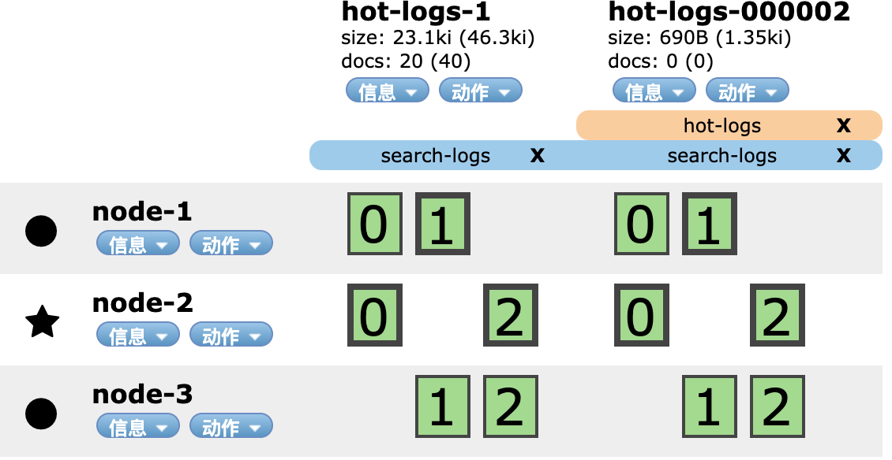
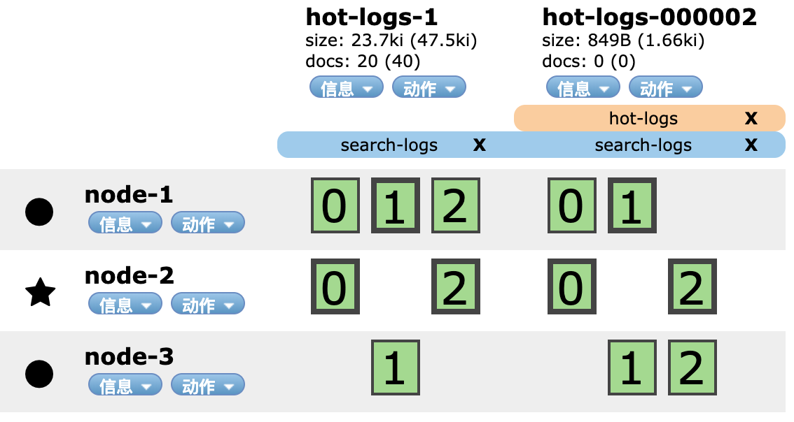
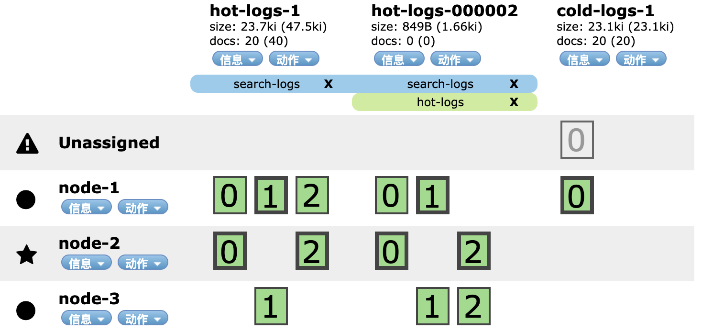

当数据量比较小的情况下，我们可以直接将其插入单台机器的一个索引中，es的性能足够应付。当数据量变得比较大，我们可以将es的索引分片，将分片分配到不同的机器上，并行搜索以满足性能的要求。当插入海量数据到es的索引中时，一个分片中的数据变得很大，此时搜索性能就会下降，因为成本的考虑，我们不能再随意横向扩容。这个时候我们就需要新的思路来解决这个问题。

<!-- more -->

所幸的是，在绝大多数的场景下，数据都是具有时间局部性的，时间近的数据往往访问频繁（即热数据），时间远的数据往往访问较少（即冷数据）。根据这个特性，我们可以将数据拆分到不同的索引中，热数据索引可以设置较多的分片，分配到性能较高的机器上。冷数据索引设置较少的分片以节约存储空间，分配到性能普通的机器上。这样可以在确保绝大多数访问性能的情况下，最大限度地节约成本。

本文是我对冷热数据分离方案的学习与总结。

下面我们先来看看es为我们提供了怎样便利的工具来实现冷热数据分离的目标

# rollover

通常情况下，我们会以索引数据的时间、索引文档数据、索引大小来拆分索引。为了做这样的拆分，我们可以在程序中去监控索引的这三个指标，在必要的时候（超过了一定的时间、，索引中文档数过多，索引太大）新建一个索引，然后将新数据插入到新建的索引。

不过，es已经为我们提供了这样的功能，叫做`rollover`。

`rollover`判断别名所对应的索引，当索引满足了我们设置的条件时，新建一个索引。`rollover`可以判断的条件有以下3个：

- `max_age`：索引中最早插入数据距今的时间
- `max_docs`：索引中最大的文档数
- `max_size`：索引最大的大小

## 示例：

首先创建一个名为`logs-000001`的索引，别名设置为`logs_write`：

```
curl -X "PUT" "http://10.0.20.33:9200/logs-000001" \
     -H 'Content-Type: application/json; charset=utf-8' \
     -d $'{
  "aliases": {
    "logs_write": {}
  }
}'
```

在`logs-000001`插入一些数据。然后调用`rollover`：

```
curl -X "POST" "http://10.0.20.33:9200/logs_write/_rollover" \
     -H 'Content-Type: application/json; charset=utf-8' \
     -d $'{
  "conditions": {
    "max_age": "7d",
    "max_docs": 1,
    "max_size": "5gb"
  }
}'

# 返回值
{
  "acknowledged": true,
  "shards_acknowledged": true,
  "old_index": "logs-000001",
  "new_index": "logs-000002",
  "rolled_over": true,
  "dry_run": false,
  "conditions": {
    "[max_size: 5gb]": false,
    "[max_docs: 1]": true,
    "[max_age: 7d]": false
  }
}
```

可以看到，我们在`rollover`中设置了3个条件，分别表示索引中最多容纳7天的数据，或者1条文档，或者5db大小的数据。根据返回值我们知道`max_docs`条件生效了，因此`rollover`新建了一个新的索引`logs-000002`。

查看别名`logs_write`：

```
curl "http://10.0.20.33:9200/_alias/logs_write"

# 返回值
{
  "logs-000002": {
    "aliases": {
      "logs_write": {}
    }
  }
}
```

我们看到，别名`logs_write`指向了新的索引`logs-000002`。这样我们在程序中就可以无感知地将数据通过别名`logs_write`插入到新的索引`logs-000002`中。

## 以日期命名的索引

我们还可以用一下命令创建一个以日期命名的索引：

```
curl -X "PUT" "http://10.0.20.33:9200/%3Clogs-%7Bnow%2Fd%7D-000001%3E" \
     -H 'Content-Type: application/json; charset=utf-8' \
     -d $'{
  "aliases": {
    "logs_date_write": {}
  }
}'

# 返回值
{
  "acknowledged": true,
  "shards_acknowledged": true,
  "index": "logs-2019.07.15-000001"
}
```

可以看到，上述命令新建了一个名为`logs-2019.07.15-000001`的索引。

在`logs-2019.07.15-000001`插入一些数据。然后调用`rollover`：

```
curl -X "POST" "http://10.0.20.33:9200/logs_date_write/_rollover" \
     -H 'Content-Type: application/json; charset=utf-8' \
     -d $'{
  "conditions": {
    "max_age": "7d",
    "max_docs": 1,
    "max_size": "5gb"
  }
}'

# 返回值
{
  "acknowledged": true,
  "shards_acknowledged": true,
  "old_index": "logs-2019.07.15-000001",
  "new_index": "logs-2019.07.15-000002",
  "rolled_over": true,
  "dry_run": false,
  "conditions": {
    "[max_size: 5gb]": false,
    "[max_docs: 1]": true,
    "[max_age: 7d]": false
  }
}
```

根据返回值我们知道`max_docs`条件生效了，因此`rollover`新建了一个新的索引`logs-2019.07.15-000002`。

查看别名`logs_date_write`：

```
curl "http://10.0.20.33:9200/_alias/logs_date_write"

# 返回值
{
  "logs-2019.07.15-000002": {
    "aliases": {
      "logs_date_write": {}
    }
  }
}
```

我们看到，别名`logs_date_write`指向了新的索引`logs-2019.07.15-000002`。


# index templates

通过前面的`rollover`，我们已经可以做到在满足条件时新建索引，并将别名指向新的索引。在实际场景下这个功能还有所欠缺，因为`rollover`不会复制原来索引的`settings`和`mappings`，因此新的索引不满足我们的使用要求。

此时，我们需要引入`index templates`，索引模板。

`index templates`可以为指定样式的一类索引定义模板，当满足样式的索引新建时，会自动应用模板中定义的`settings`和`mappings`。

还以上面的日志为例，我们可以为所有日志相关的索引建立一个模板：

```
curl -X "PUT" "http://10.0.20.33:9200/_template/logs-template" \
     -H 'Content-Type: application/json; charset=utf-8' \
     -d $'{
  "template": "logs-*",
  "mappings": {
    "properties": {
      "message": {
        "type": "keyword"
      },
      "created_at": {
        "type": "date"
      }
    }
  },
  "settings": {
    "number_of_replicas": 1,
    "number_of_shards": 3
  }
}'
```

可以看到，这个模板匹配所有以`logs-`开头的索引，在模板中设置了`mappings`、`settings`。

接下来重复上面的步骤。

新建索引：

```
curl -X "PUT" "http://10.0.20.33:9200/%3Clogs-%7Bnow%2Fd%7D-000001%3E" \
     -H 'Content-Type: application/json; charset=utf-8' \
     -d $'{
  "aliases": {
    "logs_date_write": {}
  }
}'

```

查看索引：

```
curl "http://10.0.20.33:9200/%3Clogs-%7Bnow%2Fd%7D-000001%3E"

# 返回值
{
  "logs-2019.07.15-000001": {
    "aliases": {
      "logs_date_write": {}
    },
    "mappings": {
      "properties": {
        "created_at": {
          "type": "date"
        },
        "message": {
          "type": "keyword"
        }
      }
    },
    "settings": {
      "index": {
        "creation_date": "1563170250581",
        "number_of_shards": "3",
        "number_of_replicas": "1",
        "uuid": "FyQX39R4RhO7Vc-apcEjYg",
        "version": {
          "created": "7020099"
        },
        "provided_name": "<logs-{now/d}-000001>"
      }
    }
  }
}
```

可以看到，新建的索引是按我们的模板来配置的。

在`logs-2019.07.15-000001`插入一些数据。然后调用`rollover`：

```
curl -X "POST" "http://10.0.20.33:9200/logs_date_write/_rollover" \
     -H 'Content-Type: application/json; charset=utf-8' \
     -d $'{
  "conditions": {
    "max_age": "7d",
    "max_docs": 1,
    "max_size": "5gb"
  }
}'

# 返回值
{
  "acknowledged": true,
  "shards_acknowledged": true,
  "old_index": "logs-2019.07.15-000001",
  "new_index": "logs-2019.07.15-000002",
  "rolled_over": true,
  "dry_run": false,
  "conditions": {
    "[max_size: 5gb]": false,
    "[max_docs: 1]": true,
    "[max_age: 7d]": false
  }
}
```

可以看到，经过调用`rollover`，新建了一个`logs-2019.07.15-000002`索引。查看`logs-2019.07.15-000002`索引的信息：

```
curl "http://10.0.20.33:9200/logs-2019.07.15-000002"

# 返回值
{
  "logs-2019.07.15-000002": {
    "aliases": {
      "logs_date_write": {}
    },
    "mappings": {
      "properties": {
        "created_at": {
          "type": "date"
        },
        "message": {
          "type": "keyword"
        }
      }
    },
    "settings": {
      "index": {
        "creation_date": "1563170288350",
        "number_of_shards": "3",
        "number_of_replicas": "1",
        "uuid": "8tl9W0QsQxCsUDa_WMsIMg",
        "version": {
          "created": "7020099"
        },
        "provided_name": "<logs-{now/d}-000002>"
      }
    }
  }
}
```

新的索引也应用了模板中的设置。

# 冷热数据分离实践

有了上面`rollover`和`index templates`的铺垫，我们可以正式进行冷热数据分离的实践。

首先准备了3个节点（`node-1`、`node-2`、`node-3`）来模拟正式环境下的集群环境。

首先为热数据新建索引模板：

```
curl -X "PUT" "http://10.0.20.33:9200/_template/hot-logs-template" \
     -H 'Content-Type: application/json; charset=utf-8' \
     -d $'{
  "mappings": {
    "properties": {
      "message": {
        "type": "keyword"
      },
      "created_at": {
        "type": "date"
      }
    }
  },
  "settings": {
    "number_of_replicas": 1,
    "number_of_shards": 3
  },
  "template": "hot-logs-*",
  "aliases": {
    "search-logs": {}
  }
}'
```

接着创建索引`hot-logs-1`:

```
curl -X "PUT" "http://10.0.20.33:9200/hot-logs-1" \
     -H 'Content-Type: application/json; charset=utf-8' \
     -d $'{
  "aliases": {
    "hot-logs": {}
  }
}'
```

插入数据并调用`rollover`：

```
curl -X "POST" "http://10.0.20.33:9200/hot-logs/_rollover" \
     -H 'Content-Type: application/json; charset=utf-8' \
     -d $'{
  "conditions": {
    "max_age": "7d",
    "max_docs": 10,
    "max_size": "5gb"
  }
}'

# 返回值
{
  "acknowledged": true,
  "shards_acknowledged": true,
  "old_index": "hot-logs-1",
  "new_index": "hot-logs-000002",
  "rolled_over": true,
  "dry_run": false,
  "conditions": {
    "[max_size: 5gb]": false,
    "[max_docs: 10]": true,
    "[max_age: 7d]": false
  }
}
```

`max_docs`条件生效，新建了一个索引`hot-logs-000002`。



此时，别名`search-logs`指向`hot-logs-1`和`hot-logs-000002`两个索引，别名`hot-logs`指向新的`hot-logs-000002`索引。这样，我们就可以使用`hot-logs`别名来插入数据，使用`search-logs`来在多个索引上搜索数据。

## 压缩数据

经过上面的操作，可以根据不同的条件可以不断的新建索引，将新的数据插入到新的索引中。我们还可以对老的索引进行压缩来节约空间。

首先新建一个冷数据索引的模板：

```
curl -X "PUT" "http://10.0.20.33:9200/_template/cold-logs-template" \
     -H 'Content-Type: application/json; charset=utf-8' \
     -d $'{
  "template": "cold-logs-*",
  "settings": {
    "number_of_replicas": 0,
    "number_of_shards": 1,
    "codec": "best_compression"
  }
}'
```

将分片设为1，副本设为0

接下来，我们可以使用`shrink`来压缩`hot-logs-1`索引。

首先，将`hot-logs-1`索引所有的分片都复制到一个节点上，并将该索引设置为只读：

```
curl -X "PUT" "http://10.0.20.33:9200/hot-logs-1/_settings" \
     -H 'Content-Type: application/json; charset=utf-8' \
     -d $'{
  "settings": {
    "index.blocks.write": true,
    "index.routing.allocation.require._name": "node-1"
  }
}'
```



经过上面的步骤，`hot-logs-1`索引的`0`、`1`、`2`三个分片都被复制到`node-1`节点上。

然后我们就可以对`hot-logs-1`索引执行`shrink`操作：

```
curl -X "POST" "http://10.0.20.33:9200/hot-logs-1/_shrink/cold-logs-1"
```



执行完之后，`cold-logs-1`只剩下一个分片

因为索引`hot-logs-1`被压缩成了`cold-logs-1`，因此我们需要调整别名`search-logs`。删除指向`hot-logs-1`，增加指向`cold-logs-1`。

```
curl -X "POST" "http://10.0.20.33:9200/_aliases" \
     -H 'Content-Type: application/json; charset=utf-8' \
     -d $'{
  "actions": [
    {
      "remove": {
        "index": "hot-logs-1",
        "alias": "search-logs"
      }
    },
    {
      "add": {
        "index": "cold-logs-1",
        "alias": "search-logs"
      }
    }
  ]
}'
```


随后，我们可以强行合并索引中的segment来减少空间的使用：

```
curl -X "POST" "http://10.0.20.33:9200/cold-logs-1/_forcemerge?max_num_segments=1"
```

在主分片和副本上同时合并数据没有意义，所以我们之前将`number_of_replicas`设置为`0`。强制合并完成后，我们可以增加副本数量以获得冗余。

```
curl -X "PUT" "http://10.0.20.33:9200/cold-logs-1/_settings" \
     -H 'Content-Type: application/json; charset=utf-8' \
     -d $'{
  "number_of_replicas": 1
}'
```

最后彻底删除`hot-logs-1`索引：

```
curl -X "DELETE" "http://10.0.20.33:9200/hot-logs-1"
```

# Index Lifecycle Management

上面我们进行了冷热数据分离的实践。我们看到，虽然步骤并不多，但是依然需要我们定时调用`rollover`来检查并新建索引，调用`shrink`来压缩数据。

这依然是一个比较繁琐的操作，那么有没有自动监控索引，并执行`rollover`、`shrink`操作的工具呢？答案是有的。

比如`Curator`，又比如`Index Lifecycle Management`。`Index Lifecycle Management`是Elasticsearch 6.6版本以后提供的功能，用于控制一个索引的生命周期。

`Index Lifecycle Management`为一个索引的生命周期抽象了4个阶段，他们分别代表了数据的4种状态：

- `hot`：正在有大量的数据被写入
- `warm`：通常不会被写入数据，但仍然会被查询
- `cold`：索引不再更新，也很少被查询。但是仍然需要搜索，不过即使查询速度较慢也没关系。
- `delete`：索引可以被安全地删除

假设有这样的场景：

1. 时间每过1分钟或者数据量达到了1G，则新建一个索引
2. 时间每过5分钟，对数据进行压缩清理，保留一个分片
3. 时间每过10分钟，对数据再次进行清理，保留一个副本
4. 时间每过20分钟，将索引直接删除

针对这样的场景，我们在`Index Lifecycle Management`中新建一个策略(`policy`)，如下所示：

```
curl -X "PUT" "http://10.0.20.33:9200/_ilm/policy/log_policy" \
     -H 'Content-Type: application/json; charset=utf-8' \
     -d $'{
  "policy": {
    "phases": {
      "hot": {
        "actions": {
          "rollover": {
            "max_age": "1m",
            "max_size": "1G"
          }
        }
      },
      "warm": {
        "min_age": "5m",
        "actions": {
          "forcemerge": {
            "max_num_segments": 1
          },
          "shrink": {
            "number_of_shards": 1
          },
          "allocate": {
            "number_of_replicas": 2
          }
        }
      },
      "cold": {
        "min_age": "10m",
        "actions": {
          "allocate": {
            "number_of_replicas": 1
          }
        }
      },
      "delete": {
        "min_age": "20m",
        "actions": {
          "delete": {}
        }
      }
    }
  }
}'
```

接着我们将这个`policy`关联到索引模板中：

```
curl -X "PUT" "http://10.0.20.33:9200/_template/logs-template" \
     -H 'Content-Type: application/json; charset=utf-8' \
     -d $'{
  "index_patterns": "logs-*",
  "settings": {
    "number_of_shards": 3,
    "number_of_replicas": 3,
    "index.lifecycle.name": "log_policy",
    "index.lifecycle.rollover_alias": "logs_write"
  }
}'
```

可以看到，原始的索引拥有3个分片以及3个副本。通过`index.lifecycle.name`来配置关联的`policy`，这意味着所有匹配`logs-*`的索引都会被`log_policy`管理。最重要的一个设置是`index.lifecycle.rollover_alias`，如果我们要使用`rollover`操作就必须要设置这个参数，它指定了`rollover`在哪个别名上操作。

最后新建第一个索引`logs-000001`：

```
curl -X "PUT" "http://10.0.20.33:9200/logs-000001" \
     -H 'Content-Type: application/json; charset=utf-8' \
     -d $'{
  "aliases": {
    "logs_write": {
      "is_write_index": true
    }
  }
}'
```

注意，ILM Service会在后台轮询执行`policy`，默认间隔时间为10分钟。为了能更快看到效果，我们将其修改为1秒。

```
curl -X "PUT" "http://10.0.20.33:9200/_cluster/settings" \
     -H 'Content-Type: application/json; charset=utf-8' \
     -d $'{
  "persistent": {
    "indices.lifecycle.poll_interval": "1s"
  }
}'
```

经过上面的设置，我们可以不管冷热数据分离的具体操作，直接往`logs_write`中写入数据即可。es会自动对我们的索引执行`rollover`、`shrink`、`merge`等等操作。


> https://www.elastic.co/cn/blog/managing-time-based-indices-efficiently
> https://www.elastic.co/guide/en/elasticsearch/reference/current/getting-started-index-lifecycle-management.html
> https://www.elastic.co/guide/en/elasticsearch/reference/7.2/indices-rollover-index.html
> https://www.elastic.co/guide/en/elasticsearch/reference/current/indices-templates.html