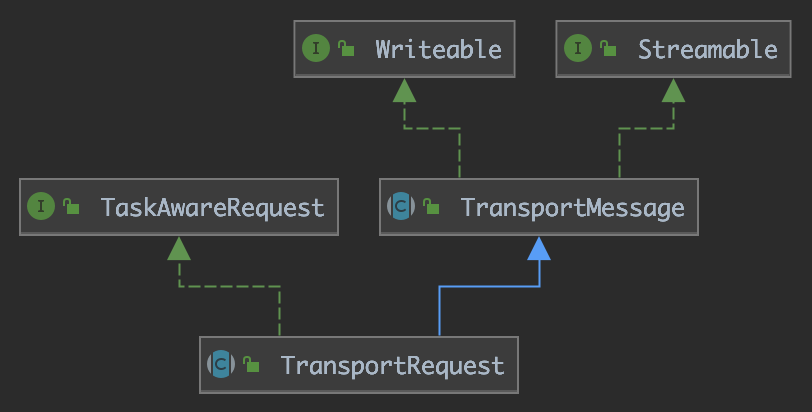
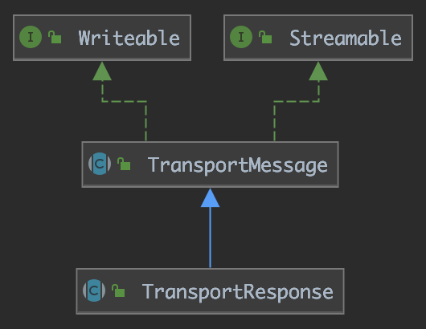

上文[Elasticsearch——transport网络模块][1]我们分析了`Elasticsearch`中用户与节点、节点与节点之间如何通过网络来通信，本文我们来分析一下通过网络传输的数据是如何被读写的。涉及上文[Elasticsearch——transport网络模块][1]相关的内容，本文不再重复。

<!-- more -->

# 用户与节点间的数据

## 请求数据的读操作

用户与`Elasticsearch`的节点通信使用的是`http`协议，数据流转的初始点在`Netty4HttpRequestHandler`的`channelRead0`方法。

下面根据函数的调用流程来看看用户的请求数据经过了哪些处理：

1. `Netty4HttpRequestHandler.channelRead0`：netty生成并传入的是`FullHttpRequest`实例，使用这个实例包装出一个`Netty4HttpRequest`实例。`Netty4HttpRequest`类定义了http请求的所有内容，包括`method`、`url`、`header`、`cookie`、`协议版本`、`请求体内容`。`Netty4HttpRequest`的构造函数中调用`Netty4Utils.toBytesReference(final ByteBuf buffer)`方法将netty生成的由`ByteBuf`实例表示的请求体包装成`ByteBufBytesReference`实例。`ByteBufBytesReference`是抽象类`BytesReference`的实现，提供了数据在字节这个层面的读写方法。
2. `AbstractHttpServerTransport.handleIncomingRequest`：请求数据由`Netty4HttpRequest`实例再进一步包装成`RestRequest`实例。相比于`Netty4HttpRequest`，`RestRequest`进一步从请求中分离出`params`、`path`信息。


有了`RestRequest`实例，处理程序可以方便地从中获取有关请求的所有信息，除了请求体信息。此时的请求体信息还是以`BytesReference`实例的形式存在的，还需要将以字节形式存在的数据解析成拥有具体类型的数据。

这一步骤关键的接口是`XContentParser`。这里先介绍几个相关的接口和类：

- `XContentType`：`Elasticsearch`支持4种数据类型，分别是`JSON`、`SMILE`、`YAML`、`CBOR`。`XContentType`是表示这四种数据类型的枚举类。
- `XContent`：数据的抽象。因为支持4种数据类型，因此`XContent`有4种实现，分别是`JsonXContent`、`SmileXContent`、`YamlXContent`、`CborXContent`。
- `XContentParser`：数据的解析器，4种数据类型的解析器实现分别是`JsonXContentParser`、`SmileXContentParser`、`YamlXContentParser`、`CborXContentParser`。

请求数据的解析流程如下：

1. 根据数据的类型创建解析器`XContentParser`
2. 将字节形式的数据转化成`StreamInput`流数据形式
3. 使用解析器`XContentParser`将流数据解析成具体表示数据的类

## 响应数据的写操作

响应数据的发送初始点在`RestResponseListener`的`processResponse`方法。它调用由具体操作实现的抽象方法`buildResponse`构造响应数据，然后调用`channel.sendResponse`发送数据。

这里有一个相关的类`XContentBuilder`，该类是`XContent`数据的构造器。向`XContentBuilder`中添加数据，`XContentBuilder`可以根据指定的类型（4种）生成相应二进制格式的数据。

`buildResponse`返回一个`RestResponse`实例。`RestResponse`是定义响应数据的抽象类，实现类是`BytesRestResponse`。其中包含响应头、响应状态、数据内容、数据类型。其中数据内容以`BytesReference`实例的形式存在。`BytesRestResponse`构造的时候会调用`BytesReference.bytes(XContentBuilder xContentBuilder)`方法将`XContentBuilder`转化成字节形式的二进制格式。

最后根据`BytesRestResponse`数据生成`Netty4HttpResponse`实例，通过`netty`提供的方法发送。

# 节点之间的数据

假设A节点向B节点发送数据，完成一次通信包含4个步骤：A向B写请求数据，B接收请求数据，B向A写响应数据，A接收响应数据。下面分析这4个操作中数据是如何被读写的。

## A向B写请求数据

对节点的请求数据以`TransportRequest`的实现类来表示。继承关系如下：



可以看到，`TransportRequest`实现了`Writeable`和`Streamable`接口。

`Writeable`接口定义了如下方法：

```java
void writeTo(StreamOutput out) throws IOException;
```

这个接口的实现类具有向`StreamOutput`写入流数据的能力。

`Streamable`接口定义了如下方法：

```java
void readFrom(StreamInput in) throws IOException;
void writeTo(StreamOutput out) throws IOException;
```

这个接口的实现类既能向`StreamOutput`写入流数据，也能从`StreamInput`中读取流数据。

所以`TransportRequest`类同时具有对二进制流的写出与读入功能。

`TransportRequest`通过`OutboundHandler`的`sendRequest`方法被发送：

```java
void sendRequest(final DiscoveryNode node, final TcpChannel channel, final long requestId, final String action,
                 final TransportRequest request, final TransportRequestOptions options, final Version channelVersion,
                 final boolean compressRequest, final boolean isHandshake) throws IOException, TransportException {
    Version version = Version.min(this.version, channelVersion);
    OutboundMessage.Request message = new OutboundMessage.Request(threadPool.getThreadContext(), features, request, version, action,
            requestId, isHandshake, compressRequest);
    ActionListener<Void> listener = ActionListener.wrap(()
            -> messageListener.onRequestSent(node, requestId, action, request, options));
    sendMessage(channel, message, listener);
}
```

`TransportRequest`在`sendRequest`中被包装成`OutboundMessage.Request`类，然后调用`sendMessage`方法：

```java
private void sendMessage(TcpChannel channel, OutboundMessage networkMessage, ActionListener<Void> listener) throws IOException {
    MessageSerializer serializer = new MessageSerializer(networkMessage, bigArrays);
    SendContext sendContext = new SendContext(channel, serializer, listener, serializer);
    internalSend(channel, sendContext);
}
```

`sendMessage`方法中，使用发送数据`OutboundMessage`生成一个数据序列化器`MessageSerializer`，将`MessageSerializer`传递给`SendContext`，然后调用`internalSend`方法将数据发送出去。在`internalSend`方法中获取到二进制数据然后发送。二进制数据的获取如下所示：

```java
public BytesReference get() throws IOException {
    bytesStreamOutput = new ReleasableBytesStreamOutput(bigArrays);
    return message.serialize(bytesStreamOutput);
}
```

分析`OutboundMessage`的`serialize`方法：

```java
BytesReference serialize(BytesStreamOutput bytesStream) throws IOException {
    storedContext.restore();
    bytesStream.setVersion(version);
    bytesStream.skip(TcpHeader.HEADER_SIZE);

    BytesReference reference;
    try(CompressibleBytesOutputStream stream = new CompressibleBytesOutputStream(bytesStream, TransportStatus.isCompress(status))) {
        stream.setVersion(version);
        threadContext.writeTo(stream);
        writeTo(stream);
        reference = writeMessage(stream);
    }
    bytesStream.seek(0);
    TcpHeader.writeHeader(bytesStream, requestId, status, version, reference.length() - TcpHeader.HEADER_SIZE);
    return reference;
}
```

可以看到，最终发送的数据分为两个部分：头部、内容。我们知道，`netty`对于拆包粘包的问题设计了`FrameDecoder`，这里的头部的用途之一就是数据包的解码。

首先将头部数据的位置先空出来，然后调用`writeTo`写入`action`名称（比如`cluster:monitor/nodes/usage[n]`）。接着调用`writeMessage`方法，`writeMessage`方法内部调用`Writeable.writeTo`方法写入具体的二进制数据。前面我们说过对节点的请求数据类都要实现`TransportRequest`，因此这里实际调用的就是各个实现类定义的`writeTo`方法。

接着将写入位置重新定位到开头，写入头部数据。头部数据包含数据标记（固定为`ES`）、数据大小、请求id、状态、`Elasticsearch`程序版本。详细内容参看`TcpHeader`类。

## B接收请求数据

前文我们分析过，请求数据到达`Netty4MessageChannelHandler`的`channelRead`方法。到达`channelRead`方法后调用`Netty4Utils.toBytesReference`将`ByteBuf`表示的数据转换成`BytesReference`表示的二进制数据。

数据经过流转到达`InboundHandler`的`messageReceived`方法，步骤如下：

1. 调用`InboundMessage.Reader`的`deserialize`方法将二进制数据初步解析成`InboundMessage`，提取出其中的头部数据以及内容。
2. 调用`handleRequest`方法处理请求。`InboundMessage`中的请求内容数据解析成`TransportRequest`。
3. 新建线程执行`RequestHandler`，处理请求数据。

## B向A写响应数据

请求经过处理之后生成以`TransportResponse`表示的响应数据。继承关系如下：



`TransportResponse`和`TransportRequest`一样，同样继承了`Writeable`和`Streamable`接口。然后调用`OutboundHandler`的`sendResponse`方法发送响应数据：

```java
void sendResponse(final Version nodeVersion, final Set<String> features, final TcpChannel channel,
                  final long requestId, final String action, final TransportResponse response,
                  final boolean compress, final boolean isHandshake) throws IOException {
    Version version = Version.min(this.version, nodeVersion);
    OutboundMessage.Response message = new OutboundMessage.Response(threadPool.getThreadContext(), features, response, version,
            requestId, isHandshake, compress);
    ActionListener<Void> listener = ActionListener.wrap(() -> messageListener.onResponseSent(requestId, action, response));
    sendMessage(channel, message, listener);
}
```

可以看到`sendResponse`方法和前面分析的`sendRequest`方法大同小异，区别在于响应数据被包装成`OutboundMessage.Response`。和数据请求一样，调用`OutboundMessage`的`serialize`来生成响应的二进制数据。

## A接收响应数据

和接收请求数据一样，到达`channelRead`方法后调用`Netty4Utils.toBytesReference`将`ByteBuf`表示的数据转换成`BytesReference`表示的二进制数据。响应数据经过流转到达`InboundHandler`的`messageReceived`方法。

不一样的地方在于对于请求数据调用`handleRequest`方法来处理，响应数据调用`handleResponse`方法来处理。如前文所示，`handleResponse`调用`TransportResponseHandler.read`方法将二进制流数据转化成`NodeResponse`数据，最后调用`TransportResponseHandler.handleResponse`方法生成http响应数据并返回。

# 总结

综上所述，`Elasticsearch`中围绕数据的读写有三个重要的类：`BytesReference`、`StreamInput`、`StreamOutput`。

`BytesReference`用于数据的二进制表示，`StreamInput`和`StreamOutput`用于数据流的读写。因为这样的设计，`Elasticsearch`对数据才能高效地进行读写。


[1]: /articles/ElasticSearch/ElasticSearch——transport网络模块.html
