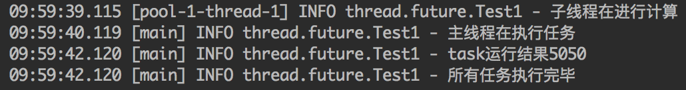
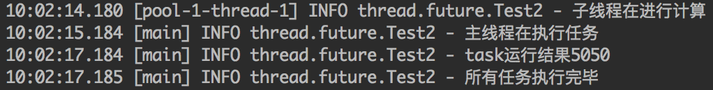
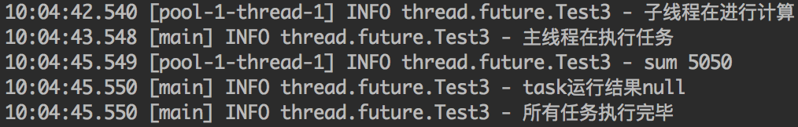
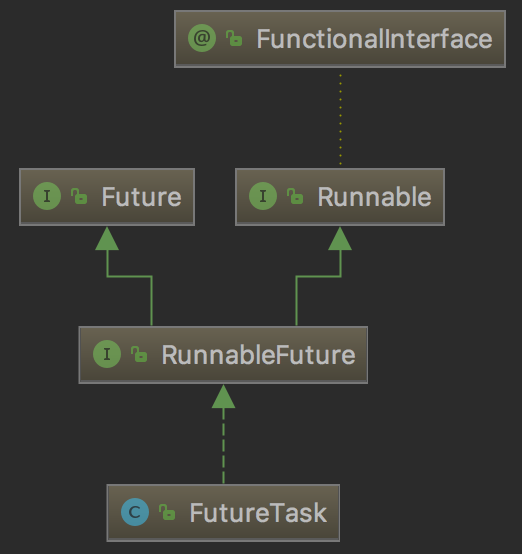

我们知道，创建线程有两种方式：一种是直接继承Thread，另外一种是实现Runnable接口。这两种方式都有一个缺陷就是：在执行完任务之后无法获取执行结果。如果需要获取执行结果，就必须通过共享变量或者使用线程通信的方式来达到效果，这样使用起来就比较麻烦。

从Java 1.5开始，提供了Callable和Future，通过它们可以在任务执行完毕之后得到任务执行结果。

<!-- more -->

Future接口是Java多线程Future模式的实现。Future模式是多线程设计常用的一种设计模式。

Future模式可以理解成：我有一个任务，提交给了Future，Future替我完成这个任务。期间我自己可以去做任何想做的事情。一段时间后，我便可以从Future那儿取出结果。

# Callable与Runnable

`java.lang.Runnable`是一个接口，在它里面只声明了一个`run()`方法：

```java
public interface Runnable {
    public abstract void run();
}
```

由于`run()`方法返回值为void类型，所以在执行完任务之后无法返回任何结果。

`java.util.concurrent.Callable`也是一个接口，在它里面声明了一个`call()`方法：

```java
public interface Callable<V> {
    V call() throws Exception;
}
```

可以看到，这是一个泛型接口，`call()`函数返回的类型就是传递进来的V类型。

`Callable`一般情况下配合`ExecutorService`来使用，在`ExecutorService`接口中声明了若干个submit方法的重载版本：

```java
<T> Future<T> submit(Callable<T> task);
<T> Future<T> submit(Runnable task, T result);
Future<?> submit(Runnable task);
```

三个方法的使用示例如下：

## <T> Future<T> submit(Callable<T> task)

这个方法比较简单，submit方法中传入一个Callable的对象，Future可以获取到Callable运行之后返回的结果。

```java
private static final Logger logger = LoggerFactory.getLogger(Test1.class);

public void test() throws Exception {
    ExecutorService executor = Executors.newCachedThreadPool();
    Task task = new Task();
    Future<Integer> result = executor.submit(task);
    executor.shutdown();

    Thread.sleep(1000);

    logger.info("主线程在执行任务");
    logger.info("task运行结果" + result.get());
    logger.info("所有任务执行完毕");
}

class Task implements Callable<Integer> {

    @Override
    public Integer call() throws Exception {
        logger.info("子线程在进行计算");
        Thread.sleep(3000);
        int sum = 0;
        for (int i = 1; i <= 100; i++) {
            sum += i;
        }
        return sum;
    }
}
```

执行结果如下：



## <T> Future<T> submit(Runnable task, T result)

这个方法比较令人费解，因为Runnable无法返回运行的结果，因此我们可以传入一个result来接收结果，result不是实际的结果，它只是存储了结果。

```java
private static final Logger logger = LoggerFactory.getLogger(Test2.class);
final Integer[] rest = new Integer[1];

public void test() throws Exception {
    ExecutorService executor = Executors.newCachedThreadPool();
    Task task = new Task();
    Future<Integer[]> result = executor.submit(task, rest);
    executor.shutdown();

    Thread.sleep(1000);

    logger.info("主线程在执行任务");
    logger.info("task运行结果" + result.get()[0]);
    logger.info("所有任务执行完毕");
}

class Task implements Runnable {

    @Override
    public void run() {
        logger.info("子线程在进行计算");
        try {
            Thread.sleep(3000);
        } catch (InterruptedException e) {
            e.printStackTrace();
        }
        int sum = 0;
        for (int i = 1; i <= 100; i++) {
            sum += i;
        }
        rest[0] = sum;
    }
}
```

执行结果如下：



## Future<?> submit(Runnable task)

它的返回值实际上是Future<Void>，子线程是不会返回数据的。它的用途是等待子线程运行完成。

```java
private static final Logger logger = LoggerFactory.getLogger(Test3.class);

public void test() throws Exception {
    ExecutorService executor = Executors.newCachedThreadPool();
    Task task = new Task();
    Future<?> result = executor.submit(task);
    executor.shutdown();

    Thread.sleep(1000);

    logger.info("主线程在执行任务");
    logger.info("task运行结果" + result.get());
    logger.info("所有任务执行完毕");
}

class Task implements Runnable {

    @Override
    public void run() {
        logger.info("子线程在进行计算");
        try {
            Thread.sleep(3000);
        } catch (InterruptedException e) {
            e.printStackTrace();
        }
        int sum = 0;
        for (int i = 1; i <= 100; i++) {
            sum += i;
        }
        logger.info("sum {}", sum);
    }
}
```



# Future

Future就是对于具体的Runnable或者Callable任务的执行结果进行取消、查询是否完成、获取结果。必要时可以通过get方法获取执行结果，该方法会阻塞直到任务返回结果。

Future位于`java.util.concurrent`包下，它是一个接口，包含了5个方法：

```java
public interface Future<V> {
    boolean cancel(boolean mayInterruptIfRunning);
    boolean isCancelled();
    boolean isDone();
    V get() throws InterruptedException, ExecutionException;
    V get(long timeout, TimeUnit unit) throws InterruptedException, ExecutionException, TimeoutException;
}
```

- cancel方法用来取消任务。

    - 如果取消任务成功则返回true，如果取消任务失败则返回false。
    - 参数mayInterruptIfRunning表示是否取消正在执行却没有执行完毕的任务，如果设置true，则表示可以取消正在执行过程中的任务。

    - 如果任务已经完成：则无论mayInterruptIfRunning为true还是false，此方法肯定返回false，即如果取消已经完成的任务会返回false
    - 如果任务正在执行：若mayInterruptIfRunning设置为true，则中断正在运行的任务，若mayInterruptIfRunning设置为false，不做操作。结果返回false
    - 如果任务还没有执行：结果返回true
    
- isCancelled方法表示任务是否被取消成功，如果在任务正常完成前被取消成功，则返回true。
- isDone方法表示任务是否已经完成，若任务完成，则返回true
- get方法用来获取执行结果，这个方法会产生阻塞，会一直等到任务执行完毕才返回
- get(long timeout, TimeUnit unit)用来获取执行结果，如果在指定时间内，还没获取到结果，就抛出`TimeoutException`异常

也就是说Future提供了三种功能：

1. 判断任务是否完成
2. 能够中断任务
3. 能够获取任务执行结果

因为Future只是一个接口，所以是无法直接用来创建对象使用的，因此就有了下面的FutureTask

# FutureTask

FutureTask实现了RunnableFuture接口：

```java
public class FutureTask<V> implements RunnableFuture<V>
```

RunnableFuture接口继承了Runnable接口和Future接口。

因此FutureTask既可以作为Runnable被线程执行，又可以作为Future得到Callable的返回值。继承关系如下所示：



FutureTask提供了两个构造器：

```java
public FutureTask(Callable<V> callable) {}
public FutureTask(Runnable runnable, V result) {}
```

FutureTask的示例如下：

```java
private static final Logger logger = LoggerFactory.getLogger(Test4.class);

public void test() throws Exception {
    ExecutorService executor = Executors.newCachedThreadPool();
    Task task = new Task();
    FutureTask<Integer> futureTask = new FutureTask<Integer>(task);
    executor.submit(futureTask);
    executor.shutdown();

    Thread.sleep(1000);

    logger.info("主线程在执行任务");
    logger.info("task运行结果" + futureTask.get());
    logger.info("所有任务执行完毕");
}

class Task implements Callable<Integer> {

    @Override
    public Integer call() throws Exception {
        logger.info("子线程在进行计算");
        Thread.sleep(3000);
        int sum = 0;
        for (int i = 1; i <= 100; i++) {
            sum += i;
        }
        return sum;
    }
}
```

# Callable的运行原理

我们从`ExecutorService`接口三个提交方法的实现入手来探究Callable的运行原理：

```java
public Future<?> submit(Runnable task) {
    if (task == null) throw new NullPointerException();
    RunnableFuture<Void> ftask = newTaskFor(task, null);
    execute(ftask);
    return ftask;
}

public <T> Future<T> submit(Runnable task, T result) {
    if (task == null) throw new NullPointerException();
    RunnableFuture<T> ftask = newTaskFor(task, result);
    execute(ftask);
    return ftask;
}

public <T> Future<T> submit(Callable<T> task) {
    if (task == null) throw new NullPointerException();
    RunnableFuture<T> ftask = newTaskFor(task);
    execute(ftask);
    return ftask;
}
```

可以看到这三个方法大同小异，都是调用`newTaskFor`方法新建`FutureTask`：

```java
protected <T> RunnableFuture<T> newTaskFor(Callable<T> callable) {
    return new FutureTask<T>(callable);
}
```

然后调用`execute`方法执行`ftask`线程。

因此，Callable调用的核心其实就是`FutureTask`，下面我们来分析这个类。

## FutureTask分析

前面我们说到，FutureTask提供了两个构造器：

```java
public FutureTask(Callable<V> callable) {
    if (callable == null)
        throw new NullPointerException();
    this.callable = callable;
    this.state = NEW;       // ensure visibility of callable
}

public FutureTask(Runnable runnable, V result) {
    this.callable = Executors.callable(runnable, result);
    this.state = NEW;       // ensure visibility of callable
}
```

这两个构造器对callable赋值，然后将状态设置为NEW。

这里注意Runnable是怎样转换为Callable的：`this.callable = Executors.callable(runnable, result);`，调用`Executors.callable`方法：

```java
public static <T> Callable<T> callable(Runnable task, T result) {
    if (task == null)
        throw new NullPointerException();
    return new RunnableAdapter<T>(task, result);
}

static final class RunnableAdapter<T> implements Callable<T> {
    final Runnable task;
    final T result;
    RunnableAdapter(Runnable task, T result) {
        this.task = task;
        this.result = result;
    }
    public T call() {
        task.run();
        return result;
    }
}
```

其实就是构建了一个`RunnableAdapter`，在它的`call()`方法中调用`Runnable`的`run`方法，把传入的`T result`作为callable的返回结果。

FutureTask有几个重要的属性：

```java
/**
 * FutureTask的运行状态
 */
private volatile int state;
/**
 * Callable实例，运行时会调用其call()方法，并获得结果。运行结束后置为null
 */
private Callable<V> callable;
/**
 * 调用get()方法时返回的结果或者是抛出的异常
 */
private Object outcome; // non-volatile, protected by state reads/writes
/**
 * 真正执行任务的线程，其中调用callable的call()方法
 */
private volatile Thread runner;
/**
 * Treiber stack
 * 用于存放存放阻塞在get()方法的线程
 */
private volatile WaitNode waiters;
```

state有以下几种状态：

```java
/**
 * 在构建FutureTask时设置，同时也表示内部成员callable已成功赋值
 * 一直到worker thread完成FutureTask中的run()
 */
private static final int NEW          = 0;
/**
 * worker thread在处理task时设定的中间状态，处于该状态时，说明worker thread正准备设置result
 */
private static final int COMPLETING   = 1;
/**
 * 当设置result结果完成后，FutureTask处于该状态，代表过程结果。
 * 该状态为最终状态final state。（正确完成的最终状态）
 */
private static final int NORMAL       = 2;
/**
 * 同上，只不过task执行过程出现异常，此时结果设置为exception，也是final state
 */
private static final int EXCEPTIONAL  = 3;
/**
 * final state，表明task被cancel（task还没有执行就被cancel的状态）
 */
private static final int CANCELLED    = 4;
/**
 * 中间状态，task运行过程中被interrupt时，设置的中间状态
 */
private static final int INTERRUPTING = 5;
/**
 * final state，中断完毕的最终状态
 */
private static final int INTERRUPTED  = 6;
```

`state`初始化为`NEW`。只有在`set`、`setException`、`cancel`方法中`state`才可以转变为终态。在任务完成期间，`state`的值可能为`COMPLETING`或`INTERRUPTING`

state有四种可能的状态转换：

1. NEW -> COMPLETING -> NORMAL
2. NEW -> COMPLETING -> EXCEPTIONAL
3. NEW -> CANCELLED
4. NEW -> INTERRUPTING -> INTERRUPTED

### run

当创建完一个Task通常会提交给`Executors`来执行，当然也可以使用Thread来执行，Thread的`start()`方法会调用Task的`run()`方法。

```java
public void run() {
    if (state != NEW ||
        !UNSAFE.compareAndSwapObject(this, runnerOffset,
                                     null, Thread.currentThread()))
        return;
    try {
        Callable<V> c = callable;
        if (c != null && state == NEW) {
            V result;
            boolean ran;
            try {
                result = c.call();
                ran = true;
            } catch (Throwable ex) {
                result = null;
                ran = false;
                setException(ex);
            }
            if (ran)
                set(result);
        }
    } finally {
        // runner must be non-null until state is settled to
        // prevent concurrent calls to run()
        runner = null;
        // state must be re-read after nulling runner to prevent
        // leaked interrupts
        int s = state;
        if (s >= INTERRUPTING)
            handlePossibleCancellationInterrupt(s);
    }
}
```

1. 首先判断任务的状态，如果任务状态不是NEW，说明任务状态已经改变，方法直接返回
2. 如果状态是NEW。调用`!UNSAFE.compareAndSwapObject(this, runnerOffset, null, Thread.currentThread())`判断runner是否为null，如果为null，则把当前执行任务的线程赋值给runner，如果runner不为null，说明已经有线程在执行，方法返回。此处使用CAS来赋值worker thread是保证多个线程同时提交同一个FutureTask时，确保该FutureTask的run只被调用一次，如果想运行多次，使用`runAndReset`方法
3. 接着开始执行任务，如果要执行的任务不为空，并且state为NEW就执行。可以看到，这里调用了Callable的call方法，如果执行成功则调用`set`方法设置结果，如果出现异常则调用`setException`设置异常。
4. 最后把runner设为null

### set

`set`方法用于设置执行结果

```java
protected void set(V v) {
    if (UNSAFE.compareAndSwapInt(this, stateOffset, NEW, COMPLETING)) {
        outcome = v;
        UNSAFE.putOrderedInt(this, stateOffset, NORMAL); // final state
        finishCompletion();
    }
}
```

1. 使用CAS的方式判断状态是否为NEW，如果为NEW就将状态设置为COMPLETING
2. 将执行结果赋值给outcome
3. 再使用CAS的方式将状态设置为NORMAL
4. 最后执行`finishCompletion()`方法

### setException

`setException`方法用于设置执行过程中抛出的异常，它的操作与`set`方法相似

```java
protected void setException(Throwable t) {
    if (UNSAFE.compareAndSwapInt(this, stateOffset, NEW, COMPLETING)) {
        outcome = t;
        UNSAFE.putOrderedInt(this, stateOffset, EXCEPTIONAL); // final state
        finishCompletion();
    }
}
```

1. 使用CAS的方式判断状态是否为NEW，如果为NEW就将状态设置为COMPLETING
2. 将执行异常赋值给outcome
3. 再使用CAS的方式将状态设置为EXCEPTIONAL
4. 最后执行`finishCompletion()`方法

### finishCompletion

`finishCompletion`方法移除并唤醒当前正在等待执行完成的阻塞线程，调用`done()`方法，将成员变量`callable`设为`null`。

```java
private void finishCompletion() {
    // assert state > COMPLETING;
    for (WaitNode q; (q = waiters) != null;) {
        if (UNSAFE.compareAndSwapObject(this, waitersOffset, q, null)) {
            for (;;) {
                Thread t = q.thread;
                if (t != null) {
                    q.thread = null;
                    LockSupport.unpark(t);
                }
                WaitNode next = q.next;
                if (next == null)
                    break;
                q.next = null; // unlink to help gc
                q = next;
            }
            break;
        }
    }

    done();

    callable = null;        // to reduce footprint
}
```

等待唤醒的线程保存在`WaitNode waiters`成员变量中，它是一个链表结构的数据类型。遍历这个链表，调用`LockSupport.unpark()`方法唤醒节点中保持的线程，然后删除该节点。

`done()`方法是一个默认为空的回调函数，可以由子类实现，在Task执行完毕后执行回调。

### get

`get`方法是一个非常重要的方法，返回Task执行完成后的结果

```java
public V get() throws InterruptedException, ExecutionException {
    int s = state;
    if (s <= COMPLETING)
        s = awaitDone(false, 0L);
    return report(s);
}
```

首先判断FutureTask的状态。如果是未完成状态(s <= COMPLETING)则调用`awaitDone`方法进行阻塞；如果是完成状态，说明已经执行过`set`或者`setException`方法，调用`report(s)`返回执行结果。

### get(long timeout, TimeUnit unit)

`get(long timeout, TimeUnit unit)`方法用于在指定时间内获取执行结果

```java
public V get(long timeout, TimeUnit unit)
    throws InterruptedException, ExecutionException, TimeoutException {
    if (unit == null)
        throw new NullPointerException();
    int s = state;
    if (s <= COMPLETING &&
        (s = awaitDone(true, unit.toNanos(timeout))) <= COMPLETING)
        throw new TimeoutException();
    return report(s);
}
```

与`get()`方法唯一不同的地方是，将超时时间作为参数传入`awaitDone`方法，判断`awaitDone`返回的状态，如果`<= COMPLETING`表示它在超时前没有执行完，于是抛出`TimeoutException`异常。如果执行完成，调用`report(s)`返回执行结果。

### report

```java
private V report(int s) throws ExecutionException {
    Object x = outcome;
    if (s == NORMAL)
        return (V)x;
    if (s >= CANCELLED)
        throw new CancellationException();
    throw new ExecutionException((Throwable)x);
}
```

`report`方法整理FutureTask执行的结果，并返回

- 如果状态为NORMAL，说明执行正常，返回执行结果
- 如果状态`>=CANCELLED`（即`CANCELLED` `INTERRUPTING` `INTERRUPTED`三种状态），说明是认为取消任务的，此时抛出`CancellationException`异常
- 除此以外，状态为`EXCEPTIONAL`，说明是执行过程中抛出了异常，此时抛出`ExecutionException((Throwable)x)`异常

### awaitDone

调用`get`方法时，如果FutureTask的状态为未完成状态，则调用`awaitDone`阻塞当前线程

```java
private int awaitDone(boolean timed, long nanos) throws InterruptedException {
    final long deadline = timed ? System.nanoTime() + nanos : 0L;
    WaitNode q = null;
    boolean queued = false;
    for (;;) {
        if (Thread.interrupted()) {
            removeWaiter(q);
            throw new InterruptedException();
        }

        int s = state;
        if (s > COMPLETING) {
            if (q != null)
                q.thread = null;
            return s;
        }
        else if (s == COMPLETING) // cannot time out yet
            Thread.yield();
        else if (q == null)
            q = new WaitNode();
        else if (!queued)
            queued = UNSAFE.compareAndSwapObject(this, waitersOffset, q.next = waiters, q);
        else if (timed) {
            nanos = deadline - System.nanoTime();
            if (nanos <= 0L) {
                removeWaiter(q);
                return state;
            }
            LockSupport.parkNanos(this, nanos);
        }
        else
            LockSupport.park(this);
    }
}
```

可以看到，`awaitDone`方法中是一个大的死循环，它在循环中判断FutureTask的执行状态，根据状态来决定是跳出方法还是阻塞等待：

1. 如果执行`get`方法的线程被中断，则移除阻塞队列中超时或者中断的线程，并抛出中断异常
2. 如果FutureTask的状态转换为完成状态（s > COMPLETING，正常完成或取消），则返回完成状态
3. 如果FutureTask的状态变为COMPLETING，则说明正在调用`set()`方法设置运行结果，此时让线程暂时等待
4. 如果FutureTask的状态为初始态NEW，则将当前线程加入到FutureTask的等待队列中去
5. 如果`get`方法没有设置超时时间，则阻塞当前调用`get`方法的线程。
6. 如果`get`方法设置了超时时间，则判断是否到达超时时间。如果到达则移除阻塞队列中超时或者中断的线程，并返回此时FutureTask的状态；如果未到达超时时间，则阻塞当前调用`get`方法的线程，并设置一个阻塞的超时时间

### cancel

对于已经提交执行的任务，可以调用`cancel`方法取消。

```java
public boolean cancel(boolean mayInterruptIfRunning) {
    if (!(state == NEW &&
          UNSAFE.compareAndSwapInt(this, stateOffset, NEW,
              mayInterruptIfRunning ? INTERRUPTING : CANCELLED)))
        return false;
    try {    // in case call to interrupt throws exception
        if (mayInterruptIfRunning) {
            try {
                Thread t = runner;
                if (t != null)
                    t.interrupt();
            } finally { // final state
                UNSAFE.putOrderedInt(this, stateOffset, INTERRUPTED);
            }
        }
    } finally {
        finishCompletion();
    }
    return true;
}
```

- 首先判断状态，只有state等于NEW才可以被取消。不为NEW表示已经处于完成、中断、取消状态，这些状态不能被取消，直接返回`false`。
- 如果`mayInterruptIfRunning`为true，代表任务需要被中断，走`NEW -> INTERRUPTING -> INTERRUPTED`流程；否则代表任务被取消，走`NEW -> CANCELLED`流程。
- 如果`mayInterruptIfRunning`为true，调用`interrupt`中断正在运行的线程。注意这里仅仅是对线程发出中断请求，不确保任务能检测并处理中断。
- 调用`finishCompletion`
- 最后返回`true`。即如果状态不为NEW，则不能取消任务，返回`false`；否则一律返回`true`，不管任务是否被取消。

### isCancelled

```java
public boolean isCancelled() {
    return state >= CANCELLED;
}
```

通过检查状态是否大于等于`CANCELLED`来判断任务是否被取消

### isDone

```java
public boolean isDone() {
    return state != NEW;
}
```

如果状态不为`NEW`表示任务已经执行完了

# 总结

`Future`机制提供了三种功能：判断任务是否完成、中断任务、获取任务执行结果。从而使得控制任务的异步执行成为可能。


> https://www.cnblogs.com/dolphin0520/p/3949310.html
> https://www.jianshu.com/p/949d44f3d9e3
> https://blog.csdn.net/codershamo/article/details/51901057
> https://www.jianshu.com/p/dff9063e1ab6


