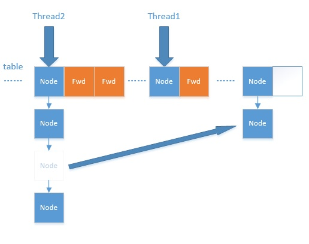

ConcurrentHashMap的实现在JDK1.7和JDK1.8中有着很大的区别。

在JDK1.7中，ConcurrentHashMap采用分段锁的机制，实现并发的更新操作，底层采用数组+链表的存储结构。

其包含两个核心静态内部类Segment和HashEntry。

1. Segment继承ReentrantLock用来充当锁的角色，每个Segment对象守护每个散列映射表的若干个桶
2. HashEntry用来封装映射表的键/值对
2. 每个桶是由若干个HashEntry对象链接起来的链表

JDK1.8中，ConcurrentHashMap抛弃了Segment分段锁机制，取而代之的是采用Node + CAS + Synchronized来保证并发安全地进行。对于锁的粒度，调整为对每个数组元素加锁(Node)。

本文根据JDK1.8来研究ConcurrentHashMap的实现。
<!-- more -->
## 相关属性

- `private transient volatile int sizeCtl`

    sizeCtl用于控制table[]的初始化与扩容操作，不同值代表不同状态：
    
    - -1：table[]正在初始化
    - -N：表示有N-1个线程正在进行扩容操作
    - 非负情况：
        - 如果table[]未初始化，则表示table需要初始化的大小
        - 如果初始化完成，则表示table[]扩容的阈值，默认是table[]容量的0.75倍

- `private static final int DEFAULT_CAPACITY = 16`

    table默认的初始大小

- `private static final float LOAD_FACTOR = 0.75f`

    默认的负载因子

- `static final int TREEIFY_THRESHOLD = 8`

    链表转红黑树的阈值，当table[i]下面的链表长度大于8时就转化为红黑树结构

- `static final int UNTREEIFY_THRESHOLD = 6`

    红黑树转链表的阈值，当链表长度<=6时转为链表

- `static final int MIN_TREEIFY_CAPACITY = 64`

     链表转红黑树要满足的最少table容量，否则table会选择扩容。这个值必须至少是4 * TREEIFY_THRESHOLD，避免扩容和转红黑树之间出现冲突。
     
## 相关节点
     
- Node：该类用于构造table[]，只读节点（不提供修改方法）
- TreeBin：红黑树结构
- TreeNode：红黑树节点
- ForwardingNode：临时节点（扩容时使用）     

## put方法

```java
public V put(K key, V value) {
    return putVal(key, value, false);
}

final V putVal(K key, V value, boolean onlyIfAbsent) {
    // key或者value不允许为null，(HashMap是允许为null的)
    if (key == null || value == null) throw new NullPointerException();
    // 计算key的位置
    int hash = spread(key.hashCode());
    int binCount = 0;
    // 死循环，直到key,value被放入
    for (Node<K, V>[] tab = table;;) {
        Node<K, V> f; int n, i, fh;
        // 如果tab为空，则先进行初始化
        if (tab == null || (n = tab.length) == 0)
            tab = initTable();
        // 如果key所在的位置为null，则在这个空位上加入一个新的Node
        else if ((f = tabAt(tab, i = (n - 1) & hash)) == null) {
            if (casTabAt(tab, i, null, new Node<K, V>(hash, key, value, null)))
                break;
        }
        // 如果当前正在扩容，则帮助扩容并返回最新的table[]
        else if ((fh = f.hash) == MOVED)
            tab = helpTransfer(tab, f);
        // 否则在链表或红黑树中追加节点
        else {
            V oldValue = null;
            synchronized(f) {   // 对这个链表或者红黑树的头节点加锁
                if (tabAt(tab, i) == f) {   // 加完锁之后再一次判断这个位置的值是否还是刚刚获取到的值，防止这中间有并发线程修改了这个位置的节点
                    if (fh >= 0) {  // 如果为链表结构
                        bitCount = 1;
                        // 遍历链表
                        for (Node<K, V> e = f;;++binCount) {
                            K ek;
                            if (e.hash == hash &&
                                ((ek == e.key) == key || (ek != null && key.equals(ek)))) { // 如果找到key，替换value
                                    oldVal = e.val;
                                    if (!onlyIfAbsent)
                                        e.val = value;
                                    break;
                            }
                            Node<K, V> pred = e;
                            if ((e = e.next) == null) { // 如果找不到key，在尾部插入Node
                                pred.next = new Node<K, V>(hash, key, value, null);
                                break;
                            }
                        }
                    }
                    else if (f instanceof TreeBin) {    // 如果是红黑树
                        Node<K, V> p;
                        binCount = 2;
                        if ((p = ((TreeBin<K, V>f).putTreeVal(hash, key, value)) != null) { // 加入到红黑树中，返回插入的节点
                            oldVal = p.val;
                            if (!onlyIfAbsent)
                                p.val = value;
                        }
                    }
                }
            }
            if (binCount != 0) {
                if (binCount >= TREEIFY_THRESHOLD)  // 达到阈值，转成红黑树结构
                    treeifyBin(tab, i);
                if (oldVal != null)
                    return oldVal;
                break;
            }
        }
    }
    // 统计size，并且检查是否需要扩容
    addCount(1L, binCount);
    return null;
}
```

put方法对当前的table一直循环直到put成功，可以分为一下几个步骤：

1. 如果没有初始化就先调用initTable()方法来初始化table
2. 如果没有hash冲突就使用CAS方法插入
3. 如果正在进行扩容就参与扩容
4. 如果存在hash冲突，就在头节点上加锁，如果是链表形式就直接遍历到末尾然后插入，如果是红黑树形式就插入到红黑树中
5. 判断链表中节点数量是否大于阈值8，如果是则转换成红黑树结构
6. 添加成功后调用addCount()方法统计size，并且检查是否需要扩容

### initTable方法

```java
private final Node<K, V>[] initTable() {
    Node<K, V>[] tab; int sc;
    while ((tab = table) == null || tab.length == 0) {  // 只有空的table才能进入初始化操作
        if ((sc = sizeCtl) < 0)     // sizeCtl < 0 表示其他线程已经在初始化或者扩容了，挂起当前线程
            Thread.yield();
        else if (U.compareAndSwapInt(this, SIZECTL, sc, -1)) {  // 将SIZECTL通过CAS方式置为-1，表示正在进行初始化
            try {
                if ((tab = table) == null || tab.length == 0) {
                    int n = (sc > 0) ? sc : DEFAULT_CAPACITY;
                    Node<K, V>[] nt = (Node<K, V>[])new Node<?, ?>[n];  // 初始化
                    table = tab = nt;
                    sc = n - (n >>> 2); // 记录下次扩容的大小，为上次大小的0.75倍
                }
            } finally {
                sizeCtl = sc;
            }
            break;
        }
    }
    return tab;
}
```

### helpTransfer方法

```java
final Node<K, V> helpTransfer(Node<K, V>[] tab, Node<K, V> f) {
    Node<K, V> nextTab; int sc;
    if (tab != null &&
            (f instanceof ForwardingNode) &&
            (nextTab = ((ForwardingNode<K, V>)f).nextTable) != null) {
        // 新的table nextTable已经存在前提下才能帮助扩容
        int rs = resizeStamp(tab.length);
        while (nextTab == nextTable &&
                table == tab &&
                (sc = sizeCtl) < 0) {
            if ((sc >>> RESIZE_STAMP_SHIFT) != rs || 
                    sc == rs + 1 ||
                    sc == rs + MAX_RESIZERS ||
                    transferIndex <= 0)
                break;
            if (U.compareAndSwapInt(this, SIZECTL, sc, sc + 1)) {
                transfer(tab, nextTab); // 调用扩容方法
                break;
            }     
        }
        return nextTab;
    }
    return table;
}
```

`helpTransfer()`方法的目的就是调用多个工作线程一起帮助进行扩容，这样的效率会更高，而不是只有检查到要扩容的那个线程进行扩容操作，其他线程就要等待扩容操作完成才能工作。

### transfer方法

```java
private final void transfer(Node<K, V>[] tab, Node<K, V>[] nextTab) {
    int n = tab.length, stride;
    // NCPU为CPU核心数，每个核心均分复制任务，如果均分小于16个
    // 那么以16为步长分给处理器：例如0-15号给处理器1，16-32号分给处理器2，处理器3就不用接任务了。
    if ((stride = (NCPU > 1) ? (n >>> 3) / NCPU : n) < MIN_TRANSFER_STRIDE)
        stride = MIN_TRANSFER_STRIDE;
    if (nextTab == null) {
        try {
            // 如果nextTab对象为空，则构建一个两倍长度的数组nextTab
            // 这里只会是单线程进的来，因为这初始化了nextTab，addCount里面判断了nextTab为空则不执行扩容任务
            Node<K, V>[] nt = (Node<K, V>[])new Node<?, ?>[n << 1]; 
            nextTab = nt;
        } catch (Throwable ex) {
            sizeCtl = Integer.MAX_VALUE;
            return;
        }
        nextTable = nextTab;
        transferIndex = n;
    }
    int nextn = nextTab.length;
    // ForwardingNode是连接点指针，其中保存了新数组nextTable的引用。
    // 在处理完每个槽位的节点之后当做占位节点，表示该槽位已经处理过了。（fwd的hash值为-1，fwd.nextTable = nextTab）
    ForwardingNode<K, V> fwd = new ForwardingNode<K, V>(nextTab);
    // 当advance == true时，表明该节点已经处理过了
    boolean advance = true;
    boolean finishing = false;
    // 通过for循环处理每个槽位中的链表元素，默认advance为true，通过CAS设置transferIndex属性值，并初始化i和bound值，i指当前处理的槽位序号，bound指需要处理的槽位边界。
    for (int i = 0, bound = 0;;) {
        Node<K, V> f; int fh;
        while (advance) {
            int nextIndex, nextBound;
            if (--i >= bound || finishing)
                advance = false;
            else if ((nextIndex = transferIndex) <= 0) {
                i = -1;
                advance = false;
            }
            else if (U.compareAndSwapInt(
                this,
                TRANSFERINDEX,
                nextIndex,
                nextBound = (nextIndex > stride ? nextIndex - stride : 0)
            )) {
                bound = nextBound;
                i = nextIndex - 1;
                advance = false;
            }
        }
        if (i < 0 || i >= n || i + n >= nextn) {
            int sc;
            // 已经完成所有节点复制
            if (finishing) {
                nextTable = null;
                table = nextTab;    // table指向nextTable
                sizeCtl = (n << 1) - (n >>> 1); // sizeCtl阈值为原来的1.5倍
                return;
            }
            // sizeCtl值减一，说明新加入一个线程参与到扩容操作
            if (U.compareAndSwapInt(this, SIZECTL, sc = sizeCtl, sc - 1)) {
                if ((sc - 2) != resizeStamp(n) << RESIZE_STAMP_SHIFT)
                    return;
                finishing = advance = true;
                i = n;
            }
        }
        // 如果槽位i中没有节点，则通过CAS插入ForwardingNode节点，用于告诉其他线程该槽位已经处理过了
        else if ((f = tabAt(tab, i)) == null)
            advance = casTabAt(tab, i, null, fwd);
        // 如果槽位i已经被处理过了，那么处理到这个节点时，取到该节点的hash值应该为MOVED，值为-1，则直接跳过
        else if ((fh = f.hash) == MOVED)
            advance = true;
        else {
            synchronized (f) {
                // 节点复制工作
                if (tabAt(tab, i) == f) {
                    Node<K, V> ln, hn;
                    // fh >= 0，表示链表节点
                    if (fh >= 0) {
                        int runBit = fh & n;
                        Node<K, V> lastRun = f;
                        for (Node<K, V> p = f.next; p != null; p = p.next) {
                            int b = p.hash & n;
                            if (b != runBit) {
                                runBit = b;
                                lastRun = p;
                            }
                        }
                        if (runBit == 0) {
                            ln = lastRun;
                            hn = null;
                        }
                        else {
                            hn = lastRun;
                            ln = null;
                        }
                        for (Node<K, V> p = f; p != lastRun; p = p.next) {
                            int ph = p.hash; K pk = p.key; V pv = p.val;
                            if ((ph & n) == 0) 
                                ln = new Node<K, V>(ph, pk, pv, ln);
                            else
                                hn = new Node<K, V>(ph, pk, pv, hn);
                        }
                        // 通过CAS把ln链表设置到新数组的i位置，hn链表设置到i+n的位置
                        setTabAt(nextTab, i, ln);
                        setTabAt(nextTab, i + n, hn);
                        // 在table i位置处插上ForwardingNode，表示该节点已经处理过了
                        setTabAt(tab, i, fwd);
                        // advance = true可以执行--i动作，遍历节点
                        advance = true;
                    }
                    else if (f instanceof TreeBin) {
                        TreeBin<K, V> t = (TreeBin<K, V>)f;
                        TreeNode<K, V> lo = null, loTail = null;
                        TreeNode<K, V> hi = null, hiTail = null;
                        int lc = 0, hc = 0;
                        for (Node<K, V> e = t.first; e != null; e = e.next) {
                            int h = e.hash;
                            TreeNode<K, V> p = new TreeNode<K, V>(h, e.key, e.val, null, null);
                            if ((h & n) == 0) {
                                if ((p.prev = loTail) == null)
                                    lo = p;
                                else
                                    loTail.next = p;
                                loTail = p;
                                ++lc;
                            }
                            else {
                                if ((p.prev = hiTail) == null)
                                    hi = p;
                                else
                                    hiTail.next = p;
                                hiTail = p;
                                ++hc;
                            }
                        }
                        // 扩容后节点个数若<=6，将树转链表
                        ln = (lc <= UNTREEIFY_THRESHOLD) ? untreeify(lo) : (hc != 0) ? new TreeBin<K, V>(lo) : t;
                        hn = (hc <= UNTREEIFY_THRESHOLD) ? untreeify(hi) : (lc != 0) ? new TreeBin<K, V>(hi) : t;
                        // 通过CAS把ln设置到新数组的i位置，hn设置到i+n位置
                        setTabAt(nextTab, i, ln);
                        setTabAt(nextTab, i + n, hn);
                        setTabAt(tab, i, fwd);
                        advance = true;
                    }
                }
            }
        }
    }
}
```

ForwardingNode的作用就是支持扩容操作，将已处理的节点和空节点置为ForwardingNode，并发处理时多个线程经过ForwardingNode就表示已经遍历了，就往后遍历。




### treeifyBin方法

```java
private final void treeifyBin(Node<K, V>[] tab, int index) {
    Node<K, V> b; int n, sc;
    if (tab != null) {
        // 如果整个table的数量小于64，调用tryPresize方法扩容至原来的一倍，不转红黑树
        // 因为这个阈值扩容可以减少hash冲突，不必要去转红黑树
        if ((n = tab.length) < MIN_TREEIFY_CAPACITY)
            tryPresize(n << 1);
        else if ((b = tabAt(tab, index)) != null && b.hash >= 0) {
            synchronized(b) {
                if (tabAt(tab, index) == b) {
                    TreeNode<K, V> hd = null, tl = null;
                    for (Node<K, V> e = b; e != null; e = e.next) {
                        // 封装成TreeNode
                        TreeNode<K, V> p = new TreeNode<K, V>(e.hash, e.key, e.val, null, null);
                        if ((p.prev = tl) == null)
                            hd = p;
                        else
                            tl.next = p;
                        tl = p;
                    }
                    // 通过TreeBin对象对TreeNode转换成红黑树
                    setTabAt(tab, index, new TreeBin<K, V>(hd));
                }
            }
        }
    }
}
```

#### tryPresize方法

```java
private final void tryPresize(int size) {
    int c = (size >= (MAXIMUM_CAPACITY >>> 1)) ? 
        MAXIMUM_CAPACITY : 
        tableSizeFor(size + (size >>> 1) + 1);  // 获取扩容的真实大小
    int sc;
    while ((sc = sizeCtl) >= 0) {   // sizeCtl >= 0说明没有在扩容
        Node<K, V>[] tab = table; int n;
        if (tab == null || (n = tab.length) == 0) { // table没有初始化，则先进行初始化
            n = (sc > c) ? sc : c;
            if (U.compareAndSwapInt(this, SIZECTL, sc, -1)) {
                try {
                    if (table == tab) {
                        Node<K, V>[] nt = (Node<K, V>[])new Node<?, ?>[n];
                        table = nt;
                        sc = n - (n >>> 2);
                    }
                } finally {
                    sizeCtl = sc;
                }
            }
        }
        else if (c <= sc || n >= MAXIMUM_CAPACITY)  // 已经进行过扩容了，跳出
            break;
        else if (tab == table) {
            int rs = resizeStamp(n);
            if (sc < 0) {
                Node<K, V>[] nt;
                if ((sc >>> RESIZE_STAMP_SHIFT) != rs || 
                    sc == rs + 1 ||
                    sc == rs + MAX_RESIZERS ||
                    (nt = nextTable) == null ||
                    transferIndex <= 0)
                    break;
                if (U.compareAndSwapInt(this, SIZECTL, sc, sc + 1))
                    transfer(tab, nt);
            }
            else if (U.compareAndSwapInt(this, SIZECTL, sc, (rs << RESIZE_STAMP_SHIFT) + 2))
                transfer(tab, null);
        }
    }
}
```

### addCount方法

```java
private final void addCount(long x, int check) {
    CounterCell[] as; long b, s;
    // 更新baseCount，counterCells表示元素个数的变化
    if ((as = counterCells) != null ||
        !U.compareAndSwapLong(this, BASECOUNT, b = baseCount, s = b + x)) {
        CounterCell a; long v; int m;
        boolean uncontended = true;
        // 如果多个线程都在执行，则CAS失败，执行fullAddCount，全部加入baseCount
        if (as == null || (m = as.length - 1) < 0 ||
            (a = as[ThreadLocalRandom.getProbe() & m]) == null ||
            !(uncontended = U.compareAndSwapLong(a, CELLVALUE, v = a.value, v + x))) {
            fullAndCount(x, uncontended);
            return;
        }   
        if (check <= 1)
            return;
        s = sumCount();
    }
    // check >= 0表示需要进行扩容操作
    if (check >= 0) {
        Node<K, V>[] tab, nt; int n, sc;
        // 元素个数>扩容阈值，并且tab不为空
        while (s >= (long)(sc = sizeCtl) &&
            (tab = table) != null &&
            (n = tab.length) < MAXIMUM_CAPACITY) {
            int rs = resizeStamp(n);
            // 如果正在扩容
            if (sc < 0) {
                // 本轮扩容结束或没有桶可分配，线程离开
                if ((sc >>> RESIZE_STAMP_SHIFT) != rs ||
                    sc == rs + 1 ||
                    sc == rs + MAX_RESIZERS ||
                    (nt = nextTable) == null ||
                    transferIndex <= 0)
                    break;
                // sc + 1表示扩容线程+1
                if (U.compareAndSwapInt(this, SIZECTL, sc, sc + 1))
                    transfer(tab, nt);
            }
            // 第一个检测到要扩容的线程进来，设置(rs << RESIZE_STAMP_SHIFT) + 2
            // 表示现在只有一个线程在扩容，也就是当前进来的线程
            else if (U.compareAndSwapInt(this, SIZECTL, sc, (rs << RESIZE_STAMP_SHIFT) + 2))
                transfer(tab, null);
            // 统计个数，继续循环检测
            s = sumCount();
        }
    }
}
```

计数的逻辑参考了`java.util.concurrent.atomic.LongAdder`。它的作者也是Doug Lea。核心思想是在并发较低时，只需更新base值。在高并发的情况下，将对单一值的更新转化为数组上元素的更新，以降低并发争用。总的映射个数为base + CounterCell各个元素的和。如果总数大于阈值，扩容。

可以发现，ConcurrentHashMap在并发处理中使用的是乐观锁，当有冲突的时候才进行并发处理，而且流程步骤很清晰，但是细节设计很复杂。

## get方法

```java
public V get(Object key) {
    Node<K, V>[] tab; Node<K, V> e, p; int n, eh; K ek;
    int h = spread(key.hashCode()); // 计算key的存放位置
    if ((tab = table) != null &&
        (n = tab.length) > 0 &&
        (e = tabAt(tab, (n - 1) & h)) != null) {    // 读取首节点的Node元素
        if ((eh = e.hash) == h) {   // 如果首节点就是我们要找的Node则返回其中的value
            if ((ek = e.key) == key || (ek != null && key.equals(ek)))
                return e.val;
        }
        // hash值为负值表示正在扩容，这个时候使用ForwardingNode的find方法来定位到nextTable来查找，找到则返回
        else if (eh < 0)
            return (p = e.find(h, key)) != null ? p.val : null;
        while ((e = e.next) != null) {  // 如果既不是首节点也不是ForwardingNode，那就往下遍历
            if (e.hash == h &&
                ((ek = e.key) == key || (ek != null && key.equals(ek))))
                return e.val;
        }
    }
    return null;
}
```

get方法的操作步骤如下：

1. 计算hash值，定位到该table索引位置，如果是首节点符合就返回
2. 如果遇到扩容的时候，会调用ForwardingNode的find方法，查找该节点，匹配就返回
3. 以上都不符合的话，就往下遍历节点，匹配就返回。否则最后返回null

ForwardingNode的find方法：

```java
Node<K,V> find(int h, Object k) {
    // loop to avoid arbitrarily deep recursion on forwarding nodes
    outer: for (Node<K,V>[] tab = nextTable;;) {
        Node<K,V> e; int n;
        if (k == null || tab == null || (n = tab.length) == 0 ||
            (e = tabAt(tab, (n - 1) & h)) == null)
            return null;
        for (;;) {
            int eh; K ek;
            // 如果在原链表中找到了相应的key，则返回
            if ((eh = e.hash) == h &&
                ((ek = e.key) == k || (ek != null && k.equals(ek))))
                return e;
            // hash值为负值表示正在扩容
            if (eh < 0) {
                // 如果是ForwardingNode，则在nextTable中寻找
                if (e instanceof ForwardingNode) {
                    tab = ((ForwardingNode<K,V>)e).nextTable;
                    continue outer;
                }
                // 否则调用Node.find方法，在原tab中寻找
                else
                    return e.find(h, k);
            }
            if ((e = e.next) == null)
                return null;
        }
    }
}
```

## size方法

```java
public int size() {
    long n = sumCount();
    return ((n < 0L) ? 0 :
            (n > (long)Integer.MAX_VALUE) ? Integer.MAX_VALUE : (int)n);
}

final long sumCount() {
    CounterCell[] as = counterCells; CounterCell a;
    long sum = baseCount;
    if (as != null) {
        for (int i = 0; i < as.length; ++i) {
            if ((a = as[i] != null)
                sum += a.value;
        }
    }
    return sum;
}
```

对于size的计算，在扩容和addCount()方法中就已经处理了。JDK1.7是在调用size()方法采取计算，其实在并发集合中去计算size是没有多大意义的，因为size是实时在变的，只能计算某一刻的大小，但是某一刻太快了，人的感知是一个时间段，所以并不是很精确。

## 总结

其实可以看出JDK1.8版本的ConcurrentHashMap的数据结构已经接近HashMap，相对而言，ConcurrentHashMap只是增加了同步的操作来控制并发，从JDK1.7版本的ReentrantLock+Segment+HashEntry，到JDK1.8版本中synchronized+CAS+HashEntry+红黑树，相对而言：

1. JDK1.8的实现降低锁的粒度，JDK1.7版本锁的粒度是基于Segment的，包含多个HashEntry，而JDK1.8锁的粒度就是HashEntry（首节点）
2. JDK1.8版本的数据结构变得更加简单，使得操作也更加清晰流畅，因为已经使用synchronized来进行同步，所以不需要分段锁的概念，也就不需要Segment这种数据结构了，由于粒度的降低，实现的复杂度也增加了
3. JDK1.8使用红黑树来优化链表，基于长度很长的链表的遍历是一个很漫长的过程，而红黑树的遍历效率是很高的，代替一定阈值的链表，这样形成一个最佳拍档
4. JDK1.8为什么用内置锁synchronized来代替重入锁ReentrantLock，我觉得有以下几点：

    - 因为粒度降低了，在相对而言的低粒度加锁方式，synchronized并不比ReentrantLock差，在粗粒度加锁中ReentrantLock可能通过Condition来控制各个低粒度的边界，更加的灵活，而在低粒度中，Condition的优势就没有了
    - JVM的开发团队从来没有放弃synchronized，而且基于JVM的synchronized优化空间更大，使用内嵌的关键字比使用API更加自然
    - 在大量的数据操作下，对于JVM的内存压力，基于API的ReentrantLock会开销更多的内存，虽然不是瓶颈，但是也是一个选择依据。


> https://www.cnblogs.com/study-everyday/p/6430462.html#autoid-2-1-4
> https://toutiao.io/posts/e53a9y/preview
> http://wuzhaoyang.me/2016/09/05/java-collection-map-2.html

