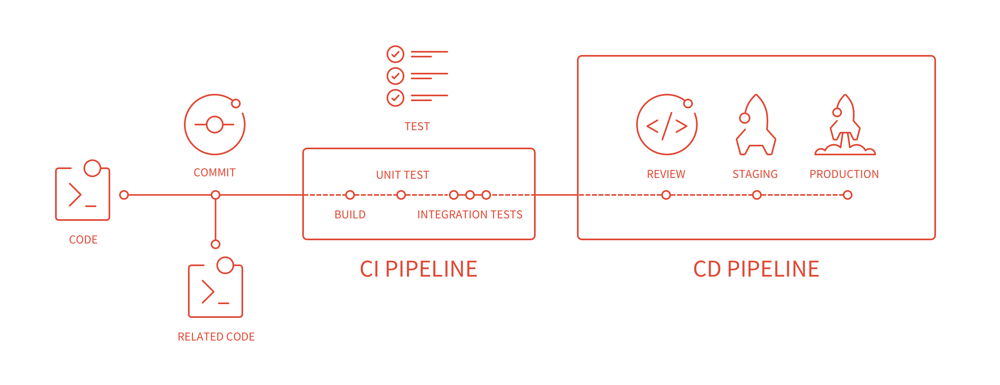
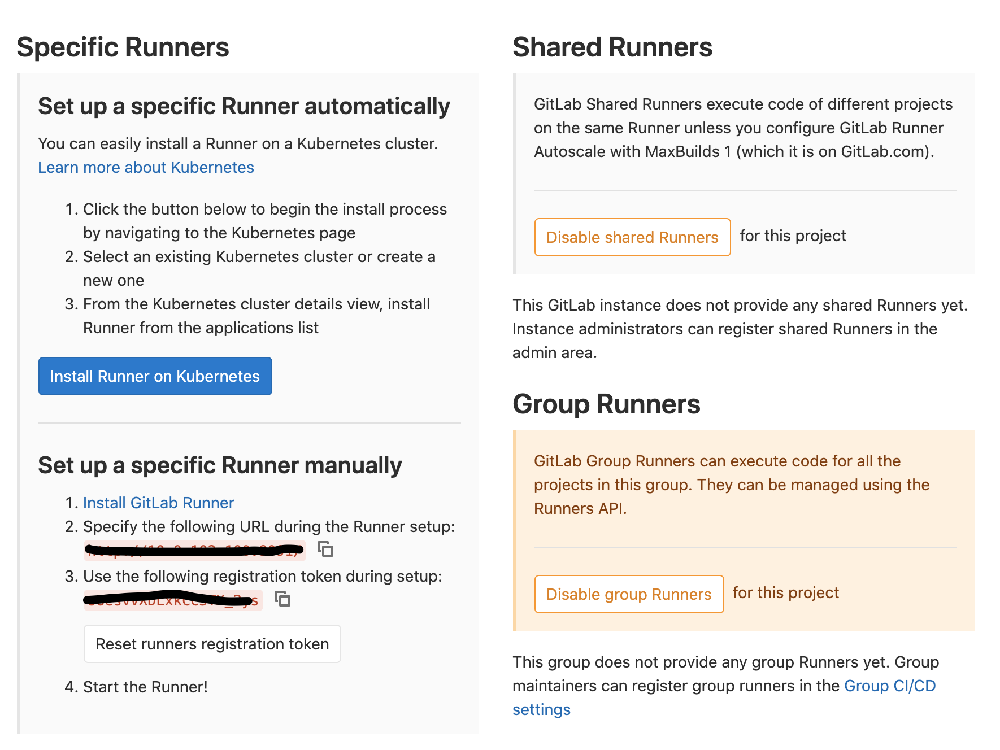

本文介绍GitLab CI/CD的简单使用，基于它来实现项目的自动化发布。

<!-- more -->

由于项目属于起步阶段，因此项目的部署流程还不规范。部署程序操作流程很长，需要经过大量的手动操作，每次部署都需要花费大约5分钟。并且因为本地环境的影响，可能导致不同人部署的程序代码不一致。

最初的部署方式非常原始：本地打包好程序之后上传到服务器，然后手动执行命令来部署程序。

因为这样的操作很繁琐，后面写了一个脚本放在服务器上，脚本可以执行同步代码、打包程序、部署程序等一系列流程。这样每次部署都只要在服务器上执行一条命令，相比之前的部署方式方便了很多。

但是对于需要频繁部署的开发环境来说，这样的操作还是繁琐。有没有提交代码后自动部署，不需要人工操作的工具呢？

因为我们使用`GitLab`来管理代码，因此我们选择使用`GitLab CI/CD`工具来自动化部署程序。

> CI: Continuous Integration 持续集成
> CD: Continuous Delivery and Deployment 持续交付和部署

`GitLab CI/CD`的工作流程如图所示：



代码提交到`GitLab`后，满足指定条件会触发`pipeline`进行自动化构建、发布。这里有几个概念需要先了解：

- `Stage`：阶段，就是完成某件事的步骤。从上面的图中可以看到`CI`中可能有`Build`、`Unit Test`、`Integration Tests`等多个阶段。
- `Job`：任务，就是某个阶段具体要做的事情，一个阶段可能会包含多个任务。
- `Pipeline`：流水线，就是对各个阶段的一个串联。同一个阶段的多个任务是可以并行执行的，一个阶段的全部任务都执行成功后流水线进入下一个阶段。反之，如果其中有一个任务失败，流水线的下一个阶段将不再执行。

`pipeline`什么时候触发，分为几个流程，每个流程做什么，是在项目的`.gitlab-ci.yml`文件中定义的。`.gitlab-ci.yml`文件是一个申明式文件，用于定义`GitLab CI/CD`流程分为几个阶段，每个阶段分别干什么。关于具体干什么、怎么干。主要使用命令行和脚本操作。

## `GitLab Runner`

除了`Gitlab`之外，还需要安装`GitLab Runner`。`GitLab Runner`是`CI`的执行环境，负责执行`.gitlab-ci.yml`文件，并将结果返回给`GitLab`系统。`GitLab Runner`具体可以有多种形式：docker、虚拟机或shell，在注册`runner`时选定方式。

第一步：安装`GitLab Runner`。

官方文档：[https://docs.gitlab.com/runner/install/linux-repository.html](https://docs.gitlab.com/runner/install/linux-repository.html)：

首先添加仓库：

```
 curl -L https://packages.gitlab.com/install/repositories/runner/gitlab-runner/script.deb.sh | sudo bash
```

然后安装最新版本：

```
sudo apt-get install gitlab-runner
```

第二步：注册`GitLab Runner`。

首先进入`GitLab`仓库，在`Settings`->`CI/CD`页面，展开`Runners`配置面板可以看到已经分配的`Runner`以及注册`Runner`需要的参数：



然后，我们开始注册`gitlab-runner`：

```
gitlab-runner register
```

执行完该命令，终端会有交互，需要我们输入以下参数：

- `gitlab-ci coordinator`：gitlab服务地址
- `gitlab-ci token`：上图中的`token`
- `gitlab-ci description`：描述信息
- `gitlab-ci tags`：标签，对应`.gitlab-ci.yml`任务中配置的`tags`，只有`tags`匹配的任务才会被该`Runner`执行
- `executor`：即任务脚本执行的环境。可以选择`docker-ssh`, `parallels`, `ssh`, `kubernetes`, `docker`, `shell`, `virtualbox`, `docker+machine`, `docker-ssh+machine`, `custom`

回到`Runners`页面，刷新便可以看到`Runner`已经注册到我们的项目了。可以点击编辑图标对该Runner进行修改。

默认情况下，`gitlab-runner`是以`gitlab-runner`用户运行的，这样可能不方便我们脚本的执行，可以修改一下运行的用户(以`ubuntu`用户为例)：

1. 删除`gitlab-runner`

```
sudo gitlab-runner uninstall
```

2. 安装并设置用户以及用户目录

```
sudo gitlab-runner install --working-directory /home/ubuntu/ --user ubuntu
```

3. 重启`gitlab-runner`

```
sudo service gitlab-runner restart
```

## `.gitlab-ci.yml`

接下来就需要写`.gitlab-ci.yml`。

`.gitlab-ci.yml`详细的用法可参考[GitLab CI/CD Pipeline Configuration Reference 文档](https://docs.gitlab.com/ee/ci/yaml/README.html)

以我们的配置为例：

```
stages:
  - deploy
deploy:
  stage: deploy
  script:
    - /home/ubuntu/web/deploy.sh
  only:
    - dev
  tags:
    - shell
```

这个配置非常简单。

只有一个`stage`是`deploy`，`only`指定了只有在`dev`分支提交代码时才会被执行，`tags`是`shell`对应了刚才注册`Runner`时候的`tags`。

最重要的`script`部分是一条`shell`指令。执行我们写的脚本，该脚本负责打包、部署。

将`.gitlab-ci.yml`文件放在项目的根目录下，然后提交到`GitLab`，这样`GitLab-CI`就可以识别到这个文件。

`GitLab`一旦检测到匹配的动作，就会触发`Runner`，在`Runner`中执行相应的操作。


> https://juejin.im/post/5d197e4fe51d45775b419c27
> https://www.jianshu.com/p/18db5a15f3c2
> http://www.fidding.me/article/111