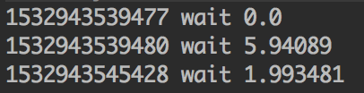
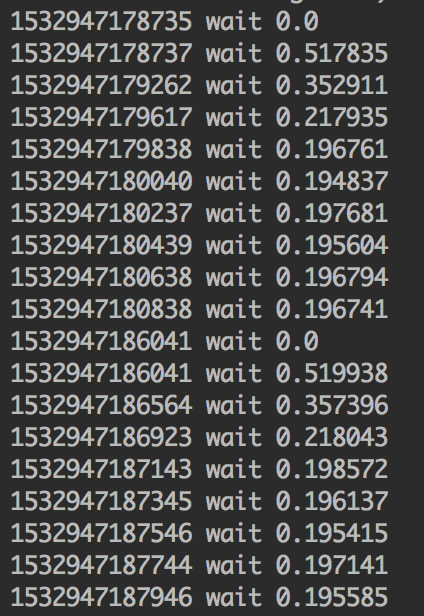

Guava的RateLimiter提供的令牌桶算法可以用于平滑突发限流（`SmoothBursty`）和平滑预热限流（`SmoothWarmingUp`）实现
<!-- more -->
# SmoothBursty

平滑突发限流（`SmoothBursty`）顾名思义，就是允许突发的流量进入，后面再慢慢地平稳限流。

`SmoothBursty`的demo：

```java
RateLimiter rateLimiter = RateLimiter.create(1.0);
Arrays.asList(6, 2, 6).forEach(num -> System.out.println(System.currentTimeMillis() + " wait " + rateLimiter.acquire(num)));
```

运行结果：



可以看出，`SmoothBursty`允许获取的令牌数量可以超过最大令牌数的限制，但是之后获取令牌的请求需要等待一定的时间来补充之前透支的令牌。

SmoothBursty中几个属性的含义:

```java
/** 
 * The currently stored permits.
 * 当前存储的令牌数
 */
double storedPermits;

/** 
 * The maximum number of stored permits.
 * 最大存储令牌数
 */
double maxPermits;

/**
 * The interval between two unit requests, at our stable rate. E.g., a stable rate of 5 permits
 * per second has a stable interval of 200ms.
 * 添加令牌时间间隔
 */
double stableIntervalMicros;

/**
 * The time when the next request (no matter its size) will be granted. After granting a request,
 * this is pushed further in the future. Large requests push this further than small requests.
 * 下一次请求可以获取令牌的起始时间
 * 由于RateLimiter允许预消费，上次请求预消费令牌后下次请求需要等待相应的时间到nextFreeTicketMicros时刻才可以获取令牌
 */
private long nextFreeTicketMicros = 0L; // could be either in the past or future
```

## SmoothBursty的创建过程

因为`SmoothBursty`的可见性是默认的包可见，因此它只能通过`RateLimiter`提供的静态方法来创建。创建方法如下：

```java
public static RateLimiter create(double permitsPerSecond) {
    return create(permitsPerSecond, SleepingStopwatch.createFromSystemTimer());
}

static RateLimiter create(double permitsPerSecond, SleepingStopwatch stopwatch) {
    RateLimiter rateLimiter = new SmoothBursty(stopwatch, 1.0 /* maxBurstSeconds */);
    rateLimiter.setRate(permitsPerSecond);
    return rateLimiter;
}
```

可以看到，`SmoothBursty`创建时传入一个`SleepingStopwatch`(用于计时和睡眠)，和一个`maxBurstSeconds`参数。

`maxBurstSeconds`表示令牌统计的时间范围，默认为1。即一秒钟内发放`permitsPerSecond`个令牌。该参数的作用在于更为灵活地控制流量，比如控制3秒内发放10个令牌。因为`SmoothBursty`无法自由创建，因此这个参数目前无法修改。

接着调用`setRate`方法设置令牌产生的速率：

```java
public final void setRate(double permitsPerSecond) {
    checkArgument(
        permitsPerSecond > 0.0 && !Double.isNaN(permitsPerSecond), "rate must be positive");
    synchronized (mutex()) {
      doSetRate(permitsPerSecond, stopwatch.readMicros());
    }
}

final void doSetRate(double permitsPerSecond, long nowMicros) {
    resync(nowMicros);
    // 通过1秒中内的微秒数除以每秒钟生成的令牌数，计算令牌生成的时间间隔
    double stableIntervalMicros = SECONDS.toMicros(1L) / permitsPerSecond;
    this.stableIntervalMicros = stableIntervalMicros;
    doSetRate(permitsPerSecond, stableIntervalMicros);
}

void doSetRate(double permitsPerSecond, double stableIntervalMicros) {
    double oldMaxPermits = this.maxPermits;
    // 计算存储的令牌数
    maxPermits = maxBurstSeconds * permitsPerSecond;
    if (oldMaxPermits == Double.POSITIVE_INFINITY) {
        // if we don't special-case this, we would get storedPermits == NaN, below
        storedPermits = maxPermits;
    } else {
        storedPermits =
            (oldMaxPermits == 0.0)
                ? 0.0 // initial state
                : storedPermits * maxPermits / oldMaxPermits;
    }
}
```

## acquire方法

`acquire`方法主要用于获取permits个令牌，并计算需要等待多长时间，进而挂起等待，并将该值返回。

```java
public double acquire() {
    return acquire(1);
}

public double acquire(int permits) {
    long microsToWait = reserve(permits);
    stopwatch.sleepMicrosUninterruptibly(microsToWait);
    return 1.0 * microsToWait / SECONDS.toMicros(1L);
}

final long reserve(int permits) {
    checkPermits(permits);
    synchronized (mutex()) {
        return reserveAndGetWaitLength(permits, stopwatch.readMicros());
    }
}

final long reserveAndGetWaitLength(int permits, long nowMicros) {
    long momentAvailable = reserveEarliestAvailable(permits, nowMicros);
    // 计算下一次请求可以获取令牌的起始时间与当前时间的差值，作为需要等待的时间长度
    return max(momentAvailable - nowMicros, 0);
}
```

`acquire`方法调用`reserve`方法获取需要等待的时间长度，然后等待给定的时间，最后返回等待的时间。

`reserve`方法实际调用的是`reserveAndGetWaitLength`方法，`reserveAndGetWaitLength`方法调用`reserveEarliestAvailable`获取`下一次请求可以获取令牌的起始时间`，即必须等待到这个时间才能获取令牌。将该时间与当前时间做差值即是需要等待的时间长度。

### reserveEarliestAvailable方法

`reserveEarliestAvailable`方法用于获取`requiredPermits`个令牌，并返回需要等待到的时间点。

```java
/**
 * 获取requiredPermits个令牌，并返回需要等待到的时间点
 */
final long reserveEarliestAvailable(int requiredPermits, long nowMicros) {
    // 更新当前存储的令牌数以及下一次请求可以获取令牌的起始时间
    resync(nowMicros);
    long returnValue = nextFreeTicketMicros;
    // 将欲获取的令牌数与当前存储的令牌数的较小值作为欲消费的令牌数(storedPermitsToSpend)
    double storedPermitsToSpend = min(requiredPermits, this.storedPermits);
    // freshPermits表示想要获取的令牌数与可消费的令牌数之间的差值，即还需要补充的令牌数
    double freshPermits = requiredPermits - storedPermitsToSpend;
    // waitMicros表示还需要等待的时间
    long waitMicros =
        storedPermitsToWaitTime(this.storedPermits, storedPermitsToSpend)
            + (long) (freshPermits * stableIntervalMicros);

    // 根据还需要等待的时间，更新nextFreeTicketMicros
    this.nextFreeTicketMicros = LongMath.saturatedAdd(nextFreeTicketMicros, waitMicros);
    // 将当前存储令牌数减掉欲消费的令牌数
    this.storedPermits -= storedPermitsToSpend;
    // 返回更新前的nextFreeTicketMicros
    return returnValue;
}

// 当前存储的令牌可以被立即消费
long storedPermitsToWaitTime(double storedPermits, double permitsToTake) {
    return 0L;
}
```

需要注意的是，该函数返回的是更新前的（上次请求计算的）`nextFreeTicketMicros`，而不是本次更新的`nextFreeTicketMicros`。通俗来讲，本次请求需要为上次请求的预消费行为埋单，这也是RateLimiter可以预消费（处理突发）的原理所在。若需要禁止预消费，则修改此处返回更新后的`nextFreeTicketMicros`值。

### resync方法

`resync`方法用于更新当前存储的令牌数(`storedPermits`)以及下一次请求可以获取令牌的起始时间(`nextFreeTicketMicros`)。

```java
void resync(long nowMicros) {
    // 如果当前时间大于下次请求可以获取令牌的起始时间(nextFreeTicketMicros)
    if (nowMicros > nextFreeTicketMicros) {
        // 时间差/生成令牌的间隔时间，生成新的令牌数
        double newPermits = (nowMicros - nextFreeTicketMicros) / coolDownIntervalMicros();
        // 当前存储令牌数+新的令牌数作为当前存储的令牌数，如果超过了最大令牌数(maxPermits)，则以最大令牌数作为当前存储的令牌数
        storedPermits = min(maxPermits, storedPermits + newPermits);
        // 当前时间作为下一次请求可以获取令牌的起始时间
        nextFreeTicketMicros = nowMicros;
    }
}

// 许可冷却时间，即生成新的许可的间隔时间
double coolDownIntervalMicros() {
    return stableIntervalMicros;
}
```

根据令牌桶算法，桶中的令牌持续生成存放的，有请求时需要先从桶中拿到令牌才能开始执行，谁来持续生成令牌存放呢？

一种解法是，开启一个定时任务，由定时任务持续生成令牌。这样的问题在于会极大的消耗系统资源，如某接口需要分别对每个用户做访问频率限制，假设系统中存在6W用户，则至多需要开启6W个定时任务来维持每个桶中的令牌数，这样的开销是巨大的。

另一种解法则是延迟计算，如上`resync`函数。该函数会在每次获取令牌之前调用，其实现思路为，若当前时间晚于`nextFreeTicketMicros`，则计算该段时间内可以生成多少令牌，将生成的令牌桶中并更新数据。这样一来，只需要在获取令牌时计算一次即可。


## tryAcquire方法

`tryAcquire`函数调用`canAcquire`方法尝试在`timeout`时间内获取令牌，如果可以则挂起等待相应的时间，并返回`true`，否则立即返回`false`。

```java
public boolean tryAcquire() {
    return tryAcquire(1, 0, MICROSECONDS);
}

public boolean tryAcquire(int permits) {
    return tryAcquire(permits, 0, MICROSECONDS);
}

public boolean tryAcquire(long timeout, TimeUnit unit) {
    return tryAcquire(1, timeout, unit);
}
  
public boolean tryAcquire(int permits, long timeout, TimeUnit unit) {
    long timeoutMicros = max(unit.toMicros(timeout), 0);
    checkPermits(permits);
    long microsToWait;
    synchronized (mutex()) {
        long nowMicros = stopwatch.readMicros();
        if (!canAcquire(nowMicros, timeoutMicros)) {
            return false;
        } else {
            microsToWait = reserveAndGetWaitLength(permits, nowMicros);
        }
    }
    stopwatch.sleepMicrosUninterruptibly(microsToWait);
    return true;
}
```

## canAcquire方法

`canAcquire`方法用于判断`timeout`时间内是否可以获取令牌。

```java
private boolean canAcquire(long nowMicros, long timeoutMicros) {
    // 如果可以获取令牌的时间小于等于超时时间与当前时间之和，说明在timeout时间内可以获得令牌
    return queryEarliestAvailable(nowMicros) - timeoutMicros <= nowMicros;
}

final long queryEarliestAvailable(long nowMicros) {
    return nextFreeTicketMicros;
}
```

# SmoothWarmingUp

平滑突发限流有可能瞬间带来很大的流量，如果系统扛不住的话，很容易造成系统挂掉。这时候，平滑预热限流便可以解决这个问题。

`SmoothWarmingUp`的demo：

```java
RateLimiter rateLimiter = RateLimiter.create(5, 1, TimeUnit.SECONDS);
IntStream.iterate(1, x -> x + 1)
        .limit(10).
        forEach(x -> System.out.println(System.currentTimeMillis() + " wait " + rateLimiter.acquire()));

Thread.sleep(5000L);

IntStream.iterate(1, x -> x + 1)
        .limit(10).
        forEach(x -> System.out.println(System.currentTimeMillis() + " wait " + rateLimiter.acquire()));
```

运行结果如下：




可以看出平滑预热限流的耗时是慢慢趋近平均值的。

## SmoothWarmingUp的创建过程

`SmoothWarmingUp`只能通过`RateLimiter`提供的静态方法来创建。创建方法如下：

```java
public static RateLimiter create(double permitsPerSecond, long warmupPeriod, TimeUnit unit) {
    checkArgument(warmupPeriod >= 0, "warmupPeriod must not be negative: %s", warmupPeriod);
    return create(permitsPerSecond, warmupPeriod, unit, 3.0, SleepingStopwatch.createFromSystemTimer());
}

static RateLimiter create(
    double permitsPerSecond,
    long warmupPeriod,
    TimeUnit unit,
    double coldFactor,
    SleepingStopwatch stopwatch) {
    RateLimiter rateLimiter = new SmoothWarmingUp(stopwatch, warmupPeriod, unit, coldFactor);
    rateLimiter.setRate(permitsPerSecond);
    return rateLimiter;
}
```

可以看到，相比于`SmoothBursty`的创建过程，创建`SmoothWarmingUp`除了需要`permitsPerSecond`参数外，还需要另外的3个参数：

- warmupPeriod：从冷启动速率过滤到平均速率所需要的时间间隔，即预热时间
- unit：warmupPeriod的时间单位
- coldFactor：冷启动系数

根据下面这张图，我们来解释`SmoothRateLimiter`中各个参数的作用以及它的初始化过程

```
*          ^ throttling
*          |
*    cold  +                  /
* interval |                 /.
*          |                / .
*          |               /  .   ← "warmup period" is the area of the trapezoid between
*          |              /   .     thresholdPermits and maxPermits
*          |             /    .
*          |            /     .
*          |           /      .
*   stable +----------/  WARM .
* interval |          .   UP  .
*          |          . PERIOD.
*          |          .       .
*        0 +----------+-------+--------------→ storedPermits
*          0 thresholdPermits maxPermits
```

简单来说，上图展示了一种机制：当前存储的令牌数(`storedPermits`)越多，生成令牌的间隔时间就越长。当存储的令牌数到达最大值(`maxPermits`)生成令牌的间隔时间也到达最大值(`cold interval`)。`cold interval`同时受`stable interval`和`coldFactor`的影响，是两者的乘积，`coldFactor`默认为3.0，即`cold interval`是`stable interval`的3倍。`thresholdPermits`是一个拐点，当令牌数小于`thresholdPermits`时生成令牌的间隔时间稳定在`stable interval`；当令牌数大于`thresholdPermits`时，生成令牌的间隔时间以一个固定的速率发生变化。`thresholdPermits`等于预热时间内产生令牌数量的一半。

```java
static final class SmoothWarmingUp extends SmoothRateLimiter {
    private final long warmupPeriodMicros;
    private double slope;
    private double thresholdPermits;
    private double coldFactor;
    
    SmoothWarmingUp(SleepingStopwatch stopwatch, long warmupPeriod, TimeUnit timeUnit, double coldFactor) {
        super(stopwatch);
        // 预热时间
        this.warmupPeriodMicros = timeUnit.toMicros(warmupPeriod);
        this.coldFactor = coldFactor;
    }
    
    @Override
    void doSetRate(double permitsPerSecond, double stableIntervalMicros) {
        double oldMaxPermits = maxPermits;
        // 稳定产生令牌的时间间隔乘以冷启动系数，表示冷启动产生令牌的时间隔间。
        // 默认的coldFactor为3.0，即冷启动重试令牌的时间是正常的3倍
        double coldIntervalMicros = stableIntervalMicros * coldFactor;
        // thresholdPermits代表从冷启动到正常的令牌数阈值，即小于这个值代表正常情况，大于这个值表示处于冷启动过程
        // 数值等于预热时间内能产生令牌数量的一半
        thresholdPermits = 0.5 * warmupPeriodMicros / stableIntervalMicros;
        // 计算最大允许的令牌数
        // 预热时间代表的是上面梯形的面积，计算梯形的高加上thresholdPermits，获得最大允许的令牌数
        maxPermits = thresholdPermits + 2.0 * warmupPeriodMicros / (stableIntervalMicros + coldIntervalMicros);
        // slope代表梯形的斜率
        slope = (coldIntervalMicros - stableIntervalMicros) / (maxPermits - thresholdPermits);
        if (oldMaxPermits == Double.POSITIVE_INFINITY) {
            // if we don't special-case this, we would get storedPermits == NaN, below
            storedPermits = 0.0;
        } else {
            storedPermits =
                (oldMaxPermits == 0.0)
                    ? maxPermits // initial state is cold
                    : storedPermits * maxPermits / oldMaxPermits;
        }
    }
    ...
}
```

## storedPermitsToWaitTime方法

与`SmoothBursty`中的`storedPermitsToWaitTime`方法（直接返回`0`）不同，`SmoothWarmingUp`中的`storedPermitsToWaitTime`方法需要根据令牌数与thresholdPermits的关系来计算等待的时间。

```java
long storedPermitsToWaitTime(double storedPermits, double permitsToTake) {
    // availablePermitsAboveThreshold代表超过thresholdPermits数量的当前令牌数
    double availablePermitsAboveThreshold = storedPermits - thresholdPermits;
    long micros = 0;
    if (availablePermitsAboveThreshold > 0.0) {
        // permitsAboveThresholdToTake代表在超过thresholdPermits数量的当前令牌中需要消费的令牌数量
        double permitsAboveThresholdToTake = min(availablePermitsAboveThreshold, permitsToTake);
        // availablePermitsAboveThreshold - permitsAboveThresholdToTake代表令牌消费之后剩余的令牌中超过thresholdPermits的令牌数，不会小于0
        // 调用permitsToTime获取给定令牌数下产生令牌的时间间隔，这里的length代表了两个令牌数下梯形的两个底之和
        double length =
            permitsToTime(availablePermitsAboveThreshold)
                + permitsToTime(availablePermitsAboveThreshold - permitsAboveThresholdToTake);
        /**
         * 计算获取超过thresholdPermits数量的令牌数需要等待的时间长度
         * 这里的等待时间就是
         * permitsAboveThresholdToTake
         * permitsToTime(availablePermitsAboveThreshold)
         * permitsToTime(availablePermitsAboveThreshold - permitsAboveThresholdToTake)
         * 围成的梯形面积
         */
        micros = (long) (permitsAboveThresholdToTake * length / 2.0);
        // 计算thresholdPermits以下的令牌数
        permitsToTake -= permitsAboveThresholdToTake;
    }
    // 加上正常情况下获取令牌需要等待的时间长度
    micros += (long) (stableIntervalMicros * permitsToTake);
    return micros;
}

private double permitsToTime(double permits) {
    // 令牌数乘以斜率，再加上stableIntervalMicros，代表令牌的产生的时间间隔
    return stableIntervalMicros + permits * slope;
}
```

## coolDownIntervalMicros方法

与`SmoothBursty`中的`coolDownIntervalMicros`方法（直接返回`stableIntervalMicros`）不同，与`SmoothWarmingUp`中的`coolDownIntervalMicros`方法如下：

```java
double coolDownIntervalMicros() {
    return warmupPeriodMicros / maxPermits;
}
```


> https://segmentfault.com/a/1190000012875897
> http://www.voidcn.com/article/p-xrbsgqit-ct.html


