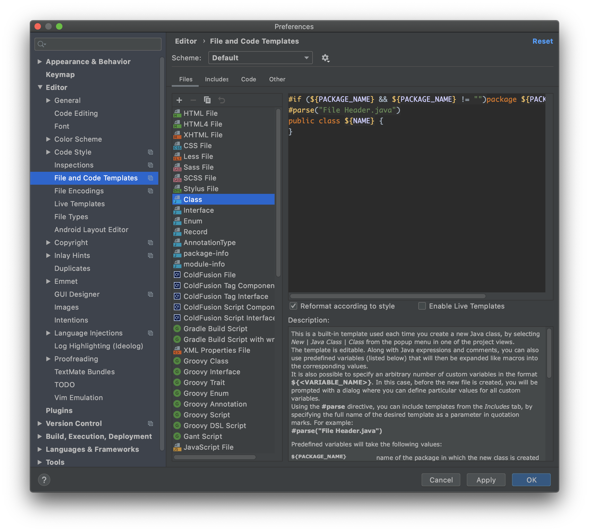
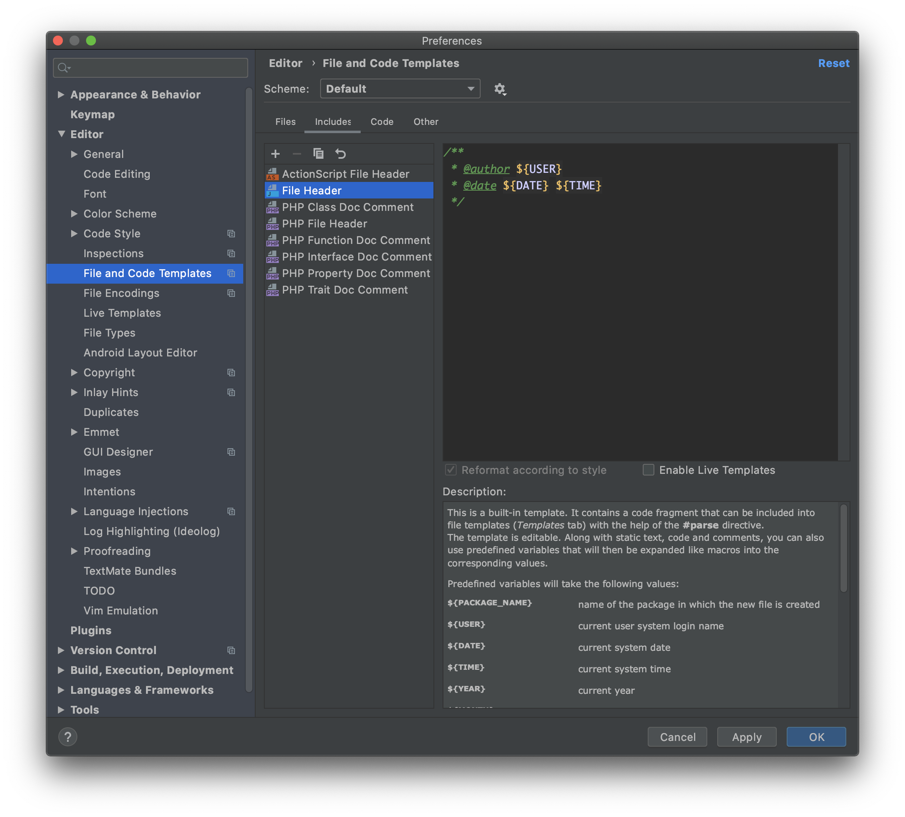
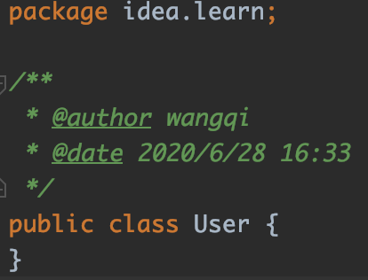
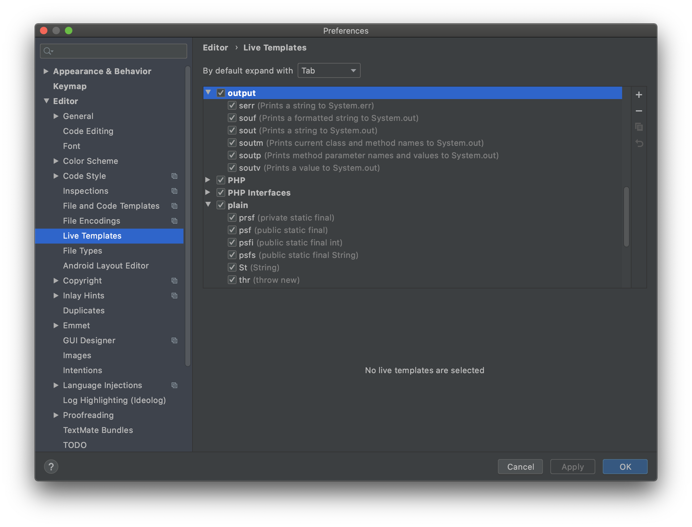
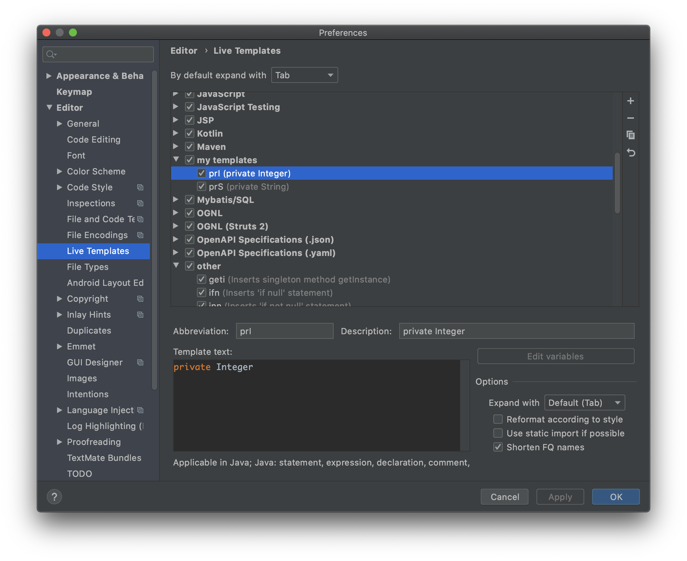
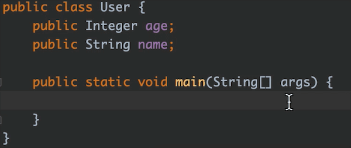
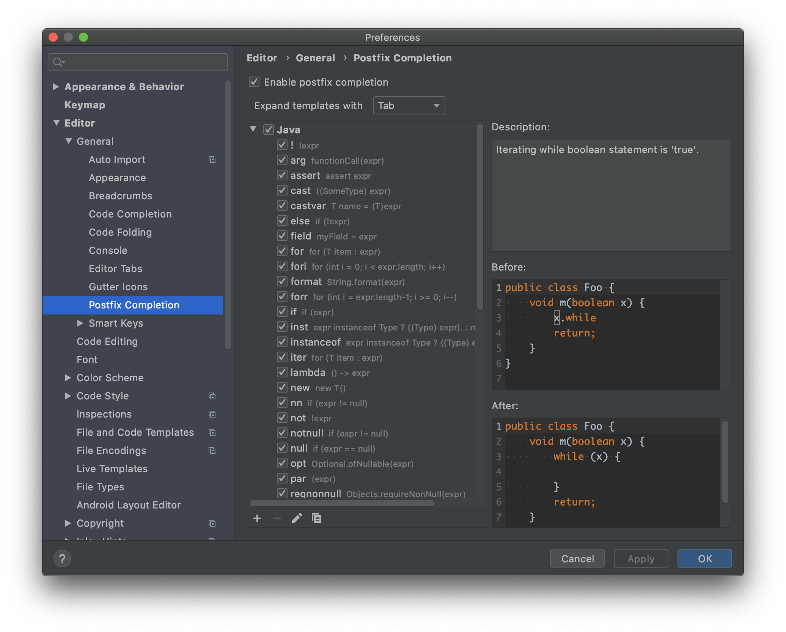
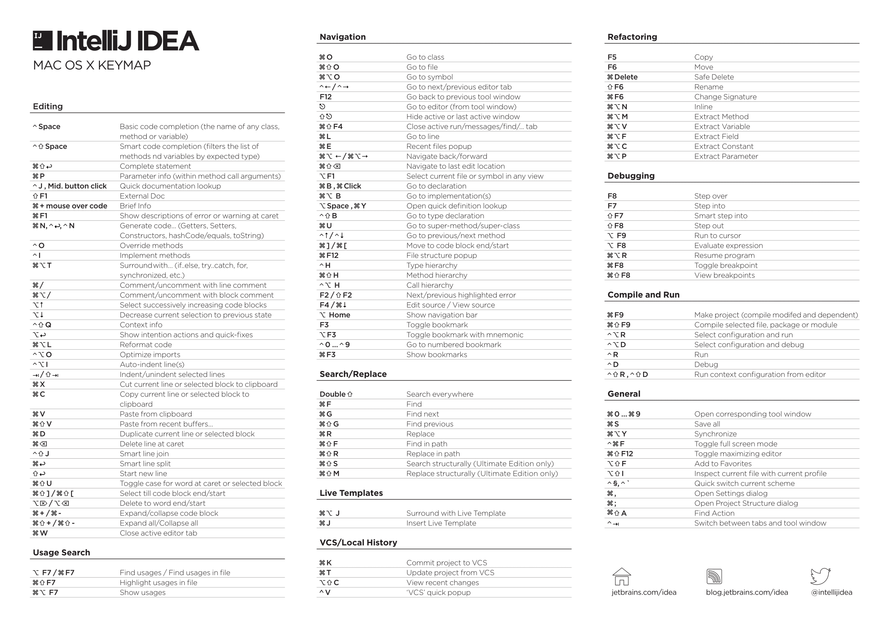

虽然我在日常开发中使用的是IntelliJ IDEA，但是基本上只是使用了一些基本的功能，很多技巧都没有使用。趁着这次给新人分享IDEA的使用，我重新学习整理了IDEA的使用技巧。

<!-- more -->

> IDEA的版本是`IntelliJ IDEA Ultimate 2020.1.1`

# 代码模板

## 文件代码模板

文件代码模板是新建文件时使用的模板，设置路径如下：`Preferences -> Editor -> File and Code Template`，也可以直接使用快捷键`command + ,`来打开`Preferences`。

在这里定义了IDEA内置的文件代码模板，当新建一个文件时（比如Java class），就会按照这里的模板生成指定的代码文件。

另外，我们可以在`Includes`里设置文件头：

设置之后创建Java类时就会在文件头上自动加上作者、新建日期等信息：

## 实时代码模板

IDEA提供了强大的实时代码模板功能，并且内置了很多模板，比如输入`sout`就会快速生成`System.out.println();`

配置路径如下：`Preferences -> Editor -> Live Templates`。

介绍几个常用的代码模板：

- `ifn`：生成参数为null的判断代码
- `inn`：生成参数不为null的判断代码
- `psvm`：生成main函数
- `sout`：生成`System.out.println();`
- `souf`：生成`System.out.printf("");`
- `serr`：生成`System.err.println();`
- `prsf`：生成`private static final `
- `psf`：生成`public static final `
- `psfi`：生成`public static final int `
- `psf`：生成`public static final `
- `St`：生成`String `
- `thr`：生成`throw new `

### 自定义实时算法模板

除了这些内置的代码模板以外，我们还可以自己添加定制的代码模板。

在`Live Templates`页面点击`+`，选择`Template Group`，创建代码模板组。然后点击`+`，选择`Live Template`，创建一个代码模板。

比如，我们可以创建两个代码模板：

- `prI`：生成`private Integer `
- `prS`：生成`private String `

## Postfix Completion

`Postfix Completion`本质上也是一种代码模板，它可以更智能地补全代码。

它具体是做什么的，我们可以通过下面的GIF演示图来说明：

新建对象的实例：

为对象实例赋值：

可以看到`Postfix Completion`和实时代码模板非常像，它在我们代码片段的后面使用，可以减少鼠标的移动，从而加速我们的一些高频操作。

配置路径如下：`Preferences -> Editor -> Postfix Completion`。

IDEA内置了很多`Postfix Completion`，除了上面演示的`new`和`var`，还有下面一些比较常用的模板：

- `for`：为可遍历对象生成`foreach`循环框架
- `fori`：为一个数字生成循环框架
- `nn`和`notnull`：为对象生成不为`null`判断的框架
- `null`：为对象生成为`null`判断的框架
- `return`：在对象前面添加`return`
- `sout`：为对象包裹`System.out.println()`方法
- `try`：为表达式生成`try-catch`框架

# 常用快捷键

## 快捷键图

导出官方快捷键图片：

`shift + command + a`，输入`key reference`

## 代码查看

### 当前文件查找

`command + f`

### 全局查找

`shift + command + f`

### 当前文件替换

`command + r`

### 全局替换

`shift + command + r`

### 查找class

`command + o`

### 查找file

`shift + command + o`

### 查找symbol

`option + command + o`

### 查找action

`shift + command + a`

### 查找class+file+symbol+action

点击两次`shift`

### 跳转到下一个 高亮错误 / 警告位置

`F2`

### 跳转到上一个高亮错误 / 警告位置

`Shift + F2`

### 查看类继承关系图

`option + command + u`

### 展示类中变量和方法

`command + F12`

### 展开折叠代码

`command + +/-`

### 展开折叠所有代码

`shift + command + +/-`

## 代码跳转

### 查看最近文件

`command + e`

### 跳转历史光标所在处

`option + command + 方向键`

### 跳转到指定行

`command + l`

### 跳转到指定文件夹

点击两次`shift`，再输入`/文件夹名`

### 从方法使用处跳转到方法定义

`command + 鼠标左键`

`command + B`

### 从方法使用处跳转到方法的实现

`option + command + 鼠标左键`

`option + command + B`

## 代码编辑

### 变量大小写切换

`shift + command + u`

### 代码格式化

`option + command + l`

### 代码自动收尾

`shift + command + enter`

比如一行代码完成后输入`shift + command + enter`，会在这行代码末尾加上`;`，光标定位到末尾。

代码收尾不仅仅是添加`;`：

这里IDEA会为`if`表达式自动加上大括号。

### 对选中的代码弹出环绕选项

`option + command + t`

### 插入自定义动态代码模板

`command + j`

### 生成代码(构造函数、`Getter/Setter`方法、`equals`方法、`hashCode`方法、`toString`方法)

`command + n`

## 重构

### 重命名变量、文件、文件夹

`shift + F6`

### 快速提取常量

`option + command + c`

### 快速提取参数到方法

`option + command + p`

### 快速提取成员变量

`option + command + f`

### 快速提取变量

`option + command + p`

### 快速提取方法

`option + command + m`

> https://juejin.im/post/5d47f4e851882534d152a206
> https://atips.cn/idea/
> http://blog.didispace.com/intellij-idea-some-features-sam-1/