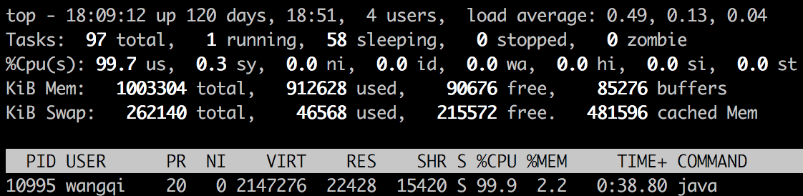

JVM调优是一个非常依赖实践的工作，本文就是在某些场景下对JVM调优方法的整理。

<!-- more -->

# CPU占用高

CPU占用高是我们在线上会遇到的场景。出现这种情况，我们首先需要定位消耗CPU资源的代码。

我们以下面的代码为例，介绍怎么定位问题：

```java
public class InfiniteLoop {
    public static void main(String[] args) {
        Thread thread = new Thread(new Runnable() {
            @Override
            public void run() {
                long i = 0;
                while (true) {
                    i++;
                }
            }
        });
        thread.start();
    }
}
```

这段代码就是一个简单的死循环。

执行程序后，执行`top`命令：



通过`top`命令，我们发现PID为`10995`的Java进程占用CPU高达`99.9%`。

下一步如何定位到具体线程？

执行以下命令显示线程列表：

```
ps -mp pid -o THREAD,tid,time
```


找到了占用CPU最高的线程`11005`，占用CPU时间为`02:23`

然后通过以下命令将找到的线程ID转换为16进制格式：

`printf "%x\n" tid`


最后通过以下命令打印线程的堆栈信息：

`jstack pid | grep tid -A 30`


通过线程堆栈信息，我们可以定位到是`InfiniteLoop`中的`run`方法。

# Full GC频繁

在线上环境，频繁的执行Full GC会导致程序经常发生停顿，从而导致接口的响应时间变长，这时就需要对JVM的状态进行监控，确定Full GC发生的原因。

首先我们在启动程序的时候可以加上GC日志相关的参数，主要有以下几个：

- `-XX:+PrintGC`：输出GC日志
- `-XX:+PrintGCDetails`：输出GC的详细日志
- `-XX:+PrintGCTimeStamps`：输出GC的时间戳（以基准时间的形式）
- `-XX:+PrintGCDateStamps`：输出GC的时间戳（以日期的形式，如`2018-08-29T19:22:48.741-0800`）
- `-XX:+PrintHeapAtGC`：在进行GC的前后打印出堆的信息
- `-Xloggc:gc.log`：日志文件的输出路径

现在通过程序来模拟Full GC频繁发生的情形：

```java
class Object1 {
    int size = (10 * 1024 * 1024) / 4;
    int[] nums = new int[size];
    public Object1() {
        for (int i = 0; i < size; i++) {
            nums[i] = i;
        }
    }

}

class Object2 {
    int size = (1 * 1024 * 1024) / 4;
    int[] nums = new int[size];
    public Object2() {
        for (int i = 0; i < size; i++) {
            nums[i] = i;
        }
    }
}

public class HeapOOM {
    public static void main(String[] args) throws InterruptedException {
        Object1 object1 = new Object1();
        while (true) {
            Object2 object2 = new Object2();
            Thread.sleep(100);
        }
    }
}
```

我们知道Java堆被划分为`新生代`和`老年代`。默认比例为`1:2`（可以通过`-XX:NewRatio`设定）。

新生代又分为`Eden`、`From Survivor`、`To Survivor`。这样划分的目的是为了使`JVM`能够更好地管理堆内存中的对象，包括内存的分派以及回收。默认比例为`Eden:From:To = 8:1:1`（可以通过参数`-XX:SurvivorRatio`来设定，`-XX:SurvivorRatio=8`表示`Eden`与一个`Survivor`空间比例为`8:1`）

一般新建的对象会分配到`Eden`区。这些对象经过第一次`Minor GC`后，如果仍然存活，将会被移到`Survivor`区。在`Survivor`每熬过一轮`Minor GC`年龄就增加1

当年龄达到一定程度是（年龄阈值，默认为`15`，可以通过`-XX:MaxTenuringThreshold`来设置），就会被移动到老年代。

`from`和`to`之间会经常互换角色，`from`变成`to`，`to`变成`from`。每次GC时，把`Eden`存活的对象和`From Survivor`中存活且没超过年龄阈值的对象复制到`To Survivor`中，`From Survivor`清空，变成`To Survivor`。

GC分为两种：

- `Minor GC`是发生在新生代中的垃圾收集动作，所采用的是复制算法，所采用的是复制算法，因为`Minor GC`比较频繁，因此一般回收速度较快。
- `Full GC`是发生在老年代的垃圾收集动作，所采用的是`标记-清除`算法，速度比`Minor GC`慢10倍以上

大对象直接进入老年代。比如很长的字符串以及数组。通过设置`-XX:PretenureSizeThreshold`，令大于这个值的对象直接在老年代分配。这样做是为了避免在`Eden`和两个`Survivor`之间发生大量的内存复制。

什么时候发生`Minor GC`？什么时候发生`Full GC`？

- 当新生代`Eden`区没有足够的空间进行分配时，虚拟机将发起一次`Minor GC`
- 老年代空间不足时发起一次`Full GC`

我们以下面的命令来执行程序：

```
java -Xms30m -Xmx30m -Xmn2m -XX:SurvivorRatio=8 -XX:+PrintGCDetails -XX:+PrintGCTimeStamps -XX:+HeapDumpOnOutOfMemoryError -XX:HeapDumpPath=dump/dump.hprof dump.HeapOOM
```

以下是对上面JVM参数的说明：

- `-Xms`：堆初始大小
- `-Xmx`：堆最大值
- `-Xmn`：新生代大小（老年代大小=堆大小-新生代大小）
- `-XX:+HeapDumpOnOutOfMemoryError`：发生内存溢出时生成heapdump文件
- `-XX:HeapDumpPath`：指定heapdump文件

我们之所以将新生代的大小设为2m，是因为这样新建的`Object2`对象就无法在新生代上分配，从而直接进入老年代，当老年代空间占满后就会触发Full GC。

程序执行之后，我们从`GC`日志中看到频繁发生Full GC，于是我们开始定位Full GC发生的原因。


以下面的两段GC日志，来看一下GC日志的含义：

```
1.840: [GC (Allocation Failure) [PSYoungGen: 573K->432K(1536K)] 28221K->28088K(30208K), 0.0014619 secs] [Times: user=0.00 sys=0.00, real=0.00 secs]
1.842: [GC (Allocation Failure) [PSYoungGen: 432K->400K(1536K)] 28088K->28056K(30208K), 0.0005985 secs] [Times: user=0.00 sys=0.00, real=0.00 secs]
1.843: [Full GC (Allocation Failure) [PSYoungGen: 400K->0K(1536K)] [ParOldGen: 27656K->10558K(28672K)] 28056K->10558K(30208K), [Metaspace: 2657K->2657K(1056768K)], 0.0038527 secs] [Times: user=0.01 sys=0.00, real=0.01 secs]
```

最前面的数字`1.840:`、`1.842:`和`1.843:`代表了GC发生的时间，这个数字的含义是从Java虚拟机启动以来经过的秒数

GC日志开头的`[GC`和`[Full GC`说明了这次垃圾收集的停顿类型，而不是用来区分新生代GC还是老年代GC的。如果有"Full GC"，说明这次GC是发生了`Stop-The-World`的。

接下来的`[PSYoungGen`、`[ParOldGen`、`[Metaspace`表示GC发生的区域。这里显示的区域名称与使用的GC收集器是密切相关的，例如上面的`PSYoungGen`表示采用`Parallel Scavenge`收集器，`ParOldGen`表示采用`Parallel Old`收集器。如果使用`Serial`收集器显示`[DefNew`，如果使用`ParNew`收集器显示`[ParNew`。

后面方括号内部的`400K->0K(1536K)`含义是"GC前该内存区域已经使用容量->GC后该内存区域已使用容量（该内存区域总容量）"。而在方括号之外的`28056K->10558K(30208K)`表示"GC前Java堆已使用容量->GC后Java堆已使用容量（Java堆总容量）"。

再往后的`0.0038527 secs`表示该内存区域GC所占用的时间，单位是秒。有的收集器会给出更具体的时间数据，如`[Times: user=0.01 sys=0.00, real=0.01 secs]`，这里面的`user`、`sys`、`real`与Linux的time命令所输出的时间含义一致，分别代表用户态消耗的CPU时间、内核态消耗的CPU时间和操作从开始到结束所经过的墙钟时间（Wall Clock Time）。CPU时间与墙钟时间的区别是，墙钟时间包括各种非运算的等待耗时，例如等待磁盘IO、等待线程阻塞，而CPU时间不包括这些耗时，但当系统有多CPU或者多核的话，多线程操作会叠加这些CPU时间，所以读者看到user或sys时间超过real时间是完全正常的。

下面开始定位问题。

首先执行`jps`命令定位程序的进程号。

然后执行`jstat`命令监视Java堆的状况.

```
jstat -gc 11172 1000
```

其中`11172`是进程号，`1000`表示每隔`1000`毫秒打印一次日志


- `S0C`和`S1C`（Survivor0、Survivor1）：两个Survivor区的大小
- `S0U`和`S1U`（Survivor0、Survivor1）：两个Survivor区的使用大小
- `EC`（Eden）：Eden区的大小
- `EU`（Eden）：Eden区的使用大小
- `OC`（Old）：老年代大小
- `OU`（Old）：老年代使用大小
- `MC`：元数据区大小
- `MU`：元数据区使用大小
- `CCSC`：压缩类空间大小
- `CCSU`：压缩类空间使用大小
- `YGC`（Young GC）：年轻代垃圾回收次数
- `YGCT`（Young GC Time）：年轻代垃圾回收总耗时（秒）
- `FGC`（Full GC）：老年代垃圾回收次数
- `FGCT`（Full GC Time）：老年代垃圾回收总耗时（秒）
- `GCT`（GC Time）：所有GC总耗时（秒）

可以看到，程序在不断发生Full GC。

执行`jmap`把当前的堆dump下来：

```
jmap -dump:live,format=b,file=dump.hprof 11172
```

其中`11172`是进程ID

然后将`dump.hprof`文件使用VisualVM来打开


我们可以看到，int[]对象占用的空间最大，其中`int[]#1`的GC Root指向了`dump.Object1`对象，无法被回收，这样一个大对象占用了老年代空间，因此导致了频繁发生Full GC。

解决这个问题有两种思路：

- 一般情况下原因都是代码问题，导致某个大对象没有及时释放，在多次GC之后进入老年代空间。我们要做的首先是定位到占用大量空间的对象，优化其中的代码，及时释放大对象，腾空老年代空间
- 增加新生代的大小，让对象都在新生代分配与释放，从而不进入老年代空间。这样就会大大减少Full GC的发生


> https://zhangguodong.me/2017/11/25/%E7%90%86%E8%A7%A3GC%E6%97%A5%E5%BF%97/
> https://segmentfault.com/a/1190000002677695
> https://www.jianshu.com/p/45415ebe0721
> https://blog.csdn.net/u010862794/article/details/78020231
> http://www.blogjava.net/hankchen/archive/2012/05/09/377735.html
> http://swcdxd.iteye.com/blog/1859858
> http://huachao1001.github.io/article.html?C2xJwZZn
> https://www.zybuluo.com/zero1036/note/872396

