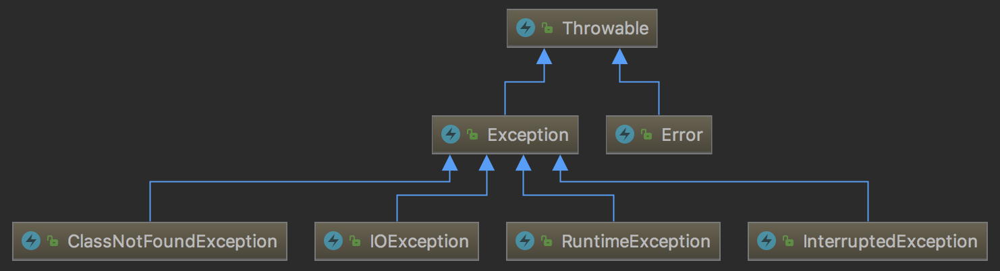
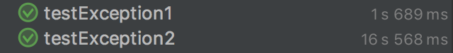

异常是Java中非常常用的功能，它可以简化代码，并且增强代码的安全性。异常处理是指程序不正常时的处理方式。具体来说，异常机制提供了程序退出的安全通道。当出现错误后，程序执行流程发生改变，程序的控制权转移到异常处理器。

<!-- more -->

异常的一般性语法为：

```java
try {
    // 有可能抛出异常的代码
} catch (Exception e) {
    // 异常处理
} finally {
    // 无论是否捕获到异常都会执行的程序
}
```

# 异常体系

Java异常体系的简单结构图：




- `Throwable`类是整个Java异常体系的超类，所有的异常类都派生自这个类。包含`Error`和`Exception`两个直接子类。
- `Error`表示程序在运行期间出现了十分严重，不可恢复的错误，在这种情况下应用程序只能中止运行，例如Java虚拟机出现错误。在程序中不用捕获`Error`类型的异常。一般情况下，在程序中也不应该抛出`Error`类型的异常。
- `Exception`是应用层面上最顶层的异常类，包含`RuntimeException`（运行时异常）和`Checked Exception`（受检异常）。

    - `RuntimeException`是一种`Unchecked Exception`，即表示编译器不会检查程序是否对`RuntimeException`作了处理，在程序中不必捕获`RuntimeException`类型的异常，也不必在方法体声明抛出`RuntimeException`类。一般来说，`RuntimeException`发生的时候，表示程序中出现了编程错误，所以应该找出错误修改程序，而不是去捕获`RuntimeException`。常见的`RuntimeException`有`NullPointException`、`ClassCastException`、`IllegalArgumentException`、`IndexOutOfBoundException`等。
    - `Checked Exception`是相对于`Unchecked Exception`而言的，Java中并没有一个名为`Checked Exception`的类。它是编程中使用最多的`Exception`，所有继承自`Exception`并且不是`RuntimeException`的异常都是`Checked Exception`。Java语言规定必须对`Checked Exception`做处理，编译器会对此做检查，要么在方法体中声明抛出`Checked Exception`，要么使用`catch`语句捕获`Checked Exception`进行处理，不然不能通过编译。常用的`Checked Exception`有`IOException`、`ClassNotFoundException`等。

异常有以下几个特点：

- 无论是受检异常（`Checked Exception`）还是运行时异常（`Runtime Exception`），如果异常没有被应用程序捕获，那么最终这个异常会交由JVM来进行处理。会得到两个结果：异常触发点后面的代码将得不到运行，异常栈信息会通过标准错误流输出。
- 在catch异常时，如果有多个异常，那么是会有顺序要求的。子类型必须要在父类型之前进行catch，catch与分支逻辑是一致，如果父类型先被catch，那么后面catch的分支根本得不到运行机会。
- 如果在finally中返回值，那么在程序中抛出的异常信息将会被吞噬掉。这是一个非常值得注意的问题，因为异常信息是非常重要的，在出现问题时，我们通常凭它来查找问题。如果编码不小心而导致异常被吞噬，排查起来是相当困难的，这将是一个大隐患。
- 必须要对底层抛出来的受检异常进行处理，处理方式有`try...catch...`或者向上抛出(throws)，否则程序无法通过编译。
- 如果我们试图去捕获一个未被抛出的受检异常，程序将无法通过编译（`Exception`除外）
- 运行时异常(`runtime exception`)与受检异常(`checked exception`)的最大区别是不强制对抛出的异常进行处理。所有的运行时异常都继承自`RuntimeException`。如果抛出的是运行时异常，就算不捕获这个异常，程序也可以编译通过。

# 正确使用异常

- 针对不同的异常采取合适的、正确的异常处理方式，不要遇到任何异常都`printTrace()`或者打印一个日志
- catch时指定具体的异常。不要一股脑地catch Exception，具体的异常应该单独catch住，越具体的异常越早catch
- 如果涉及到资源的关闭，应该将关闭资源的代码写在finally代码块内
- try的范围应该尽量小，最好就是try住抛出异常的那个方法即可

# 重写Exception的fillInStackTrace方法

默认情况下，在程序抛出异常时，会调用`fillInStackTrace()`方法填充堆栈信息，代码如下所示：

```java
public synchronized Throwable fillInStackTrace() {
    if (stackTrace != null ||
        backtrace != null /* Out of protocol state */ ) {
        fillInStackTrace(0);
        stackTrace = UNASSIGNED_STACK;
    }
    return this;
}
```

`fillInStackTrace()`方法会通过调用`private native Throwable fillInStackTrace(int dummy)`这个本地方法来获取当前线程的堆栈信息，这是一个非常耗时的操作。如果我们仅仅需要用到异常的传播性质，而不关心异常的堆栈信息，那么完全可以通过重写`fillInStackTrace()`方法。实例如下：

```java
public class MyException extends Exception {
    public MyException(String message) {
        super(message);
    }

    /**
     * 重写fillInStackTrace方法会使得这个自定义的异常不会收集线程的整个异常栈信息，会大大减少异常开销
     * @return
     */
    @Override
    public synchronized Throwable fillInStackTrace() {
        return this;
    }

    public static void main(String[] args) {
        try {
            throw new MyException("由于MyException重写了fillInStackTrace方法，那么它不会收集线程运行栈信息");
        } catch (MyException e) {
            e.printStackTrace();
        }
    }
}
```

为了对`fillInStackTrace`的性能有个了解，我们来对比一下有无`fillInStackTrace`两种情况的耗时。代码如下：

```java
public class FillInStackTraceTest {
    class Exception1 extends Exception {
        public Exception1(String message) {
            super(message);
        }

        @Override
        public synchronized Throwable fillInStackTrace() {
            return this;
        }
    }

    class Exception2 extends Exception {
        public Exception2(String message) {
            super(message);
        }
    }

    @Test
    public void testException1() {
        multiThreadRun(integer -> {
            try {
                throw new Exception1("exception1");
            } catch (Exception1 exception1) {
            }
        });
    }

    @Test
    public void testException2() {
        multiThreadRun(integer -> {
            try {
                throw new Exception2("exception2");
            } catch (Exception2 exception2) {
            }
        });
    }

    int loop = 1000000;
    int threadCount = 100;
    public void multiThreadRun(Consumer<Integer> action) {
        Runnable runnable = () -> {
            for (int i = 0; i < loop; i++) {
                action.accept(i);
            }
        };

        List<Thread> threadList = new ArrayList<>();
        for (int i = 0; i < threadCount; i++) {
            threadList.add(new Thread(runnable));
        }
        threadList.forEach(Thread::start);
        threadList.forEach(thread -> {
            try {
                thread.join();
            } catch (InterruptedException e) {
                e.printStackTrace();
            }
        });
    }
}
```

其中`Exception1`中重写了`fillInStackTrace`函数，`Exception2`是一个普通的异常类。测试的方式就是在100个线程中循环执行，得到执行的时间。如图所示：



可以看到`fillInStackTrace`方法对性能的影响是巨大的。

# 异常处理原理

Java编译后，会在代码后附加异常表的形式来实现Java的异常处理及finally机制。在JDK1.4.2之前，Javac编译器使用jsr和ret指令来实现finally语句，但是1.4.2之后自动在每段可能的分支路径后将finally语句块内容冗余生成一遍来实现。JDK1.7及之后版本，则完全禁止在Class文件中使用jsr和ret指令。

属性表（attribute_info）可以存在于Class文件、字段表、方法表中，用于描述某些场景的专有信息。属性表中有个Code属性，该属性在方法表中使用，Java程序方法体中的代码被编译成的字节码指令存储在Code属性中。而异常表（exception_table）则是存储在Code属性表中的一个结构，这个结构是可选的。

异常表结构如下表所示：

|类型|名称|数量|
|---|----|---|
|u2|start_pc|1|
|u2|end_pc|1|
|u2|handler_pc|1|
|u2|catch_type|1|

异常表包含四个字段，如果当字节码在第`start_pc`行到`end_pc`行之间出现了类型为`catch_type`或者其子类的异常（`catch_type`为指向一个`CONSTANT_Class_info`型常量的索引），则跳转到第`handler_pc`行执行。如果`catch_type`为`0`，表示任意异常情况都需要转到`handler_pc`处进行处理。

## 处理异常机制

如上面所说，每个类编译后，都会跟随一个异常表。如果发生异常，首先在异常表中查找对应的行，如果找到，则跳转到异常处理代码执行，如果没有找到，则返回（执行finally之后），并copy异常的应用给父调用者，接着查询父调用的异常表，以此类推。

### 异常处理实例

对于Java源码：

```java
public class ExceptionClassCode {
    public int demo() {
        int x;
        try {
            x = 1;
            return x;
        } catch (Exception e) {
            x = 2;
            return x;
        } finally {
            x = 3;
        }
    }
}
```

其编译后的字节码为：

```
public int demo();
    descriptor: ()I
    flags: ACC_PUBLIC
    Code:
      stack=1, locals=5, args_size=1
         0: iconst_1            // try中的x = 1
         1: istore_1
         2: iload_1             // 保存x到returnValue中
         3: istore_2
         4: iconst_3            // finally中的x = 3
         5: istore_1
         6: iload_2             // 将returnValue中的值放到栈顶，准备给ireturn返回
         7: ireturn
         8: astore_2            // 给catch中的Exception e赋值，存储在Slot 2中
         9: iconst_2            // catch中的x = 2
        10: istore_1
        11: iload_1             // 保存x到returnValue中，此时x = 2
        12: istore_3
        13: iconst_3            // finally中的x = 3
        14: istore_1
        15: iload_3             // 将returnValue中的值放到栈顶，准备给ireturn返回
        16: ireturn
        17: astore        4     // 如果出现了不属于java.lang.Exception及其子类中的异常则到这里
        19: iconst_3            // finally中的x = 3
        20: istore_1
        21: aload         4     // 将异常放置到栈顶
        23: athrow              // 抛出异常
      Exception table:
         from    to  target type
             0     4     8   Class java/lang/Exception
             0     4    17   any
             8    13    17   any
            17    19    17   any
```

首先可以看到，对于finally，编译器将每个可能出现的分支后都放置了冗余。并且编译器生成了4个异常表记录，从Java代码的语义上讲，执行路径分别为：

1. 如果try语句块中出现了属于Exception及其子类的异常，则跳转到catch处理
2. 如果try语句块中出现了不属于Exception及其子类的异常，则跳转到finally处理
3. 如果catch语句块中出现了任何异常，则跳转到finally处理

由此可以分析此段代码可能的返回结果：

1. 如果没有出现异常，返回1
2. 如果出现了Exception异常，返回2
3. 如果出现了Exceptino以外的异常，非正常退出，没有返回

我们来分析字节码：

- 首先执行`0-4`行。把整数1赋值给x，并且将此时x的值复制一个副本到本地变量表的Slot中（即returnValue）。这个Slot里面的值在`ireturn`指令执行前会被重新读到栈顶，作为返回值。
- 如果没有异常，则执行`5-7`行，把x赋值为3，然后返回returnValue中保存的1，方法结束。
- 如果出现`java.lang.Exception`异常，读取异常表发现应该执行第8行，pc寄存器指针指向第8行。`8-16`行就是把2赋值给x，然后把x赋值给returnValue，再将x赋值为3，然后将returnValue中的2读到操作栈顶返回。
- 如果出现了不属于`java.lang.Exception`及其子类的异常，读取异常表发现应该执行第17行，pc寄存器指针指向第17行。17行开始把x赋值为3并且将栈顶的异常抛出，方法结束。

`athrow`是专门用于抛出异常的指令。这个指令大致的运作过程如下：

首先检查操作栈顶，这时栈顶必须存在一个`reference`类型的值，并且是`java.lang.Throwable`的子类（虚拟机规范中要求如果遇到null则当做NPE异常使用），然后暂时先把这个引用出栈，接着搜索本方法的异常表，找一下本方法中是否有能处理这个异常的handler，如果能找到合适的handler就会重新初始化PC寄存器指针指向此异常handler的第一个指令的偏移地址。接着把当前栈帧的操作栈清空，再把刚刚出栈的引用重新入栈。如果在当前方法中很悲剧的找不到handler，那只好把当前方法的栈帧出栈（这个栈是VM栈，不要和前面的操作栈搞混了，栈帧出栈就意味着当前方法退出），这个方法的调用者的栈帧就自然在这条线程VM栈的栈顶了，然后再对这个新的当前方法再做一次刚才做过的异常handler搜索，如果还是找不到，继续把这个栈帧踢掉，这样一直找，要么找到一个能使用的handler，转到这个handler的第一条指令开始继续执行，要么把VM栈的栈帧抛光了都没有找到期望的handler，这样的话这条线程就只好被迫终止、退出了。


> https://blog.csdn.net/xialei199023/article/details/63251277
> https://blog.liexing.me/2017/09/17/java-exception-table/
> https://www.cnblogs.com/f-ck-need-u/p/8130361.html
> https://my.oschina.net/suemi/blog/852542
> http://www.importnew.com/14688.html

