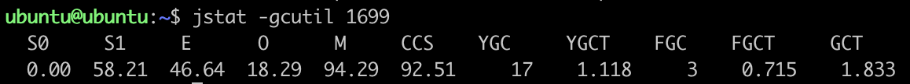

指针压缩在Java虚拟机的一个功能点，平常只知道它的存在，不太关注它。在学习前文[gc相关知识整理][1]时，深入了解了一下指针压缩相关的知识点，本文就是对该知识点的整理。

<!-- more -->

64位程序在当前这个时间(2020年)是司空见惯的东西了，甚至MacOS在2019年Catalina开始就已经不再支持32位程序了。

在32位到64位的转变中，程序最大的获益是内存容量。在一个32位系统中，内存地址的宽度就是32位，这就意味着，程序最大能获取的内存空间是`2^32`（`4G`）字节。这个容量明显不够用了。在一个64位的机器中，理论上程序能获得的内存容量是`2^64`字节，这是一个十分庞大的数字。虽然现实中，因为一系列硬件与软件的因素限制，能获得的内存要少得多，但是和`4G`比起来还是要大得多。

不过，这个转变也是有代价的：

1. 运行在64位中的程序会花费更多的内存。通常64位JVM消耗的内存会比32位的大`1.5`倍，这是因为对象指针在64位架构下，长度会翻倍（更宽的寻址）。对于那些将要从32位平台移植到64位的应用来说，平白无故多了`1/2`的内存占用，这是开发者不愿意看到的。
2. 增加了GC开销。64位对象引用需要占用更多的对空间，留给其他数据的空间将会减少，从而加快了GC的发生。
3. 降低了CPU缓存的命中率。64位对象引用（指针）增加了，CPU能缓存的指针将会减少，从而降低了CPU缓存的效率。

为了解决上述的问题，HotSpot引入了两个压缩优化的技术，`Compressed Ordinary Object Pointers`和`Compressed Class Pointers`。

## Compressed Ordinary Object Pointers

`Ordinary Object Pointers`，`oops`即普通对象指针。启用`CompressOops`后，以下对象的指针会被压缩：

- 每个Class的属性指针（静态成员变量）
- 每个对象的属性指针
- 普通对象数组的每个元素指针

启动压缩后，JVM保存32位的指针，但是在64位机器中，最终还是需要一个64位的地址来访问数据。这里JVM需要做一个对指针数据编码、解码的工作。在机器码中植入压缩与解压指令来实现以下过程：

首先，每个对象的大小一定是8字节的倍数，因为JVM会在对象的末尾加上数据进行对齐填充（Padding）。

假设对象`x`中有3个引用，`a`在地址`0`，`b`在地址`8`，`c`在地址`16`。那么在`x`中记录引用信息的时候，可以不记录`0`, `8`, `16`...这些数值，而是可以使用`0`, `1`, `2`...（即地址右移3位，相当于除8），这一步称为`encode`。在访问`x.c`的时候，拿到的地址信息是`2`，这里做一次`decode`（即地址左移3位，相当于乘8）得到地址`16`，然后就可以访问到`c`了。

这样，虽然我们使用32位来存储指针，但是我们多出了8倍的可寻址空间。所以压缩指针的方式可以访问的内存是`4G * 8 = 32G`。

## Compressed Class Pointers

在HotSpot虚拟机中，对象在内存中存储的布局可以分为3块区域：对象头（Header）、实例数据（Instance Data）和对齐填充（Padding）。

HotSpot虚拟机的对象头包括两部分信息，第一部分用于存储对象自身的运行时数据，如哈希码、GC分代年龄、锁状态标志、线程持有的锁、偏向线程ID、偏向时间戳等，这部分数据的长度在32位和64位的虚拟机中分别为32bit和64bit，官方称它为`Mark Word`。

另外一部分是一个指向`Metaspace`中`Klass`结构（这个结构可以理解为一个Java类在虚拟机内部的表示）的指针，虚拟机通过这个指针来确定这个对象是哪个类的实例：


在64位JVM中，这个指针是64位的。当开启`Compressed Class Pointers`之后，这个指针是32位的，为了找到真正的64位地址，需要加上一个base值：


这项技术对`Klass`的分配带来的问题是：由于32位地址只能访问到`4G`的空间，所以最大只允许`4G`的`Klass`地址。这项限制也意味着，JVM需要向`Metaspace`分配一个连续的地址空间。

当从系统申请内存时，通过调用系统接口`malloc(3)`或`mmap(3)`，操作系统可能返回任意一个地址值，所以在64位系统中，它并不能保证在`4G`的范围内。

所以，我们只能用一个`mmap()`来申请一个区域单独用来存放`Klass`对象。我们需要提前知道这个区域的大小，而且不能超过`4G`。显然，这种方式是不能扩展的，因为这个地址后面的内存可能是被占用的。

只有`Klass`结构有这个限制，对于其他的`class metadata`没有这个必要：因为只有`Klass`实例是通过Java对象header中的压缩指针访问的。其他的`metadata`都是通过64位的地址进行访问的，所以它们可以被放到任意的地址上。

因此`Metaspace`分为两个区域：

- `class part`：存放`Klass`对象，需要一个连续的不超过`4G`的内存。
- `non-class part`：包含其他的所有`metadata`。

`class part`被称为`Compressed Class Space`，其大小默认为`1G`。可以通过`-XX:CompressedClassSpaceSize`指定。

使用`jstat`命令查看内存分布时，其中的`CCS`即表示`Compressed Class Space`：



## 指针压缩参数

指针压缩相关的JVM参数为：

1. -XX:+UseCompressedOops：允许普通对象指针压缩
2. -XX:+UseCompressedClassPointers：允许类指针压缩

当Java堆小于`32G`时，这两个参数默认开启：


参数`-XX:-UseCompressedOops`可以搭配`-XX:-UseCompressedClassPointers`，即可以同时关闭普通对象指针、类指针。

参数`-XX:-UseCompressedOops`不可以搭配`-XX:+UseCompressedClassPointers`，即关闭普通对象指针压缩的情况下，不能开启类指针压缩。

参数`-XX:+UseCompressedOops`可以搭配`-XX:-UseCompressedClassPointers`，即可以压缩普通对象指针，不压缩类指针。

当Java堆大于等于`32G`时，这两个参数都会被关闭：


当`UseCompressedClassPointers`选项被关闭时，那么将没有`Compressed Class Space`这个空间，并且`-XX:CompressedClassSpaceSize`这个参数无效。


## 验证指针压缩

为了验证指针压缩是否对内存的占用有所影响，我们首先需要一种手段来计算Java对象所占内存的大小。

在前文[伪共享学习][2]中，介绍了一种使用`classmexer`来计算Java对象大小的方法。这种方法需要设置`javaagent`参数，略显麻烦。

[如何计算Java对象所占内存的大小](https://www.jianshu.com/p/9d729c9c94c4)一文中介绍了一种更加方便的方法，即使用`lucene`提供的专门用于计算堆内存占用大小的工具类：`RamUsageEstimator`。

首先定义一个空白的类：

```java
public class Node {
}
```

然后使用一下代码来计算`Node`对象的大小：

```java
public static void main(String[] args) throws InterruptedException {
    Node node = new Node();
    long size = RamUsageEstimator.shallowSizeOf(node);
    System.out.println(size);
}
```

分以下三种情况：

- `-XX:+UseCompressedOops -XX:+UseCompressedClassPointers`：占用`16 Byte`。

    `64(Mark Word) + 32(Compressed Class Pointers) = 96 bits = 12 Byte`，再加上`4 Byte`的`Padding`空间，因此占用`16 Byte`。

- `-XX:-UseCompressedOops -XX:-UseCompressedClassPointers`：占用`16 Byte`。

    `64(Mark Word) + 64(Compressed Class Pointers) = 128 bits = 16 Byte`，因此占用`16 Byte`。

- `-XX:+UseCompressedOops -XX:-UseCompressedClassPointers`：占用`16 Byte`。

    `64(Mark Word) + 64(Compressed Class Pointers) = 128 bits = 16 Byte`，因此占用`16 Byte`。

如果将`Node`类做如下修改：

```java
public class Node {
    private Integer a = new Integer(1);
}
```

分以下三种情况：

- `-XX:+UseCompressedOops -XX:+UseCompressedClassPointers`：占用`16 Byte`。

    `64(Mark Word) + 32(Compressed Class Pointers) + 32(a pointer) = 128 bits = 16 Byte`，因此占用`16 Byte`。

- `-XX:-UseCompressedOops -XX:-UseCompressedClassPointers`：占用`24 Byte`。

    `64(Mark Word) + 64(Compressed Class Pointers) + 64(a pointer) = 192 bits = 24 Byte`，因此占用`24 Byte`。

- `-XX:+UseCompressedOops -XX:-UseCompressedClassPointers`：占用`24 Byte`。

    `64(Mark Word) + 64(Compressed Class Pointers) + 32(a pointer) = 160 bits = 20 Byte`，再加上`4 Byte`的`Padding`空间，因此占用`24 Byte`。

如果将`Node`类做如下修改：

```java
public class Node {
    private Integer a = new Integer(1);
    private Integer b = new Integer(1);
}
```

分以下三种情况：

- `-XX:+UseCompressedOops -XX:+UseCompressedClassPointers`：占用`24 Byte`。

    `64(Mark Word) + 32(Compressed Class Pointers) + 32(a pointer) + 32(b pointer) = 160 bits = 20 Byte`，因此占用`24 Byte`。

- `-XX:-UseCompressedOops -XX:-UseCompressedClassPointers`：占用`32 Byte`。

    `64(Mark Word) + 64(Compressed Class Pointers) + 64(a pointer) + 64(a pointer) = 258 bits = 32 Byte`，因此占用`32 Byte`。

- `-XX:+UseCompressedOops -XX:-UseCompressedClassPointers`：占用`24 Byte`。

    `64(Mark Word) + 64(Compressed Class Pointers) + 32(a pointer) + 32(b pointer) = 192 bits = 24 Byte`，因此占用`24 Byte`。

以上的示例充分说明了指针压缩的效果。


[1]: /articles/Java/gc相关知识整理.html
[2]: /articles/Java/伪共享学习.html

> 深入理解Java虚拟机——JVM高级特性与最佳实践
> https://blog.csdn.net/qq_27093465/article/details/106760961
> https://blog.csdn.net/liuxiao723846/article/details/91981757
> https://www.iteye.com/topic/470404
> https://www.jianshu.com/p/9d729c9c94c4
> https://www.javadoop.com/post/metaspace
> https://juejin.cn/post/6844903768077647880
> https://cloud.tencent.com/developer/article/1408827