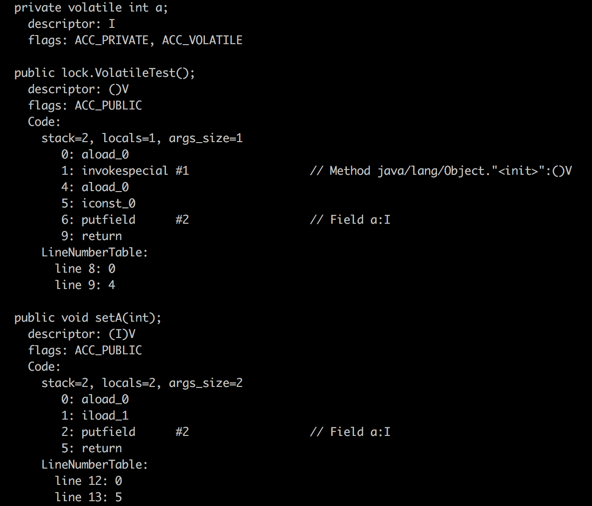
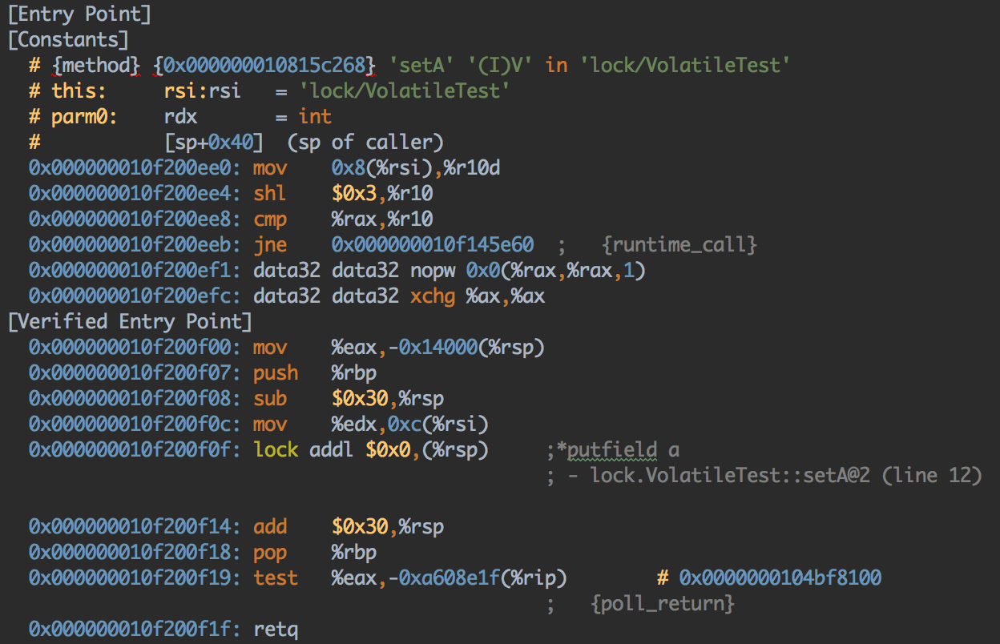
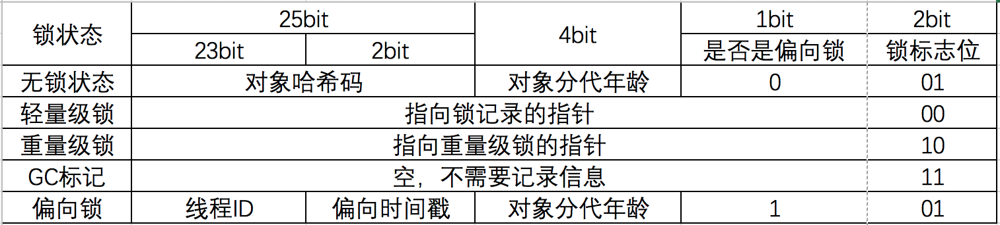
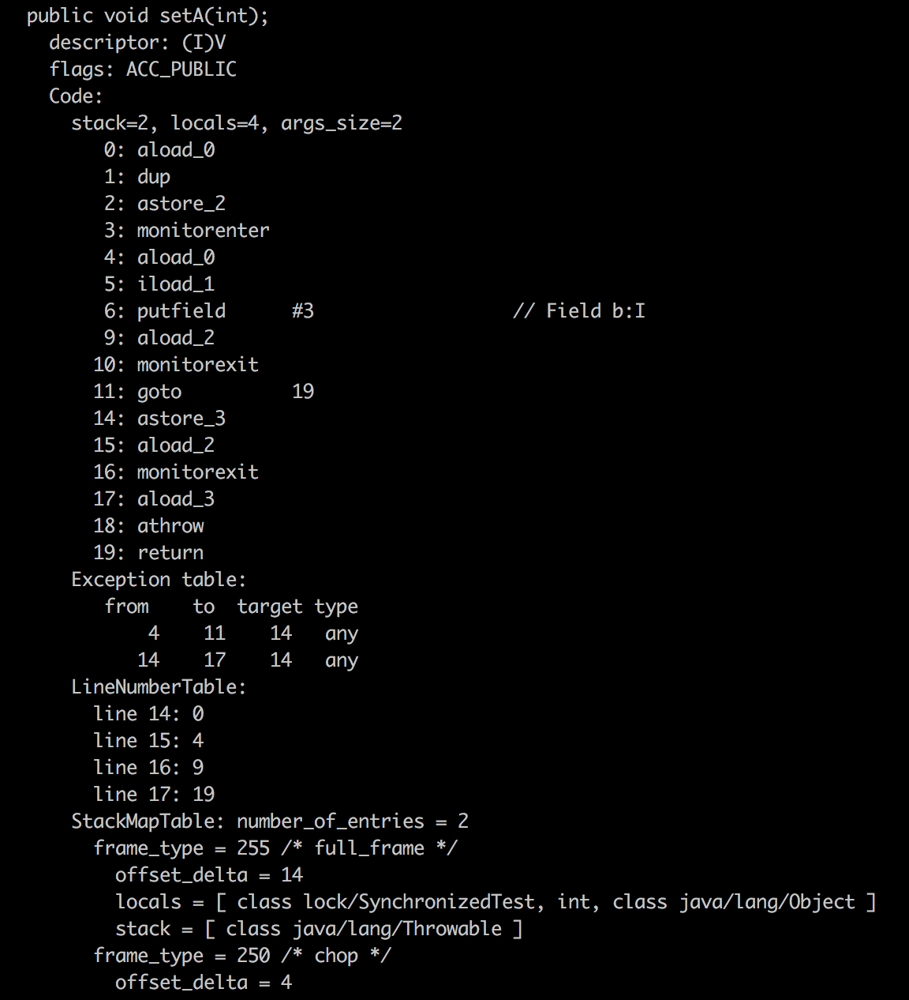
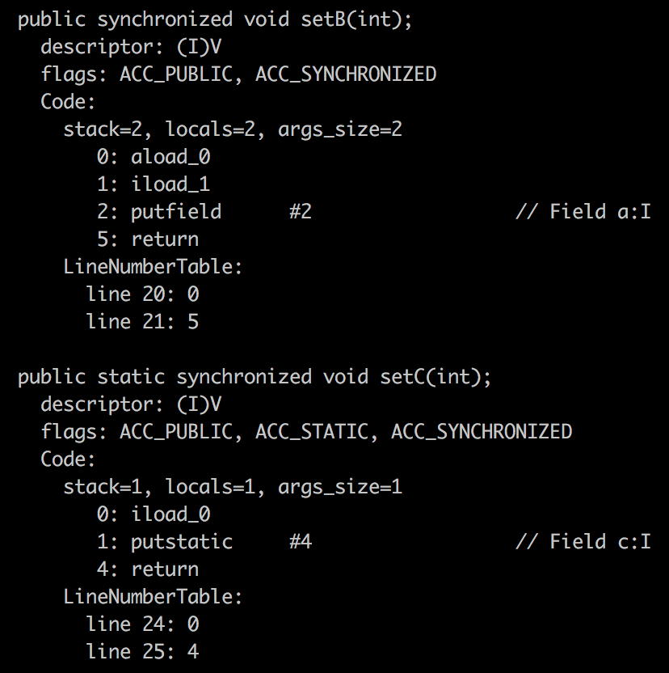
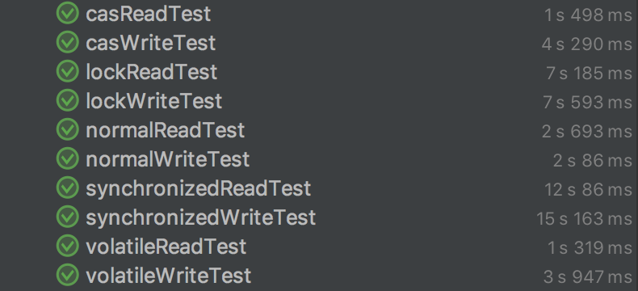
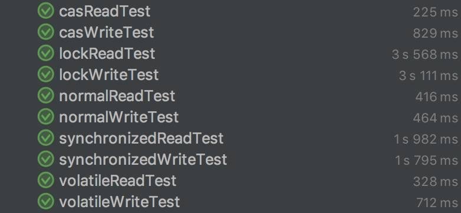

当多个线程同时操作一个可共享的资源变量时，相互之间会产生冲突，导致数据不准确。

因此对共享资源的访问需要采取一些措施，这些措施就被称为线程同步。

<!-- more -->

简单来说，线程同步有以下几种方法：

- volatile关键字
- synchronized关键字
- CAS机制
- Lock

下面我们来详细介绍上面的几种方法。

# volatile关键字

关键字`volatile`可以说是Java虚拟机提供的最轻量的同步机制，但是它并不容易完全被正确、完整地理解。

要理解`volatile`关键字首先要了解Java的内存模型。Java内存模型规定了所有的的变量都存储在主内存中。每个线程还有自己的工作内存，线程的工作内存中保存了被该线程使用到的变量的主内存副本拷贝，线程对变量的所有操作（读取、赋值）都必须在工作内存中进行，而不能直接读写主内存中的变量。不同的线程之间也无法直接访问对方工作内存中的变量，线程间变量值的传递均需要通过主内存来完成。

当一个变量定义为`volatile`之后，它将具备两种特性：

1. 第一是保证此变量对所有线程的可见性。这里的可见性是指当一条线程修改了这个变量的值，新值对于其他线程来说是可以立即得知的。而普通变量不能做到这一点，普通变量的值在线程间传递均需要通过主内存来完成。
2. 第二是禁止指令重排序优化，普通的变量仅仅会保证在该方法的执行过程中所有依赖赋值结果的地方都能获取到正确的结果，而不能保证变量赋值操作的顺序与程序代码中的执行顺序一致。

## volatile关键字的原理

有`volatile`修饰的变量赋值后多执行了一个`lock addl $0x0,(%rsp)`操作，这个操作相当于一个内存屏障（指令重排序时不能把后面的指令重排序到内存屏障之前的位置）

lock前缀的作用是使得本CPU的Cache写入了内存，该写动作也会引起别的CPU或者别的内核无效化其Cache，这种操作相当于对Cache中的变量做了一次Java内存模型中的`store`和`write`操作。所以通过这样一个空操作，可让前面`volatile`变量的修改对其他CPU立即可见。

`lock addl $0x0,(%rsp)`指令把修改同步到内存时，意味着所有之前的操作都已经执行完成，这样便形成了**指令重排序无法越过内存屏障**的效果。

### volatile字节码

为了看看lock指令是否真的存在，我们先来看看class字节码。

首先写一个`volatile`的测试程序：

```java
public class VolatileTest {
    private volatile int a = 0;

    public void setA(int a) {
        this.a = a;
    }

    public static void main(String[] args) {
        new VolatileTest().setA(1);
    }
}
```

执行`javac lock/VolatileTest.java`编译出字节码，然后执行`javap -v -p lock.VolatileTest`查看编译出来的字节码。字节码如下所示：



非常遗憾的是，除了`a`变量定义的时候有一个`ACC_VOLATILE`，`setA`方法的字节码跟有无`volatile`完全一样。在字节码中看不出有内存屏障的存在。于是我们需要看一下汇编代码。

### volatile汇编代码

HSDIS是一个sun官方推荐的HotSpot虚拟机JIT编译代码的反汇编插件。在mac系统下需要安装一个`hsdis-amd64.dylib`的插件。下载地址：[https://github.com/importsource/jvm-tuts/blob/master/hsdis-amd64.dylib](https://github.com/importsource/jvm-tuts/blob/master/hsdis-amd64.dylib)

下载下来后，将其放置到`jre/lib`目录即可：

```
sudo cp hsdis-amd64.dylib /Library/Java/JavaVirtualMachines/jdk1.8.0_162.jdk/Contents/Home/jre/lib
```

然后再运行：

```
java -XX:+UnlockDiagnosticVMOptions -XX:+PrintAssembly -Xcomp -XX:CompileCommand=dontinline,*VolatileTest.setA -XX:CompileCommand=compileonly,*VolatileTest.setA lock.VolatileTest
```

其中`*VolatileTest.setA`表示你运行的`类.函数`，`lock.VolatileTest`表示你的`包名.类名`。注意需要有main函数来运行你所需要执行的函数。

参数`-Xcomp`是让虚拟机以编译模式执行代码，这样代码可以偷懒，不需要执行足够次数来预热就能触发JIT编译。两个`-XX:CompileCommand`意思是让编译器不要内联`setA`并且只编译`setA`，`-XX:+PrintAssembly`就是输出反汇编内容。

得到的汇编代码如下：



我们来分析一下`setA`方法的汇编代码：

- `mov    %eax,-0x14000(%rsp)`：检查栈溢
- `push   %rbp`：保存上一帧基址
- `sub    $0x30,%rsp`：给新帧分配空间
- `mov    %edx,0xc(%rsi)`：对变量`a`进行赋值，这里`0xc(%rsi)`就是`rsi + 0xc`的意思，前面`[Constants]`中提示了`rsi:rsi   = 'lock/VolatileTest'`，即`rsi`寄存器中放的就是this对象的地址，偏移`0xc`就是实例变量`a`的内存地址。
- `lock addl $0x0,(%rsp)`：`lock`指令使得本CPU的Cache写入了内存，该写动作也会引起别的CPU或者别的内核无效化其Cache。所以通过这样一个空操作，可以让前面`volatile`变量的修改对其他CPU立即可见。
- `add    $0x30,%rsp`：撤销栈帧
- `pop    %rbp`：恢复上一帧
- `test   %eax,-0xa608e1f(%rip)`：轮询方法返回处的SafePoint
- `retq`：方法返回

# synchronized关键字

Java中最基本的互斥同步手段就是`synchronized`关键字，保证一个区域的代码同时最多只能有一个线程能执行，这个区域即是所谓的临界区。

`synchronized`关键字经过编译之后，会在同步块的前后分别形成`monitorenter`和`monitorexit`这两个字节码指令，这两个字节码都需要一个reference类型的参数来指明要锁定和解锁的对象。如果Java程序中的`synchronized`明确指定了对象参数，那就是这个对象的reference；如果没有明确指定，那就根据`synchronized`修饰的是实例方法还是类方法，去取对应的对象实例或Class对象来作为锁对象。

`synchronized`关键字主要有三种使用方法：

1. 修饰实例方法。作用于当前实例加锁，进入同步代码前要获得当前实例的锁。

    当一个线程正在访问一个对象的`synchronized`实例方法，那么其他线程不能访问该对象的其他`synchronized`方法，毕竟一个对象只有一把锁，当一个线程获取了该对象的锁之后，其他线程无法获取该对象的锁，所以无法访问该对象的其他`synchronized`实例方法，但是其他线程还是可以访问该实例对象的其他非`synchronized`方法。
    
    当然如果是一个线程A需要访问实例对象`obj1`的`synchronized`方法`f1`（当前对象锁是`obj1`），另一个线程B需要访问实例对象`obj2`的`synchronized`方法`f2`（当前对象锁是`obj2`），这样是允许的，因为两个实例对象锁并不相同。此时如果两个线程操作数据是非共享的，线程安全有保障，如果两个线程操作的是共享数据，那么线程安全就可能无法保证了。

2. 修饰静态方法。作用于当前类对象加锁，进入同步代码前要获得当前实例的锁。

    由于静态成员不专属于任何一个实例对象，是类成员，因此通过class对象锁可以控制静态成员的并发操作。需要注意的是如果一个线程A调用一个实例对象的非`static synchronized`方法，而线程B需要调用这个实例对象所属类的静态`synchronized`方法，是允许的，不会发生互斥现象，因为访问静态`synchronized`方法占用的锁是当前类的class对象，而访问非静态`synchronized`方法占用的锁是当前实例对象锁。

3. 修饰代码块。指定加锁对象，对给定对象加锁，进入同步代码库前要获得给定对象的锁。

    除了使用关键字修饰实例方法和静态方法外，还可以使用同步代码块，在某些情况下，我们编写的方法体可能比较大，同时存在一些比较耗时的操作，而需要同步的代码又只有一小部分，如果直接对整个方法进行同步操作，可能会得不偿失，此时我们可以使用同步代码块的方式对需要同步的代码进行包裹，这样就无需对整个方法进行同步操作了。
    
    `synchronized`作用于一个给定的实例对象`instance`，即`instance`对象就是锁对象，每次当线程进入`synchronized`包裹的代码块时就会要求当前线程持有`instance`实例对象锁。除了指定一个实例对象`instance`作为锁对象外，还可以使用`this`（代表当前实例）或者当前类的class对象作为锁。
    
## Java对象头与Monitor

在HotSpot虚拟机中，对象在内存中存储的布局可以分为3块区域：对象头、实例数据、对齐填充。

先简单介绍一下实例数据、对齐填充两块区域，这两块区域和`synchronized`的实现无关：

- 实例数据部分是对象真正存储的有效信息，也是在程序代码中所定义的各种类型的字段内容。无论是从父类继承下来的，还是在子类中定义的，都需要记录起来。这部分的存储顺序会受到虚拟机分配策略参数（FieldsAllocationStyle）和字段在Java源码中定义顺序的影响。HotSpot虚拟机默认的分配策略为`longs/doubles`、`ints`、`shorts/chars`、`bytes/booleans`、`oops（Ordinary Object Pointers）`，从分配策略中可以看出，相同宽度的字段总是被分配到一起。在满足这个前提条件的情况下，这父类中定义的变量会出现在子类之前。如果`CompactFields`参数值为`true`（默认为`true`），那么子类之中较窄的变量也可能会插入到父类变量的空隙之中。

- 对齐填充并不是必然存在的，也没有特别的含义，它仅仅起着占位符的作用。由于HotSpot VM的自动内存管理系统要求对象起始地址必须是8字节的整数倍，换句话说，就是对象的大小必须是8字节的整数倍。而对象头部分正好是8字节的倍数，因此，当对象实例数据部分没有对齐时，就需要通过对齐填充来补全。

对象头区域是实现`synchronized`的基础。

HotSpot虚拟机的对象头包含两部分信息：

1. 第一部分用于存储对象自身的运行时数据。官方称它为"Mark Word"。
2. 第二部分是类型指针，即对象指向它的类元数据的指针。

    虚拟机通过这个指针来确定来确定这个对象是哪个类的实例。并不是所有的虚拟机实现都必须在对象数据上保留类型指针，换句话说，查找对象的元数据信息并不一定要经过对象本身。另外，如果对象是一个Java数组，那在对象头中还必须有一块用于记录数组长度的数据，因为虚拟机可以通过普通Java对象的元数据信息确定Java对象的大小，但是从数组的元数据中却无法确定数组的大小。
    

对象头的第一部分信息"Mark Word"存储了对象自身的运行时数据。包括哈希码、GC分代年龄、锁状态标志、线程持有的锁、偏向线程ID、偏向时间戳等，这部分数据的长度在32位和64为的虚拟机（未开启压缩指针）中分别为32bit和64bit。因为对象需要存储的运行时数据很多，其实已经超出了32位、64为Bitmap所能记录的限度，但是对象头信息是与对象自身定义的数据结构无关的额外存储成本，考虑到虚拟机的空间效率，Mark Work被设计成一个非固定的数据结构以便在极小的空间内存储尽量多的信息，它会根据对象的状态复用自己的存储空间。存储内容见下表：



其中轻量级锁和偏向锁是Java 6对`synchronized`锁进行优化后新增加的，而重量级锁也就是通常说的`synchronized`对象锁，锁标识位为`10`，其中指针指向的是monitor对象（也称为管程或监视器锁）的起始地址。每个对象都存在一个monitor与之关联，对象与其monitor之间的关系存在多种实现方式，如monitor可以与对象一起创建销毁或当线程试图获取对象锁时自动生成，但当一个monitor被某个线程持有后，它便处于锁定状态。在HotSpot中，monitor是由`ObjectMonitor`实现的，其主要数据结构如下：

```C++
ObjectMonitor() {
    _header       = NULL;
    _count        = 0; //记录个数
    _waiters      = 0,
    _recursions   = 0;
    _object       = NULL;
    _owner        = NULL;
    _WaitSet      = NULL; //处于wait状态的线程，会被加入到_WaitSet
    _WaitSetLock  = 0 ;
    _Responsible  = NULL ;
    _succ         = NULL ;
    _cxq          = NULL ;
    FreeNext      = NULL ;
    _EntryList    = NULL ; //处于等待锁block状态的线程，会被加入到该列表
    _SpinFreq     = 0 ;
    _SpinClock    = 0 ;
    OwnerIsThread = 0 ;
}
```

`ObjectMonitor`中有两个队列，`_WaitSet`和`_EntryList`，用来保存`ObjectMonitor`对象列表（每个等待锁的线程都会被封装成`ObjectWaiter`对象），`_owner`指向`ObjectMonitor`对象的线程，当多个线程同时访问一段同步代码时，首先会进入`_EntryList`集合，当线程获取到对象的monitor后把monitor中的owner变量设置为当前线程，同时monitor中的计数器`_count`加1。若线程调用`wait()`方法，将释放当前持有的monitor，`_owner`变量恢复为null，`_count`自减1，同时该线程进入`_WaitSet`集合中等待被唤醒。若当前线程执行完毕也将释放monitor并复位变量的值，以便其他线程进入获取monitor。

由此看来，monitor对象存在与每个Java对象的对象头（存储指针），synchronized锁便是通过这种方式获取锁的，这也是为什么Java中任意对象可以作为锁的原因，同时也是`notify/notifyAll/wait`等方法存在于顶级对象`Object`中的原因。

## synchronized字节码

因为`synchronized`关键字有三种使用方法，我们来看看这三种情况下有何异同。

```java
public class SynchronizedTest {
    private int a = 0;
    private int b = 0;
    private static int c = 0;

    public void setA(int b) {
        synchronized (this) {
            this.b = b;
        }
    }

    public synchronized void setB(int a) {
        this.a = a;
    }

    public static synchronized void setC(int c) {
        SynchronizedTest.c = c;
    }

    public static void main(String[] args) {
        SynchronizedTest synchronizedTest = new SynchronizedTest();
        synchronizedTest.setA(1);
        synchronizedTest.setB(2);
        SynchronizedTest.setC(3);
    }
}

```

可以看到，`setA`方法中`synchronized`修饰的是代码块，`setB`方法中`synchronized`修饰的是实例方法，，`setC`方法中`synchronized`修饰的是静态方法。

### synchronized代码块字节码

先来看一下`setA`方法反编译后得到的字节码：



从字节码中可知同步语句块的实现使用的是`monitorenter`和`monitorexit`指令，其中`monitorenter`指令指向同步代码块的开始位置，`monitorexit`指令则指明同步代码块的结束位置。当执行`monitorenter`指令时，当前线程将试图获取`objectref`（即对象锁）所对应的`monitor`的持有权。当`objectref`的`monitor`的计数器为0，那线程可以成功取得`monitor`，并将计数器值设置为1，取锁成功。如果当前线程已经拥有`objectref`的`monitor`的持有权，那它可以重入这个`monitor`，重入时计数器的值也会加1。倘若其他线程已经拥有`objectref`的`monitor`的所有权，那当前线程将被阻塞，直到正在执行线程执行完毕，即`monitorexit`指令被执行，执行线程将释放`monitor`并设置计数器值为0，其他线程将有机会持有`monitor`。

值得注意的是编译器将会确保无论方法通过何种方式完成，方法中调用过的每条`monitorenter`指令都有执行其对应`monitorexit`指令，而无论这个方法是正常结束还是异常结束。为了保证在方法异常完成时`monitorenter`和`monitorexit`指令依然可以正确配对执行，编译器会自动产生一个异常处理器，这个异常处理器声明可处理所有的异常，它的目的就是用来执行monitorexit指令。从字节码中也可以看出多了一个`monitorexit`指令，它就是异常结束时被执行的释放`monitor`的指令。

### synchronized方法字节码

再来看一下`setB`和`setC`两个方法的字节码，这两个方法分别是`synchronized`关键字修饰实例方法和静态方法。



从字节码中可以看出，无论`synchronized`修饰的是实例方法还是静态方法，字节码中都没有`monitorenter`和`monitorexit`指令，取而代之的是`ACC_SYNCHRONIZED`标识，该标识指明了该方法是同步方法。JVM可以从方法常量池中的方法表结构中的`ACC_SYNCHRONIZED`访问标志区分一个方法是否是同步方法。当方法调用时，调用指令将会检查方法的`ACC_SYNCHRONIZED`访问标志是否被设置。如果设置了，执行线程将先持有`monitor`，然后再执行方法，最后在方法完成（无论是正常完成还是非正常完成）时释放`monitor`。在方法执行期间，执行线程持有`monitor`，其他任何线程都无法再获得同一个`monitor`。如果一个同步方法执行期间抛出了异常，并且在方法内部无法处理此异常，那这个同步方法所持有的`monitor`将在异常抛到同步方法之外时自动释放。

在Java早期版本中，`synchronized`属于重量级锁，效率低下，因为监视器锁(`monitor`)是依赖于底层的操作系统的`Mutex Lock`来实现的，而操作系统实现线程之间的切换时需要从用户态转换到核心态，这个状态之间的转换需要相对比较长的时间，时间成本相对较高，这也是为什么早期的synchronized效率低的原因。庆幸的是在Java 6之后Java官方从JVM层面对`synchronized`进行了较大优化，所以现在`synchronized`锁效率也优化得很不错了。

锁优化包含以下几种手段：

- 自旋锁与自适应自旋
- 锁消除
- 锁粗化
- 轻量级锁

    在代码进入同步块的时候，如果此同步对象没有被锁定（锁标志位为`01`状态），虚拟机首先将在当前线程的栈帧中建立一个名为锁记录（`Lock Record`）的空间，用于存储锁对象目前的`Mark Word`的拷贝（官方把这份拷贝加了一个`Displaced`前缀，即`Displaced Mark Word`）。
    
    然后，虚拟机将使用CAS操作尝试将对象的`Mark Word`更新为指向`Lock Record`的指针。如果这个更新动作成功了，那么这个线程就拥有了该对象的锁，并且对象`Mark Word`的锁标志位（`Mark Word`的最后2bit）将转变为`00`，即表示对对象处于轻量级锁定状态。
    
    如果这个更新操作失败了，虚拟机首先会检查对象的`Mark Word`是否指向当前线程的栈帧，如果是说明线程已经拥有了这个对象的锁，那就可以直接进入同步块继续执行，否则说明这个锁对象已经被其他线程抢占了。如果有两条以上的线程争用同一个锁，那轻量级锁就不再有效，要膨胀为重量级锁，锁标志的状态值变为`10`，`Mark Word`中存储的就是指向重量级锁的指针，后面等待锁的线程也要进入阻塞状态。
    
    上面描述的是轻量级锁的加锁过程，它的解锁过程也是通过CAS操作来进行的，如果对象的`Mark Word`仍然指向着线程的锁记录，那就用CAS操作把对象当前的`Mark Word`和线程中复制的`Displaced Mark Word`替换回来，如果替换成功，整个同步过程就完成了。如果替换失败，说明有其他线程尝试过获取该锁，那就要在释放锁的同时，唤醒被挂起的线程。
    
    轻量级锁提升程序同步性能的依据是**对于绝大部分的锁，在整个同步周期内都是不存在竞争的**。这是一个经验数据。如果没有竞争，轻量级锁使用CAS操作避免了使用互斥量的开销，但如果存在锁竞争，除了互斥量的开销外，还额外发生了CAS操作，因此在有竞争的情况下，轻量级锁会比传统的重量级锁更慢。

- 偏向锁

    如果说轻量级锁时在无竞争的情况下使用CAS操作去消除同步使用的互斥量，那偏向锁就是在无竞争的情况下把整个同步都消除掉，连CAS操作都不做了。
    
    偏向锁的`偏`，就是偏心的`偏`、偏袒的`偏`，它的意思是这个锁会偏向于第一个获得它的线程，如果在接下来的执行过程中，该锁没有被其他的线程获取，则持有偏向锁的线程将永远不需要再进行同步。
    
    当锁对象第一次被线程获取的时候，虚拟机将会把对象头中的标志位设为`01`，即偏向模式。同时使用CAS操作把获取到这个锁的线程的ID记录在对象的`Mark Word`之中，如果CAS操作成功，持有偏向锁的线程以后每次进入这个锁相关的同步块时，虚拟机都可以不再进行任何同步操作。
    
    当有另外一个线程去尝试获取这个锁时，偏向模式就宣告结束。根据锁对象目前是否处于被锁定的状态，撤销偏向后恢复到未锁定（标志位为`01`）或轻量级锁定（标志位为`00`）的状态，后续的同步操作就如上面介绍的轻量级锁那样执行。
    
    偏向锁可以提高带有同步但无竞争的程序性能。它同样是一个带有效益权衡性质的优化，也就是说，它并不一定总是对程序运行有利，如果程序中大多数的锁总是被多个不同的线程访问，那偏向模式就是多余的。

## 中断与synchronized

线程的中断操作对于正在等待获取锁对象的`synchronized`方法或者代码块并不起作用，也就是对于`synchronized`来说，如果一个线程在等待锁，那么结果只有两种，要么它获得这把锁继续执行，要么它就保存等待，即使调用中断线程的方法，也不会生效。

示例如下：

```java
public class SynchronizedBlocked implements Runnable{

    public synchronized void f() {
        System.out.println("Trying to call f()");
        while (true) {
            Thread.yield();
        }
    }

    public SynchronizedBlocked() {
        new Thread() {
            @Override
            public void run() {
                f();
            }
        }.start();
    }

    @Override
    public void run() {
        while (true) {
            if (Thread.interrupted()) {
                System.out.println("中断线程!!");
                break;
            } else {
                f();
            }
        }
    }

    public static void main(String[] args) throws InterruptedException {
        SynchronizedBlocked sync = new SynchronizedBlocked();
        Thread t = new Thread(sync);
        t.start();
        TimeUnit.SECONDS.sleep(1);
        t.interrupt();
    }
}
```

我们在`SynchronizedBlocked`构造函数中创建一个新线程并启动调用`f()`获取到当前实例锁，由于`SynchronizedBlocked`自身也是线程，启动后在其`run`方法中也调用了`f()`。但由于对象锁被其他线程占用，导致`t`线程只能等待锁，此时我们调用`t.interrupt()`方法并不能中断线程。

## 等待唤醒机制与synchronized

这里的等待唤醒机制主要指的是`notify/notifyAll/wait`方法，在使用这3个方法时，必须处于`synchronized`代码块或者`synchronized`方法中，否则就会抛出`IllegalMonitorStateException`异常，这是因为调用这几个方法前必须拿到当前对象的监视器monitor对象，也就是`notify/notifyAll/wait`方法依赖于monitor对象，在前面的分析中，我们知道monitor存在于对象头的`Mark Word`中（存储monitor引用指针），而`synchronized`关键字可以获取monitor，这也是为什么`notify/notifyAll/wait`方法必须在`synchronized`代码块或者`synchronized`方法调用的原因。

需要特别理解的一点是，与`sleep`方法不同的是`wait`方法调用完成后，线程将被暂停，但wait方法将会释放当前持有的监视器锁(monitor)，直到有线程调用`notify/notifyAll`方法后方能继续执行，而`sleep`方法只让线程休眠并不释放锁。同时`notify/notifyAll`方法调用后，并不会马上释放监视器锁，而是在相应的`synchronized`方法或代码块执行结束后才自动释放锁。

# CAS机制

前面我们说到，`synchronized`关键字属于重量级锁，虽然JVM采取了许多措施来优化`synchronized`锁，但是很多情况下`synchronized`的开销还是相当可观。`volatile`也是不错的选择，但是`volatile`不能保证原子性，只能在某些场合下使用。

从分类上来说，`synchronized`属于悲观锁，它假设冲突一定会发生。如果程序的并发程度并不高，冲突不是经常发生，这种情况下，加锁的开销就比较可观。除了悲观锁，还有一种乐观锁。乐观锁的含义就是假设没有发生冲突，正好可以进行某项操作，如果进行操作的时候发生了冲突，那就重试直到成功。乐观锁最常见的就是`CAS`。

`CAS`是`compare and swap`的缩写，翻译成比较并交换。

`java.util.concurrent`包中绝大多数的源码内部都应用了`CAS`。

我们从`CAS`的应用出发，进一步了解`CAS`的原理。简单起见，这里选取`AtomicInteger`类。

```java
public class AtomicInteger extends Number implements java.io.Serializable {
    private static final long serialVersionUID = 6214790243416807050L;

    // setup to use Unsafe.compareAndSwapInt for updates
    private static final Unsafe unsafe = Unsafe.getUnsafe();
    private static final long valueOffset;

    static {
        try {
            valueOffset = unsafe.objectFieldOffset
                (AtomicInteger.class.getDeclaredField("value"));
        } catch (Exception ex) { throw new Error(ex); }
    }

    private volatile int value;
 
    // ...
 
    public final int getAndIncrement() {
        return unsafe.getAndAddInt(this, valueOffset, 1);
    }

    // ...
}
```

这里省略掉其他方法，重点关注`getAndIncrement()`方法，该方法实现了原子自增的功能。

可以看到，`getAndIncrement()`方法调用了`Unsafe`实例的`getAndAddInt`方法。`Unsafe`类是一个底层类，它提供了很多实现`CAS`功能的本地方法。

`Unsafe`类的`getAndAddInt`方法如下：

```java
public final int getAndAddInt(Object var1, long var2, int var4) {
    int var5;
    do {
        var5 = this.getIntVolatile(var1, var2);
    } while(!this.compareAndSwapInt(var1, var2, var5, var5 + var4));

    return var5;
}
```

来看一下传入的三个参数：

- `Object var1`：该参数传入的是`this`。即`AtomicInteger`当前对象实例本身
- `long var2`：该参数传入的是`valueOffset`。查看`AtomicInteger`的代码，我们可以看到，其值实际上是存储在`value`中的。`valueOffset`的赋值发生在`static`块中，`static`块的加载发生于类加载的时候，是最先初始化的。它保存了调用`unsafe`的`objectFieldOffset`方法从`AtomicInteger`类中获取的`value`偏移量。
- `int var4`：固定为1

再来看看`getAndAddInt`方法中`int var5`获取的是什么。`var5`保存了`this.getIntVolatile`方法的返回值，这是个native方法，其实就是获取`var1`中`var2`偏移量处的值。前面已经知道，`var1`保存的是`AtomicInteger`对象，`var2`保存是`value`的偏移量。所以这里`var5`获取的是`AtomicInteger`对象中`value`的值。

为了便于理解，我们将后面的`compareAndSwapInt(var1, var2, var5, var5 + var4)`方法写成`compareAndSwapInt(obj, offset, expect, update)`。即检查`obj`内`offset`偏移量处的变量值，如果它的值与`expect`相等，证明没有其他线程修改过这个变量，此时可以将它更新为`update`，返回`true`。如果更新没有成功，代表另外的线程已经修改了这个变量，此时重复进行循环，检查并设置新值，直到新值设置成功。

## CAS原理

`Unsafe`中的方法是native的，使用`JNI`调用C代码实现。在`hotspot/src/share/vm/prims/unsafe.cpp`里可以找到它的实现

```C
UNSAFE_ENTRY(jboolean, Unsafe_CompareAndSwapInt(JNIEnv *env, jobject unsafe, jobject obj, jlong offset, jint e, jint x))
  UnsafeWrapper("Unsafe_CompareAndSwapInt");
  oop p = JNIHandles::resolve(obj);
  jint* addr = (jint *) index_oop_from_field_offset_long(p, offset);
  return (jint)(Atomic::cmpxchg(x, addr, e)) == e;
UNSAFE_END
```

`p`是取出的对象，`addr`是`p`中`offset`处的地址，最后调用了`Atomic::cmpxchg(x, addr, e)`，其中参数`x`是即将更新的值，参数`e`是原内存的值。

`Atomic::cmpxchg`有基于各个平台的实现，这里我们选择linux x86平台下的源码，代码在`hotspot/src/os_cpu/linux_x86/vm/atomic_linux_x86.inline.hpp`中。

```asm
inline jint     Atomic::cmpxchg    (jint     exchange_value, volatile jint*     dest, jint     compare_value) {
  int mp = os::is_MP();
  __asm__ volatile (LOCK_IF_MP(%4) "cmpxchgl %1,(%3)"
                    : "=a" (exchange_value)
                    : "r" (exchange_value), "a" (compare_value), "r" (dest), "r" (mp)
                    : "cc", "memory");
  return exchange_value;
}
```

这是一段小汇编，`__asm__`说明是ASM汇编，`volatile`禁止编译器优化。

`os::is_MP()`判断当前系统是否为多核系统。如果当前是多核系统，返回1，否则返回0。

`LOCK_IF_MP(%4)`会根据`mp`的值来决定是否为`cmpxchgl`执行添加lock前缀。如果是多核系统就添加`lock`，这时候会给总线加锁，所以同一芯片上的其他处理器就暂时不能通过总线访问内存，保证了该指令在多处理器环境下的原子性。

在正式解读这段汇编前，我们来了解下嵌入汇编的基本格式：

```
asm ( assembler template
    : output operands               /* optional */
    : input operands                /* optional */
    : list of clobbered registers   /* optional */
    );
```

- `template`就是`cmpxchgl %1,(%3)`，表示汇编模板
- `output operands`表示输出操作数，`=a`对应`eax`寄存器
- `input operands`表示输入参数，`%1`就是`exchange_value`，`%3`是`dest`，`%4`是`mp`，`r`表示任意寄存器，`a`还是`eax`寄存器
- `list of clobbered registers`就是些额外参数，`cc`表示编译器`cmpxchgl`的执行将影响到标志寄存器，`memory`告诉编译器要重新从内存中读取变量的最新值。

那么表达式其实就是`cmpxchgl exchange_value, dest`，我们会发现`%2`也就是`compare_value`没有用上，这里就要分析`cmpxchgl`的语义了。`cmpxchgl`末尾的`l`表示操作数长度为`4`，上面已经知道了。`cmpxchgl`会默认比较`eax`寄存器的值即`compare_value`和`exchange_value`的值，如果相等，就把`dest`的值赋值给`exchange_value`，否则，将`exchange_value`赋值到`eax`。

最终，JDK通过CPU的`cmpxchgl`指令的支持，实现`AtomicInteger`的`CAS`操作的原子性。

## CAS的问题

1. ABA问题

    CAS需要在操作值的时候检查下值有没有发生变化，如果没有发生变化则更新，但是如果一个值原来是A，变成了B，又变成了A，那么使用CAS进行检查时会发现它的值没有发生变化，但是实际上却变化了。这就是CAS的ABA问题。
    
    常见的解决思路是使用版本号。在变量前面追加上版本号，每次变量更新的时候把版本号加1，那么`A-B-A`就会变成`1A-2B-3A`。目前在JDK的atomic包里提供了一个类`AtomicStampedReference`来解决ABA问题。这个类的`compareAndSet`方法作用是首先检查当前引用是否等于预期引用，并且当前标志是否等于预期标志，如果全部相等，则以原子方式将该引用和该标志的值设置为给定的更新值。

2. 循环时间上开销大

    前面我们说到，如果CAS的设置不成功，它会一直自旋，直到设置成功。如果线程争用特别严重，那么会有很多CAS处于自旋的状态，这会给CPU带来非常大的执行开销。

# Lock

`synchronized`是Java关键字，它一把锁，用来保证同一时间只有一个线程能进入临界区执行。

Java中还有一种方式可以对临界区的代码进行加锁，那就是`Lock`。

`Lock`是一个接口，有如下方法：

```java
public interface Lock {
    void lock();
    void lockInterruptibly() throws InterruptedException;
    boolean tryLock();
    boolean tryLock(long time, TimeUnit unit) throws InterruptedException;
    void unlock();
    Condition newCondition();
}
```

- `lock`：用来获取锁，如果锁被其他线程获取，处于等待状态。如果采用`Lock`，必须主动去释放锁，并且在发生异常时，不会自动释放锁。因此一般来说，使用`Lock`必须在`try ... catch ...`块中进行，并且将释放锁的操作放在`finally`块中进行，以保证锁一定会被释放，防止死锁的发生。
- `lockInterruptibly`：通过这个方法获取锁时，如果线程正在等待获取锁，则这个线程能够响应中断，即中断线程的等待状态
- `tryLock`：`tryLock`方法是有返回值的，它表示用来尝试获取锁，如果获取成功，则返回`true`，如果获取失败（即锁已被其他线程获取），则返回`false`，也就是说这个方法无论如何都会立即返回。在拿不到锁时不会一直在那等待。
- `tryLock(long, TimeUnit)`：与`tryLock`类似，只不过是有等待时间，在等待时间内获取到锁返回`true`，超时返回`false`
- `unlock`：释放锁，一定要在`finally`块中释放

`Lock`接口有以下几个常见的实现类：

- `ReentrantLock`
- `ReentrantReadWriteLock`

有关`ReentrantLock`的原理可以查看[ReentrantLock与AbstractQueuedSynchronizer][1]

## synchronized和Lock的区别

- `Lock`是一个接口，而`synchronized`是Java中的关键字，是内置的语言实现
- `synchronized`在发生异常时，会自动释放线程占有的锁，因此不会导致死锁现象的发生；而`Lock`在发生异常时，如果没有主动通过`unlock`去释放锁，则很可能造成死锁的现象，因此使用`Lock`时需要在`finally`块中释放锁。
- 等待可中断。`Lock`可以让等待锁的线程响应中断，而`synchronized`却不行，使用`synchronized`时，等待的线程会一直等待下去，不能够响应中断。
- 公平锁。公平锁是指多线程在等待同一个锁时，必须按照申请锁的时间顺序来依次获取锁，而非公平锁则不保证这一点。在锁被释放时，任何一个等待锁的线程都有机会获得锁。`synchronized`中的锁时非公平的，`ReentrantLock`默认情况下也是非公平的，但可以通过带布尔值的构造函数要求使用公平锁
- `Lock`可以绑定多个条件。绑定多个条件是指一个`ReentrantLock`对象可以同时绑定多个`Condition`对象，而在`synchronized`中，锁对象的`wait()`和`notify()`或`notifyAll()`方法可以实现一个隐含的条件，如果要和多于一个的条件关联的时候，就不得不额外地添加一个锁，而`ReentrantLock`则无须这样做，只需要多次调用`newCondition()`方法即可。
- 通过`Lock`可以知道有没有成功获取锁，而`synchronized`却无法办到
- `Lock`可以提高多个线程进行读操作的效率（通过`ReadWriteLock`实现读写分离）
- 性能上来说，在资源竞争不激烈的情形下，`Lock`性能稍微比`synchronized`差点（编译程序通常会尽可能地进行优化`synchronized`）。但是当同步非常激烈的时候，`synchronized`的性能一下能下降好几十倍。而`ReentrantLock`却还能维持常态。


# 性能对比

前文我们描述了四种同步方式的原理，通过他们的原理我们大概可以判断他们之间性能的差别。现在让我们通过程序来实际测试一下他们的性能。

代码如下。启动10个线程并发执行，每个线程循环多次来读或写变量，得出他们的运行时间来比较各自同步方式的性能。

```java
public class LockMultiThreadTest {
    int normalVar = 0;
    volatile int volatileVar = 0;
    final int loop = 20000000;
    int temp;
    Lock lock = new ReentrantLock();
    AtomicInteger atomicInteger = new AtomicInteger(0);

    private void normalRead() {
        temp = normalVar;
    }

    private void normalWrite(int n) {
        normalVar = n;
    }

    @Test
    public void normalReadTest() {
        multiThreadRun(e -> normalRead());
    }

    @Test
    public void normalWriteTest() {
        multiThreadRun(e -> normalWrite(e));
    }

    private void volatileRead() {
        temp = volatileVar;
    }

    private void volatileWrite(int n) {
        volatileVar = n;
    }

    @Test
    public void volatileReadTest() {
        multiThreadRun(e -> volatileRead());
    }

    @Test
    public void volatileWriteTest() {
        multiThreadRun(e -> volatileWrite(e));
    }

    private synchronized void synchronizedRead() {
        temp = normalVar;
    }

    private synchronized void synchronizedWrite(int n) {
        normalVar = n;
    }

    @Test
    public void synchronizedReadTest() {
        multiThreadRun(e -> synchronizedRead());
    }

    @Test
    public void synchronizedWriteTest() {
        multiThreadRun(e -> synchronizedWrite(e));
    }

    private void casRead() {
        temp = atomicInteger.get();
    }

    private void casWrite(int n) {
        atomicInteger.getAndIncrement();
    }

    @Test
    public void casReadTest() {
        multiThreadRun(e -> casRead());
    }

    @Test
    public void casWriteTest() {
        multiThreadRun(e -> casWrite(e));
    }

    private void lockRead() {
        lock.lock();
        try {
            temp = normalVar;
        } finally {
            lock.unlock();
        }
    }

    private void lockWrite(int n) {
        lock.lock();
        try {
            normalVar = n;
        } finally {
            lock.unlock();
        }
    }

    @Test
    public void lockReadTest() {
        multiThreadRun(e -> lockRead());
    }

    @Test
    public void lockWriteTest() {
        multiThreadRun(e -> lockWrite(e));
    }


    public void multiThreadRun(Consumer<Integer> action) {
        Runnable runnable = new Runnable() {
            @Override
            public void run() {
                for (int i = 0; i < loop; i++) {
                    action.accept(i);
                }
            }
        };

        List<Thread> threadList = new ArrayList<>();
        for (int i = 0; i < 10; i++) {
            threadList.add(new Thread(runnable));
        }
        threadList.forEach(Thread::start);
        threadList.forEach(thread -> {
            try {
                thread.join();
            } catch (InterruptedException e) {
                e.printStackTrace();
            }
        });
    }
}
```

运行结果如下：



通过上面的测试结果我们可以得出如下结论：

- 不做同步措施的情况下，性能是最好的，并且读写的性能基本没有差别
- `CAS`与`volatile`的性能相近，`volatile`的性能稍好。但是他们的读写性能相差很大，相比于读操作，写操作需要耗费好几倍的时间。

    从原理上来说，`CAS`与`volatile`在读取变量的时候指令上不会加上`lock`前缀，但是在写变量的时候会。指令的`lock`前缀是一个开销比较大的操作，它有以下三个影响：
    
    - 它会给内存总线加锁，同一芯片上的其他处理器就暂时不能通过总线访问内存，保证了该指令在多处理器环境下的原子性。
    - 禁止该指令与之前和之后的读和写指令重排序
    - 把写缓冲区中的所有数据刷新到内存中

- `Lock`的性能比`CAS`与`volatile`更差，因为它是代码实现的锁，所需要的指令比起`CAS`与`volatile`来说要多得多。而且它读写的性能没有差别，因为无论是读还是写加锁解锁的步骤是一样的。
- `synchronized`相对来说是性能是最差的，"重量级锁"的名称名不虚传。虽然如此，但是如果是线程竞争不激烈的情况下，`synchronized`的性能并不差，甚至比`Lock`要好，这也说明了JVM对`synchronized`锁优化的效果。我们将线程数减少到两个，执行结果如下：




[1]: /articles/Java/ReentrantLock与AbstractQueuedSynchronizer.html


> https://segmentfault.com/a/1190000014315651
> https://blog.csdn.net/javazejian/article/details/72828483
> https://juejin.im/post/5a73cbbff265da4e807783f5
> https://blog.csdn.net/hsuxu/article/details/9467651
> https://juejin.im/post/5a43ad786fb9a0450909cb5f
> https://blog.csdn.net/fw0124/article/details/6672522

