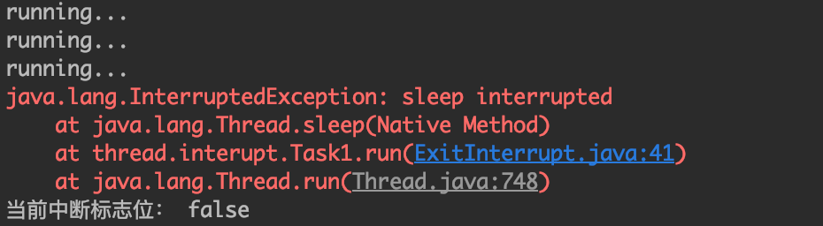
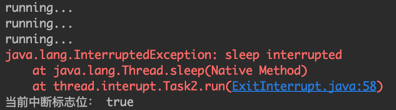

我们经常需要停止一个正在执行的线程，也就是停止线程正在执行的操作。

<!-- more -->

通常来说，停止线程有三种方法：

1. 使用线程的`stop`方法强行终止线程。
2. 设置退出标志，当线程检测到退出标志被设置时，主动结束线程
3. 使用线程的中断方法

## stop方法

`stop`方法可以快速、方便地强制终止一个线程。但是`stop`方法是一个标记为废弃的方法，它不够安全，因为线程的强制终止可能会导致数据的不一致或者资源的不正常释放。因此一般不推荐使用。

## 退出标志

退出标志也很简单，添加一个变量标识线程是否该退出。线程在运行过程中检查这个变量，如果该变量被标记为退出，则线程主动结束运行。

```java
public class ExitTag {
    public static void main(String[] args) throws InterruptedException {
        Task task = new Task();
        new Thread(task).start();
        Thread.sleep(10000);
        task.stop();
    }
}

class Task implements Runnable {

    private volatile boolean running = true;

    public void stop() {
        running = false;
    }

    @Override
    public void run() {
        while (running) {
            System.out.println("running...");
            try {
                Thread.sleep(1000);
            } catch (InterruptedException e) {
                e.printStackTrace();
            }
        }
    }
}
```

如上面的程序所示，当`Task`线程检测到`running`变量变成`false`时主动退出执行。

退出标志最大的问题是当线程阻塞在某些点上的时候（比如获取资源），无法检测到这个退出标志。这个时候线程就没办法退出了。示例如下：

```java
public class ExitTag {
    public static void main(String[] args) throws InterruptedException {
        Task task = new Task();
        new Thread(task).start();
        Thread.sleep(1000);
        task.stop();
    }
}

class Task implements Runnable {

    private volatile boolean running = true;

    private BlockingQueue<Integer> queue = new LinkedBlockingQueue<>();

    public void stop() {
        running = false;
    }

    @Override
    public void run() {
        while (running) {
            System.out.println("running...");
            try {
                Integer number = queue.take();
                System.out.println(number);
            } catch (InterruptedException e) {
                e.printStackTrace();
            }
        }
    }
}
```

当queue中没有添加数据的时候，`Task`线程阻塞在`queue.take()`代码上，这时候因为线程不再执行，因此无法检测到`running`标志，此时`Task`线程也就无法结束。针对这种情况，我们需要使用线程的中断。

## 线程中断

线程中断并不像它的字面意思所表达的那样，调用中断函数之后线程就会终止执行。它与`stop`函数的最大区别是：`stop`是由系统强制终止线程，而线程中断则温柔许多，它仅仅是给目标线程发送一个中断信号，目标线程的中断标志位被置为`true`。

它和前面说的退出标志有点相似，目标线程同样需要主动查询中断标志位，然后自行决定是否停止当前线程的执行。如果目标线程不查询中断标志，或者发现中断标志位为`true`但是并没有主动采取线程停止的操作，则线程也不会停止。

线程中断有3个最重要的方法：`interrupt()`、`isInterrupted()`、`interrupted()`。

其中`interrupt()`方法负责中断目标线程，给目标线程发一个中断信号。

`isInterrupted()`和`interrupted()`方法非常相似，都用于判断目标线程是否被中断。

我们来看他们的代码：

```java
public static boolean interrupted() {
    return currentThread().isInterrupted(true);
}

public boolean isInterrupted() {
    return isInterrupted(false);
}

private native boolean isInterrupted(boolean ClearInterrupted);
```

`interrupted()`方法和`isInterrupted()`方法都调用了同一个native方法：`isInterrupted(boolean ClearInterrupted)`，判断线程是否被中断。其中`interrupted()`是静态方法，而`isInterrupted()`是实例方法，主要的区别在于它们的形参`ClearInterrupted`传的不一样。`interrupted()`在返回中断标志位后会清除标志位，`isInterrupted()`不清除中断标志位。

```java
public class ExitInterrupt {

    public static void main(String[] args) throws InterruptedException {
        Task1 task1 = new Task1();
        Thread thread = new Thread(task1);
        thread.start();
        Thread.sleep(3000);
        thread.interrupt();
    }

}

class Task1 implements Runnable {

    @Override
    public void run() {
        while (!Thread.interrupted()) {
            System.out.println("running...");
            try {
                Thread.sleep(1000);
            } catch (InterruptedException e) {
                e.printStackTrace();
                Thread.currentThread().interrupt();
            }
        }
        System.out.println("当前中断标志位： " + Thread.currentThread().isInterrupted());
    }
}
```

如上面的代码所示，调用`Thread.interrupted()`来判断当前线程的中断标志位，如果收到中断则跳出循环。运行结果如图：



我们发现调用`interrupted()`方法之后，中断标志位变为`false`，说明`interrupted()`方法会清除中断标志位。我们再来看`isInterrupted()`方法：

```java
public class ExitInterrupt {

    public static void main(String[] args) throws InterruptedException {
        Thread task = new Task2();
        task.start();
        Thread.sleep(3000);
        task.interrupt();
    }

}

class Task2 extends Thread {

    @Override
    public void run() {
        while (!isInterrupted()) {
            System.out.println("running...");
            try {
                Thread.sleep(1000);
            } catch (InterruptedException e) {
                e.printStackTrace();
                Thread.currentThread().interrupt();
            }
        }
        System.out.println("当前中断标志位： " + Thread.currentThread().isInterrupted());
    }
}
```

执行结果如下：



我们发现调用`isInterrupted()`方法之后，中断标志位还是为`true`，说明`isInterrupted()`方法不会清除中断标志位。

注意，抛出`InterruptedException`异常也会清除中断标志位，如果想要继续保留中断标志位的状态，可以调用`Thread.currentThread().interrupt()`手动触发中断标志。

注意，下面的线程中断调用是失败的：

```java
public class ExitInterrupt {

    public static void main(String[] args) throws InterruptedException {
        Task1 task1 = new Task1();
        Thread thread = new Thread(task1);
        thread.start();
        Thread.sleep(3000);
        task1.stop();
    }

}


class Task1 implements Runnable {

    public void stop() {
        Thread.currentThread().interrupt();
    }

    @Override
    public void run() {
        while (!Thread.interrupted()) {
            System.out.println("running...");
            try {
                Thread.sleep(1000);
            } catch (InterruptedException e) {
                e.printStackTrace();
                Thread.currentThread().interrupt();
            }
        }
        System.out.println("当前中断标志位： " + Thread.currentThread().isInterrupted());
    }
}
```

我们看到，`main`方法里调用`task.stop()`方法来试图中断线程，而`stop()`方法调用了`Thread.currentThread().interrupt()`。这里的错误就在于，在`main`方法里调用`stop`方法，`stop`方法中的`Thread.currentThread()`返回的是当前线程，即`main`方法所在的线程，相当于向主线程发送了中断请求，而不是中断`Task1`线程，因此`Task1`线程并不会收到中断信号。

中断线程必须要选择正确的目标线程。


> https://mp.weixin.qq.com/s/FPhtbM7Wdyr0iZqbdKecpA
> https://zhuanlan.zhihu.com/p/45667127
> https://www.cnblogs.com/greta/p/5624839.html
> https://www.jianshu.com/p/8000b85c8fc5