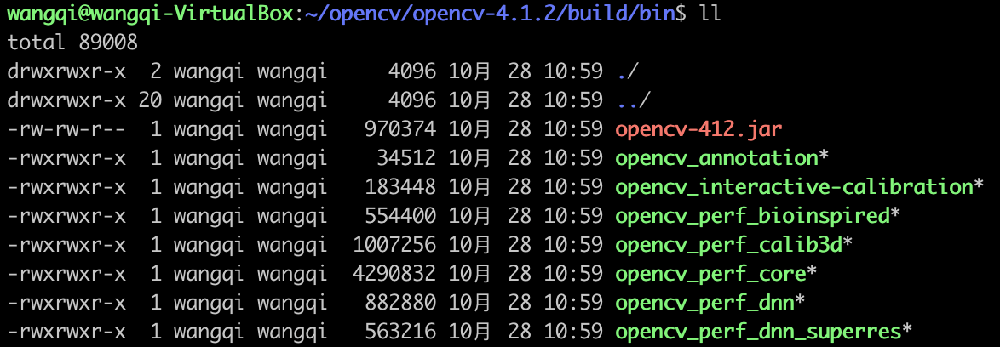

最近有一个大量处理图片的需求，因为整个后台是用Java做的，因此最开始使用JDK自带的方法来处理。问题是这样处理的效率并不高，所以考虑将图片处理的工具替换成opencv。


<!-- more -->


## opencv的编译安装

首先要做的是编译安装opencv：

1. 首先安装jdk
2. 安装必要的工具：

    ```
    sudo apt-get install build-essential cmake unzip pkg-config
    sudo apt-get install libjpeg-dev libpng-dev libtiff-dev
    sudo apt install libjasper1 libjasper-dev
    sudo apt-get install libavcodec-dev libavformat-dev libswscale-dev libv4l-dev
    sudo apt-get install libxvidcore-dev libx264-dev
    sudo apt-get install libgtk-3-dev
    sudo apt-get install libatlas-base-dev gfortran
    sudo apt-get install python3.6-dev
    sudo apt-get install ant
    ```
    
    `ant`必须要安装，否则无法生成给Java使用的库。
    
4. 下载`opencv-4.1.2.zip`，`opencv_contrib-4.1.2.tar.gz`，解压
5. 进入`opencv`目录，创建`build`文件夹
    
    ```
    cd opencv-4.1.2/
    mkdir build
    cd build
    ```

5. 利用cmake生成makefile：

    ```
    cmake -DOPENCV_EXTRA_MODULES_PATH=/home/wangqi/opencv/opencv_contrib-4.1.2/modules \
          -DCMAKE_BUILD_TYPE=RELEASE \
          -DBUILD_opencv_java=ON \
          -DWITH_FFMPEG=ON ..
    ```

5. 执行make命令编译安装opencv

    ```
    make -j
    sudo make install
    ```

## java调用opencv

opencv经过上面的编译安装，在`opencv-4.1.2/build/bin`下可以看到一个`opencv-412.jar`。




这就是刚刚生成的java库，使用这个库我们就可以实现java调用opencv的功能。

下面是一个使用java库的基础示例:

```java
public static void main(String[] args) {
    System.loadLibrary(Core.NATIVE_LIBRARY_NAME);
    String imagePath = "/home/wangqi/1.png";
    Mat mat = Imgcodecs.imread(imagePath);
    Imgcodecs.imwrite("/home/wangqi/2.png", mat);
    mat.release();
}
```

功能很简单。就是读取一张图片然后输出一张新的图片。输入以下命令执行程序：

```
java -Djava.library.path=/usr/local/share/java/opencv4/ -jar opencv-demo-1.0-SNAPSHOT-jar-with-dependencies.jar
```

执行完毕后生成一张`2.png`图片。

## opencv调用的内存泄露问题

在使用的过程中，发现java调用opencv的程序存在很严重的内存泄露问题。这个问题纠缠了我几天的时候，之后发现一篇有点参考价值的文章[https://github.com/sgjava/opencvmem](https://github.com/sgjava/opencvmem)，按照文中提示，发现也之后有所缓解，无法彻底解决。

附内存泄露的程序：

```java
public static void drawImage(Mat mat, String file, int x, int y, int width, int height) {
    Mat src = Imgcodecs.imread(file);
    src.copyTo(mat.colRange(x, x + width).rowRange(y, y + height));
    src.release();
}

public static void test2() {
    String imagePath = "/home/wangqi/cb60c-dphvh.png";
    Mat mat = Imgcodecs.imread(imagePath);
    drawImage(mat, "/home/wangqi/seg_image/98001.jpg", 0, 0, 90, 139);
    mat.release();
}
```

`test2`方法经过1000次的反复调用，在我机器上占用高达2G的内存。

## javacv

由于迟迟解决不了opencv的内存问题，我重新寻找其他方案。

[javacv](https://github.com/bytedeco/javacv)，是一个对opencv调用的第三方封装。它基于javacpp技术而不是一般我们用的jni技术。经过实际测试，不存在内存泄露问题。

但是有一点比较奇怪，经过测试发现，它的性能相对于使用jni的官方库来说比较差。具体原因没来得及深究，猜测和javacpp技术本身有关。

javacv对opencv的封装非常好，不用考虑各种c++库。对性能要求不高的场景下可以使用。

## 总结

经过这几天的测试，对性能有要求的场景下，最好的方案是用c++调用opencv写好图片处理的具体接口，然后再使用jni来使java调用。这样既能保证性能，对内存的使用也更可控。


> https://www.pyimagesearch.com/2018/05/28/ubuntu-18-04-how-to-install-opencv/