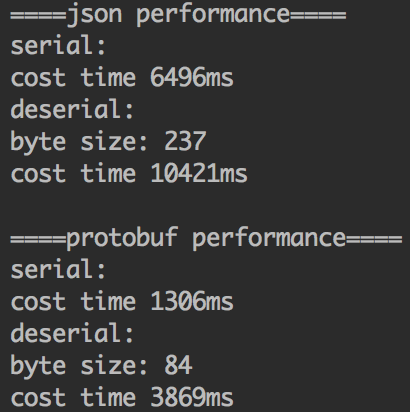

最近在看canal源码的时候发现其中server与client数据通信使用了Protobuf协议，从前听过这个协议但是没用过，趁这个机会学习一下。

<!-- more -->

Protobuf是Google开发的一种数据描述语言，类似于XML能够将结构化数据序列化，可用于数据存储、通信协议等方面。

它不依赖于语言和平台并且可扩展性极强。相比于`json`和`xml`，Protobuf的使用更简单，传输的数据更小，序列化反序列化的性能更高。

本文简单介绍一下Protobuf在java中的使用。

# 安装

首先安装Protobuf。对于Mac OS只需要使用brew命令安装：

```
brew install protobuf
```

# 定义消息格式

和`json`和`xml`等协议不同，Protobuf在使用之前需要先定义一个`.proto`文件作为消息的格式。

`.proto`文件的格式参考：[https://blog.csdn.net/u011518120/article/details/54604615#ScalarValueTypes](https://blog.csdn.net/u011518120/article/details/54604615#ScalarValueTypes)

假设我们要定义一个评论的消息格式：

```proto
syntax = "proto3";

option java_package = "love.wangqi";
option java_outer_classname = "CommentProto";

message comment {
    string id = 1;
    string content = 2;
    string articleTitle = 3;
    string articleId = 4;
    string articleUrl = 5;
    string projectId = 6;
    string categoryId = 7;
    string commentUserId = 8;
    string commentUserName = 9;
    int32 likeCount = 10;
    int64 sortNumber = 11;
}
```

# Java使用

定义完`.proto`消息描述文件之后，执行以下命令生成Java代码：

```
protoc -I=src/main/java/love/wangqi --java_out=src/main/java comment.proto
```

- `-I`：proto文件所在的目录
- `--java_out`：Java文件存放目录
- 最后是proto文件名称

执行完命令之后在`src/main/java`目录下会生成`CommentProto.java`类。

接下来我们就可以是用这个类了。

首先在pom文件中引入protobuf-java依赖：

```
<dependency>
    <groupId>com.google.protobuf</groupId>
    <artifactId>protobuf-java</artifactId>
    <version>3.7.0</version>
</dependency>
```

之后我们就可以使用protobuf：

```java
public static void main(String[] args) throws InvalidProtocolBufferException {
    // 构建Comment
    CommentProto.comment.Builder commentBuilder = CommentProto.comment.newBuilder();
    commentBuilder.setId("1");
    commentBuilder.setContent("评论内容");
    commentBuilder.setArticleTitle("稿件标题");
    commentBuilder.setArticleId("11");
    commentBuilder.setArticleUrl("http://localhost");
    commentBuilder.setProjectId("123");
    commentBuilder.setCategoryId("456");
    commentBuilder.setCommentUserId("789");
    commentBuilder.setCommentUserName("zhangsan");
    commentBuilder.setLikeCount(10);
    commentBuilder.setSortNumber(100000L);

    CommentProto.comment comment = commentBuilder.build();
    System.out.println(comment);

    // 序列化，输出byte数组
    byte[] bytes = comment.toByteArray();
    System.out.println("序列化之后的数据大小：" + bytes.length);

    // 根据byte数组，反序列化
    CommentProto.comment comment1 = CommentProto.comment.parseFrom(bytes);
    System.out.println("反序列化之后的数据：");
    System.out.println(comment1);
}
```

# Protobuf与Json的性能对比

上面我们提高过，Protobuf相比于Json传输的数据更小，性能更高。下面我们来实验一下。

性能测试父类，通过多线程循环执行之后统计执行时间：

```java
public class Performance {
    private int threadCount = 4;
    private int loopCount = 10000000;

    interface Action {
        void run() throws Exception;
    }

    public void test(Action action) {
        List<Thread> threadList = new ArrayList<>();
        for (int i = 0; i < threadCount; i++) {
            threadList.add(new Thread(() -> {
                for (int i1 = 0; i1 < loopCount; i1++) {
                    try {
                        action.run();
                    } catch (Exception e) {
                        e.printStackTrace();
                    }
                }
            }));
        }

        long start = System.currentTimeMillis();
        for (Thread thread : threadList) {
            thread.start();
        }

        for (Thread thread : threadList) {
            try {
                thread.join();
            } catch (InterruptedException e) {
                e.printStackTrace();
            }
        }
        long end = System.currentTimeMillis();
        System.out.println("cost time " + (end - start) + "ms");
    }
}
```

ProtoBuf的性能测试代码：

```java
public class ProtoPerformance extends Performance {
    CommentProto.comment.Builder commentBuilder;
    CommentProto.comment comment;

    public ProtoPerformance() {
        commentBuilder = CommentProto.comment.newBuilder();
        commentBuilder.setId("1");
        commentBuilder.setContent("评论内容");
        commentBuilder.setArticleTitle("稿件标题");
        commentBuilder.setArticleId("11");
        commentBuilder.setArticleUrl("http://localhost");
        commentBuilder.setProjectId("123");
        commentBuilder.setCategoryId("456");
        commentBuilder.setCommentUserId("789");
        commentBuilder.setCommentUserName("zhangsan");
        commentBuilder.setLikeCount(10);
        commentBuilder.setSortNumber(100000L);

        comment = commentBuilder.build();
    }

    public void serialTest() {
        System.out.println("serial:");
        test(() -> comment.toByteArray());
    }

    public void deserialTest() {
        System.out.println("deserial:");
        byte[] commentBytes = comment.toByteArray();
        System.out.println("byte size: " + commentBytes.length);
        test(() -> {
            try {
                CommentProto.comment.parseFrom(commentBytes);
            } catch (InvalidProtocolBufferException e) {
                e.printStackTrace();
            }
        });
    }
}
```

Json的性能测试代码：

```java
public class JsonPerformance extends Performance {
    ObjectMapper mapper = new ObjectMapper();
    Comment comment;

    public JsonPerformance() {
        comment = new Comment();
        comment.setId("1");
        comment.setContent("评论内容");
        comment.setArticleTitle("稿件标题");
        comment.setArticleId("11");
        comment.setArticleUrl("http://localhost");
        comment.setProjectId("123");
        comment.setCategoryId("456");
        comment.setCommentUserId("789");
        comment.setCommentUserName("zhangsan");
        comment.setLikeCount(10);
        comment.setSortNumber(100000L);
    }

    public void serialTest() {
        System.out.println("serial:");
        test(() -> mapper.writeValueAsString(comment));
    }

    public void deserialTest() throws JsonProcessingException {
        System.out.println("deserial:");
        String json = mapper.writeValueAsString(comment);
        byte[] bytes = json.getBytes();
        System.out.println("byte size: " + bytes.length);
        test(() -> mapper.readValue(json, Comment.class));
    }
}
```

接下来执行Json与Protobuf的性能对比：

```java
public class Main {
    public static void main(String[] args) throws JsonProcessingException {
        System.out.println("====json performance====");
        JsonPerformance jsonPerformance = new JsonPerformance();
        jsonPerformance.serialTest();
        jsonPerformance.deserialTest();

        System.out.println();

        System.out.println("====protobuf performance====");
        ProtoPerformance protoPerformance = new ProtoPerformance();
        protoPerformance.serialTest();
        protoPerformance.deserialTest();
    }
}
```

执行结果如下：



从结果中我们可以看到protobuf序列化之后生成的数据要大大小于Json生成的数据，而且无论是序列化还是反序列化的性能都优于Json。


> https://www.jianshu.com/p/bb3ac7e5834e
> https://juejin.im/post/5b2a2880f265da598451eff3

