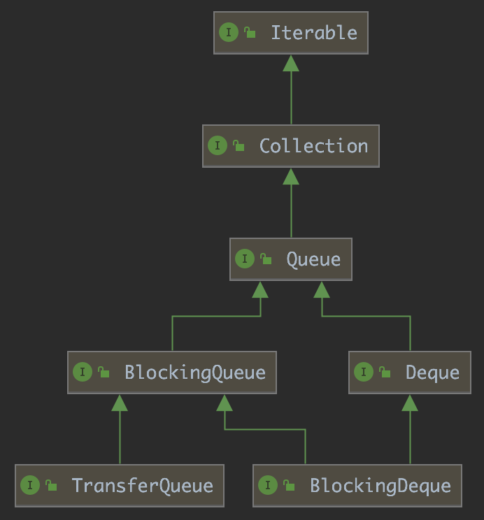
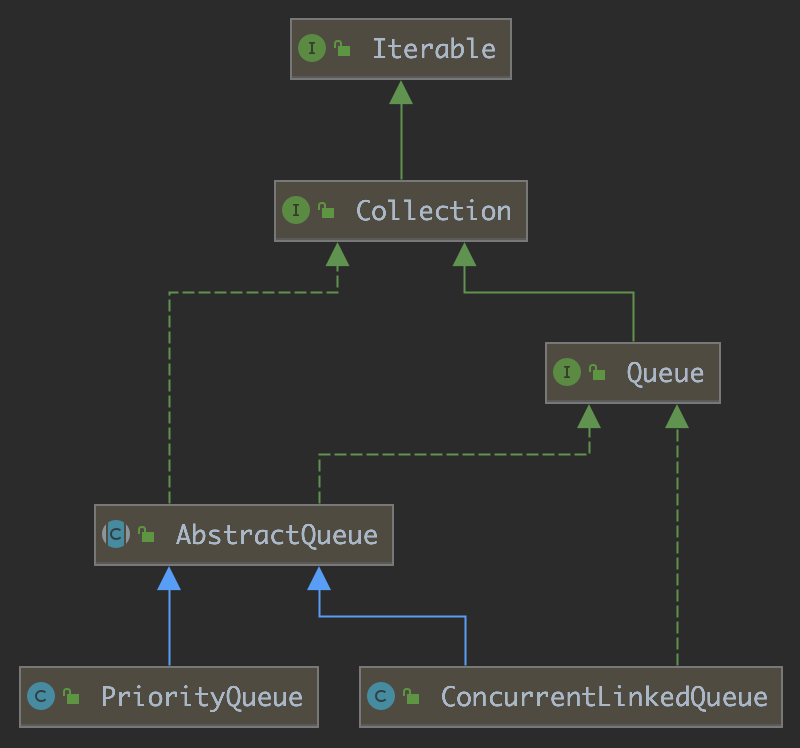
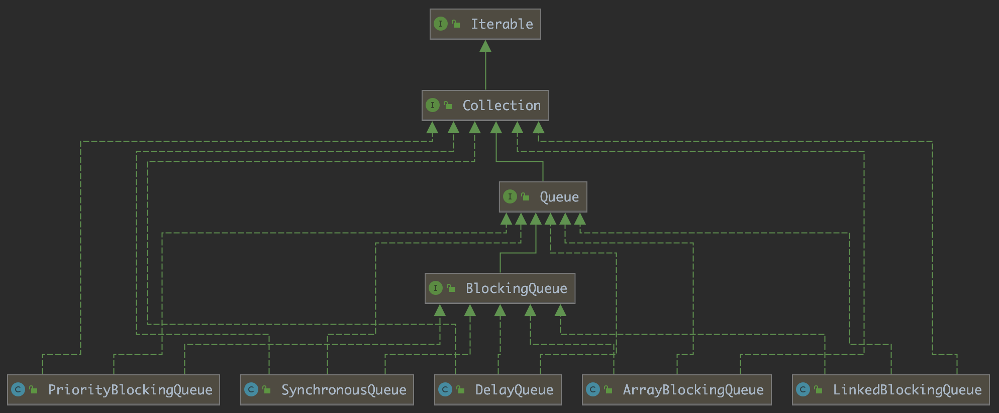
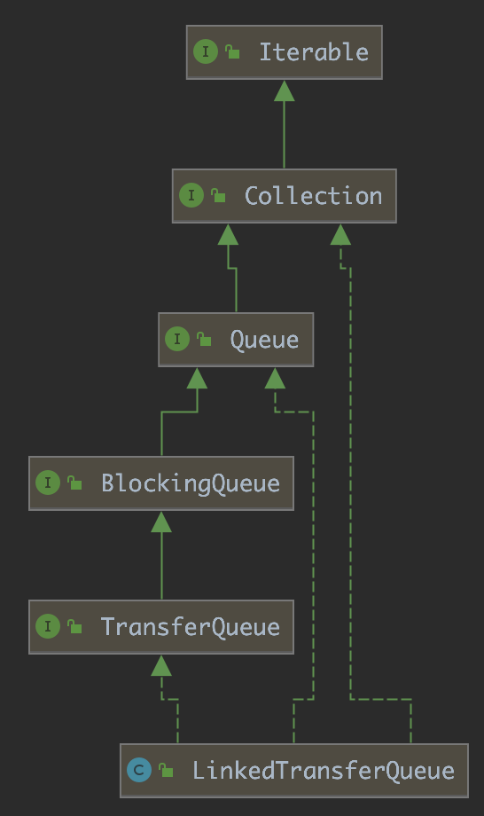
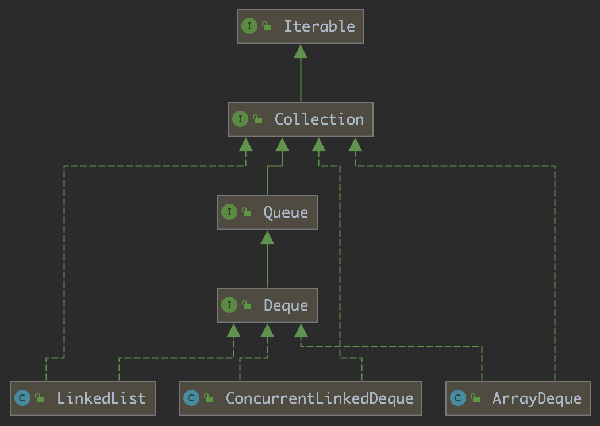
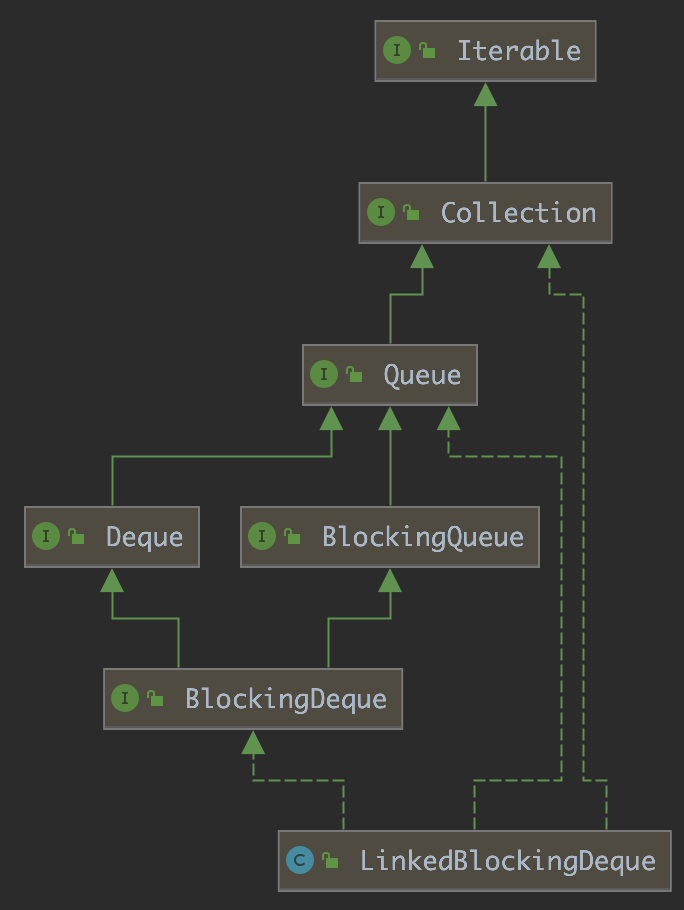

队列就是一种特殊的线性表，它只允许在表的头部进行删除操作，在表的尾部进行插入操作。

队列是Java开发中常用的工具，JDK中提供了多种类供我们使用，本文是对这些类的整理。

<!-- more -->

`Queue`是JDK中所有队列类的公共接口，它拥有6对方法，分别对应在尾部插入元素、删除头部元素、获取头部元素，但是对于操作失败的处理有所不同：

一类是抛出异常：

- `add(e)`：插入元素。如果插入成功，返回`true`，否则抛出`IllegalStateException`异常。
- `remove()`：删除元素。如果删除成功，返回头部被删除的元素，否则抛出`NoSuchElementException`异常。
- `element()`：获取元素。如果队列不为空，返回头部元素，否则抛出`NoSuchElementException`异常。

一类是返回特殊的值：

- `offer(e)`：插入元素。如果插入成功，返回`true`，否则返回`false`。
- `poll()`：删除元素。如果删除成功，返回头部被删除的元素，否则返回`null`。
- `peek()`：获取元素。如果队列不为空，返回头部元素，否则返回`null`。

有多个继承自`Queue`的接口，分别为`BlockingQueue`、`TransferQueue`、`Deque`、`BlockingDeque`。

下面分不同接口的实现类来分别进行总结。

# Queue

直接实现`Queue`接口的类不多，如下图所示，只有`PriorityQueue`和`ConcurrentLinkedQueue`。

## PriorityQueue

`PriorityQueue`是一个基于堆的有序无界队列，插入到其中的元素经过堆排序形成一个有序的结构，每次删除元素都从堆的顶部删除。

## ConcurrentLinkedQueue

`ConcurrentLinkedQueue`是一个基于链表的无界队列，插入元素时添加到链表的尾部，删除元素时摘除链表的头结点并返回，元素的顺序遵循先进先出原则。`ConcurrentLinkedQueue`是一个线程安全的类。

# BlockingQueue

`BlockingQueue`又名阻塞队列，它在`Queue`接口的基础上添加了阻塞操作的方法。即：

- 当队列满时，队列会阻塞插入元素的线程，直到队列不满
- 当队列空时，队列会阻塞删除元素的线程，直到队列不空

它添加的方法分为两类：

一类是一直阻塞的方法：

- `put(e)`：插入元素。如果队列满了，等待队列空出位置。等待过程中如果中断线程，抛出`InterruptedException`异常。
- `take()`：删除元素。如果队列为空，等待队列有元素进入。等待过程中如果中断线程，抛出`InterruptedException`异常。

一类是带有超时的阻塞方法：

- `offer(e, time, unit)`：插入元素。如果队列满了，等待队列空出位置，或者等待时间超时。如果成功插入元素则返回`true`，如果等待时间超时则返回`false`。等待过程中如果中断线程，抛出`InterruptedException`异常。
- `poll(time, unit)`：删除元素。如果队列为空，等待队列有元素进入，或者等待时间超时。如果元素删除成功则返回被删除的元素，如果等待时间超时则返回`null`。等待过程中如果中断线程，抛出`InterruptedException`异常。

`BlockingQueue`的实现类如下图所示：

## ArrayBlockingQueue

`ArrayBlockingQueue`是一个基于数组的有界阻塞队列，它在新建时需要指定队列的容量。

`ArrayBlockingQueue`使用`Condition`信号量来达到阻塞的目的。默认对锁的抢占是非公平的，可以在新建时指定公平锁。

## LinkedBlockingQueue

`LinkedBlockingQueue`是一个基于链表的有界阻塞队列，它的默认容量为`Integer.MAX_VALUE`，在新建时可以指定容量。

`LinkedBlockingQueue`对插入和删除两个操作分配了两个锁，降低了这两个操作竞争锁而阻塞线程的概率，提高了执行效率。

## DelayQueue

`DelayQueue`是一个支持延时获取元素的无界阻塞队列。队列中的元素必须实现`Delayed`接口，在创建元素时可以指定多久才能从队列中获取当前元素，只有在延迟期满时才能从队列中提取元素。

`DelayQueue`中包含了一个`PriorityQueue`用于维护元素的顺序。

## PriorityBlockingQueue

`PriorityBlockingQueue`是一个基于堆的有序无界阻塞队列。

`PriorityBlockingQueue`只使用了一个`notEmpty`信号量，因为`PriorityBlockingQueue`是一个无界队列，因此插入元素不需要等待队列**不满**。

## SynchronousQueue

`SynchronousQueue`是一种特殊的队列，队列中不存储元素。`put`方法会一直阻塞直到有另外的线程调用`take`方法获取元素，`take`方法也类似，只有另外的线程调用`put`方法插入元素`take`方法才会返回。

`SynchronousQueue`相当于是一个线程同步工具。

# TransferQueue

`TransferQueue`接口是对`SynchronousQueue`的一种抽象，它定义了生产者和消费者线程相互阻塞的操作。它定义了几个方法：

- `tryTransfer(e)`：尝试将元素交给消费者线程
- `transfer(e)`：一直阻塞，等待将元素交给消费者线程
- `tryTransfer(e, timeout, unit)`：等待将元素交给消费者线程，一定时间后返回
- `hasWaitingConsumer()`：判断是否有等待的消费者线程
- `getWaitingConsumerCount()`：获得消费者线程的数量

## LinkedTransferQueue

`LinkedTransferQueue`是`TransferQueue`的实现类，它综合了`LinkedBlockingQueue`和`SynchronousQueue`的功能。`LinkedTransferQueue`通过`CAS`保证线程安全性，相比于`LinkedBlockingQueue`提高了效率。

`transfer`方法需要等待消费者线程消费元素。`put`方法判断是否有等待的消费线程，如果有则直接将元素交给消费线程，否则将元素添加到队列中，不会一直等待消费者线程。

# Deque

`Deque`被称为双端队列。和队列相比，双端队列可以在头部和尾部都进行插入和删除操作。它定义了以下方法：

头部操作方法，根据失败操作的处理分为两类：

抛出异常

- `addFirst(e)`：在头部插入元素，如果队列已满则抛出`IllegalStateException`异常。
- `removeFirst()`：在头部删除元素，如果队列为空则抛出`NoSuchElementException`异常。
- `getFirst()`：获取头部元素，如果队列为空则抛出`NoSuchElementException`异常。

返回特殊值

- `offerFirst(e)`：在头部插入元素，如果插入成功则返回`true`，队列已满则返回`false`。
- `pollFirst()`：在头部删除元素，如果队列为空则返回`null`，否则返回队列头部的元素。
- `peekFirst()`：获取头部元素，如果队列为空则返回`null`，否则返回队列头部的元素。

尾部操作方法，根据失败操作的处理分为两类：

抛出异常

- `addLast(e)`：在尾部插入元素，如果队列已满则抛出`IllegalStateException`异常。
- `removeLast()`：在尾部删除元素，如果队列为空则抛出`NoSuchElementException`异常。
- `getLast()`：获取尾部元素，如果队列为空则抛出`NoSuchElementException`异常。

返回特殊值

- `offerLast(e)`：在尾部插入元素，如果插入成功则返回`true`，队列已满则返回`false`。
- `pollLast()`：在尾部删除元素，如果队列为空则返回`null`，否则返回队列头部的元素。
- `peekLast()`：获取尾部元素，如果队列为空则返回`null`，否则返回队列头部的元素。

和`Queue`相比，`Deque`有几个相等的方法：

|`Queue`中的方法|`Deque`中相等的方法|
|---|---|
|`add(e)`|`addLast(e)`|
|`offer(e)`|`offerLast(e)`|
|`remove()`|`removeFirst()`|
|`poll()`|`pollFirst()`|
|`element()`|`getFirst()`|
|`peek()`|`peekFirst()`|

和`Stack`相比，`Deque`有几个相等的方法：

|`Stack`中的方法|`Deque`中相等的方法|
|---|---|
|`push(e)`|`addLast(e)`|
|`pop()`|`removeFirst()`|
|`peek()`|`peekFirst()`|

## ArrayDeque

`ArrayDeque`是一个基于数组的无界双端队列。

## LinkedList

`LinkedList`是一个基于双向链表的无界双端队列。

## ConcurrentLinkedDeque

`ConcurrentLinkedDeque`是一个基于双向链表的无界双端队列。它是一个线程安全类。

# BlockingDeque

`BlockingDeque`是阻塞双端队列，即队列为空时在队列两端的删除操作都会被阻塞，队列已满时在队列两端的插入操作都会被阻塞。

相比于`Deque`，`BlockingDeque`定义了一些阻塞方法：

头部操作方法，根据是否有超时时间分为两类：

一直阻塞：

- `putFirst(e)`：在头部插入元素。如果队列满了，等待队列空出位置。等待过程中如果中断线程，抛出`InterruptedException`异常。
- `takeFirst()`：在头部删除元素。如果队列为空，等待队列有元素进入。等待过程中如果中断线程，抛出`InterruptedException`异常。

超时时间：

- `offerFirst(e, time, unit)`：在头部插入元素。如果队列满了，等待队列空出位置，或者等待时间超时。如果成功插入元素则返回`true`，如果等待时间超时则返回`false`。等待过程中如果中断线程，抛出`InterruptedException`异常。
- `pollFirst(time, unit)`：在头部删除元素。如果队列为空，等待队列有元素进入，或者等待时间超时。如果元素删除成功则返回被删除的元素，如果等待时间超时则返回`null`。等待过程中如果中断线程，抛出`InterruptedException`异常。

尾部操作方法，根据是否有超时时间分为两类：

一直阻塞：

- `putLast(e)`：在尾部插入元素。如果队列满了，等待队列空出位置。等待过程中如果中断线程，抛出`InterruptedException`异常。
- `takeLast()`：在尾部删除元素。如果队列为空，等待队列有元素进入。等待过程中如果中断线程，抛出`InterruptedException`异常。

超时时间：

- `offerLast(e, time, unit)`：在尾部插入元素。如果队列满了，等待队列空出位置，或者等待时间超时。如果成功插入元素则返回`true`，如果等待时间超时则返回`false`。等待过程中如果中断线程，抛出`InterruptedException`异常。
- `pollLast(time, unit)`：在尾部删除元素。如果队列为空，等待队列有元素进入，或者等待时间超时。如果元素删除成功则返回被删除的元素，如果等待时间超时则返回`null`。等待过程中如果中断线程，抛出`InterruptedException`异常。

## LinkedBlockingDeque

`LinkedBlockingDeque`是一个基于链表的有界阻塞双端队列。

> https://docs.oracle.com/javase/8/docs/api/index.html
> https://docs.oracle.com/javase/8/docs/api/java/util/concurrent/BlockingQueue.html
> https://docs.oracle.com/javase/8/docs/api/java/util/concurrent/TransferQueue.html
> https://docs.oracle.com/javase/8/docs/api/java/util/concurrent/BlockingDeque.html
> https://juejin.im/post/6844903657436086285
> https://juejin.im/post/6844903662460878861
> https://juejin.im/post/6844903600431480840