Rx是微软的.NET的一个响应式扩展。Rx借助可观测的序列提供一种简单的方式来创建异步的，基于事件驱动的程序。

简单点说，Rx就是一种响应式编程，来创建基于事件的异步程序。

Rx其实是一种编程思想，用很多语言都可以实现，比如RxJava、RxJS、RxPHP等等。

RxJava就是Java对Rx的实现，一个在JVM上使用可观测的序列来组成异步的、基于事件的程序的库。

RxJava的异步实现，是通过一种扩展的观察者模式来实现的。
<!-- more -->

# 基本使用

RxJava2的基本实现主要是三点：

## Observer（观察者）

`Observer`即观察者，它决定事件触发的时候将有怎样的行为。创建方式如下：

```java
Observer<String> observer = new Observer<String>() {
    @Override
    public void onSubscribe(Disposable disposable) {
        logger.info("onSubscribe: " + disposable);
    }

    @Override
    public void onNext(String s) {
        logger.info("onNext: " + s);
    }

    @Override
    public void onError(Throwable throwable) {
        logger.info("onError: " + throwable);
    }

    @Override
    public void onComplete() {
        logger.info("onComplete: ");
    }
};
```

- onSubscribe：它会在事件还未发送之前被调用，可以用来做一些准备操作。里面的Disposable则是用来切断上下游关系的。
- onNext：普通的事件
- onError：事件队列异常，在事件处理过程中出现异常情况时，此方法会被调用。同时队列将会终止，也就是不允许再有事件发出。
- onComplete：事件队列完成。

## Observable（被观察者）

`Observable`即被观察者，它决定什么时候触发事件以及触发怎样的事件。创建方式如下：

```java
Observable<String> observable = Observable.create(new ObservableOnSubscribe<String>() {
    @Override
    public void subscribe(ObservableEmitter<String> observableEmitter) throws Exception {
        observableEmitter.onNext("Hello");
        observableEmitter.onNext("Rxjava2");
        observableEmitter.onNext("My name is Silence");
        observableEmitter.onNext("What's your name");
        observableEmitter.onComplete();
    }
});
```

`ObservableEmitter`是被观察者用来发送事件的。它可以发出三种类型的事件，通过调用`Emitter`的`onNext(T value)`、`onError(Throwable error)`、`onComplete()`就可以分别发出next事件、error事件、complete事件。

- `onNext`：普通事件。
- `onCompleted`：事件队列完结。RxJava不仅把每个事件单独处理，还会把它们看做一个队列。RxJava规定，当不会再有新的`onNext`发出时，需要触发`onCompleted`方法作为标志。
- `onError`：事件队列异常。在事件处理过程中出异常时，`onError`会被触发，同时队列自动终止，不允许再有事件发出。
- 在一个正确运行的事件序列中，`onCompleted`和`onError`有且只有一个，并且是事件序列中的最后一个。需要注意的是，`onCompleted`和`onError`二者也是互斥的，即在队列中调用了其中一个，就不应该再调用另一个。

## Subscribe（订阅）

创建了`Observable`和`Observer`之后，再用`subscribe()`方法将它们联结起来，整条链子就可以工作了。只需要一行代码：

```java
observable.subscribe(observer);
```

看看运行效果：

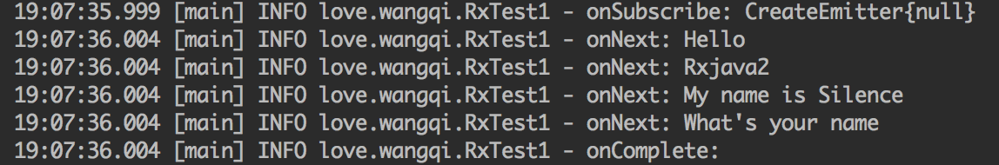


和之前介绍的一样，先调用`onSubscribe`，然后调用`onNext`，最后以`onComplete`结尾。

# 操作符

## 创建操作符

### just

`just`是一个简单的发射器，将传入的参数依次发射出来。

```java
Observable<String> observable = Observable.just("Hello", "Rxjava2", "My name is Silence", "What's your name");
// 将会依次调用：
// onNext("Hello");
// onNext("Rxjava2");
// onNext("My name is Silence");
// onNext("What's your name");
// onCompleted();
```

### fromarray

将传入的数组通过坐标依次发送出去。

```java
String[] words = {"Hello", "Rxjava2", "My name is Silence", "What's your name"};
Observable<String> observable = Observable.fromArray(words);
// 将会依次调用：
// onNext("Hello");
// onNext("Rxjava2");
// onNext("My name is Silence");
// onNext("What's your name");
// onCompleted();
```

### timer

`timer`相当于一个定时任务，延时一定时间然后开始执行任务。间隔执行的功能属于`interval`操作符。

```java
logger.info("start");
Observable.timer(3, TimeUnit.SECONDS)
        .subscribe(new Consumer<Long>() {
            @Override
            public void accept(Long aLong) throws Exception {
                logger.info("accept: " + aLong);
            }
        });
```

执行结果：

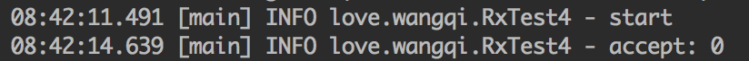


### interval

定时器功能。周期性执行任务。

```java
Observable.interval(1, TimeUnit.SECONDS).subscribe(
        new Consumer<Long>() {
            @Override
            public void accept(Long aLong) throws Exception {
                logger.info("accept: " + aLong.intValue());
            }
        }
);
```

执行结果：

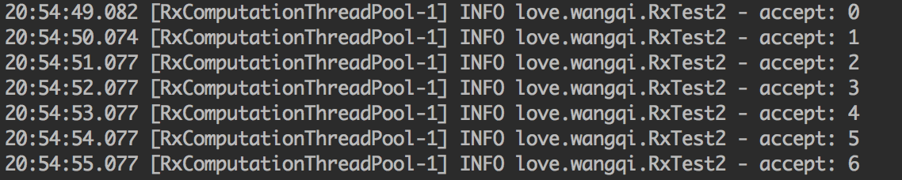

每隔1s打印一次日志

## 变换操作符

### map

`map`操作符通过指定一个`Function`对象，将`Observable`转换为一个新的`Observable`对象并发射，观察者将收到新的`Observable`。

```java
Observable.create(new ObservableOnSubscribe<Integer>() {
    @Override
    public void subscribe(ObservableEmitter<Integer> emitter) throws Exception {
        emitter.onNext(1);
        emitter.onNext(2);
        emitter.onNext(3);
        emitter.onNext(4);
    }
}).map(new Function<Integer, String>() {
    @Override
    public String apply(Integer integer) throws Exception {
        return "This is result " + integer;
    }
}).subscribe(new Consumer<String>() {
    @Override
    public void accept(String s) throws Exception {
        logger.info("accept: " + s);
    }
});
```

执行结果：

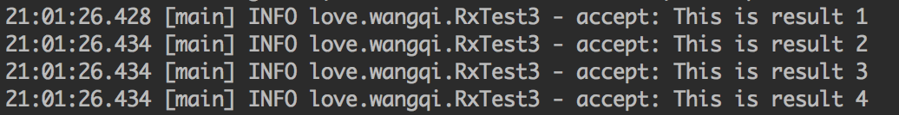

`map`方法中，我们把一个integer对象转换成了一个String对象。然后当`map`调用结束时，事件的参数类型也从integer转换成了String。这就是最常见的变换操作。

### flatMap

`flatMap`的操作符是将`Observable`发射的数据集合变成一个`Observable`集合。也就是说它可以将一个观察对象变换成多个观察对象，但是并不能保证事件的顺序。想要保证事件的顺序需要使用下面讲到的`concatMap`。

```java
Observable.create(new ObservableOnSubscribe<Integer>() {
    @Override
    public void subscribe(ObservableEmitter<Integer> emitter) throws Exception {
        emitter.onNext(1);
        emitter.onNext(2);
        emitter.onNext(3);
    }
}).flatMap(new Function<Integer, ObservableSource<String>>() {
    @Override
    public ObservableSource<String> apply(Integer integer) throws Exception {
        final List<String> list = new ArrayList<>();
        for (int i = 0; i < 3; i++) {
            list.add("I am value " + integer + "\n");
        }
        return Observable.fromIterable(list).delay(100, TimeUnit.MILLISECONDS);
    }
}).subscribe(new Consumer<String>() {
    @Override
    public void accept(String s) throws Exception {
        logger.info("accept: " + s);
    }
});
```

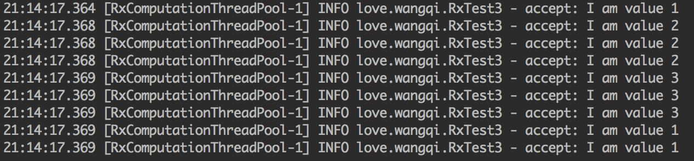

我们看到，对于一个integer，我们将它映射成了3个String类型的Observable对象。通过一个100ms的延迟，能看到发射的时间不能保证顺序。

### concatMap

除了保证顺序，`concatMap`和`flatMap`一模一样。

```java
Observable.create(new ObservableOnSubscribe<Integer>() {
    @Override
    public void subscribe(ObservableEmitter<Integer> emitter) throws Exception {
        emitter.onNext(1);
        emitter.onNext(2);
        emitter.onNext(3);
    }
}).concatMap(new Function<Integer, ObservableSource<String>>() {
    @Override
    public ObservableSource<String> apply(Integer integer) throws Exception {
        final List<String> list = new ArrayList<>();
        for (int i = 0; i < 3; i++) {
            list.add("I am value " + integer);
        }
        return Observable.fromIterable(list).delay(1000, TimeUnit.MILLISECONDS);
    }
}).subscribe(new Consumer<String>() {
    @Override
    public void accept(String s) throws Exception {
        logger.info("accept: " + s);
    }
});
```

执行结果：

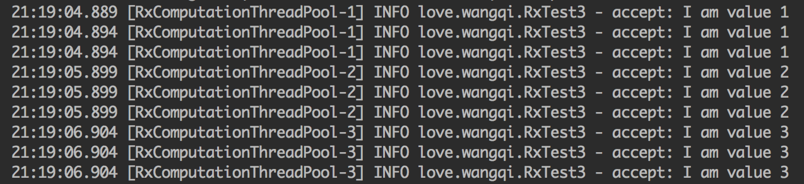

### compose


## 过滤操作符

### filter

`filter`操作符是对`Observable`产生的结果进行有规则的过滤。只有满足规则的结果才会提交到观察者手中。

```java
Observable.just(1, 2, 3).filter(new Predicate<Integer>() {
    @Override
    public boolean test(Integer integer) throws Exception {
        return integer < 3;
    }
}).subscribe(new Consumer<Integer>() {
    @Override
    public void accept(Integer integer) throws Exception {
        logger.info("accept:" + integer);
    }
});
```

执行结果：

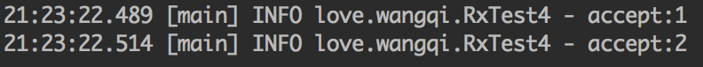

`Observable`发送`1`, `2`, `3`。当我们加上了一个`filter`操作符，让它只返回小于3的内容。那么观察者只能收到的两个数据。

### distinct

`distinct`的作用就是去重。它只允许还没有发射的数据项通过，发射过的数据项直接pass。

```java
Observable.just(1, 2, 3, 4, 2, 3, 5, 6, 1, 3)
        .distinct().subscribe(new Consumer<Integer>() {
    @Override
    public void accept(Integer integer) throws Exception {
        logger.info("accept: " + integer);
    }
});
```

执行结果：

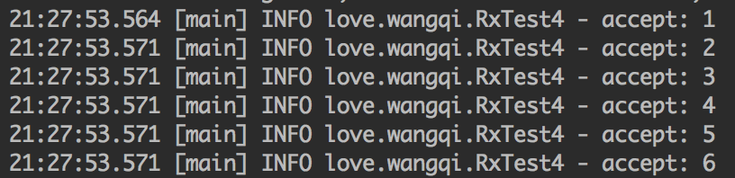


### buffer

`buffer`的作用主要是缓存，把`Observable`转换成一个新的`Observable`。这个新的`Observable`每次发射的是一组List，而不是单独的一个个的发送数据

`buffer`可以接受一个参数`buffer(count)`：作用是将`Observable`中的数据分成最大不超过count的buffer，然后生成一个`Observable`。

```java
Observable.just(1, 2, 3, 4, 5, 6)
        .buffer(2).subscribe(new Consumer<List<Integer>>() {
    @Override
    public void accept(List<Integer> integers) throws Exception {
        for (Integer integer : integers) {
            logger.info("accept: " + integer);
        }
        logger.info("accept:-------------->");
    }
});
```

执行结果：

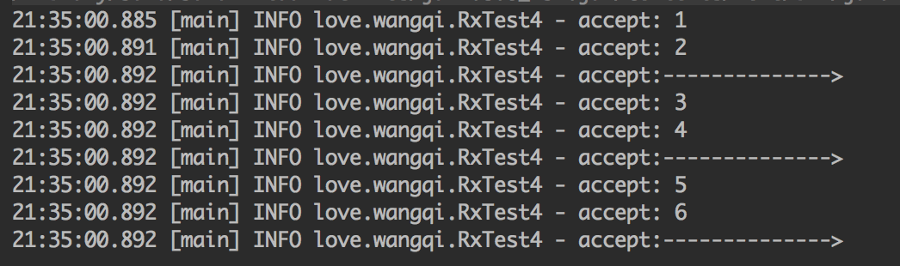

`buffer`也可以接受两个参数`buffer(count, skip)`：作用是将`Observable`中的数据按`skip`(步长)分成最大不超过count的buffer，然后生成一个`Observable`。

```java
Observable.just(1, 2, 3, 4, 5, 6)
        .buffer(2, 1).subscribe(new Consumer<List<Integer>>() {
    @Override
    public void accept(List<Integer> integers) throws Exception {
        for (Integer integer : integers) {
            logger.info("accept: " + integer);
        }
        logger.info("accept:-------------->");
    }
});
```

执行结果：

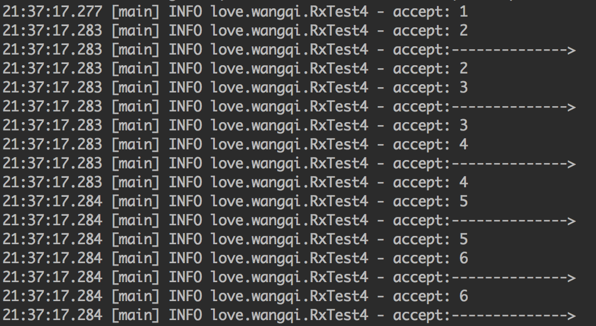


### skip、skipLast

`skip`将`Observable`发射的数据过滤掉前n项。`skipLast`则是从后往前进行过滤。

```java
Observable.just(1, 2, 3, 4, 5, 6)
        .skip(2).subscribe(new Consumer<Integer>() {
    @Override
    public void accept(Integer integer) throws Exception {
        logger.info("accept: " + integer);
    }
});
```

执行结果：

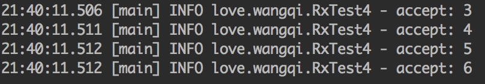

### take、takeLast

`take`只取`Observable`发射数据的前n项。`takeLast`则是从后往前取。

```java
Observable.just(1, 2, 3, 4, 5, 6)
        .take(3).subscribe(new Consumer<Integer>() {
    @Override
    public void accept(Integer integer) throws Exception {
        logger.info("accept: " + integer);
    }
});
```

执行结果：

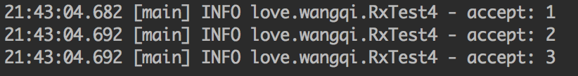

### doOnNext

`doOnNext`的作用是让订阅者在接收到数据之前干点有意思的事情。

```java
Observable.just(1, 2, 3, 4)
        .doOnNext(new Consumer<Integer>() {
            @Override
            public void accept(Integer integer) throws Exception {
                logger.info("doOnNext " + integer);
            }
        }).subscribe(new Consumer<Integer>() {
    @Override
    public void accept(Integer integer) throws Exception {
        logger.info("accept: " + integer);
    }
});
```

执行结果：

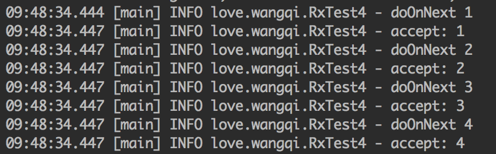

### doOnEach

`doOnEach`可以给`Observable`加上这样的一个回调：`Observable`每发射一个数据的时候就会触发这个回调，不仅包括`onNext`还包括`onError`和`onCompleted`。

### debounce

`debounce`的作用是发送频率过快的项。

```java
Observable.create(new ObservableOnSubscribe<Integer>() {
    @Override
    public void subscribe(ObservableEmitter<Integer> emitter) throws Exception {
        emitter.onNext(1);
        Thread.sleep(400);
        emitter.onNext(2);
        Thread.sleep(505);
        emitter.onNext(3);
        Thread.sleep(100);
        emitter.onNext(4);
        Thread.sleep(605);
        emitter.onNext(5);
        Thread.sleep(510);
        emitter.onComplete();
    }
}).debounce(500, TimeUnit.MILLISECONDS)
        .subscribe(new Consumer<Integer>() {
            @Override
            public void accept(Integer integer) throws Exception {
                logger.info("accept: " + integer);
            }
        });
```

执行结果：

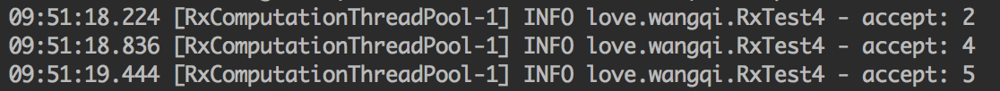

`debounce(500, TimeUnit.MILLISECONDS)`的作用是去除发送间隔小于500毫秒的发射事件，所以1和3被过滤掉了

### defer

`defer`操作符每次订阅都会创建一个新的`Observable`，如果没有被订阅，就不会产生新的`Observable`。

```java
Observable<Integer> observable = Observable.defer(new Callable<ObservableSource<Integer>>() {
    @Override
    public ObservableSource<Integer> call() throws Exception {
        return Observable.just(1, 2, 3);
    }
});

Observer observer = new Observer<Integer>() {
    @Override
    public void onSubscribe(Disposable d) {

    }

    @Override
    public void onNext(Integer integer) {
        logger.info("onNext: " + integer);
    }

    @Override
    public void onError(Throwable e) {
        logger.info("onError: " + e.getMessage());
    }

    @Override
    public void onComplete() {
        logger.info("onComplete");
    }
};

observable.subscribe(observer);
observable.subscribe(observer);
```

执行结果：

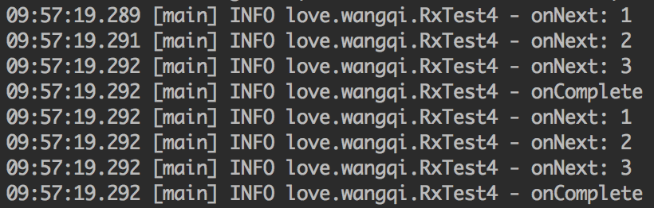

### last

`last`操作符仅取出可观察到的最后一个值，或者是满足某些条件的最后一项。

```java
Observable.just(1, 2, 3)
        .last(4)
        .subscribe(new Consumer<Integer>() {
            @Override
            public void accept(Integer integer) throws Exception {
                logger.info("last: " + integer);
            }
        });
```

执行结果：

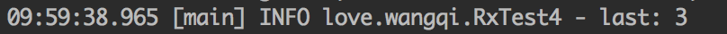


## 组合操作符

### merge

`merge`将多个操作符合并到一个`Observable`中进行发射。`merge`可能让合并到`Observable`的数据发射错了。（并行无序）

```java
Observable<Integer> observable1 = Observable.just(1, 2, 3);
Observable<Integer> observable2 = Observable.just(4, 5, 6);
Observable.merge(observable1, observable2).subscribe(new Consumer<Integer>() {
    @Override
    public void accept(Integer integer) throws Exception {
        logger.info("accept: " + integer);
    }
});
```

执行结果：

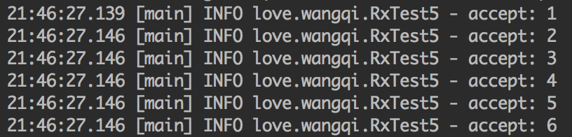

### reduce

`reduce`操作符每次用一个方法处理一个值，可以有一个seed作为初始值

```java
Observable.just(1, 2, 3)
        .reduce(new BiFunction<Integer, Integer, Integer>() {
            @Override
            public Integer apply(Integer integer, Integer integer2) throws Exception {
                return integer + integer2;
            }
        }).subscribe(new Consumer<Integer>() {
    @Override
    public void accept(Integer integer) throws Exception {
        logger.info("accept: " + integer);
    }
});
```

执行结果：

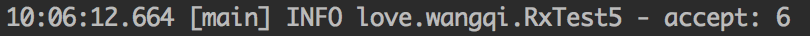

### scan

`scan`操作符作用和上面的`reduce`一致，唯一的区别是`reduce`是输出结果，而`scan`会把每个步骤都输出。

```java
Observable.just(1, 2, 3)
        .scan(new BiFunction<Integer, Integer, Integer>() {
            @Override
            public Integer apply(Integer integer, Integer integer2) throws Exception {
                return integer + integer2;
            }
        }).subscribe(new Consumer<Integer>() {
    @Override
    public void accept(Integer integer) throws Exception {
        logger.info("accept : scan " + integer);
    }
});
```

执行结果：

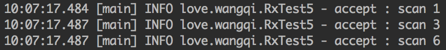

### window

`window`安装时间划分窗口，将数据发送给不同的`Observable`。

```java
Observable.interval(1, TimeUnit.SECONDS)
        .take(15)
        .window(3, TimeUnit.SECONDS)
        .subscribeOn(Schedulers.io())
        .subscribe(new Consumer<Observable<Long>>() {
            @Override
            public void accept(Observable<Long> longObservable) throws Exception {
                logger.info("Sub Divide begin...");
                Integer ri = new Random().nextInt();
                longObservable.subscribe(new Consumer<Long>() {
                    @Override
                    public void accept(Long aLong) throws Exception {
                        logger.info(ri + " Next: " + aLong);
                    }
                });
            }
        });
```

执行结果：

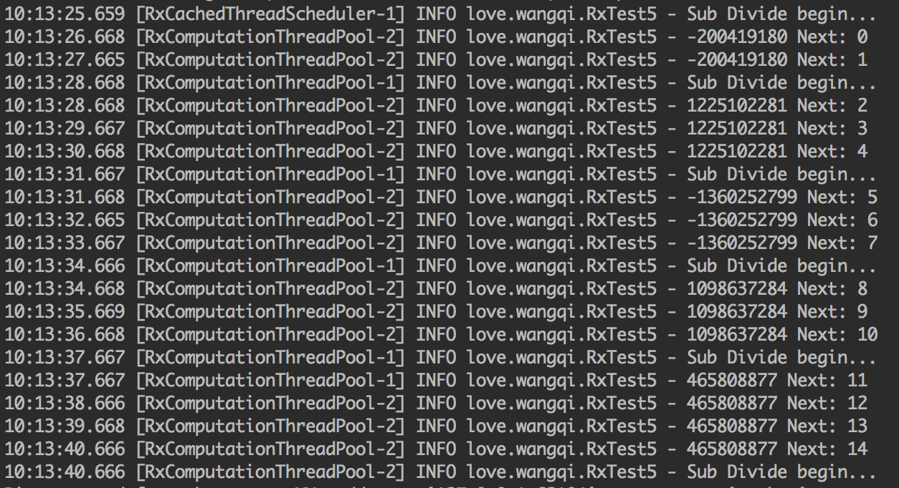


### concat

`concat`将多个操作符合并到一个`Observable`中进行发射，和`merge`不同的是，`merge`是无序的，而`concat`是有序的。（串行有序）没有发射完前一个它一定不会发射后一个。

```java
Observable<Integer> observable1 = Observable.just(1, 2, 3);
Observable<Integer> observable2 = Observable.just(4, 5, 6);
Observable.concat(observable1, observable2).subscribe(new Consumer<Integer>() {
    @Override
    public void accept(Integer integer) throws Exception {
        logger.info("accept: " + integer);
    }
});
```

执行结果：

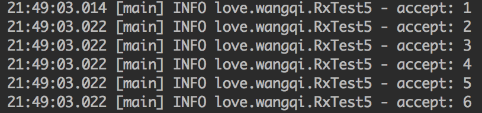


### zip

`zip`合并多个`Observable`发送的数据项，根据它们的类型进行重新变换，并发射一个新的值。

```java
Observable<Integer> observable1 = Observable.just(1, 2, 3);
Observable<String> observable2 = Observable.just("a", "b", "c");
Observable.zip(observable1, observable2, new BiFunction<Integer, String, String>() {
    @Override
    public String apply(Integer integer, String s) throws Exception {
        return integer + s;
    }
}).subscribe(new Consumer<String>() {
    @Override
    public void accept(String s) throws Exception {
        logger.info("accept: " + s);
    }
});
```

执行结果：

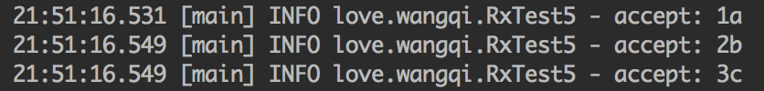


### concatEager

前面说到`concat`是串行有序，而`concatEager`是并行有序的。

```java
Observable<Integer> observable1 = Observable.just(1, 2, 3);
Observable<String> observable2 = Observable.just("a", "b", "c");
Observable.concatEager(Observable.fromArray(observable1, observable2))
        .subscribe(new Consumer<Serializable>() {
    @Override
    public void accept(Serializable serializable) throws Exception {
        logger.info("accept: " + serializable);
    }
});
```

执行结果：

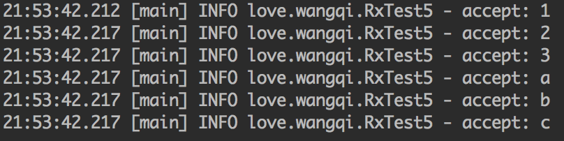


> http://gank.io/post/560e15be2dca930e00da1083
> https://juejin.im/post/5a43a842f265da432d2863ab#heading-26
> https://www.daidingkang.cc/2017/05/19/Rxjava/
> https://www.jianshu.com/p/b39afa92807e
> https://github.com/IamXiaRui/Android_5.0_ViewDemo/tree/master/FirstRxJavaDemo
> http://rxmarbles.com/
> https://blog.csdn.net/qq_20198405/article/details/51307198

