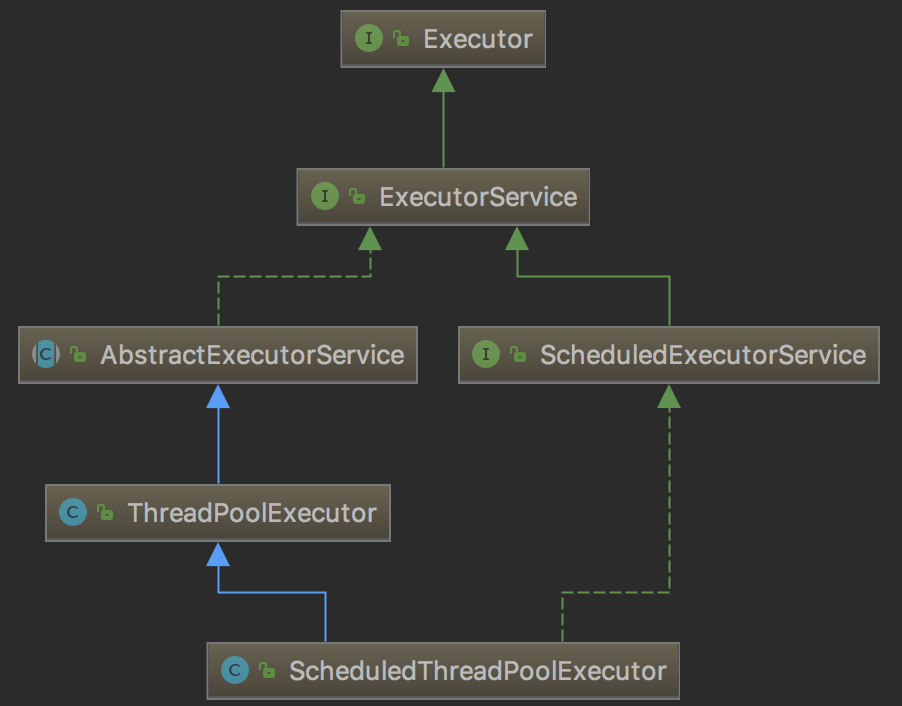

`ScheduledThreadPoolExecutor`继承`ThreadPoolExecutor`类，实现`ScheduledExecutorService`接口。它是一个支持定时执行或者延时执行的线程池。
<!-- more -->

# ScheduledThreadPoolExecutor的使用

`ScheduledExecutorService`的定义如下：

```java
public interface ScheduledExecutorService extends ExecutorService {
    /**
     * 在给定的delay延时之后，执行command任务。返回的ScheduledFuture表示任务执行完成，其get()方法返回null
     */
    public ScheduledFuture<?> schedule(Runnable command,
                                       long delay, TimeUnit unit);
                                       
    /**
     * 在给定的delay延时之后，执行callable任务。返回的ScheduledFuture可以用于获取结果，或者取消任务的执行
     */
    public <V> ScheduledFuture<V> schedule(Callable<V> callable,
                                           long delay, TimeUnit unit);
    
    /**
     * 在给定的delay延时之后，执行command任务，然后以period为周期循环执行任务
     */
    public ScheduledFuture<?> scheduleAtFixedRate(Runnable command,
                                                  long initialDelay,
                                                  long period,
                                                  TimeUnit unit);
    /**
     * 在给定的initialDelay延时之后，执行command任务，之后的任务总是延时delay时间之后执行下一次的任务
     */
    public ScheduledFuture<?> scheduleWithFixedDelay(Runnable command,
                                                     long initialDelay,
                                                     long delay,
                                                     TimeUnit unit);
}
```

两个`schedule`方法的区别就在于，前者传入的是`Runnable`而后者传入的是`Callable`，因此后者可以获得任务执行的结果而前者不可以。

`scheduleAtFixedRate()`方法和`scheduleWithFixedDelay()`方法看起来十分相似，我们来看看他们之间的区别。

## scheduleAtFixedRate

编写一个测试方法：

```java
private static void scheduleAtFixedRate(ScheduledExecutorService service, final int sleepTime) {
    service.scheduleAtFixedRate(new Runnable() {
        @Override
        public void run() {
            long start = System.currentTimeMillis();
            System.out.println("scheduleAtFixedRate 开始执行时间：" + DateFormat.getTimeInstance().format(new Date()));
            try {
                Thread.sleep(sleepTime);
            } catch (InterruptedException e) {
                e.printStackTrace();
            }
            long end = System.currentTimeMillis();
            System.out.println("scheduleAtFixedRate 执行花费时间：" + (end - start));
            System.out.println("scheduleAtFixedRate 执行完成时间：" + DateFormat.getTimeInstance().format(new Date()));
            System.out.println("===============");
        }
    }, 1000, 5000, TimeUnit.MILLISECONDS);
}
```

### 执行时间小于间隔时间

执行`scheduleAtFixedRate`方法：

```java
scheduleAtFixedRate(service, 1000);
```

执行结果：

```
scheduleAtFixedRate 开始执行时间：10:47:55
scheduleAtFixedRate 执行花费时间：1026
scheduleAtFixedRate 执行完成时间：10:47:56
===============
scheduleAtFixedRate 开始执行时间：10:48:00
scheduleAtFixedRate 执行花费时间：1001
scheduleAtFixedRate 执行完成时间：10:48:01
===============
scheduleAtFixedRate 开始执行时间：10:48:05
scheduleAtFixedRate 执行花费时间：1003
scheduleAtFixedRate 执行完成时间：10:48:06
===============
```

可以看到：在任务执行时间小于间隔时间的情况下，程序以起始时间为准则，每隔指定时间执行一次，不受任务执行时间影响。

### 执行时间大于间隔时间

执行`scheduleAtFixedRate`方法：

```java
scheduleAtFixedRate(service, 6000);
```

执行结果：

```
scheduleAtFixedRate 开始执行时间：10:50:20
scheduleAtFixedRate 执行花费时间：6029
scheduleAtFixedRate 执行完成时间：10:50:26
===============
scheduleAtFixedRate 开始执行时间：10:50:26
scheduleAtFixedRate 执行花费时间：6003
scheduleAtFixedRate 执行完成时间：10:50:32
===============
scheduleAtFixedRate 开始执行时间：10:50:32
scheduleAtFixedRate 执行花费时间：6002
scheduleAtFixedRate 执行完成时间：10:50:38
===============
```

可以看到，在任务执行时间大于间隔时间的情况下，此方法不会重新开启一个新的任务进行执行，而是等待原有任务执行完成，马上开启下一个任务进行执行。此时，执行间隔时间已经被打乱。

## scheduleWithFixedRate

编写一个测试方法：

```java
private static void scheduleWithFixedDelay(ScheduledExecutorService service, final int sleepTime) {
    service.scheduleWithFixedDelay(new Runnable() {
        @Override
        public void run() {
            long start = System.currentTimeMillis();
            System.out.println("scheduleWithFixedDelay 开始执行时间：" + DateFormat.getTimeInstance().format(new Date()));
            try {
                Thread.sleep(sleepTime);
            } catch (InterruptedException e) {
                e.printStackTrace();
            }
            long end = System.currentTimeMillis();
            System.out.println("scheduleWithFixedDelay 执行花费时间：" + (end - start));
            System.out.println("scheduleWithFixedDelay 执行完成时间：" + DateFormat.getTimeInstance().format(new Date()));
            System.out.println("===============");
        }
    }, 1000, 5000, TimeUnit.MILLISECONDS);
}
```

### 执行时间小于间隔时间

执行`scheduleWithFixedDelay`方法：

```java
scheduleWithFixedDelay(service, 1000);
```

执行结果：

```
scheduleWithFixedDelay 开始执行时间：10:54:26
scheduleWithFixedDelay 执行花费时间：1029
scheduleWithFixedDelay 执行完成时间：10:54:27
===============
scheduleWithFixedDelay 开始执行时间：10:54:32
scheduleWithFixedDelay 执行花费时间：1005
scheduleWithFixedDelay 执行完成时间：10:54:33
===============
scheduleWithFixedDelay 开始执行时间：10:54:38
scheduleWithFixedDelay 执行花费时间：1004
scheduleWithFixedDelay 执行完成时间：10:54:39
===============
```

可以看到：当执行任务小于延迟时间时，第一个任务执行之后，延迟指定时间，然后开始执行第二个任务。

### 执行时间大于间隔时间

执行`scheduleWithFixexDelay`方法：

```java
scheduleWithFixedDelay(service, 6000);
```

执行结果：

```
scheduleWithFixedDelay 开始执行时间：11:28:18
scheduleWithFixedDelay 执行花费时间：6026
scheduleWithFixedDelay 执行完成时间：11:28:24
===============
scheduleWithFixedDelay 开始执行时间：11:28:29
scheduleWithFixedDelay 执行花费时间：6002
scheduleWithFixedDelay 执行完成时间：11:28:35
===============
scheduleWithFixedDelay 开始执行时间：11:28:40
scheduleWithFixedDelay 执行花费时间：6106
scheduleWithFixedDelay 执行完成时间：11:28:46
===============
```

可以看到：当执行任务大于延迟时间时，第一个任务执行之后，延迟指定时间，然后开始执行第二个任务。

无论任务的执行时间长短，`scheduleWithFixedDelay`方法都是当第一个任务执行完成之后，延迟指定时间再开始执行第二个任务。

# ScheduledThreadPoolExecutor原理

首先我们来查看一下`ScheduledThreadPoolExecutor`的新建过程。

前面我们的示例中是这样新建`ScheduledExecutorService`的：

`ScheduledExecutorService service = Executors.newScheduledThreadPool(10)`

`Executors`是一个工具类，提供了许多静态方法，根据用户选择返回不同的线程池实例。`newScheduledThreadPool`方法新建了一个`ScheduledThreadPoolExecutor`实例。

`ScheduledThreadPoolExecutor`的继承关系如下：



可以看到，`ScheduledThreadPoolExecutor`继承了`ThreadPoolExecutor`并实现了`ScheduledExecutorService`。换句话说，`ScheduledThreadPoolExecutor`的功能实现依赖于线程池。这一点从它的构造函数可以看出：

```java
public ScheduledThreadPoolExecutor(int corePoolSize,
                                   ThreadFactory threadFactory) {
    super(corePoolSize, Integer.MAX_VALUE, 0, NANOSECONDS,
          new DelayedWorkQueue(), threadFactory);
}
```

可以看到，`ScheduledThreadPoolExecutor`的构造函数中调用了父类`ThreadPoolExecutor`的构造函数。唯一特殊的地方就是它传入的阻塞队列为一个在`ScheduledThreadPoolExecutor`中实现的`DelayedWorkQueue`，这个队列是实现定时任务的关键，我们在后面详述。

## schedule方法

两个`schedule`方法大同小异，我们以传入`Runnable`参数的方法为例，其代码如下所示：

```java
public ScheduledFuture<?> schedule(Runnable command,
                                   long delay,
                                   TimeUnit unit) {
    if (command == null || unit == null)
        throw new NullPointerException();
    // 将任务包装成ScheduledFutureTask，主要实现了getDelay和compareTo方法
    RunnableScheduledFuture<?> t = decorateTask(command,
        new ScheduledFutureTask<Void>(command, null,
                                      triggerTime(delay, unit)));
    // 添加任务到延迟队列
    delayedExecute(t);
    return t;
}

// decorateTask这里返回了作为参数传入的任务
protected <V> RunnableScheduledFuture<V> decorateTask(
    Runnable runnable, RunnableScheduledFuture<V> task) {
    return task;
}

// 返回该任务的触发事件，即当前时间+延时时间
private long triggerTime(long delay, TimeUnit unit) {
    return triggerTime(unit.toNanos((delay < 0) ? 0 : delay));
}

long triggerTime(long delay) {
    return now() +
        ((delay < (Long.MAX_VALUE >> 1)) ? delay : overflowFree(delay));
}

private void delayedExecute(RunnableScheduledFuture<?> task) {
    // 如果线程池关闭了，则拒绝任务
    if (isShutdown())
        reject(task);
    else {
        // 将任务添加到队列中
        super.getQueue().add(task);
        // 再次检查线程池关闭
        if (isShutdown() &&
            !canRunInCurrentRunState(task.isPeriodic()) &&
            remove(task))
            task.cancel(false);
        else
            // 确保至少一个线程在处理任务
            ensurePrestart();
    }
}

public BlockingQueue<Runnable> getQueue() {
    return workQueue;
}
```

## scheduleAtFixedRate方法

`scheduleAtFixedRate`方法相对任务的起始时间点固定频率调用。代码如下：

```java
public ScheduledFuture<?> scheduleAtFixedRate(Runnable command,
                                              long initialDelay,
                                              long period,
                                              TimeUnit unit) {
    if (command == null || unit == null)
        throw new NullPointerException();
    if (period <= 0)
        throw new IllegalArgumentException();
    // 将定时任务包装成ScheduledFutureTask，注意这里period=period>0
    ScheduledFutureTask<Void> sft =
        new ScheduledFutureTask<Void>(command,
                                      null,
                                      triggerTime(initialDelay, unit),
                                      unit.toNanos(period));
    RunnableScheduledFuture<Void> t = decorateTask(command, sft);
    sft.outerTask = t;
    delayedExecute(t);
    return t;
}
```

## scheduleWithFixedDelay方法

`scheduleWithFixedDelay`方法相对任务的结束时间点固定频率调用。代码如下：

```java
public ScheduledFuture<?> scheduleWithFixedDelay(Runnable command,
                                                 long initialDelay,
                                                 long delay,
                                                 TimeUnit unit) {
    if (command == null || unit == null)
        throw new NullPointerException();
    if (delay <= 0)
        throw new IllegalArgumentException();
    // 将定时任务包装成ScheduledFutureTask，注意这里period=-delay<0
    ScheduledFutureTask<Void> sft =
        new ScheduledFutureTask<Void>(command,
                                      null,
                                      triggerTime(initialDelay, unit),
                                      unit.toNanos(-delay));
    RunnableScheduledFuture<Void> t = decorateTask(command, sft);
    sft.outerTask = t;
    delayedExecute(t);
    return t;
}
```

## ScheduledFutureTask

我们在之前的文章[ThreadPoolExecutor][1]中对线程池的运行原理进行了详细的描述。线程池的工作线程通过`getTask`方法获取任务并执行，`getTask`方法调用`workQueue`的`E poll(long timeout, TimeUnit unit)`或者`E take()`的方法从工作队列中获取任务。

我们在一般情况下使用`LinkedBlockingQueue`作为线程池的队列，这也意味着线程池对于任务的执行顺序是先进先出的。

`ScheduledThreadPoolExecutor`的特殊性就在于采用了`DelayedWorkQueue`作为队列。`DelayedWorkQueue`是一个堆实现的优先队列，它按照每个任务距离下次执行时间间隔的大小排序，时间间隔小的任务排在前面。

前面我们看到任务被包装成`ScheduledFutureTask`，`DelayedWorkQueue`根据`ScheduledFutureTask`提供的比较函数实现排序。代码如下：

```java
ScheduledFutureTask(Runnable r, V result, long ns) {
    super(r, result);
    this.time = ns; // time表示任务触发时间
    this.period = 0;
    this.sequenceNumber = sequencer.getAndIncrement();
}

// 任务的延时时间，触发事件-当前时间，就是即将过期剩余时间
public long getDelay(TimeUnit unit) {
    return unit.convert(time - now(), NANOSECONDS);
}

// 比较任务，即让过期时间最近的任务放在队列的头上
public int compareTo(Delayed other) {
    if (other == this) // compare zero if same object
        return 0;
    if (other instanceof ScheduledFutureTask) {
        ScheduledFutureTask<?> x = (ScheduledFutureTask<?>)other;
        long diff = time - x.time;
        // 首先比较触发时间
        if (diff < 0)
            return -1;
        else if (diff > 0)
            return 1;
        // 如果触发时间相同，则比较任务的添加顺序
        else if (sequenceNumber < x.sequenceNumber)
            return -1;
        else
            return 1;
    }
    long diff = getDelay(NANOSECONDS) - other.getDelay(NANOSECONDS);
    return (diff < 0) ? -1 : (diff > 0) ? 1 : 0;
}
```

当线程池获得了`DelayedWorkQueue`队列头部的任务后调用`ScheduledFutureTask`的`run`方法运行任务。代码如下：

```java
public void run() {
    // 根据period != 0来判断是否是周期性任务
    // scheduleAtFixedRate和scheduleWithFixedDelay创建的任务时周期性任务，schedule方法创建的任务默认period == 0，因此不是周期性任务
    boolean periodic = isPeriodic();
    // 判断当前线程池的状态是否可执行，如果不能执行则删除任务
    if (!canRunInCurrentRunState(periodic))
        cancel(false);
    // 如果不是周期性任务，只执行一次
    else if (!periodic)
        ScheduledFutureTask.super.run();
    // 周期性执行
    else if (ScheduledFutureTask.super.runAndReset()) {
        // 设置下次执行的时间
        setNextRunTime();
        // 将任务重新加入队列
        reExecutePeriodic(outerTask);
    }
}

public boolean isPeriodic() {
    return period != 0;
}

private void setNextRunTime() {
    long p = period;
    /**
     * 这里是scheduleAtFixRate和scheduleWithFixedRate区别的关键
     * 如果period > 0，即scheduleAtFixedRate方法。下次调用时间是上次理论调用时间加上延时时间
     * 如果period < 0，即scheduleWithFixedRate方法。下次调用时间是当前时间加上延时时间
     */
    if (p > 0)
        time += p;
    else
        time = triggerTime(-p);
}

void reExecutePeriodic(RunnableScheduledFuture<?> task) {
    if (canRunInCurrentRunState(true)) {
        // 调用队列的add方法将任务重新添加到队列中
        super.getQueue().add(task);
        if (!canRunInCurrentRunState(true) && remove(task))
            task.cancel(false);
        else
            ensurePrestart();
    }
}
```


[1]: /articles/Java/ThreadPoolExecutor.html


> https://blog.csdn.net/wo541075754/article/details/51556198
> https://blog.csdn.net/xiangzhihong8/article/details/78995686

