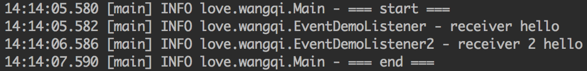
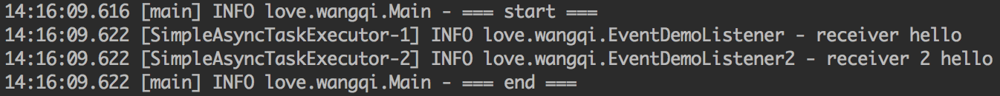
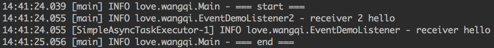

Spring的事件通知机制是一项很有用的功能，使用事件机制我们可以将相互耦合的代码解耦，从而方便功能的修改与添加。本文我来学习并分析一下Spring中事件的原理。

<!-- more -->

举个例子，假设有一个添加评论的方法，在评论添加成功之后需要进行修改redis缓存、给用户添加积分等等操作。当然可以在添加评论的代码后面假设这些操作，但是这样的代码违反了设计模式的多项原则：单一职责原则、迪米特法则、开闭原则。一句话说就是耦合性太大了，比如将来评论添加成功之后还需要有另外一个操作，这时候我们就需要去修改我们的添加评论代码了。

在以前的代码中，我使用观察者模式来解决这个问题。不过Spring中已经存在了一个升级版观察者模式的机制，这就是监听者模式。通过该机制我们就可以发送接收任意的事件并处理。

通过一个简单的demo来看看Spring事件通知的使用：

```java
// 定义一个事件
public class EventDemo extends ApplicationEvent {
    private String message;


    public EventDemo(Object source, String message) {
        super(source);
        this.message = message;
    }

    public String getMessage() {
        return message;
    }
}

// 定义一个事件监听者
@Component
public class EventDemoListener implements ApplicationListener<EventDemo> {
    @Override
    public void onApplicationEvent(EventDemo event) {
        System.out.println("receiver " + event.getMessage());
    }
}

// 事件发布
@Component
public class EventDemoPublish {
    @Autowired
    private ApplicationEventPublisher applicationEventPublisher;

    public void publish(String message) {
        EventDemo demo = new EventDemo(this, message);
        applicationEventPublisher.publishEvent(demo);
    }
}
```

调用`EventDemoPublish.publish`方法来发布消息，`EventDemoListener`监听器接收到消息后对消息进行处理，打印出消息的内容：

```
receiver hello
```

## Spring事件通知原理

首先我们跟踪`publishEvent`方法，这个方法在`AbstractApplicationContext`类中。

```java
protected void publishEvent(Object event, @Nullable ResolvableType eventType) {
    Assert.notNull(event, "Event must not be null");

    // Decorate event as an ApplicationEvent if necessary
    ApplicationEvent applicationEvent;
    if (event instanceof ApplicationEvent) {
        // 如果event是ApplicationEvent对象
        applicationEvent = (ApplicationEvent) event;
    }
    else {
        // 如果event不是ApplicationEvent对象，则将其包装成PayloadApplicationEvent事件，并获取对应的事件类型
        applicationEvent = new PayloadApplicationEvent<>(this, event);
        if (eventType == null) {
            eventType = ((PayloadApplicationEvent) applicationEvent).getResolvableType();
        }
    }

    // Multicast right now if possible - or lazily once the multicaster is initialized
    if (this.earlyApplicationEvents != null) {
        this.earlyApplicationEvents.add(applicationEvent);
    }
    else {
        // 获取ApplicationEventMulticaster，调用`multicastEvent`方法广播事件
        getApplicationEventMulticaster().multicastEvent(applicationEvent, eventType);
    }

    // 如果当前命名空间还有父亲节点，也需要给父亲推送该消息
    // Publish event via parent context as well...
    if (this.parent != null) {
        if (this.parent instanceof AbstractApplicationContext) {
            ((AbstractApplicationContext) this.parent).publishEvent(event, eventType);
        }
        else {
            this.parent.publishEvent(event);
        }
    }
}

// 获取ApplicationEventMulticaster
ApplicationEventMulticaster getApplicationEventMulticaster() throws IllegalStateException {
    if (this.applicationEventMulticaster == null) {
        throw new IllegalStateException("ApplicationEventMulticaster not initialized - " +
                "call 'refresh' before multicasting events via the context: " + this);
    }
    return this.applicationEventMulticaster;
}
```

经过上面的分析，我们看到事件是通过`applicationEventMulticaster`来广播出去的。

`applicationEventMulticaster`在Spring的启动过程中被建立，我们在之前的文章[Spring启动过程分析1(overview)][1]中分析过Spring的启动过程，在核心方法`refresh`中建立`applicationEventMulticaster`：

```java
// Initialize message source for this context.
initMessageSource();

// Initialize event multicaster for this context.
// 在Spring容器中初始化事件广播器，事件广播器用于事件的发布
initApplicationEventMulticaster();

// Initialize other special beans in specific context subclasses.
onRefresh();

// Check for listener beans and register them.
// 把Spring容器内的事件监听器和BeanFactory中的事件监听器都添加的事件广播器中。
registerListeners();

// Instantiate all remaining (non-lazy-init) singletons.
finishBeanFactoryInitialization(beanFactory);

// Last step: publish corresponding event.
finishRefresh();
```

关注`initApplicationEventMulticaster`和`registerListeners`方法。

```java
// 初始化事件广播器
protected void initApplicationEventMulticaster() {
    ConfigurableListableBeanFactory beanFactory = getBeanFactory();
    // 如果用户手动新建了一个名为applicationEventMulticaster类型为ApplicationEventMulticaster的bean，则将这个bean作为事件广播器
    if (beanFactory.containsLocalBean(APPLICATION_EVENT_MULTICASTER_BEAN_NAME)) {
        this.applicationEventMulticaster =
                beanFactory.getBean(APPLICATION_EVENT_MULTICASTER_BEAN_NAME, ApplicationEventMulticaster.class);
        if (logger.isTraceEnabled()) {
            logger.trace("Using ApplicationEventMulticaster [" + this.applicationEventMulticaster + "]");
        }
    }
    else {
        // 否则新建一个SimpleApplicationEventMulticaster作为默认的事件广播器
        this.applicationEventMulticaster = new SimpleApplicationEventMulticaster(beanFactory);
        beanFactory.registerSingleton(APPLICATION_EVENT_MULTICASTER_BEAN_NAME, this.applicationEventMulticaster);
        if (logger.isTraceEnabled()) {
            logger.trace("No '" + APPLICATION_EVENT_MULTICASTER_BEAN_NAME + "' bean, using " +
                    "[" + this.applicationEventMulticaster.getClass().getSimpleName() + "]");
        }
    }
}
```

```java
// 注册监听器
protected void registerListeners() {
    // Register statically specified listeners first.
    // 把提前存储好的监听器添加到监听器容器中
    for (ApplicationListener<?> listener : getApplicationListeners()) {
        getApplicationEventMulticaster().addApplicationListener(listener);
    }

    // Do not initialize FactoryBeans here: We need to leave all regular beans
    // uninitialized to let post-processors apply to them!
    // 获取类型是ApplicationListener的beanName集合，此处不会去实例化bean
    String[] listenerBeanNames = getBeanNamesForType(ApplicationListener.class, true, false);
    for (String listenerBeanName : listenerBeanNames) {
        getApplicationEventMulticaster().addApplicationListenerBean(listenerBeanName);
    }

    // Publish early application events now that we finally have a multicaster...
    Set<ApplicationEvent> earlyEventsToProcess = this.earlyApplicationEvents;
    this.earlyApplicationEvents = null;
    // 如果存在earlyEventsToProcess，提前处理这些事件
    if (earlyEventsToProcess != null) {
        for (ApplicationEvent earlyEvent : earlyEventsToProcess) {
            getApplicationEventMulticaster().multicastEvent(earlyEvent);
        }
    }
}
```

经过前面的分析，我们知道了事件广播器`applicationEventMulticaster`如何被构建，下面我们分析事件的广播过程。

```java
@Override
public void multicastEvent(final ApplicationEvent event, @Nullable ResolvableType eventType) {
    ResolvableType type = (eventType != null ? eventType : resolveDefaultEventType(event));
    // 根据event类型获取适合的监听器
    for (final ApplicationListener<?> listener : getApplicationListeners(event, type)) {
        // 获取SimpleApplicationEventMulticaster中的线程执行器，如果存在线程执行器则在新线程中异步执行，否则直接同步执行监听器中的方法
        Executor executor = getTaskExecutor();
        if (executor != null) {
            executor.execute(() -> invokeListener(listener, event));
        }
        else {
            invokeListener(listener, event);
        }
    }
}

protected void invokeListener(ApplicationListener<?> listener, ApplicationEvent event) {
    // 如果存在ErrorHandler，调用监听器方法如果抛出异常则调用ErrorHandler来处理异常。否则直接调用监听器方法
    ErrorHandler errorHandler = getErrorHandler();
    if (errorHandler != null) {
        try {
            doInvokeListener(listener, event);
        }
        catch (Throwable err) {
            errorHandler.handleError(err);
        }
    }
    else {
        doInvokeListener(listener, event);
    }
}
```

经过上面的分析，我们知道了Spring如何发送并响应事件。下面我们来分析如何使Spring能够异步响应事件。

## 异步响应Event

默认情况下，Spring是同步执行Event的响应方法的。如果响应方法的执行时间很长会阻塞发送事件的方法，因此很多场景下，我们需要让事件的响应异步化。

为了更直观地说明Event的响应默认是同步的，我们修改一下`EventDemoListener`并增加一个`EventDemoListener2`：

```java
@Component
public class EventDemoListener implements ApplicationListener<EventDemo> {
    Logger logger = LoggerFactory.getLogger(EventDemoListener.class);

    @Override
    public void onApplicationEvent(EventDemo event) {
        logger.info("receiver " + event.getMessage());
        try {
            Thread.sleep(1000);
        } catch (InterruptedException e) {
            e.printStackTrace();
        }
    }
}

@Component
public class EventDemoListener2 implements ApplicationListener<EventDemo> {
    Logger logger = LoggerFactory.getLogger(EventDemoListener2.class);

    @Override
    public void onApplicationEvent(EventDemo event) {
        logger.info("receiver 2 " + event.getMessage());
        try {
            Thread.sleep(1000);
        } catch (InterruptedException e) {
            e.printStackTrace();
        }
    }
}
```

执行结果如下：



执行结果显示：`EventDemoListener2`和`EventDemoListener`的执行间隔1秒，`EventDemoListener2`的执行和程序的结束也间隔1秒。结果表示我们的响应程序是同步执行的，一个响应程序的执行会阻塞下一个响应程序的执行。

### 自定义SimpleApplicationEventMulticaster

通过前面的代码分析，我们发现如果`SimpleApplicationEventMulticaster`中的`taskExecutor`如果不为null，将在`taskExecutor`中异步执行响应程序。`applicationEventMulticaster`的新建在`initApplicationEventMulticaster`方法中，默认情况下它会新建一个`SimpleApplicationEventMulticaster`，其中的`taskExecutor`为null。因此想要`taskExecutor`不为null，我们可以自己手动创建一个`SimpleApplicationEventMulticaster`然后设置一个`taskExecutor`。

修改`Config`类：

```java
@Configuration
@ComponentScan("love.wangqi")
public class Config {
    @Bean
    public SimpleAsyncTaskExecutor simpleAsyncTaskExecutor() {
        return new SimpleAsyncTaskExecutor();
    }

    @Bean
    public SimpleApplicationEventMulticaster applicationEventMulticaster() {
        SimpleApplicationEventMulticaster simpleApplicationEventMulticaster = new SimpleApplicationEventMulticaster();
        simpleApplicationEventMulticaster.setTaskExecutor(simpleAsyncTaskExecutor());
        return simpleApplicationEventMulticaster;
    }
}
```

此时再次执行程序，执行结果如下：



可以看到，`EventDemoListener`和`EventDemoListener2`是同时执行的，同时它们的执行没有阻塞主程序的执行。事件的响应做到了异步化。

### @Async

前面我们看到，通过手动新建`SimpleApplicationEventMulticaster`并设置`TaskExecutor`可以使所有的事件响应程序都在另外的线程中执行，不阻塞主程序的执行。不过这样也带来一个问题，那就是所有的事件响应程序都异步化了，某些场景下我们希望某些关系密切的响应程序可以同步执行另外一些响应程序异步执行。这种场景下，我们就不能简单地新建`SimpleApplicationEventMulticaster`并设置`TaskExecutor`。

Spring中提供了一个`@Async`注解，可以将加上这个注解的方法在另外的线程中执行。通过这个注解我们可以将指定的事件响应程序异步化。

我们修改`EventDemoListener`，在`onApplicationEvent`中加上`@Async`注解；同时修改`Config`类：

```java
@Component
public class EventDemoListener implements ApplicationListener<EventDemo> {
    Logger logger = LoggerFactory.getLogger(EventDemoListener.class);

    @Async
    @Override
    public void onApplicationEvent(EventDemo event) {
        logger.info("receiver " + event.getMessage());
        try {
            Thread.sleep(1000);
        } catch (InterruptedException e) {
            e.printStackTrace();
        }
    }
}

@Configuration
@ComponentScan("love.wangqi")
@EnableAsync
public class Config {
    @Bean
    public SimpleAsyncTaskExecutor simpleAsyncTaskExecutor() {
        return new SimpleAsyncTaskExecutor();
    }
}
```

注意`Config`类中需要加上`@EnableAsync`注释，并定义`TaskExecutor`。

执行结果如下：



我们看到，`EventDemoListener`是在另外的线程中执行的，但是`EventDemoListener2`仍然在主线程中执行，因此`EventDemoListener2`阻塞了主线程的执行。

#### @Async原理

`@Async`注解可以将方法异步化，下面我们来看看它的原理是什么。

我们在`Config`类中添加了`@EnableAsync`注释。`@EnableAsync`注释引入`AsyncConfigurationSelector`类，`AsyncConfigurationSelector`类导入`ProxyAsyncConfiguration`类，`ProxyAsyncConfiguration`类新建过程中会新建`AsyncAnnotationBeanPostProcessor`。

`AsyncAnnotationBeanPostProcessor`类继承了`BeanPostProcessor`，当每个Bean新建完成后会调用`AsyncAnnotationBeanPostProcessor`的`postProcessAfterInitialization`方法：

```java
@Override
public Object postProcessAfterInitialization(Object bean, String beanName) {
    if (this.advisor == null || bean instanceof AopInfrastructureBean) {
        // Ignore AOP infrastructure such as scoped proxies.
        return bean;
    }

    if (bean instanceof Advised) {
        Advised advised = (Advised) bean;
        if (!advised.isFrozen() && isEligible(AopUtils.getTargetClass(bean))) {
            // Add our local Advisor to the existing proxy's Advisor chain...
            if (this.beforeExistingAdvisors) {
                advised.addAdvisor(0, this.advisor);
            }
            else {
                advised.addAdvisor(this.advisor);
            }
            return bean;
        }
    }

    if (isEligible(bean, beanName)) {
        ProxyFactory proxyFactory = prepareProxyFactory(bean, beanName);
        if (!proxyFactory.isProxyTargetClass()) {
            evaluateProxyInterfaces(bean.getClass(), proxyFactory);
        }
        proxyFactory.addAdvisor(this.advisor);
        customizeProxyFactory(proxyFactory);
        return proxyFactory.getProxy(getProxyClassLoader());
    }

    // No proxy needed.
    return bean;
}
```

`postProcessAfterInitialization`方法判断bean是否符合要求（方法上是否加了`@Async`注释），如果符合要求则对bean加上代理，代理类为`AnnotationAsyncExecutionInterceptor`。

```java
@Override
@Nullable
public Object invoke(final MethodInvocation invocation) throws Throwable {
    Class<?> targetClass = (invocation.getThis() != null ? AopUtils.getTargetClass(invocation.getThis()) : null);
    Method specificMethod = ClassUtils.getMostSpecificMethod(invocation.getMethod(), targetClass);
    final Method userDeclaredMethod = BridgeMethodResolver.findBridgedMethod(specificMethod);

    // 获取executor
    AsyncTaskExecutor executor = determineAsyncExecutor(userDeclaredMethod);
    if (executor == null) {
        throw new IllegalStateException(
                "No executor specified and no default executor set on AsyncExecutionInterceptor either");
    }

    // 将我们真正的方法包装成一个`Callable`任务
    Callable<Object> task = () -> {
        try {
            Object result = invocation.proceed();
            if (result instanceof Future) {
                return ((Future<?>) result).get();
            }
        }
        catch (ExecutionException ex) {
            handleError(ex.getCause(), userDeclaredMethod, invocation.getArguments());
        }
        catch (Throwable ex) {
            handleError(ex, userDeclaredMethod, invocation.getArguments());
        }
        return null;
    };
    
    // 将任务提交到`executor`中执行
    return doSubmit(task, executor, invocation.getMethod().getReturnType());
}
```

调用我们的方法时首先调用`AnnotationAsyncExecutionInterceptor`的`invoke`方法，`invoke`方法将我们真正的方法包装成一个`Callable`任务，将这个任务提交到`executor`中执行。由此达到了将我们的方法异步化的目的。

## 总结

Spring的事件机制是一套相当灵活的机制，使用它可以简便地将我们的代码解耦从而优化我们的代码。经过前面的分析我们了解了其中的运行原理，这有助于我们更好地使用这套机制。


[1]: /articles/Spring/Spring启动过程分析1(overview).html


> https://www.jianshu.com/p/21984b08875c
> https://juejin.im/post/5aee749bf265da0b71562ac1
> https://my.oschina.net/u/2278977/blog/794868

