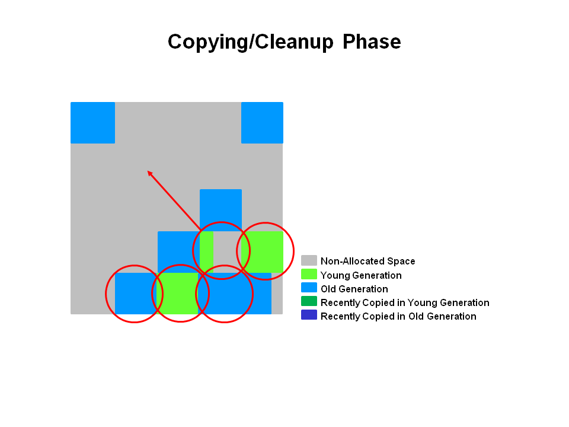

垃圾收集（Garbage Collection, GC）是Java区别于`C`、`C++`等语言的一个重要特征。在Java虚拟机自动内存管理机制的帮助下，程序员不再需要为每一个`new`操作去写配对的`delete/free`代码，虚拟机中的垃圾收集器会自动帮助运行中的程序回收不再使用的内存，这样就不容易出现内容泄露的问题。

正是因为垃圾收集是Java虚拟机自动执行的，我们对其的了解就十分重要。当需要排查各种内存溢出、内存泄露等问题，当垃圾收集称为系统达到更高并发量的瓶颈时，我们需要对垃圾收集实施必要的监控和调节。

本文是对垃圾收集相关知识的整理。使用的JDK版本为`1.8.0_211`

<!-- more -->

# 垃圾收集

Java虚拟机在执行Java程序的过程中会把它所管理的内存划分为若干个不同的数据区域：

1. 程序计数器
2. Java虚拟机栈
3. 本地方法栈
4. Java堆
5. 方法区
6. 直接内存

不同内存区域的用途不一样，Java虚拟机对它们的管理方式也不同。其中程序计数器、Java虚拟机栈、本地方法栈3个区域随线程而生，随线程而灭；栈中的栈帧随着方法的进入和退出而有条不紊地执行着出栈和入栈操作。每一个栈帧中分配多少内存基本上是在类结构确定下来时就已知的，因此这几个区域的内存分配和回收都具备确定性，在这几个区域内就不需要过多考虑回收的问题，因为方法结束或者线程结束时，内存自然就跟着回收了。

而Java堆和方法区则不一样，一个接口中的多个实现类需要的内存可能不一样，一个方法中的多个分支需要的内存也可能不一样，我们只有在程序处于运行期间时才能知道会创建哪些对象，这部分内存的分配和回收都是动态的，垃圾收集器就作用在这两部分内存上。

垃圾收集器运行在对堆进行回收前，第一件事情就是要确定这些对象之中哪些还“存活”着，哪些已经“死去”（即不可能再被任何途径使用的对象）。

一种简单的判断对象是否存活的算法是引用计数算法。该算法是这样的：给对象中添加一个引用计数器，每当有一个地方引用它时，计数器值就加1；当引用失效时，计数器就减1；任何时刻计数器为0的对象就是不可能再被使用的。引用计数算法足够简单，但是它很难解决对象之间相互循环引用的问题。

Java虚拟机的主流实现都采用可达性分析（Reachability Analysis）来判定对象是否存活。这个算法的基本思路就是通过一系列的称为"GC Roots"的对象作为起始点，从这些节点开始向下搜索，搜索所走过的路径称为引用链（Reference Chain），当一个对象到GC Roots没有任何引用链相连时，则证明此对象是不可用的。在Java语言中，可作为GC Roots的对象包括下面几种：

- 虚拟机栈（栈帧中的本地变量表）中引用的对象。
- 方法区中类静态属性引用的对象。
- 方法区中常量引用的对象。
- 本地方法栈中JNI（即一般说的Native方法）引用的对象。


## 垃圾收集算法

这里的垃圾收集算法指的是几种垃圾收集的思想。主要有以下三种：

1. 标记-清除算法。

算法分为“标记”和“清除”两个阶段：首先标记出所有需要回收的对象，在标记完成后统一回收所有被标记的对象。主要不足：1、效率问题，标记和清除两个过程的效率不高；2、空间问题，标记清除之后会产生大量不连续的内存碎片，空间碎片太多可能会导致以后在程序运行过程中需要分配较大对象时，无法找到足够的连续内存而不得不提前触发另一次垃圾收集动作。

2. 标记-复制算法。

算法将可用内存按容量划分为大小相等的两块，每次只使用其中的一块。当这一块的内存用完了，就将还存活着的对象复制到另外一块上面，然后再把已使用过的内存空间一次清理掉。该算法的优点是实现简单、运行高效。不足是：可用内存缩小为一半，内存使用效率太低。

3. 标记-整理算法。

算法在标记过程与“标记-清除”算法一样，标记出所有需要回收的对象，但后续步骤不是直接对可回收对象进行清理，而是让所有存活的对象都向一端移动，然后直接清理掉端边界以外的内存。

以上3种算法思想各有各的优缺点。在Java虚拟机的实现中，并没有采用其中的某一种算法，而是综合使用了3种算法，从而最大限度地利用3种算法的优点，规避3种算法的缺点，这就是“分代收集”（Generational Collection）算法。

一般把Java堆划分为新生代和老年代，这样就可以根据各个年代的特点采用最适当的收集算法。在新生代中，每次垃圾收集时都有大批对象死去，只有少量存活，所以采用“标记-复制”算法，只需要付出少量存活对象的复制成本就可以完成收集。而老年代因为对象存活率高、没有额外空间对它进行分配担保，所以采用“标记-清除”或者“标记-整理”算法。

## 垃圾收集器

垃圾收集算法仅仅是内存回收的方法论，垃圾收集器才是对内存回收具体的实现。Java虚拟机规范中对垃圾收集器应该如何实现并没有任何规定，因此不同的厂商、不同版本的虚拟机所提供的垃圾收集器都可能会有很大差别，并且一般都会提供参数供用户根据自己的应用特点和要求组合出各个年代所使用的收集器。

下图展示了HotSpot虚拟机包含的7种作用于不同分代的垃圾收集器：


收集器所处的区域表示它属于新生代收集器还是老年代收集器，如果两个收集器之间存在连线，就说明它们可以搭配使用。

### JVM参数

#### JVM参数分类

JVM参数分为三类：

1. 标准参数(`-`)：所有JVM实现都会实现这些参数的功能。
2. 非标准参数(`-X`)：HotSpot JVM默认实现这些参数，但是并不保证所有JVM都实现。
3. 非Stable参数(`-XX`)：这些参数各个JVM的实现会有所不同，将来可能会取消。

#### 标准参数(`-`)

标准参数以`-`开头，可以通过输入`java -help`来查看标准参数列表，其中包含了每个参数的说明。下面是几个常用的参数：

- -cp或者-classpath：

    配置JVM搜索的目录名、jar文档名、zip文档名，之间使用分号`;`分隔，使用`-classpath`之后JVM将不再使用`CLASSPATH`中的类搜索路径，如果`-classpath`和`CLASSPATH`都没有设置，则JVM使用当前路径`.`作为类搜索路径。
    
- -D<名称>=<值>：

    设置系统属性的键值对，运行在此JVM之上的应用程序可用`System.getProperty("property")`的到`property`的值。如果值中有空格，则要使用双引号将该值括起来，如`-Dname="space string"`。

#### 非标准参数(`-X`)

非标准参数以`-X`开头，可以通过输入`java -X`来查看非标准参数列表，其中包含了每个参数的说明。下面是几个常用的参数：

- -Xms(size)：指定JVM堆的初始大小
- -Xmx(size)：指定JVM堆的最大值
- -Xss(size)：指定线程栈的大小

#### 非Stable参数(`-XX`)

非Stable参数以`-XX`开头。非Stable参数非常多，HotSpot JVM提供了两个参数：`-XX:+PrintFlagsInitial`和`-XX:+PrintFlagsFinal`，在JVM启动后，在命令行中可以输出所有的`-XX`参数和值。其中`-XX:+PrintFlagsInitial`表示初始默认的JVM参数，`-XX:+PrintFlagsFinal`表示被用户或者JVM赋值之后的参数。

比如在命令行中输入：`java -XX:+PrintFlagsFinal -version`，输出如下表格：

```
[Global flags]
     intx ActiveProcessorCount                      = -1                                  {product}
    uintx AdaptiveSizeDecrementScaleFactor          = 4                                   {product}
    uintx AdaptiveSizeMajorGCDecayTimeScale         = 10                                  {product}
    uintx AdaptiveSizePausePolicy                   = 0                                   {product}
    uintx AdaptiveSizePolicyCollectionCostMargin    = 50                                  {product}
    uintx AdaptiveSizePolicyInitializingSteps       = 20                                  {product}
    uintx AdaptiveSizePolicyOutputInterval          = 0                                   {product}
    uintx AdaptiveSizePolicyWeight                  = 10                                  {product}
    uintx AdaptiveSizeThroughPutPolicy              = 0                                   {product}
    uintx AdaptiveTimeWeight                        = 25                                  {product}
     bool AdjustConcurrency                         = false                               {product}
     bool AggressiveHeap                            = false                               {product}
     bool AggressiveOpts                            = false                               {product}
     intx AliasLevel                                = 3                                   {C2 product}
     ......
```

表格的每一行包括5列，来表示一个`XX`参数。第一列表示参数的数据类型，第二列表示名称，第四列表示值。

第三列如果是`=`表示第四列是参数的默认值，如果是`:=`表示参数被用户或者JVM赋值了。比如输入：`java -XX:+PrintFlagsFinal -version | grep ":="`，输出结果：

```
     intx CICompilerCount                          := 12                                  {product}
    uintx InitialHeapSize                          := 536870912                           {product}
    uintx MaxHeapSize                              := 8589934592                          {product}
    uintx MaxNewSize                               := 2863136768                          {product}
    uintx MinHeapDeltaBytes                        := 524288                              {product}
    uintx NewSize                                  := 178782208                           {product}
    uintx OldSize                                  := 358088704                           {product}
     bool PrintFlagsFinal                          := true                                {product}
     bool UseCompressedClassPointers               := true                                {lp64_product}
     bool UseCompressedOops                        := true                                {lp64_product}
     bool UseParallelGC                            := true                                {product}
java version "1.8.0_211"
Java(TM) SE Runtime Environment (build 1.8.0_211-b12)
Java HotSpot(TM) 64-Bit Server VM (build 25.211-b12, mixed mode)
```

可以看到默认情况下JVM如何进行参数设置。

第五列表示参数的类别。含义如下：

- product： 官方支持, JVM内部选项
- rw： 可动态写入的.
- C1： Client JIT 编译器
- C2： Server JIT 编译器
- pd： platform Dependent 平台独立
- lp64： 仅 64 位JVM
- manageable： 外部定义的并且是可动态写入的.
- diagnostic： 用于虚拟机debug的
- experimental： 非官方支持的

还有一个非常有用的参数`-XX:+PrintCommandLineFlags`。这个参数让JVM打印出那些已经被用户或者JVM设置过的详细的`XX`参数的名称和值。以这种方式，我们可以用`-XX:+PrintCommandLineFlags`作为快捷方式来查看修改过的参数。比如输入`java -XX:+PrintCommandLineFlags -version`，输出：

```
-XX:InitialHeapSize=536870912 -XX:MaxHeapSize=8589934592 -XX:+PrintCommandLineFlags -XX:+UseCompressedClassPointers -XX:+UseCompressedOops -XX:+UseParallelGC
java version "1.8.0_211"
Java(TM) SE Runtime Environment (build 1.8.0_211-b12)
Java HotSpot(TM) 64-Bit Server VM (build 25.211-b12, mixed mode)
```

非Stable参数分为以下四类：

##### 高级运行时参数(Advanced Runtime Options)

高级运行时参数用于控制HotSpot VM的运行时行为。

- -XX:MaxDirectMemorySize=size：

    设置NIO可分配的直接内存的最大值。数值之后可以接着`k`、`K`或者`m`、`M`或者`g`、`G`。
    
    默认值为`0`，JVM可以自动分配直接内存的大小。

- -XX:ThreadStackSize=size：

    设置线程栈的大小。数值之后可以接着`k`、`K`或者`m`、`M`或者`g`、`G`。与`-Xss`参数的功能一致。
    
    默认值根据不同的操作系统而有所不同：
    
    - Linux/ARM (32-bit): 320 KB
    - Linux/i386 (32-bit): 320 KB
    - Linux/x64 (64-bit): 1024 KB
    - OS X (64-bit): 1024 KB
    - Oracle Solaris/i386 (32-bit): 320 KB
    - Oracle Solaris/x64 (64-bit): 1024 KB

- -XX:-UseCompressedOops：

    禁用普通对象指针压缩。默认该选项是开启的，当Java堆大小小于`32G`，指针就会被压缩，对象的引用以32位而不是64位来表示，这样就可以减少内存的占用提升运行性能。
    
    当Java对大小大于`32G`也可以使用指针压缩。但需要配合`-XX:ObjectAlignmentInBytes`参数来使用。
    
- -XX:ObjectAlignmentInBytes=alignment：
    
    设置Java对象的内存对齐。默认为`8 bytes`。该值必须设置为2的幂次方，且必须大于等于`8`小于等于`256`。设置该值可以在更大的Java堆中使用指针压缩。Java堆限制的计算公式：`4GB * ObjectAlignmentInBytes`。
    
- -XX:-UseCompressedClassPointers：

    禁用类指针压缩。

##### 高级JIT编译器参数(Advanced JIT Compiler Options)

高级JIT编译器参数用于控制HotSpot VM中JIT的行为。

- -XX:CICompilerCount=threads：

    设置用于JIT编译的线程数量，默认为`2`。

##### 高级可服务性参数(Advanced Serviceability Options)

高级可服务性参数用于收集HotSpot VM运行中的系统信息。

- -XX:+HeapDumpOnOutOfMemoryError：

    当发生`OutOfMemoryError`异常时保存Java堆信息到文件中。默认是关闭的。

- -XX:HeapDumpPath=path：

    指定发生`OutOfMemoryError`异常时堆信息保存的文件路径。

##### 高级垃圾收集参数(Advanced Garbage Collection Options)

高级垃圾收集参数用于控制HotSpot VM的垃圾收集行为。

- -XX:InitialHeapSize=size：

    设置初始堆大小。必须是0或者大于1M且是1024倍数的数值。数值之后可以接着`k`、`K`或者`m`、`M`或者`g`、`G`。

    默认值：物理内存的`1/64`。
    
    如果设置为`0`，初始大小就被设置为老年代大小与年轻代大小之和。
    
- -XX:MaxHeapSize=size：

    设置最大的堆大小。必须是大于2MB且是1024倍数的数值。数值之后可以接着`k`、`K`或者`m`、`M`或者`g`、`G`。
    
    默认值：物理内存的`1/4`。
    
    `-XX:MaxHeapSize`参数与`-Xmx`等价。

- -XX:MinHeapFreeRatio=percent：

    设置垃圾收集事件之后空闲堆空间最小的百分比。如果空闲堆空间低于这个值，就会增大堆空间，直到`-XX:MaxHeapSize`设置的上限。
    
    默认值：`40%`。
    
- -XX:MaxHeapFreeRatio=percent：

    设置垃圾收集事件之后空闲堆空间最大的百分比。如果空闲堆空间大于这个值，就会缩小堆空间。
    
    默认值：`70%`。

- -XX:NewSize=size：

    设置年轻代的初始大小。数值之后可以接着`k`、`K`或者`m`、`M`或者`g`、`G`。
    
    `-XX:NewSize`与`-Xmn`等价。

- -XX:MaxNewSize=size：

    设置年轻代最大的大小。
    
- -XX:OldSize=size:

    设置老年代的大小。

- -XX:MetaspaceSize=size：

    设置Metaspace第一次触发垃圾收集的初始阈值。该阈值会根据Metaspace的使用情况动态增减。
    
    Metaspace由于使用不断扩容到`-XX:MetaspaceSize`参数指定的量，就会发生Full GC；且之后每次Metaspace扩容都可能会发生Full GC。

- -XX:MaxMetaspaceSize=size：

    设置Metaspace最大可分配的直接内存的大小。默认该大小是没有限制的。
    
- -XX:MinMetaspaceFreeRatio=size：

    设置Metaspace最小空闲空间比。如果空闲比小于这个参数，那么Metaspace就会停止增长。默认值为`40`，也就是`40%`。设置该参数可以控制Metaspace的增长速度，太小的值会导致Metaspace增长缓慢，Metaspace使用逐渐趋于饱和，可能会影响之后类的加载。而太大的值会导致Metaspace增长过快，浪费内存。

- -XX:MaxMetaspaceFreeRatio=size：

    设置Metaspace最大空闲空间比。如果空闲比大于这个参数，那么虚拟机会释放Metaspace的部分空间。默认值为`70`，也就是`70%`。

- -XX:MinMetaspaceExpansion=size：

    Metaspace增长的最小幅度。

- -XX:MaxMetaspaceExpansion=size：

    Metaspace增长的最大幅度。

- -XX:MinHeapDeltaBytes：

    每次垃圾收集之后堆最小的增减大小。

- -XX:NewRatio：

    设置新生代与老年代的比例。默认为`2`，新生代与老年代的比例为`1:2`，即新生代占`1/3`的堆空间大小，老年代占`2/3`的堆空间大小。

- -XX:SurvivorRatio：
    
    设置新生代中eden区与survivor区的比例。默认为`8`，即`eden : from : to = 8 : 1 : 1`。

- -XX:MaxTenuringThreshold=threshold：

    设置新生代需要经历多少次GC才会晋升到老年代的阈值。最大值为`15`。并行收集器的默认值是`15`，CMS收集器是`6`。

###### 垃圾收集器的选择参数

| 参数 | 垃圾收集器 |
|---|---|
| -XX:+UseSerialGC | Serial + Serail Old |
| -XX:+UseConcMarkSweepGC | ParNew + CMS |
| -XX:+UseParNewGC | ParNew + Serial Old（该组合不太常用） |
| -XX:+UseParallelGC | Parallel Scavenge + Serial Old |
| -XX:+UseParallelOldGC | Parallel Scavenge + Parallel Old |
| -XX:+UseG1GC | G1 |

###### gc日志打印参数

| 参数 | 含义 | 默认值 |
|---|---|---|
| -XX:+PrintGC | 打印日志 | false |
| -XX:+PrintGCDetails | 打印详细日志 | false |
| -XX:+PrintGCApplicationConcurrentTime | 打印每次GC时程序运行的时间 | false |
| -XX:+PrintGCApplicationStoppedTime | 打印每次GC使程序停顿的时间 | false |
| -XX:+PrintGCDateStamps | 打印每次GC的日期 | false |
| -XX:+PrintGCTaskTimeStamps | 打印每个GC工作线程的时间戳 | false |
| -XX:+PrintGCTimeStamps | 打印每次GC的时间戳 | false |
| -XX:+PrintHeapAtGC | 打印每次GC回收前与回收后的堆信息 | false |
| -Xloggc:filename | gc日志重定向到指定文件中 | - |


### 新生代收集器

#### Serial收集器

Serial是采用复制算法的新生代收集器。它是一个单线程收集器，只会使用一个CPU或一条收集线程去完成垃圾收集。它在垃圾收集时必须暂停其他所有的工作线程，直到收集结束。

#### ParNew收集器

ParNew收集器其实就是Serial收集器的多线程版本，除了使用多条线程进行垃圾收集之外，其余行为包括Serial收集器可用的所有控制参数、收集算法、Stop The World、对象分配规则、回收策略等都与Serial收集器完全一样。

ParNew收集器默认开启的收集线程数与CPU的数量相同，在CPU非常多的环境下，可以使用`-XX:ParallelGCThreads`参数来限制垃圾收集的线程数。

#### Parallel Scavenge收集器

Parallel Scavenge也是一个使用复制算法的多线程收集器。

Parallel Scavenge收集器的特点是它的关注点与其他收集器不同，CMS等收集器的关注点是尽可能地缩短垃圾收集时用户线程的停顿时间，而Parallel Scavenge收集器的目标则是达到一个可控制的吞吐量（Throughput）。所谓吞吐量就是CPU用于运行用户代码的时间与CPU总消耗时间的比值，即`吞吐量 = 运行用户代码时间/(运行用户代码时间 + 垃圾收集时间)`。

停顿时间越短就越适合需要与用户交互的程序，良好的响应速度能提升用户体验。而高吞吐量则可以高效率地利用CPU时间，尽快完成程序的运算任务，主要适合在后台运算而不需要太多交互的任务。

Parallel Scavenge收集器提供了两个参数用于精确控制吞吐量，分别是控制最大垃圾收集停顿时间的`-XX:MaxGCPauseMillis`，以及直接设置吞吐量大小的`-XX:GCTimeRatio`。

`MaxGCPauseMillis`参数允许的值是一个大于0的毫秒数，收集器将尽可能地保证内存回收花费的时间不超过设定值。

`GCTimeRatio`参数的值应当是一个大于0且小于100的整数，也就是垃圾收集时间占总时间的比率。

Parallel Scavenge收集器还提供了一个`-XX:+UseAdaptiveSizePolicy`开关参数，当这个参数打开之后，就不需要手工指定新生代的大小（`-Xmn`）、Eden与Survivor区的比例（`-XX:SurvivorRatio`）、晋升老年代对象年龄（`-XX:PretenureSizeThreshold`）等细节参数了，虚拟机会根据当前系统的运行情况收集性能监控信息，动态调整这些参数以提供最合适的停顿时间或者最大的吞吐量，这种调节方式称为GC自适应的调节策略（`GC Ergonomics`）。

### 老年代收集器

#### Serial Old收集器

Serial Old是Serial收集器的老年代版本，它同样是一个单线程收集器，使用“标记-整理”算法。

它主要有两大用途：

1. 在JDK 1.5以及以前的版本中与Parallel Scavenge收集器搭配使用
2. 作为CMS收集器的后备预案，在并发收集发生Concurrent Mode Failure时使用。

#### Parallel Old收集器

Parallel Old是Parallel Scavenge收集器的老年代版本，使用多线程和“标记-整理”算法。

在注重吞吐量以及CPU资源敏感的场合，可以优先考虑Parallel Scavenge加Parallel Old收集器。

#### CMS收集器

CMS收集器是一种以获取最短回收停顿时间为目标的收集器，它使用“标记-清除”算法。

CMS收集器运作过程分为4个步骤：

- 初始标记（CMS initial mark）：仅仅只是标记一下GC Roots能直接关联到的对象，速度很快。需要“Stop The World”。
- 并发标记（CMS concurrent mark）：进行GC Roots Tracing的过程，在整个过程中耗时最长。
- 重新标记（CMS remark）：为了修正并发标记期间因用户程序继续运作而导致标记产生变动的那一部分对象的标记记录，需要“Stop The World”。这个阶段的停顿时间一般会比初始标记阶段稍长一些，但远比并发标记的时间短。
- 并发清除（CMS concurrent sweep）

由于整个过程中耗时最长的并发标记和并发清除过程收集器线程都可以与用户线程一起工作，所以，从总体上来说，CMS收集器的内存回收过程是与用户线程一起并发执行的。

CMS的优点主要是：并发收集、低停顿。缺点主要是以下3个：

1. CMS收集器对CPU资源非常敏感。在并发阶段，它虽然不会导致用户线程停顿，但是会因为占用一部分线程（或者说是CPU资源）而导致应用程序变慢，总吞吐量会降低。当CPU数量不足4个时，CMS对用户程序的影响就可能变得很大。
2. CMS收集器无法处理浮动垃圾（Floating Garbage），可能出现“Concurrent Mode Failure”失败而导致另一次Full GC的产生。由于CMS并发清理阶段用户线程还在运行着，伴随着程序运行还有新的垃圾不断产生，这一部分垃圾出现在标记过程之后，CMS无法在当次收集中处理掉它们，只好留待下一次GC时再清理掉。这一部分垃圾就称为“浮动垃圾”。由于在垃圾收集阶段用户线程还需要运行，那也就还需要预留有足够的内存空间给用户线程使用，因此CMS收集器不能像其他收集器那样等到老年代几乎完全被填满了再进行收集，需要预留一部分空间提供并发收集时的程序运行使用。收集器提供`-XX:CMSInitiatingOccupancyFraction`参数来设置触发百分比，提高该参数可以降低内存回收次数从而获取更好的性能。如果CMS运行期间预留的内存无法满足程序需要，就会出现一次“Concurrent Mode Failure”失败，这时虚拟机将临时启用Serial Old收集器来重新进行老年代的垃圾收集，这样停顿时间就很长了。所以`-XX:CMSInitiatingOccupancyFraction`参数设置得太高很容易导致大量“Concurrent Mode Failure”失败，性能反而降低。
3. CMS是基于“标记-清除”算法的收集器，收集结束时会有大量空间碎片产生。空间碎片过多时，将会给大对象分配带来很大麻烦，往往会出现老年代还有很大空间剩余，但是无法找到足够大的连续空间来分配当前对象，不得不提前触发一次Full GC。CMS收集器提供了两个参数：`-XX:+UseCMSCompactAtFullCollection`开关参数（默认开启），设置CMS收集器顶不住要进行Full GC时开启内存碎片的合并整理过程，内存整理的过程是无法并发的，空间碎片问题没有了，但停顿时间不得不变长；`-XX:CMSFullGCsBeforeCompaction`设置执行多少次不压缩的Full GC后，跟着来一次带压缩的（默认值为0，表示每次进入Full GC时都进行碎片整理）。

### G1收集器

G1是一款面向服务器端的垃圾收集器，应用在多处理器和大容量内存环境中，在实现高吞吐量的同时，尽可能地满足垃圾收集暂停时间的要求。它有以下几个特点：

- 像CMS收集器一样，能与应用程序线程并发执行
- 整理空闲空间更快
- 需要的GC停顿时间更好预测
- 不希望牺牲大量的吞吐性能
- 不需要更大的Java Heap

相比于CMS，它在以下方面更出色：

- G1是一个有整理内存过程的垃圾收集器，不会产生很多内存碎片
- G1的Stop The World（STW）更可控，G1在停顿时间上添加了预测机制，用户可以指定期望停顿时间

传统的GC收集器将连续的内存空间划分为新生代、老年代和永久代（JDK8去除了永久代，引入了元空间Metaspace），这种划分的特点是各代的存储地址（逻辑地址）是连续的。如下图所示：


而G1的各代存储地址是不连续的，每一代都是用了n个不连续的大小相同的Region，每个Region占有一块连续的虚拟内存地址。如下图所示：


有一些Region标明了H，它是特殊的Region，即：Humongous，它是特殊的老年代Region。这种Region被设计用来保存超过Region的50%空间的对象，它们存储在一系列连续的Region中。

超大对象的分配可能导致过早地发生垃圾收集，每一个超大对象分配时，G1会检查初始堆占用阈值`-XX:InitiatingHeapOccupancyPercent`，如果占用比例超过了阈值，那么就会触发全局并发标记。如果超大对象的分配导致连续发生全局并发标记，那么可以考虑适当增加参数`-XX:G1HeapRegionSize`的值，这样一来，之前的超大对象就不再是超大对象，而是采用常规分配方式的普通对象。另外，超大对象的分配还会导致老年代碎片化，需要注意。

超大对象从来不会被移动（但是可以被清理），即使发生的是FullGC。这可能会导致过早的Full GC或者一些意外之外的OOM，而事实上还有很多可用堆空间。

JVM启动的时候会自动设置Region大小，也可以自己制定Region的大小（例如`-XX:G1HeapRegionSize=4m`）。Region数量最多不会超过2048个，每个Region的大小在1~32M之间，且必须是2的N次方。

#### 全局并发标记周期

G1有一个全局并发标记周期的概念，即`concurrent marking cycle`，G1的全局并发标记周期和CMS的并发收集过程非常相似。不过，G1模式下满足触发全局并发标记的条件由参数`-XX:InitiatingHeapOccupancyPercent=45`控制，这个比例是整个Java堆占用百分比阈值，即Java堆占用这么多空间后，就会进入初始化标记->并发标记->最终标记->清理的生命周期。而CMS是由参数`-XX:CMSInitiatingOccupancyFraction`控制，这个比例是老年代占用比阈值。

G1的并发标记周期主要包括如下几个过程：

- 初始化标记（initial Mark）：STW阶段。它伴随着一次普通的Young GC发生，这么做的好处是没有额外的、单独的暂停阶段。这个阶段主要是找出所有的根Region集合。
- 并发根分区扫描（concurrent root region scan）：并发阶段。扫描那些根分区（root region）集合——Oracle官方介绍的根分区集合是那些对老年代有引用的Survivor分区，标记所有从根分区集合可直接到达的对象并将它们的字段压入扫描栈（marking stack）中等待后续扫描。G1使用外部的bitmap来记录mark信息，而不使用对象头的mark word里的mark bit（JDK12的Shenandoah GC是使用对象头）。这个过程是和应用线程一起运行的，另外需要注意的是，这个阶段必须在下一次Young GC发生之前完成，如果扫描过程中，Eden区耗尽，那么一定要等待根分区扫描完成才能进行Young GC。
- 并发标记（concurrent Mark）：并发阶段，继续扫描，不断从上一个阶段的扫描栈中取出引用递归扫描整个堆里所有存活的对象图。每扫描到一个对象就会对其标记，并将其字段压入扫描栈。重复扫描过程，直到扫描栈清空。另外，需要注意的是，这个阶段可以被Young GC中断。
- 最终标记（remark）：STW阶段。彻底完成堆中存活对象的标记工作.
- 清理阶段（cleanup）：STW阶段。这个过程主要是从bitmap里统计每个Region被标记为存活的对象，计算存活对象的统计信息，然后将它们按照存活状况（liveness）进行排列。并且会找出完全空闲的Region，然后回收掉这些完全空闲的Region，并将空间返回到可分配的Region集合中。需要说明的是，这个阶段不会有拷贝动作，因为不需要，清理阶段只回收完全空闲的Region而已，还有存活对象的Region，需要接下来的Mixed GC才能回收。
- evacuation：STW阶段，这个阶段会把存活的对象拷贝到全新的还未使用的Region中，G1的这个过程有两种选定CSet的模式。既可以由Young GC来完成，只回收年轻代，也可能是Mixed GC来完成，即回收年轻代又回收（部分）老年代。

#### 分代收集器

G1垃圾收集器分为Young GC以及Mixed GC。

##### Young GC

G1的Young GC回收前是这样的，当Eden满了之后，就会触发Young GC.


G1的Young GC过程如下图所示，年轻代存活的对象会被从多个Region（Eden）中拷贝并移动到1个或多个Region（S区），这个过程就叫做`Evacuation`。如果某些对象的年龄值达到了阈值，就会晋升到Old区。


G1的Young GC也是一个完全Stop The World（STW），且多线程并行执行。

为了下次Young GC，Eden和Survivor的大小会被重新计算，计算过程中用户设置的停顿时间目标也会被考虑进去，如果需要的话，它们的大小可能调大，也可能调小。

存活的对象被拷贝并移动到Survivor或者晋升到Old区（如果有满足条件的对象的话）：


##### Mixed GC

Mixed GC的示意图如下所示，回收所有Young区和部分Old区：



被选中的Region（所有年轻代Region和部分老年代Region）已经被回收，存活的对象被压缩到深蓝色Region（最近被拷贝的老年代Region）和深绿色Region（最近被拷贝的年轻代Region）中：


Mixed GC的执行是Stop The World的，它是G1一种非常重要的回收方式，它根据用户设置的停顿时间目标，回收所有年轻代，以及部分老年代Region集合（Collection Set，收集集合，简称CSet）。一次完整的全局并发标记周期后，如果满足触发Mixed GC的条件，那么就会执行Mixed GC，并且Mixed GC可能会执行多次（最大次数由参数`-XX:G1MixedGCCountTarget`控制），直到CSet都被回收，并且尽可能达到用户期望的停顿时间目标。

在选定CSet后，G1在执行Evacuation阶段时，采用并行复制（或者叫scavenging）算法把CSet里每个Region中的存活对象拷贝到新的Region里，然后回收掉这些Region，整个过程完全STW。

##### Full GC

在G1的正常工作流程中没有Full GC的概念，老年代的收集全靠Mixed GC来完成。

但是，如果Mixed GC实在无法跟上程序分配内存的速度，导致老年代填满无法继续进行Mixed GC，就会切换到G1之外的Serial Old GC来收集整个堆（包括Young、Old、Metaspace），这才是真正的Full GC（Full GC不在G1的控制范围内），进入这种状态的G1就跟`-XX:+UseSerialGC`的Full GC一样（背后的核心代码是两者共用的）。

# GC日志

GC日志是查看垃圾收集的一个有力工具，是处理Java虚拟机内存问题的基础技能。

每一种收集器的日志形式都是由它们自身的实现所决定的，换而言之，每个收集器的日志格式都可以不一样。但虚拟机设计者为了方便用户阅读，将各个收集器的日志都维持一定的共性。例如下面的gc日志是配置了`-XX:+UseSerialGC -XX:+PrintGCDetails -Xloggc:path-to-log`参数打印出的：

```
0.542: [GC (Allocation Failure) 0.542: [DefNew: 139776K->3122K(157248K), 0.0061696 secs] 139776K->3122K(506816K), 0.0062419 secs] [Times: user=0.02 sys=0.00, real=0.00 secs]
0.746: [GC (Allocation Failure) 0.746: [DefNew: 142898K->4203K(157248K), 0.0076117 secs] 142898K->4203K(506816K), 0.0076689 secs] [Times: user=0.01 sys=0.01, real=0.01 secs]
0.908: [GC (Allocation Failure) 0.908: [DefNew: 143979K->4916K(157248K), 0.0071169 secs] 143979K->4916K(506816K), 0.0071696 secs] [Times: user=0.01 sys=0.00, real=0.01 secs]
1.048: [Full GC (Metadata GC Threshold) 1.048: [Tenured: 0K->5728K(349568K), 0.0336508 secs] 135776K->5728K(506816K), [Metaspace: 20511K->20511K(1067008K)], 0.0337450 secs] [Times: user=0.06 sys=0.00, real=0.04 secs]
1.294: [GC (Allocation Failure) 1.294: [DefNew: 139904K->841K(157376K), 0.0047403 secs] 145632K->6569K(506944K), 0.0048239 secs] [Times: user=0.02 sys=0.00, real=0.01 secs]
```

最前面的数字`0.542:`、`0.746:`和`0.908:`代表了GC发生的时间，这个数字的含义是从Java虚拟机启动以来经过的秒数

GC日志开头的`[GC`和`[Full GC`说明了这次垃圾收集的停顿类型，而不是用来区分新生代GC还是老年代GC的。如果有"Full GC"，说明这次GC是发生了`Stop-The-World`的。

接下来的`[DefNew`、`[Tenured`、`[Metaspace`表示GC发生的区域。这里显示的区域名称与使用的GC收集器是密切相关的，例如上面的`Serial`收集器的新生代名为`Default New Generation`，所以显示的是`[DefNew`。如果是`ParNew`收集器，新生代名称就会变为`[ParNew`，意为`Parallel New Generation`。如果采用`Parallel Scavenge`收集器，新生代就是`PSYoungGen`。老年代同理。

后面方括号内部的`139776K->3122K(157248K)`含义是"GC前该内存区域已经使用容量->GC后该内存区域已使用容量（该内存区域总容量）"。而在方括号之外的`139776K->3122K(506816K)`表示"GC前Java堆已使用容量->GC后Java堆已使用容量（Java堆总容量）"。

再往后的`0.0062419 secs`表示该内存区域GC所占用的时间，单位是秒。有的收集器会给出更具体的时间数据，如`[Times: user=0.02 sys=0.00, real=0.00 secs]`，这里面的`user`、`sys`、`real`与Linux的time命令所输出的时间含义一致，分别代表用户态消耗的CPU时间、内核态消耗的CPU时间和操作从开始到结束所经过的墙钟时间（Wall Clock Time）。CPU时间与墙钟时间的区别是，墙钟时间包括各种非运算的等待耗时，例如等待磁盘IO、等待线程阻塞，而CPU时间不包括这些耗时，但当系统有多CPU或者多核的话，多线程操作会叠加这些CPU时间，所以读者看到user或sys时间超过real时间是完全正常的。

# JDK命令行工具

## jps

jps（JVM Process Status Tool），用于显示指定系统内所有的HotSpot虚拟机进程。

可以列出正在运行的虚拟机进程，并显示虚拟机执行主类（Main Class, main()函数所在的类）名称以及这些进程的本地虚拟机唯一ID（Local Virtual Machine Identifier, LVMID）。

jps命令格式：`jps [options] [<hostid>]`

它有几个选项：

- -q：只输出LVMID，省略主类的名称
- -m：输出虚拟机进程启动时传递给主类main()函数的参数
- -l：输出主类的全名，如果进程执行的是Jar包，输出Jar路径
- -v：输出虚拟机进程启动时JVM参数
- -V：输出通过flag文件传递到JVM中的参数（`.hotspotrc`文件或`-XX:Flags=`所指定的文件）

## jinfo

jinfo（Configuration Info For Java），用于显示虚拟机配置信息。

命令格式：`jinfo [option] <pid>`。

它有几个选项：

- -flag <name>：查看某个JVM参数的值
- -flag [+|-]<name>：调整布尔类型的JVM参数
- -flag <name>=<value>：调整数字或者字符串类型的JVM参数
- -flags：查看非默认的（即经过修改的）JVM参数
- -sysprops：查看Java系统属性
- <no option>：如果不加任何选项，则同时输出非默认的（即经过修改的）JVM参数和Java系统属性

## jstat

jstat（JVM Statistics Monitoring Tool），用于收集HotSpot虚拟机各方面的运行数据。

它可以显示本地或者远程虚拟机进程中的类转载、内存、垃圾收集、JIT编译等运行数据。

命令格式：`jstat -<option> [-t] [-h<lines>] <vmid> [<interval> [<count>]]`。

参数`interval`和`count`代表查询间隔和次数，如果省略这两个参数，说明只查询一次。

它有几个选项：

- -class：监视类装载、卸载数量、总空间以及类装载所耗费的时间
- -compiler：输出JIT编译器编译过的方法、耗时等信息
- -gc：监视Java堆状况，包括Eden区、两个survivor区、老年代、元数据区等的容量、已用空间、GC时间合计等信息
- -gccapacity：监视内容与-gc基本相同，但输出主要关注Java堆各个区域使用到的最大、最小空间
- -gcutil：监视内容与-gc基本相同，但输出主要关注已使用空间占总空间的百分比
- -gccause：与-gcutil功能一样，但是会额外输出导致上一次GC产生的原因
- -gcnew：监视新生代GC状况
- -gcnewcapacity：监视内容与-gcnew基本相同，输出主要关注使用到的最大、最小空间
- -gcold：监视老年代GC状况
- -gcoldcapacity：监视内容与-gcold基本相同，输出主要关注使用到的最大、最小空间
- -gcmetacapacity：监视元数据区的GC状况，输出主要关注使用到的最大、最小空间
- -printcompilation：输出已经被JIT编译的方法

下面根据`-gcutil`选项来演示输出结果：


- S0：survivor 1区当前使用比例
- S1：survivor 2区当前使用比例
- E：Eden区使用比例
- O：老年代使用比例
- M：元数据区使用比例
- CCS：压缩类区的使用比例
- YGC：年轻代垃圾收集次数
- YGCT：年轻代垃圾收集的总时间
- FGC：对堆内存整体包含新生代，老年代，永久代)垃圾收集次数
- FGCT：对堆内存整体包含新生代，老年代，永久代)垃圾收集消耗时间
- GCT：垃圾收集消耗总时间

## jmap

jmap（Memory Map For Java），用于生成虚拟机的内存转储快照（heapdump文件）。

jmap的作用并不仅仅是为了获取dump文件，它还可以查询finalize执行队列、Java堆的详细信息：如空间使用率、当前用的是哪种收集器等。

命令格式：`jmap [option] <pid>`。

它有几个选项：

- -heap：显示Java堆的详细信息，如使用哪种回收器、参数配置、分代状况等。
- -histo[:live]：显示堆中对象统计信息，包括类、实例数量、合计容量。
- -clstats：统计类加载器的信息
- -finalizerinfo：显示在F-Queue中等待Finalizer线程执行finalize方法的对象。
- -dump:<dump-options>：生成Java堆转储快照。格式为`-dump:[live,]format=b,file=<file>`，其中live子参数说明是否只dump出存活的对象。
- -F：当虚拟机进程对`-dump`选项没有响应时，可使用这个选项强制生成dump快照。

## jstack

jstack（Stack Trace for Java），用于生成虚拟机当前时刻的线程快照。线程快照就是当前虚拟机内每一条线程正在执行的方法堆栈的集合，生成线程快照的主要目的是定位线程出现长时间停顿的原因，如线程间死锁、死循环、请求外部资源导致的长时间等待都是导致长时间停顿的常见原因。线程出现停顿的时候通过jstack来查看各个线程的调用堆栈，就可以知道没有响应的线程到底在后台做什么，或者等待什么资源。

命令格式：`jstack [option] vmid`。

它有几个选项：

- -F：当正常输出的请求不被响应时，强制输出线程堆栈
- -m：如果调用到本地方法的话，可以显示C/C++的堆栈
- -l：除堆栈外，显示关于锁的附加信息

## jcmd

jcmd，是一个多功能工具，它综合了上面几个命令的功能。可以用它来导出堆、查看Java进程、导出线程信息、执行GC、还可以进行采样分析。

执行`jcmd -l`与`jps`相似，可以查看本机的所有JVM进程。

执行`jcmd <pid> help`可以输出指定JVM进程可以执行的操作：


比如执行`jcmd 1699 VM.flags`命令可以查看1699进程的JVM参数。


# Visual GC使用

Visual GC是Visual VM的一个插件，默认没有安装，安装之后可以很直观的查看GC相关的一系列信息。其界面如下：


整个区域分为三个部分：Spaces、Graphs、Histogram。

## Spaces区域

Spaces区域展示虚拟机的内存分布情况。可以看到内存分为`Metaspace`、`Old`、`Eden`、`S0`、`S1`。

## Graphs区域

Graphs区域展示内存使用的详细情况。

1. Compile Time：编译时间。34327 compiles表示编译总数，2m 34.701s表示编译累计时间。一个脉冲表示一次JIT编译，窄脉冲表示持续时间短，宽脉冲表示持续时间长。
2. Class Loader Time：类加载时间。54684 loaded表示加载类数量，132 unloaded表示卸载的类数量，31.897s表示类加载花费的时间。
3. GC Time：垃圾收集时间。43 collections表示垃圾收集的总次数，601.902ms表示垃圾收集花费的时间，Last Cause表示最近垃圾收集的原因。
4. Eden Space：Eden区。括号中的200.000M表示最大容量，136.500M表示当前容量，后面的79.415M表示当前使用情况，43 collections表示垃圾收集的次数，601.902ms表示垃圾收集花费的时间。
5. Survivor 0以及Survivor 1：S0和S1区。括号内的25.000M表示最大容量，17.062M表示当前容量，之后的值表示当前使用情况。
6. Old Gen：老年代。括号内第一个500.000M表示最大容量，第二个500.000M表示当前容量，之后的383.220M表示当前使用情况，0 collections表示垃圾收集次数，0s表示垃圾收集花费的时间。
7. Metaspace：元数据区。括号内的1.051G表示最大容量，336.191M表示当前容量，之后的321.895M表示当前使用情况。

## Histogram区域

Histogram区域展示survivor区域参数和年龄柱状图。

1. Tenuring Threshold：表示新生代年龄大于当前值则进入老年代
2. Max Tenuring Threshold：表示新生代最大年龄值。
3. Desired Survivor Size：Survivor空间大小验证阈值（默认是Survivor空间的一半），用于Tenuring Threshold判断对象是否提前进入老年代。
4. Current Survivor Size：当前Survivor空间的大小。
5. Histogram柱状图：表示年龄段对象的存储柱状图。

Tenuring Threshold与Max Tenuring Threshold区别：Max Tenuring Threshold是一个最大限定，所有的新生代年龄都不能超过当前值，而Tenuring Threshold是一个动态计算出来的临时值，一般情况与Max Tenuring Threshold相等，如果在Survivor空间中，相同年龄所有对象大小的总和大于Survivor空间的一半，则年龄大于等于该年龄的对象都可以直接进入老年代（如果计算出来年龄段是5，则Tenuring Threshold=5，age>=5的Survivor对象都符合要求），它才是新生代是否进入老年代判断的依据。


> 深入理解Java虚拟机——JVM高级特性与最佳实践
> https://crowhawk.github.io/2017/08/15/jvm_3/
> https://tech.meituan.com/2016/09/23/g1.html
> https://www.jianshu.com/p/7dd309cc3442
> https://docs.oracle.com/javase/8/docs/technotes/tools/unix/java.html
> http://www.51gjie.com/java/551.html
> https://darktea.github.io/notes/2013/09/08/java-gc.html
> http://huhanlin.com/2016/12/13/了解java虚拟机（2）-jvm的参数设置/
> https://wiki.jikexueyuan.com/project/jvm-parameter/all.html
> https://blog.csdn.net/guyue35/article/details/107957859#一jvm标准参数
> https://www.jianshu.com/p/b448c21d2e71
> https://blog.csdn.net/wo541075754/article/details/55095443
> https://www.jianshu.com/p/c321d0808a1b
> https://blog.csdn.net/qq_27093465/article/details/106524222
> https://blog.csdn.net/qq_27093465/article/details/106760961
> https://blog.csdn.net/liubenlong007/article/details/78143285
> https://www.zybuluo.com/changedi/note/975529


