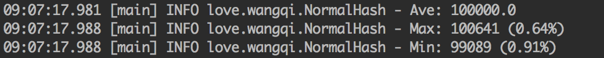
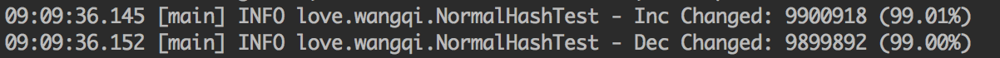
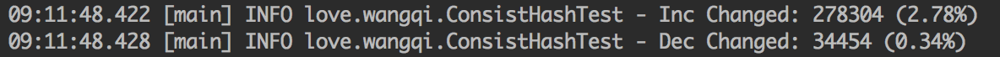
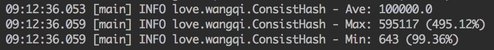
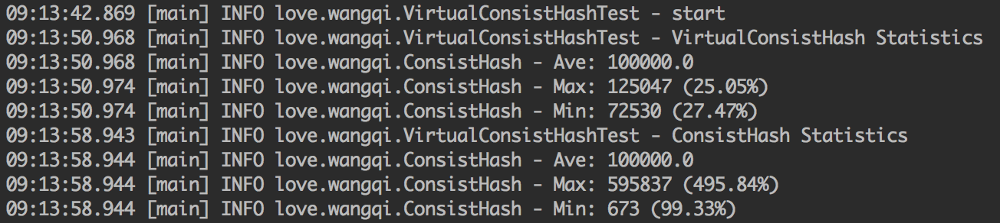
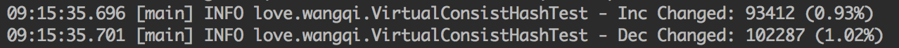

一致性哈希算法是一种特殊的哈希算法。在使用一致性哈希算法后，哈希表槽位数（大小）的改变平均只需要对K/n个关键字重新映射，其中K是关键字的数量，n是槽位数量，因为这个特性，一致性哈希经常用于分布式存储系统中。

<!-- more -->

假设有这样一个场景：有10亿条数据，需要放在N台机器上的缓存里，应该怎么设计一个规则将这些数据均衡的放在这些机器中。

# 普通哈希

一个简单的方法是对每条记录计算hash值，然后取模，即`hash(record) mod N`。

具体的实现如下：

```java
public interface Hash {
    /**
     * 初始化节点
     * @return
     */
    Hash initNodes();

    /**
     * 增加数据
     * @param data
     * @return
     */
    int add(String data);

    /**
     * 统计信息
     */
    void statistics();
}

public class NormalHash implements Hash {
    Logger logger = LoggerFactory.getLogger(NormalHash.class);

    class Node {
        List<String> list;

        public Node() {
            list = new ArrayList<>();
        }

        void add(String data) {
            list.add(data);
        }

        int size() {
            return list.size();
        }
    }

    private Node[] nodes;
    private int nodeSize;
    private int total;

    @Override
    public NormalHash initNodes() {
        for (int i = 0; i < nodes.length; i++) {
            nodes[i] = new Node();
        }
        return this;
    }

    public NormalHash(int nodeSize) {
        this.nodeSize = nodeSize;
        nodes = new Node[nodeSize];
    }

    @Override
    public int add(String data) {
        long h = KetamaHash.calculate(data);
        int index = (int) (h % nodeSize);
        nodes[index].add(data);
        total++;
        return index;
    }

    @Override
    public void statistics() {
        double ave = total / (nodeSize * 1.0);
        logger.info("Ave: {}", ave);
        int max = Integer.MIN_VALUE, min = Integer.MAX_VALUE;
        for (Node node : nodes) {
            int count = node.size();
            if (count > max) { max = count; }
            if (count < min) { min = count; }
        }
        logger.info("Max: {} ({})", max, String.format("%.2f%%", Math.abs(max - ave) / ave * 100));
        logger.info("Min: {} ({})", min, String.format("%.2f%%", Math.abs(min - ave) / ave * 100));
    }
}
```

通过以下代码来测试数据在节点上的分布情况：

```java
@Test
public void testDist() {
    int nodesSize = 100;
    final int SIZE = 100000;
    int[] nums = RandomNum.getRandomNum(SIZE * nodesSize);
    Hash normalHash = new NormalHash(nodesSize).initNodes();
    for (int num : nums) {
        normalHash.add(String.valueOf(num));
    }
    normalHash.statistics();
}
```



从上述结果可以看出，普通Hash算法能均匀地将这些数据项打散到节点上，分布数量最少的节点和最多的节点数据项数目相差不大，和平均值的差别在`1%`以内。

在Hash算法中，Hash函数的选择是重中之重，好的Hash函数可以保证将数据尽量平衡地分配到所有节点中，最大化地利用空间。

[一致性哈希算法之Ketama算法](http://codelog.me/2015-10-12/consistent-hash-ketama/)这篇文章中描述了一种叫Ketama的一致性哈希算法，一致性哈希算法下文讨论，里面使用了非常简单的Hash函数。其实就是经过计算数据的MD5值，然后取出其中的32位作为数据的Hash值。其实现可以参考：[KetamaHash](https://www.javatips.net/api/jdbc-shards-master/src/main/java/com/wplatform/ddal/dispatch/rule/KetamaHash.java)

普通Hash算法在平均性上来说做的足够好，但是由于该算法使用节点取余的方法，强依赖node的数目，因此，当node数发生变化的时候，数据所对应的node就会发生剧烈的变化，而发生变化的成本就是我们需要在node数发生变化的时候，数据需要迁移，这对存储产品来说显然不能忍，我们来测试一下增加或者减少node后，数据迁移的情况。

```java
@Test
public void testMigrate() {
    int nodesSize = 100;
    int nodesSizeInc = nodesSize + 1;
    int nodesSizeDec = nodesSize - 1;

    final int SIZE = 100000;

    Hash normalHash = new NormalHash(nodesSize).initNodes();
    Hash normalHashInc = new NormalHash(nodesSizeInc).initNodes();
    Hash normalHashDec = new NormalHash(nodesSizeDec).initNodes();

    int changedInc = 0, changedDec = 0;
    int[] nums = RandomNum.getRandomNum(SIZE * nodesSize);

    for (int num : nums) {
        int hashIndex = normalHash.add(String.valueOf(num));
        int hashIncIndex = normalHashInc.add(String.valueOf(num));
        int hashDecIndex = normalHashDec.add(String.valueOf(num));

        if (hashIndex != hashIncIndex) {
            changedInc++;
        }
        if (hashIndex != hashDecIndex) {
            changedDec++;
        }
    }

    logger.info("Inc Changed: {} ({})", changedInc, String.format("%.2f%%", changedInc / (1.0 * SIZE * nodesSize) * 100));
    logger.info("Dec Changed: {} ({})", changedDec, String.format("%.2f%%", changedDec / (1.0 * SIZE * nodesSize) * 100));
}
```



可以看到，不管是增加一个node还是减少一个node，都需要迁移`99%`的数据。

这样的代价显然是不能接受的，必须是对其进行改进。于是就发展出了一致性哈希算法

# 一致性哈希算法

简单来说，一致性哈希将整个哈希值空间组织成一个虚拟的圆环，如假设某哈希函数H的值空间为`0 - 2^32-1`（即哈希值是一个32位无符号整型），整个哈希空间环如下：


整个空间按顺时针方向组织。`0`和`2^32-1`在零点钟方向重合。

下一步将各个服务器使用哈希函数进行哈希，具体可以选择服务器的IP或主机名作为关键字进行哈希，这样每台机器就能确定其在哈希环上的位置，这里假设将三台服务器使用IP地址哈希后在环空间的位置如下：


接下来使用算法定位数据访问到相应服务器：将数据使用相同的哈希函数计算出哈希值，通过哈希值确定此数据在环上的位置，从此位置沿环顺时针“行走”，第一台遇到的服务器就是其应该定位到的服务器。

例如我们有A B C D四个数据对象，经过哈希计算后，在环空间上的位置如下：


根据一致性哈希算法，数据A会被定位到Server 1上，D被定位到Server 3上，而B、C分别被定为到Server 2上

下面分析一致性哈希算法的容错性和可扩展性。现假设Server 3宕机了：


可以看到此时A B C不会受到影响，只有D节点被重定位到Server 2。一般的，在一致性哈希算法中，如果一台服务器不可用，则受影响的数据仅仅是此服务器到其环空间中前一台服务器（即顺着逆时针方向行走遇到的第一台服务器）之间数据，其他不会受到影响。

下面考虑另一种情况，如果我们在系统中增加了一台服务器Server 4


此时A D C不受影响，只有B需要重定位到新的Server 4。一般的，在一致性哈希算法中，如果增加一台服务器，则受影响的数据仅仅是新服务器到其环空间中前一台服务器（即顺着逆时针方向行走遇到的第一台服务器）之间数据，其他不会受到影响。

一致性哈希的实现代码如下：

```java
public class ConsistHash implements Hash {
    Logger logger = LoggerFactory.getLogger(ConsistHash.class);

    class Node {
        private int index;
        private List<String> list;

        public Node(int index) {
            list = new ArrayList<>();
            this.index = index;
        }

        void add(String data) {
            list.add(data);
        }

        int size() {
            return list.size();
        }

        public int getIndex() {
            return index;
        }
    }

    TreeMap<Long, Node> hashNodeMap = new TreeMap<>();
    Long[] hashArray;
    int nodeSize;
    int total;

    public ConsistHash(int nodeSize) {
        this.nodeSize = nodeSize;
    }

    @Override
    public ConsistHash initNodes() {
        for (int i = 0; i < nodeSize; i++) {
            Long nodeHash = KetamaHash.calculate(i);
            Node node = new Node(i);
            hashNodeMap.put(nodeHash, node);
        }
        hashArray = new Long[hashNodeMap.size()];
        hashArray = hashNodeMap.keySet().toArray(hashArray);
        return this;
    }

    private Long findHash(Long dataHash, int left, int right) {
        int mid = (left + right) / 2;
        if (dataHash.equals(hashArray[mid])) {
            return hashArray[mid];
        }
        if (right - left == 1) {
            if (dataHash < hashArray[left]) {
                return hashArray[left];
            }
            if (dataHash > hashArray[left] && dataHash <= hashArray[right]) {
                return hashArray[right];
            }
            return null;
        }
        if (dataHash < hashArray[mid]) {
            return findHash(dataHash, left, mid);
        }
        if (dataHash > hashArray[mid]) {
            return findHash(dataHash, mid, right);
        }
        return null;
    }

    private Node getNode(Long dataHash) {
        Long hash = findHash(dataHash, 0, hashNodeMap.size() - 1);

        if (hash == null) {
            return hashNodeMap.firstEntry().getValue();
        }
        return hashNodeMap.get(hash);
    }

    @Override
    public int add(String data) {
        Long m = KetamaHash.calculate(data);
        Node node = getNode(m);
        node.add(data);
        total++;
        return node.getIndex();
    }

    @Override
    public void statistics() {
        double ave = total / (nodeSize * 1.0);
        logger.info("Ave: {}", ave);
        int max = Integer.MIN_VALUE, min = Integer.MAX_VALUE;
        for (Map.Entry<Long, Node> entry : hashNodeMap.entrySet()) {
            Node node = entry.getValue();
            int count = node.size();
            if (count > max) { max = count; }
            if (count < min) { min = count; }
        }
        logger.info("Max: {} ({})", max, String.format("%.2f%%", Math.abs(max - ave) / ave * 100));
        logger.info("Min: {} ({})", min, String.format("%.2f%%", Math.abs(min - ave) / ave * 100));
    }
}
```

通过下面的代码来测试一下增加或者减少node后，数据迁移的情况。

```java
@Test
public void testMigrate() {
    int nodesSize = 100;
    int nodesSizeInc = nodesSize + 1;
    int nodesSizeDec = nodesSize - 1;
    final int SIZE = 100000;

    Hash hash = new ConsistHash(nodesSize).initNodes();
    Hash hashInc = new ConsistHash(nodesSizeInc).initNodes();
    Hash hashDec = new ConsistHash(nodesSizeDec).initNodes();

    int changedInc = 0, changedDec = 0;
    int[] nums = RandomNum.getRandomNum(SIZE * nodesSize);

    for (int num : nums) {
        int hashIndex = hash.add(String.valueOf(num));
        int hashIncIndex = hashInc.add(String.valueOf(num));
        int hashDecIndex = hashDec.add(String.valueOf(num));

        if (hashIndex != hashIncIndex) {
            changedInc++;
        }
        if (hashIndex != hashDecIndex) {
            changedDec++;
        }
    }

    logger.info("Inc Changed: {} ({})", changedInc, String.format("%.2f%%", changedInc / (1.0 * SIZE * nodesSize) * 100));
    logger.info("Dec Changed: {} ({})", changedDec, String.format("%.2f%%", changedDec / (1.0 * SIZE * nodesSize) * 100));
}
```



可以看到，不管是增加一个node还是减少一个node，一致性哈希算法需要迁移的数据都不多，完全在可接受程度内。

我们再来测试一下一致性哈希算法的平衡性：

```java
@Test
public void testDist() {
    int nodesSize = 100;
    final int SIZE = 100000;
    int[] nums = RandomNum.getRandomNum(SIZE * nodesSize);
    Hash consistHash = new ConsistHash(nodesSize).initNodes();
    for (int num : nums) {
        consistHash.add(String.valueOf(num));
    }
    consistHash.statistics();
}
```

结果如下：



非常遗憾的是，虽然一致性算法在节点变动的情况下需要迁移的数据很少，但是它的数据分布却非常不平衡。主要原因是这100个节点Hash后，在环上分布不均匀，导致了每个节点实际上占据环上的区间大小不一致。如图所示：


# 虚拟节点

一致性哈希算法在服务节点太少时，容易因为节点分布不均匀而造成数据倾斜问题。如果我们有两台服务器，其环分布如下：


此时必然造成大量数据集中到Server 1上，而只有极少量会定位到Server 2。为了解决这种数据倾斜问题，一致性哈希算法引入了虚拟节点机制，即对每个服务节点计算多个哈希，每个计算结果位置都放置一个此服务节点，称为虚拟节点。例如上面的情况，我们可以为每台服务器计算三个虚拟节点，于是形成6个虚拟节点：


同时数据定位算法不变，只是多了一步虚拟节点到实际节点的映射。这样就解决了服务节点少时数据倾斜的问题。在实际应用中，通常将虚拟节点数设置为32设置更大，因此即使很少的服务节点也能做到相对均匀的数据分布。

加入虚节点的一致性哈希的实现代码如下：

```java
public class VirtualConsistHash extends ConsistHash {
    Logger logger = LoggerFactory.getLogger(VirtualConsistHash.class);

    private int virtualNodeSize;

    public VirtualConsistHash(int nodeSize, int virtualNodeSize) {
        super(nodeSize);
        this.virtualNodeSize = virtualNodeSize;
    }

    @Override
    public VirtualConsistHash initNodes() {
        for (int i = 0; i < nodeSize; i++) {
            Long nodeHash = KetamaHash.calculate(i);
            Node node = new Node(i);
            hashNodeMap.put(nodeHash, node);
            for (int j = 0; j < virtualNodeSize; j++) {
                Long virtualNodeHash = KetamaHash.calculate(i + "#" + j);
                hashNodeMap.put(virtualNodeHash, node);
            }
        }
        hashArray = new Long[hashNodeMap.size()];
        hashArray = hashNodeMap.keySet().toArray(hashArray);
        return this;
    }
}
```

下面比较带虚拟节点的一致性哈希和不带虚拟节点的一致性哈希的平衡性比较：

```java
@Test
public void testDist() {
    int nodesSize = 100;
    final int SIZE = 100000;

    int[] nums = RandomNum.getRandomNum(SIZE * nodesSize);
    logger.info("start");
    Hash virtualConsistHash = new VirtualConsistHash(nodesSize, 100).initNodes();
    for (int num : nums) {
        virtualConsistHash.add(String.valueOf(num));
    }
    logger.info("VirtualConsistHash Statistics");
    virtualConsistHash.statistics();

    Hash consistHash = new ConsistHash(nodesSize).initNodes();
    for (int num : nums) {
        consistHash.add(String.valueOf(num));
    }
    logger.info("ConsistHash Statistics");
    consistHash.statistics();
}
```

结果如下：



可以看到，其平衡性改善了很多

再来测试一下虚拟节点的加入对数据迁移的影响：

```java
@Test
public void testMigrate() {
    int nodesSize = 100;
    int nodesSizeInc = nodesSize + 1;
    int nodesSizeDec = nodesSize - 1;
    final int SIZE = 100000;

    Hash hash = new VirtualConsistHash(nodesSize, 100).initNodes();
    Hash hashInc = new VirtualConsistHash(nodesSizeInc, 100).initNodes();
    Hash hashDec = new VirtualConsistHash(nodesSizeDec, 100).initNodes();

    int changedInc = 0, changedDec = 0;
    int[] nums = RandomNum.getRandomNum(SIZE * nodesSize);

    for (int num : nums) {
        int hashIndex = hash.add(String.valueOf(num));
        int hashIncIndex = hashInc.add(String.valueOf(num));
        int hashDecIndex = hashDec.add(String.valueOf(num));

        if (hashIndex != hashIncIndex) {
            changedInc++;
        }
        if (hashIndex != hashDecIndex) {
            changedDec++;
        }
    }

    logger.info("Inc Changed: {} ({})", changedInc, String.format("%.2f%%", changedInc / (1.0 * SIZE * nodesSize) * 100));
    logger.info("Dec Changed: {} ({})", changedDec, String.format("%.2f%%", changedDec / (1.0 * SIZE * nodesSize) * 100));
}
```

结果如下：



可以看到，不管是增加一个node还是减少一个node，一致性哈希算法中加入虚拟节点对需要迁移的数据量影响不大。

本文代码详见：[https://github.com/wangqifox/consistent-hash-demo](https://github.com/wangqifox/consistent-hash-demo)


> https://yikun.github.io/2016/06/09/一致性哈希算法的理解与实践/
> https://blog.csdn.net/lihao21/article/details/54193868
> https://colobu.com/2015/04/13/consistent-hash-algorithm-in-java-memcached-client/
> https://juejin.im/entry/59f6e748518825299a4678b3
> http://codelog.me/2015-10-12/consistent-hash-ketama/
> http://blog.codinglabs.org/articles/consistent-hashing.html


