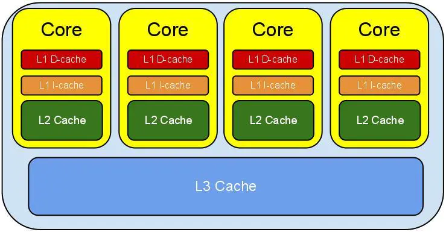
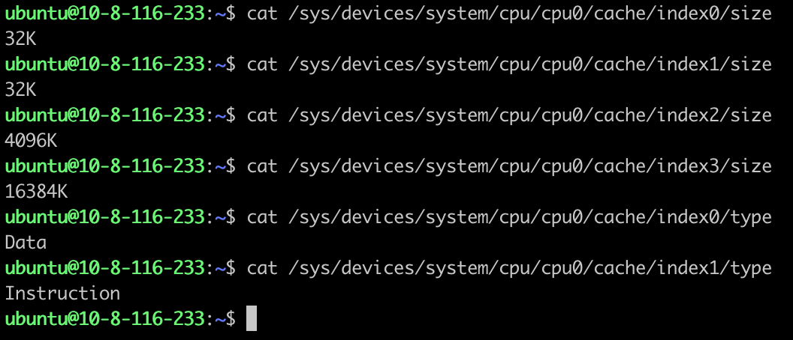
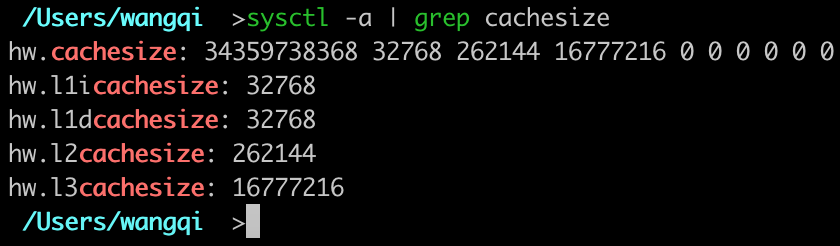
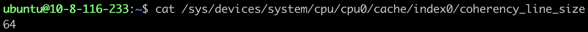
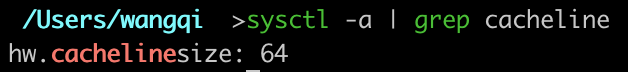
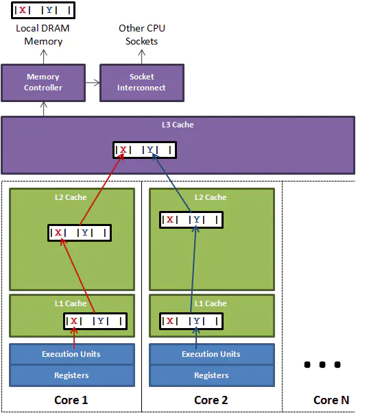

最近在整理学习Java队列类的时候接触到一个高性能的无锁队列`Disruptor`，在学习它的时候接触到一个新的概念——伪共享(`false sharing`)。

本文是对这一概念的学习整理。

<!-- more -->

伪缓存涉及到多个概念，下面一一说明。

# CPU缓存

CPU缓存的概念非常常见，即使对于非开发人员日常也会接触到。比如购买电脑时，我们会关注CPU的性能，其中有一项参数就是缓存大小。对于相同类型的CPU，规格越高，往往缓存大小也越大。下面是从网上找的一张对比图：


从计算机体系结构的角度看，存储系统是分为多个层级的。从上到下依次可以分为：寄存器、高速缓存(`Cache`)、主存储器、辅助存储器。这是因为存储设备总是遇到存储速度、存储容量、成本三个方面的矛盾，现实中不存在同时满足存储速度快、存储容量大、成本低三方面要求的存储设备。设计这种分层的存储结构，就可以充分利用不同存储设备的优点，规避缺点，在存储速度、存储容量、成本三方面取得一个平衡点。

CPU中的高速缓存是为了弥补主存储器访问速度慢的问题。现代CPU引入了3级缓存，结构如下图所示：



越靠近CPU的缓存容量越小但是速度越快，这也体现了存储速度、存储容量、成本三个方面的平衡。

- `L1 Cache`分为`D-Cache`和`I-Cache`，`D-Cache`用来存储数据，`I-Cache`用来存放指定，一般`L1 Cache`的大小是32K
- `L2 Cache`更大一些，例如256K，速度要慢一些，一般情况下每个核上都有一个独立的`L2 Cache`
- `L3 Cache`是三级缓存中最大的一级，同时也是最大的一级，在同一个CPU插槽之间的核共享一个`L3 Cache`

在Linux中可以通过以下命令查看CPU Cache:



这里的index0和index1对应`L1 D-Cache`和`L1 I-Cache`。

在Mac中可以通过以下命令查看CPU Cache:



当CPU需要取数据时，首先去`L1 Cache`找，命中则返回未命中则寻找`L2 Cache`，命中则返回未命中则寻找`L3 Cache`，命中则返回，如果还未命中就从内存中读取数据。

下面的列表展示了CPU读取各级缓存的时间：

|缓存层级|大约需要的CPU时钟周期|大约需要的时间|
|---|---|---|
|寄存器|1 cycle||
|L1 Cache|3~4 cycles|1 ns|
|L2 Cache|10 cycles|3 ns|
|L3 Cache|40~45 cycles|15 ns|
|主存||60~120 ns|

可见，CPU读取主存中的数据会比从`L1 Cache`中读取慢将近2个数量级。因此，在越高层次的缓存命中数据，则计算的性能越高。

为了提高缓存命中率，CPU读取数据并不是以单个数据为单位读取的，而是一次读取一块数据到缓存中。这样每次读取数据就把周围的数据也一起读到缓存中，根据程序的空间局部性原理，这样做可以显著提高数据中命中率。

这样读取的一块数据被保存在缓存行(`Cache Line`)中。

# 缓存行

缓存行是CPU存取缓存的最小单位，一般情况一行缓存行有64字节。

在Linux中可以通过以下命令查看缓存行的大小:



在Mac中可以通过以下命令查看缓存行的大小:



即使读取一个字节的数据，CPU也会把这个字节数据周围的64字节数据全部加载进缓存中。缓存行的存在是为了提高缓存的命中率，但是如果程序的设计出问题，则无法利用缓存行来提升数据的读取速度，大幅降低了程序的运行速度。

下面是一个很经典的示例：

```java
public class CacheLineEffect {
    public static void main(String[] args) {
        int runs = 100;
        int row = 1024 * 1024;
        int column = 6;

        long[][] arr = new long[row][];
        for (int i = 0; i < row; i++) {
            arr[i] = new long[column];
        }

        long sum = 0L;
        long start;

        start = System.currentTimeMillis();
        for (int l = 0; l < runs; l++) {
            for (int i = 0; i < row; i++) {
                for (int j = 0; j < column; j++) {
                    sum = arr[i][j];
                }
            }
        }
        System.out.println("run time: " + (System.currentTimeMillis() - start) + "ms");

        start = System.currentTimeMillis();
        for (int l = 0; l < runs; l++) {
            for (int i = 0; i < column; i++) {
                for (int j = 0; j < row; j++) {
                    sum = arr[j][i];
                }
            }
        }
        System.out.println("run time: " + (System.currentTimeMillis() - start) + "ms");
    }
}
```

程序以两种不同的方式来读取二维数组：一种是按行来读取，一种是按列来读取。程序运行结果如下：

```
run time: 802ms
run time: 2447ms
```

可以看到按行读取数据的方式要远远快于按列读取数据，这充分说明了良好的程序可以充分利用缓存行来加速程序的运行。原因如下：二维数组是一个存放数组的数组，第一维的数组就是一个存放数组引用的数组。示意图如下：


上图表示了下面的定义的二维数组：

```java
int[][] ns = new int[][]{
        {1, 2, 3, 4},
        {5, 6, 7, 8},
        {9, 10, 11, 12}
};
```

每一行的数据是排列在一起的，当加载一个数据，相邻的一行数据会被加载到缓存中，这样读取下一个数据时会命中缓存。

而每一列的数据在空间上就不是存放在一起的，当加载一个数据时，相邻的一行数据会被加载到缓存中，读取一列的下一个数据时这一行的数据全部不命中，CPU只好去加载下一行的数据。这样一来按列读取数据的缓存命中率就极低。

# 伪共享

伪共享的发生也是因为缓存行的存在，但是它的发生比上面的例子要隐蔽的多。

下图展示了伪共享是如何发生的：



假设我们有两个线程操作同一个对象的不同成员变量，如上图所示，一个运行在处理器core1上的线程想要更新变量`x`，同时另外一个运行在处理器core2上的线程想要更新变量`y`。这两个变量由于处于同一个缓存行，线程对一个变量的修改会导致整行的数据失效，另外一个线程不得不从`L3 Cache`中重新加载数据。看起来两个线程是在互不影响地操作两个变量，但是因为它们共享了一个缓存行，因此两个线程会发生激烈的冲突。

下面的代码模拟了这种情况：

```java
public class NodeNoPadding {
    public volatile long x;
    public volatile long y;
}

public class Main {
    public static void main(String[] args) throws InterruptedException {
        NodeNoPadding node = new NodeNoPadding();
        Thread thread1 = new Thread(() -> {
            for (int j = 0; j < 20000; j++) {
                for (int i = 0; i < 10000; i++) {
                    node.x = i;
                }
            }
        });

        Thread thread2 = new Thread(() -> {
            for (int j = 0; j < 20000; j++) {
                for (int i = 0; i < 10000; i++) {
                    node.y = i;
                }
            }
        });

        long start = System.currentTimeMillis();
        thread1.start();
        thread2.start();
        thread1.join();
        thread2.join();
        long end = System.currentTimeMillis();

        System.out.println("cost: " + (end - start));
    }
}
```

运行结果为:

```
cost: 4059
```

如何避免伪共享呢？答案是**缓存行填充(Padding)**。我们知道一个缓存行有64字节，一个long类型变量占用8字节，我们只需要在`x`和`y`变量之间填充8个long类型的变量，让`x`和`y`变量处于不同的缓存行，就避免了伪共享。如下所示：

```java
public class NodePadding {
    public volatile long x;
    public long p1, p2, p3, p4, p5, p6, p7;
    public volatile long y;
}
```

将`NodeNoPadding`替换成`NodePadding`再次运行，结果为：

```
cost: 994
```

可以看到，在避免了伪共享之后，性能得到了成倍的提高。

除了手动填充若干个变量外，Java8中还提供了`@sun.misc.Contended`注解，JVM会在使用此注解的对象或者变量前后各增加**128字节**大小的padding，使用2倍于大多数硬件缓存行大小的填充来避免伪共享冲突。

修改一下`NodePadding`：

```java
public class NodePadding {
    @Contended
    public volatile long x;
    @Contended
    public volatile long y;
}
```

运行时需要设置JVM启动参数`-XX:-RestrictContended`。再次运行程序，结果为：

```
cost: 989
```

说明使用`@sun.misc.Contended`注解也避免了伪共享的发生。

来验证一下`Contended`的原理:

使用[http://www.javamex.com/](http://www.javamex.com/)中提供的[classmexer](http://www.javamex.com/classmexer/classmexer-0_03.zip)来计算对象的大小：

```java
public class Node1 {
    public volatile long x;
}

public class Node2 {
    @Contended
    public volatile long x;
}

/**
 * VM options:
 * -javaagent:/Users/wangqi/Downloads/classmexer-0_03/classmexer.jar -XX:-RestrictContended
 */
public class TestNodeSize {
    public static void main(String[] args) {
        Node1 node1 = new Node1();
        System.out.println("Shallow Size: " + MemoryUtil.memoryUsageOf(node1) + " bytes");
        System.out.println("Retained Size: " + MemoryUtil.deepMemoryUsageOf(node1) + " bytes");

        Node2 node2 = new Node2();
        System.out.println("Shallow Size: " + MemoryUtil.memoryUsageOf(node2) + " bytes");
        System.out.println("Retained Size: " + MemoryUtil.deepMemoryUsageOf(node2) + " bytes");
    }
}
```

在运行前需要设置`javaagent`参数，在JVM启动参数中添加`-javaagent:/path_to_agent/classmexer.jar`来运行。运行结果为：

```
Shallow Size: 24 bytes
Retained Size: 24 bytes
Shallow Size: 280 bytes
Retained Size: 280 bytes
```

有关Shallow Size和Retained Size请参考：[http://blog.csdn.net/e5945/article/details/7708253](http://blog.csdn.net/e5945/article/details/7708253)

可以看到，`@Contended`注解在变量前后各增加128字节大小的padding，因此对象的大小扩大了256字节。


> https://www.jianshu.com/p/c3c108c3dcfd
> https://www.jianshu.com/p/900554f11881
> https://www.jianshu.com/p/91e398d5d17c
> https://www.cnblogs.com/cyfonly/p/5800758.html
> https://www.cnblogs.com/zhanjindong/p/3757767.html
> https://www.cnblogs.com/techyc/p/3625701.html
> https://blog.csdn.net/e5945/article/details/7708253
> https://www.liaoxuefeng.com/wiki/1252599548343744/1259544232593792
