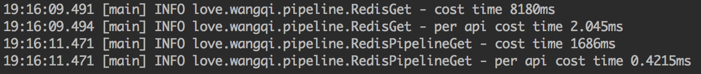

在我们后端开发中，经常使用redis作为缓存。常见的redis使用场景一般是这样的：使用sorted set存储有序列表，key存储的是数据的id，score作为列表的排序依据；使用字符串存储详细数据的json，key存储的是数据的id。这样我们就可以通过redis获得列表数据的id值，然后使用id去redis中获取数据的详细值。

在这样的使用方式下，每一次的接口请求都需要几十次的redis请求。因为redis占用了连接池资源并且存在固定的网络传输消耗，在读多写少的场景下，大量的redis请求造成的性能损失还是相当可观的。

为了减少的redis访问次数，提升效率，我们需要借助redis的pipeline功能。

<!-- more -->

## pipeline使用

redis本身是基于Request/Response协议的，正常情况下，客户端发送一个命令，等待redis应答，redis在接收到命令，处理后应答。在这种情况下，如果同时需要执行大量的命令，那就需要等待上一条命令应答后再执行，这中间不仅仅多了RTT（Round Time Trip，传播时延(往返)+排队时延(路由器和交换机)+数据处理时延(应用程序)），而且还频繁地调用系统IO，发送网络请求。

pipeline允许客户端可以一次发送多条命令，而不等待上一条命令执行的结果，这和网络的Nagel算法有点像（TCP_NODELAY选项）。不仅减少了RTT，同时也减少了IO调用次数（IO调用涉及到用户态到内核态之间的切换）。

pipeline需要客户端的支持，本文我们以Jedis客户端为例来说明使用pipeline批量获取数据：

```java
// 连接redis
Jedis jedis = new Jedis();
// 使用pipeline方式批量获取数据，只能获取到value值，对应的key获取不到，我们通过一个中间的map来获取key
Map<String, Response<String>> responseMap = new HashMap<>();
jedis.select(1);
Pipeline pipelined = jedis.pipelined();

List<String> keys = new ArrayList<>();
String keyPrefix = "comment_";

for (int i = 0; i < 20; i++) {
    keys.add(keyPrefix + i);
}

for (String key : keys) {
    responseMap.put(key, pipelined.get(key));
}
// 执行sync命令批量发送请求并执行
pipelined.sync();
jedis.close();

// 获取结果数据
for (String key : keys) {
    String json = responseMap.get(key).get();
}
```

## pipeline性能测试

测试抽象类:

```java
public abstract class AbstractRedis {
    private final Pool<Jedis> pool;
    private final Logger logger = LoggerFactory.getLogger(getClass());

    public AbstractRedis() {
        int maxTotal = 1000;
        int maxIdle = 800;
        int minIdle = 500;
        int timeOut = 10000;
        String host = "xx.xx.xx.xx";
        int port = 6379;
        String password = "********";

        JedisPoolConfig config = new JedisPoolConfig();
        config.setMaxIdle(maxIdle);
        config.setMinIdle(minIdle);
        config.setMaxTotal(maxTotal);

        pool = new JedisPool(config, host, port, timeOut, password);
    }

    public Pool<Jedis> getPool() {
        return pool;
    }

    public void close() {
        pool.close();
    }

    public void performanceTest() {
        long start, end;
        start = System.currentTimeMillis();
        int threadCount = 400;
        int loop = 10;

        List<Thread> threadList = new ArrayList<>();
        for (int i = 0; i < threadCount; i++) {
            Thread thread = new Thread(() -> {
                for (int i1 = 0; i1 < loop; i1++) {
                    action();
                }
            });
            threadList.add(thread);
        }
        for (Thread thread : threadList) {
            thread.start();
        }
        for (Thread thread : threadList) {
            try {
                thread.join();
            } catch (InterruptedException e) {
                e.printStackTrace();
            }
        }

        end = System.currentTimeMillis();
        logger.info("cost time {}ms", (end - start));
        logger.info("per api cost time {}ms", (end - start) / (1.0 * threadCount * loop));
    }

    protected abstract void action();
}
```

获取数据的普通方式：

```java
public class RedisGet extends AbstractRedis {
    private static final Logger logger = LoggerFactory.getLogger(RedisGet.class);

    public void get() {
        Pool<Jedis> pool = getPool();
        try(Jedis jedis = pool.getResource()) {
            jedis.select(1);

            for (int i = 0; i < 20; i++) {
                String key = "comment_" + i;
                String json = jedis.get(key);
            }
        }
    }

    @Override
    protected void action() {
        get();
    }
}
```

获取数据的pipeline方式：

```java
public class RedisPipelineGet extends AbstractRedis {
    private static final Logger logger = LoggerFactory.getLogger(RedisPipelineGet.class);

    public void get() {
        Map<String, Response<String>> responseMap = new HashMap<>();

        Pool<Jedis> pool = getPool();
        try(Jedis jedis = pool.getResource()) {
            jedis.select(1);
            Pipeline pipelined = jedis.pipelined();

            List<String> keys = new ArrayList<>();

            for (int i = 0; i < 20; i++) {
                keys.add("comment_" + i);
            }

            for (String key : keys) {
                responseMap.put(key, pipelined.get(key));
            }
            pipelined.sync();

            for (String key : keys) {
                String json = responseMap.get(key).get();
            }
        }
    }

    @Override
    protected void action() {
        get();
    }
}
```

性能测试代码：

```java
public class PerformanceTest {
    public static void main(String[] args) {
        RedisGet redisGet = new RedisGet();
        redisGet.performanceTest();
        redisGet.close();

        RedisPipelineGet redisPipelineGet = new RedisPipelineGet();
        redisPipelineGet.performanceTest();
        redisPipelineGet.close();
    }
}
```

性能测试执行结果如下：



可以看到，每20次的请求，普通方式要比pipeline方式耗费的时间多出4.8倍。pipeline对于qps的提升是非常大的。

## pipeline使用的注意点

需要注意的是，`pipelined.sync()`执行之前不能使用`jedis`执行普通命令。如果`jedis`是从Pool中获取的，在`pipelined.sync()`执行之前不能提早将`jedis`归还，否则在并发状态下其他线程会取得`jedis`执行其他命令。

## 总结

虽然redis是一个性能强大的缓存服务，但是在使用的过程中仍然有性能提示的空间。


> https://juejin.im/post/5a31e9f66fb9a0451238f610
> https://blog.csdn.net/HG_Harvey/article/details/80082090
> https://www.cnblogs.com/jabnih/p/7157921.html
> https://www.zhihu.com/question/39244840

