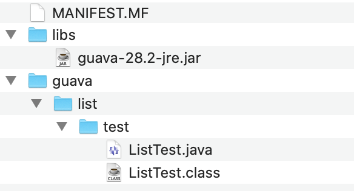
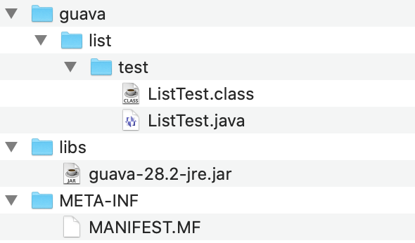
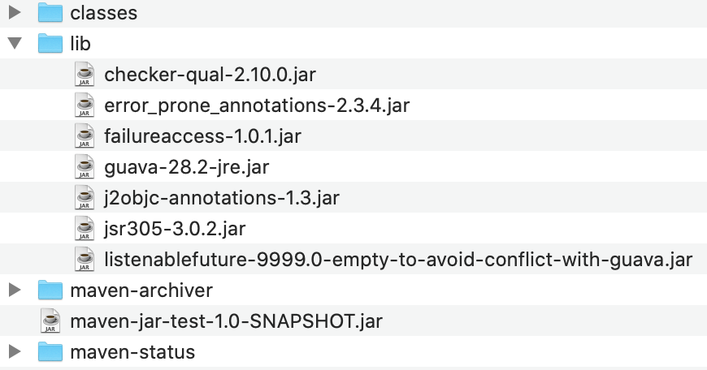
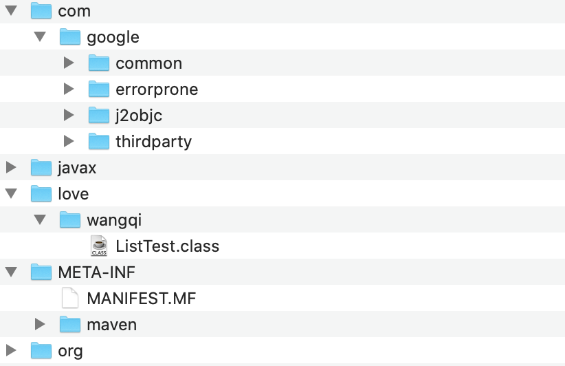
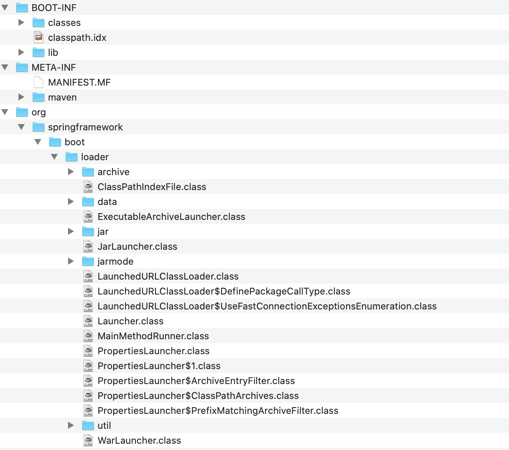

我们在平时的工作中，不管是对于一个普通的Java工程还是一个SpringBoot工程，都会将这些工程打包成一个可执行的jar包，然后就可以利用`java -jar xxx.jar`命令来运行可执行jar包。

本文是对如何生成一个可执行jar包、以及可执行jar包背后原理的一个学习探索和整理。

<!-- more -->

# `java -jar xxx.jar`命令的原理

当我们在命令行执行`java -jar xxx.jar`命令时，Java虚拟机会加载我们的jar包，虚拟机中的app类加载器会获取jar包中的`META-INF/MANIFEST.MF`文件，该文件中列出了该可执行jar包的入口程序、依赖的jar包、版本号等。

## 手动创建一个可执行jar包

知道了这个原理，我们可以手动创建一个可执行jar包。

首先创建一个简单的类：

```java
package guava.list.test;

import com.google.common.collect.Lists;

import java.util.ArrayList;

public class ListTest {
    public static void main(String[] args) {
        ArrayList<Integer> list = Lists.newArrayList(1, 2, 3);
        System.out.println(list);
    }
}
```

为了测试可执行jar包对第三方jar包的依赖，我们这个类依赖`guava`库。使用`javac`命令编译该文件：

```
javac -cp libs/* guava/list/test/ListTest.java
```

其中`libs`目录中存放guava的jar包。

接下来创建一个`MANIFEST.MF`文件，内容如下：

```
Manifest-Version: 1.0
Main-Class: guava.list.test.ListTest
Class-Path: libs/guava-28.2-jre.jar
```

各字段的含义如下：

- `Manifest-Version`：清单文件的版本，默认为`1.0`
- `Main-Class`：程序的入口，即main函数所在的类
- `Class-Path`：可执行jar包依赖的包的路径

此时目录结构如下：




最后使用`jar`命令来生成可执行jar包：

```
jar -cvfm jartest.jar MANIFEST.MF guava libs
```

`jar`是jdk自带的命令，各个参数的含义如下：

- `c`：创建新档案
- `v`：在标准输出中输出详细信息
- `f`：指定档案文件名
- `m`：指定清单文件，也就是指定我们的`MANIFEST.MF`。如果没有这个参数，会生成一个默认的`MANIFEST.MF`文件。
- `jartest.jar`：指定生成jar包的名称
- `MANIFEST.MF`：指定清单文件
- `guava libs`：指定要打包的文件

最后输出一个可执行jar包：`jartest.jar`。

这样就可以运行这个可执行jar包：

```
> java -jar jartest.jar
[1, 2, 3]
```

解压`jartest.jar`来查看目录结构:



发现jar命令根据`MANIFEST.MF`文件的描述，将我们自己的类、第三方依赖类都打包进了这个可执行jar包，并且新建了一个`META-INF`目录来存放`MANIFEST.MF`文件。

# maven生成普通的可执行jar包

日常开发中，我们不会手动维护依赖包更不会手动编写`MANIFEST.MF`描述文件，而是会使用maven这样的工具来维护我们的整个工程。

使用maven来生成可以执行的jar包原理上和上文所说的手动创建一个可执行jar包是一样的：

1. 需要一个`META-INF/MANIFEST.MF`文件来指定入口函数，以及依赖包的位置
2. 能够在指定依赖包的位置找到依赖包

如果直接使用`mvn package`命令来对项目进行打包，是无法生成一个可执行jar包的。原因就是这样生成的jar包，`META-INF/MANIFEST.MF`文件中没有指定`Main-Class`以及`Class-Path`，因此java虚拟机在加载jar包后找不到入口函数以及依赖的包。

我们需要使用maven插件来生成可执行的jar包。有以下几种方法：

## 使用maven-jar-plugin和maven-dependency-plugin插件

在`pom.xml`中配置：

```xml
<build>
  <plugins>
    <plugin>
      <groupId>org.apache.maven.plugins</groupId>
      <artifactId>maven-jar-plugin</artifactId>
      <version>3.1.2</version>
      <configuration>
        <archive>
          <manifest>
            <addClasspath>true</addClasspath>
            <classpathPrefix>lib/</classpathPrefix>
            <mainClass>love.wangqi.ListTest</mainClass>
          </manifest>
        </archive>
      </configuration>
    </plugin>
    <plugin>
      <groupId>org.apache.maven.plugins</groupId>
      <artifactId>maven-dependency-plugin</artifactId>
      <version>3.1.1</version>
      <executions>
        <execution>
          <id>copy-dependencies</id>
          <phase>package</phase>
          <goals>
            <goal>copy-dependencies</goal>
          </goals>
          <configuration>
            <outputDirectory>${project.build.directory}/lib</outputDirectory>
          </configuration>
        </execution>
      </executions>
    </plugin>
  </plugins>
</build>
```

`maven-jar-plugin`插件用于生成`META-INF/MANIFEST.MF`文件的部分内容。`<mainClass>love.wangqi.ListTest</mainClass>`指定`MANIFEST.MF`中的`Main-Class`，`<addClasspath>true</addClasspath>`会在`MANIFEST.MF`加上`Class-Path`项并配置依赖包，`<classpathPrefix>lib/</classpathPrefix>`指定依赖包所在的目录。

下面就是我的工程生成的`MANIFEST.MF`文件内容：

```
Manifest-Version: 1.0
Class-Path: lib/guava-28.2-jre.jar lib/failureaccess-1.0.1.jar lib/lis
 tenablefuture-9999.0-empty-to-avoid-conflict-with-guava.jar lib/jsr30
 5-3.0.2.jar lib/checker-qual-2.10.0.jar lib/error_prone_annotations-2
 .3.4.jar lib/j2objc-annotations-1.3.jar
Build-Jdk-Spec: 1.8
Created-By: Maven Archiver 3.4.0
Main-Class: love.wangqi.ListTest
```

只生成`MANIFEST.MF`文件还不够，`maven-dependency-plugin`插件用于将依赖包拷贝到`<outputDirectory>${project.build.directory}/lib</outputDirectory>`指定的位置，即`lib`目录下。

配置完成后，使用`mvn package`命令会在`target`目录下生成可执行的jar包，并将依赖包拷贝到`target/lib`目录下，目录结构如下：



可以看到，所以依赖的包（包括`guava`以及`guava`本身依赖的包）都被拷贝到了`lib`目录下。有了入口函数以及依赖包，我们就可以通过`java -jar xxx.jar`命令来运行jar包了。

这种方式生成的jar包有个缺点，就是依赖包是单独存放的，这样不便于管理。

## 使用maven-assembly-plugin插件

在`pom.xml`中配置：

```xml
<build>
  <plugins>
    <plugin>
      <groupId>org.apache.maven.plugins</groupId>
      <artifactId>maven-assembly-plugin</artifactId>
      <version>3.1.1</version>
      <configuration>
        <archive>
          <manifest>
            <mainClass>love.wangqi.ListTest</mainClass>
          </manifest>
        </archive>
        <descriptorRefs>
          <descriptorRef>jar-with-dependencies</descriptorRef>
        </descriptorRefs>
      </configuration>
    </plugin>
  </plugins>
</build>
```

配置后可以使用`mvn package assembly:single`命令来生成可执行jar包。

命令执行后，会在`target`目录下生成两个jar包：一个是普通的`xxx.jar`，另一个是`xxx-jar-with-dependencies.jar`文件，这个文件不但包含了自己项目中的代码和资源，还包含了所有依赖包的内容。所以可以直接通过`java -jar`命令来运行。

它的`MANIFEST.MF`文件内容如下：

```
Manifest-Version: 1.0
Built-By: wangqi
Created-By: Apache Maven 3.6.3
Build-Jdk: 1.8.0_211
Main-Class: love.wangqi.ListTest
```

可以看到，`MANIFEST.MF`文件指定了`Main-Class`，并没有指定`Class-Path`。原因我们查看jar包的目录结构可知：



可以看到，`maven-assembly-plugin`插件并不是打包依赖的第三方jar包，而是将所有依赖的class文件打包进这个单一的jar包。

加上以下配置，就可以直接使用`mvn package`来打包，无需使用`assembly:single`。

```
<build>
  <plugins>
    <plugin>
      <groupId>org.apache.maven.plugins</groupId>
      <artifactId>maven-assembly-plugin</artifactId>
      <version>3.1.1</version>
      <configuration>
        <archive>
          <manifest>
            <mainClass>love.wangqi.ListTest</mainClass>
          </manifest>
        </archive>
        <descriptorRefs>
          <descriptorRef>jar-with-dependencies</descriptorRef>
        </descriptorRefs>
      </configuration>
      <executions>
        <execution>
          <id>make-assembly</id>
          <phase>package</phase>
          <goals>
            <goal>single</goal>
          </goals>
        </execution>
      </executions>
    </plugin>
  </plugins>
</build>
```

其中`<phase>package</phase>`、`<goal>single</goal>`表示在执行`package`打包时，执行`assembly:single`。

## 使用maven-shade-plugin插件

在`pom.xml`中配置：

```xml
<build>
  <plugins>
    <plugin>
      <groupId>org.apache.maven.plugins</groupId>
      <artifactId>maven-shade-plugin</artifactId>
      <version>2.4.1</version>
      <executions>
        <execution>
          <phase>package</phase>
          <goals>
            <goal>shade</goal>
          </goals>
          <configuration>
            <transformers>
              <transformer implementation="org.apache.maven.plugins.shade.resource.ManifestResourceTransformer">
                <mainClass>love.wangqi.ListTest</mainClass>
              </transformer>
            </transformers>
          </configuration>
        </execution>
      </executions>
    </plugin>
  </plugins>
</build>
```

配置后可以使用`mvn package`命令来生成可执行jar包。

命令执行后，会在`target`目录下生成两个jar包：一个是普通的`original-xxx.jar`，另一个是`xxx.jar`文件。其中`original-xxx.jar`是不包含依赖的原始文件，`xxx.jar`是包含了依赖以及程序入口的可执行jar包。

`maven-shade-plugin`插件与`maven-assembly-plugin`插件一样，也是将第三方依赖的class文件打包进这个独立的jar包中，所以这个jar包可以独立运行。

# maven生成SpringBoot项目的可执行jar包

SpringBoot项目与普通的java项目是不一样的，它无法使用前面说的这几种maven插件来生成可执行jar包，而是需要引入`spring-boot-maven-plugin`插件来打包：

```xml
<build>
    <plugins>
        <plugin>
            <groupId>org.springframework.boot</groupId>
            <artifactId>spring-boot-maven-plugin</artifactId>
        </plugin>
    </plugins>
</build>
```

打包之后可执行jar包的目录结构如下：



其中`MANIFEST.MF`内容如下：

```
Manifest-Version: 1.0
Spring-Boot-Classpath-Index: BOOT-INF/classpath.idx
Implementation-Title: springboot-jar-test
Implementation-Version: 0.0.1-SNAPSHOT
Start-Class: love.wangqi.SpringbootJarTestApplication
Spring-Boot-Classes: BOOT-INF/classes/
Spring-Boot-Lib: BOOT-INF/lib/
Build-Jdk-Spec: 1.8
Spring-Boot-Version: 2.3.3.RELEASE
Created-By: Maven Jar Plugin 3.2.0
Main-Class: org.springframework.boot.loader.JarLauncher
```

我们发现与普通Java工程不一样的是，SpringBoot生成的可执行jar包指定的`Main-Class`并不是我们在程序中`main`函数所在类，而是名为`org.springframework.boot.loader.JarLauncher`的类。当我们使用`java -jar`执行jar包时，调用的是`JarLauncher`类的main方法。

`JarLauncher`类位于`org.springframework.boot.loader`的package中，这个package在打包时由`spring-boot-maven-plugin`插件追加进jar包。Spring Boot Loader是SpringBoot提供的一个工具，用于执行SpringBoot打包出来的jar包。

## JarLauncher的执行原理

Springboot设计了多个`Launcher`用于启动不同类型的程序，分别是：

- JarLauncher：用于加载并执行jar包
- WarLauncher：用于加载并执行war包
- PropertiesLauncher：PropertiesLauncher可以通过配置`loader.path`去加载外部的jar包

以当前程序使用的JarLauncher的为例：

```java
protected void launch(String[] args) throws Exception {
    JarFile.registerUrlProtocolHandler();
    ClassLoader classLoader = createClassLoader(getClassPathArchives());
    launch(args, getMainClass(), classLoader);
}
```

其执行的主流程如下：

1. 注册一个处理自定义URL的jar协议
2. 为执行指定`archive`的类加载器
3. 调用`Start-Classs`中指定类中的`main`方法

### 处理自定义URL的jar协议

```java
public static void registerUrlProtocolHandler() {
    String handlers = System.getProperty(PROTOCOL_HANDLER, "");
    System.setProperty(PROTOCOL_HANDLER,
            ("".equals(handlers) ? HANDLERS_PACKAGE : handlers + "|" + HANDLERS_PACKAGE));
    resetCachedUrlHandlers();
}
```

为什么Springboot需要自定义jar包的处理协议？

在JDK里面，jar资源的分隔符是`!/`，但是JDK中只支持一个`!/`，这无法满足Springboot的需求。因此Springboot扩展了`java.util.jar.JarFile`即`org.springframework.boot.loader.jar.JarFile`，它支持多个`!/`，表示jar文件嵌套jar文件、jar文件嵌套目录。文件的url如下所示：

```
jar:file:/Users/wangqi/IdeaProjects/springboot-jar-test/target/springboot-jar-test-0.0.1-SNAPSHOT.jar!/BOOT-INF/classes!/
jar:file:/Users/wangqi/IdeaProjects/springboot-jar-test/target/springboot-jar-test-0.0.1-SNAPSHOT.jar!/BOOT-INF/lib/spring-boot-starter-web-2.3.3.RELEASE.jar!/
jar:file:/Users/wangqi/IdeaProjects/springboot-jar-test/target/springboot-jar-test-0.0.1-SNAPSHOT.jar!/BOOT-INF/lib/spring-boot-starter-2.3.3.RELEASE.jar!/
jar:file:/Users/wangqi/IdeaProjects/springboot-jar-test/target/springboot-jar-test-0.0.1-SNAPSHOT.jar!/BOOT-INF/lib/spring-boot-2.3.3.RELEASE.jar!/
jar:file:/Users/wangqi/IdeaProjects/springboot-jar-test/target/springboot-jar-test-0.0.1-SNAPSHOT.jar!/BOOT-INF/lib/spring-boot-autoconfigure-2.3.3.RELEASE.jar!/
jar:file:/Users/wangqi/IdeaProjects/springboot-jar-test/target/springboot-jar-test-0.0.1-SNAPSHOT.jar!/BOOT-INF/lib/spring-boot-starter-logging-2.3.3.RELEASE.jar!/
...
```

这是因为Springboot重新扩展了jar文件的协议，因此需要自定义一个jar文件协议的处理器。

通过将包名`org.springframework.boot.loader`追加到系统属性`java.protocol.handler.pkgs`中，来定义jar文件的处理器：`org.springframework.boot.loader.jar.Handler`。

Springboot还定义了一个`org.springframework.boot.loader.archive.Archive`类来定义资源统一访问的接口。比如`getUrl`方法获取资源的url，`getManifest`获取资源的MANIFEST文件，`getNestedArchives`方法获取内部的嵌套资源。还在`Archive`内部定义了一个`Entry`接口，用于表示`Archive`内部的子资源。

`Archive`有两个实现：`JarFileArchive`、`ExplodedArchive`，分别表示jar文件，文件目录。

### 类加载器

Springboot自定义了一个类加载器：`LaunchedURLClassLoader`，这是为什么？

我们知道，java中的类加载器遵循双亲委派机制，从上到下依次为`Bootstrap ClassLoader`（启动类加载器）、`Extension ClassLoader`（扩展类加载器）、`Application ClassLoader`（应用程序类加载器）以及自定义的类加载器。如果一个类加载器收到了类加载的请求，它首先不会自己去尝试加载这个类，而是把这个请求委派给父类加载器去完成，每一个层次的类加载器都是如此，因此所有的加载请求最终都应该传送到顶层的启动类加载器中，只有当父加载器反馈自己无法完成这个加载请求（它的搜索范围中没有找到所需的类）时，子加载器才会尝试自己去加载。

但是因为Springboot打出的jar包依赖的各个第三方jar文件，并不在自己的`classpath`下，它们存放在jar包的`BOOT-INF/lib`目录下，如果采用双亲委派机制的话，获取不到这些依赖。因此需要破坏双亲委派机制，使用自定义的类加载器。

在`LaunchedURLClassLoader`创建之前，会先调用`getClassPathArchives`方法获得所有依赖资源来组成`classpath`。资源过滤遵循以下规则：

```java
protected boolean isNestedArchive(Archive.Entry entry) {
    if (entry.isDirectory()) {
        return entry.getName().equals(BOOT_INF_CLASSES);
    }
    return entry.getName().startsWith(BOOT_INF_LIB);
}
```

即位于`BOOT-INF/classes/`和`BOOT-INF/lib/`的class文件以及jar包。

接着将这个资源列表传递给`LaunchedURLClassLoader`。

Springboot使用这个自定义的`LaunchedURLClassLoader`类加载器来执行后续的程序。当需要加载新的类时，`LaunchedURLClassLoader`就能找到指定的位置去加载类。

`LaunchedURLClassLoader`重写了`loadClass`方法，因此jvm会调用该方法来加载类。`loadClass`的执行主要分成两步：

第一步，调用`definePackageIfNecessary(String className)`方法来定义指定类所在的package。`definePackageIfNecessary`方法的关键代码如下：

```java
String packageEntryName = packageName.replace('.', '/') + "/";
String classEntryName = className.replace('.', '/') + ".class";
for (URL url : getURLs()) {
    try {
        URLConnection connection = url.openConnection();
        if (connection instanceof JarURLConnection) {
            JarFile jarFile = ((JarURLConnection) connection).getJarFile();
            if (jarFile.getEntry(classEntryName) != null && jarFile.getEntry(packageEntryName) != null
                    && jarFile.getManifest() != null) {
                definePackage(packageName, jarFile.getManifest(), url);
                return null;
            }
        }
    }
    catch (IOException ex) {
        // Ignore
    }
}
```

遍历`LaunchedURLClassLoader`中保存的所有目录以及jar包，这些资源是前面调用`getClassPathArchives`方法获取得来的，如果发现这些资源中有存在指定的类，则调用`definePackage`方法保存`packageName`与资源`url`的对应关系，确保jar包与相应的package相关联。

第二步，调用`super.loadClass()`方法来加载指定的类。

这一步是正常的双亲委派机制的流程。类加载器首先调用上层类加载器的`loadClass`方法来尝试加载类，按`LaunchedURLClassLoader`->`AppClassLoader`->`ExtClassLoader`->`BootstrapClassLoader`的顺序依次调用。

上层的类加载器无法加载到jar包中的资源，于是从上往下按`BootstrapClassLoader`->`ExtClassLoader`->`AppClassLoader`->`LaunchedURLClassLoader`的顺序调用下层`findClass`方法。

直到调用`LaunchedURLClassLoader`父类`URLClassLoader`的`findClass`方法，主要代码如下：

```java
String path = name.replace('.', '/').concat(".class");
Resource res = ucp.getResource(path, false);
if (res != null) {
    try {
        return defineClass(name, res);
    } catch (IOException e) {
        throw new ClassNotFoundException(name, e);
    }
} else {
    return null;
}
```

第一步，将类名解析成路径并加上`.class`后缀。

第二步，根据之前注册的资源列表找到指定类所在的资源。关键代码是`Resource res = ucp.getResource(path, false);`。`ucp`是`URLClassPath`实例，里面保存了之前注册的资源列表，遍历该列表并找到指定类所对应的资源url。比如类`org/springframework/boot/SpringApplication.class`对应的资源url为`jar:file:/Users/wangqi/IdeaProjects/springboot-jar-test/target/springboot-jar-test-0.0.1-SNAPSHOT.jar!/BOOT-INF/lib/spring-boot-2.3.3.RELEASE.jar!/org/springframework/boot/SpringApplication.class`。

第三步，最终根据类名以及对应的资源url调用`defineClass`方法完成类的加载并返回。

### 执行main方法

```java
protected String getMainClass() throws Exception {
    Manifest manifest = this.archive.getManifest();
    String mainClass = null;
    if (manifest != null) {
        mainClass = manifest.getMainAttributes().getValue("Start-Class");
    }
    if (mainClass == null) {
        throw new IllegalStateException("No 'Start-Class' manifest entry specified in " + this);
    }
    return mainClass;
}

protected void launch(String[] args, String mainClass, ClassLoader classLoader) throws Exception {
    Thread.currentThread().setContextClassLoader(classLoader);
    createMainMethodRunner(mainClass, args, classLoader).run();
}

public MainMethodRunner(String mainClass, String[] args) {
    this.mainClassName = mainClass;
    this.args = (args != null) ? args.clone() : null;
}

public void run() throws Exception {
    Class<?> mainClass = Thread.currentThread().getContextClassLoader().loadClass(this.mainClassName);
    Method mainMethod = mainClass.getDeclaredMethod("main", String[].class);
    mainMethod.invoke(null, new Object[] { this.args });
}
```

执行main的方法就相对简单，流程如下：

1. 根据`MANIFEST`文件中的`Start-Class`找到指定的启动类。
2. 利用反射加载并启动`Start-Class`指定类中的main方法，这里用到了前面自定义的`LaunchedURLClassLoader`类加载器。


> https://my.oschina.net/thinwonton/blog/877493
> https://www.jianshu.com/p/e32e4c1595a4
> https://blog.csdn.net/xiao__gui/article/details/47341385
> https://juejin.im/post/6844904181304672270
> https://fangjian0423.github.io/2017/05/31/springboot-executable-jar/
> https://xie.infoq.cn/article/765f324659d44a5e1eae1ee0c