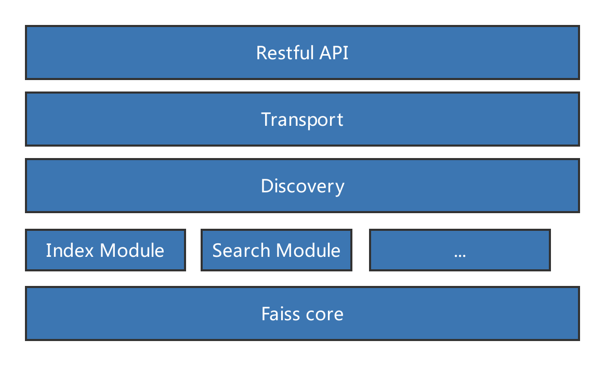

这段时间以来，我陆陆续续在开发一个特征向量的搜索系统。目前这个系统出了一个大致可用的版本，这篇文章记录一下这个系统开发的方方面面。

<!-- more -->

## 背景

今天5月底，我来到当前这个团队。我们是一个做视频监控识别的团队。很重要的一个功能是对人、人脸、车、非机动车等对象的搜索，这些对象经过算法识别之后会输出两种信息：一种是结构化信息（比如性别、发型、衣服颜色、车牌号等），另一种是非结构化信息（一个特定维数的向量）。

对于大量结构化信息的存储与检索，传统数据库是无能为力的，所幸现在有`elasticsearch`，使用`es`完美解决这些数据的存储与检索。

于是还剩下非结构化信息。非结构化检索一个非常典型的应用是以图搜图：用户上传一张图片，在监控数据中搜索出与其相似的图片，从而定位人、车等对象在何时何地出现。

这是一个向量相似度的计算，我们使用`faiss`来解决这个相似度计算问题。`faiss`是Facebook开源的一个项目，它是一个用于稠密向量相似度计算和聚类的库。

非常遗憾的是，`faiss`是一个比较底层的库。除了基础的存储、检索等功能，它缺少分布式存储、检索，高可用，服务器监控等等功能。

`faiss`是c++写的，我们后端程序一般都是java写的，调用起来也不方便。再者目前市场上也缺少一个分布式的向量搜索系统，于是我们着手开发一个。

## 架构

重头开发一个分布式系统是一个很艰巨的任务，考虑到人力短缺，因此必须要找一个巨人的肩膀。

之前两年，我一直在使用`elasticsearch`开发新闻app的搜索服务，对于`elasticsearch`还是比较熟悉的。`elasticsearch`是对`lucene`的包装，提供了分布式存储、检索，高可用等等功能，简直太契合我目前的需求了。于是我们这个分布式系统就是基于`elasticsearch`的设计思想来开发，其中复用了很多代码。

下面是这个系统的架构图：

说明：

1. `Restful API`：这个是提供给其他服务的接口。其他服务可以简单地调用这些api来实现存储于检索。
2. `Transport`：与集群中其他节点交互的节点
3. `Discovery`：负责集群的发现
4. `Index Module`、`Search Module`：存储与检索等模块
5. `Faiss core`：`faiss`的核心功能。通过jni的方式来调用。

## 功能说明

该系统的主要功能是分布式存储与检索。具体描述如下：

**节点发现**

负责集群中节点的发现。这里我采用了`zookeeper`来实现。

**索引**

索引是一个将数据写入faiss索引的过程。某个节点接收到一条数据之后，选择一个最终存储的节点（随机、轮流、根据数据量等策略）转发给它，最终接收到数据的节点将数据保存在faiss索引中。

**搜索**

某个节点接收到搜索，此时该节点就是计算节点。计算节点将请求发送给所有集群中的节点，各个节点将搜索的结果返回给计算节点。计算节点汇总所有的数据，经过排序、截断等操作，将最终结果返回给客户端。

**定时保存索引数据到磁盘**

`faiss`所有的索引数据都是保存在内存中的，为了保证数据不丢失，定时将内存中的索引数据保存到磁盘。相当于`elasticsearch`中的`flush`操作。

**内存数据的淘汰机制**

由于向量的搜索必须将数据加载到内存中，而内存容量是有限的，因此根据`LRU`算法设计了一个淘汰机制。如果内存中的数据量超出了一个阈值，将最老的索引从内存中移除。

## 对elasticsearch机制的修改

**节点发现**

`elasticsearch`中的发现机制是内建的协议`Zen`，该协议比较复杂且存在一定几率出错（参考[https://zhuanlan.zhihu.com/p/34830403](https://zhuanlan.zhihu.com/p/34830403)）。所以这里我把整个发现模块都替换成使用`zookeeper`来实现，复杂度大幅度降低。使用`zookeeper`还有一个好处就是它也是一个简单的存储系统，可以将索引信息等简单数据存储在`zookeeper`中，进一步简化了`elasticsearch`中数据的存储与交换。

**简化了分片机制**

这里我们没有采用`elasticsearch`中固定分片的策略，而是将分片分散到所有节点中。这是因为`faiss`的存储搜索操作完全需要在内存中执行，将数据分散到所有节点，可以充分利用集群的内存及计算资源。

**去掉了副本机制**

`elasticsearch`中的副本机制可以保证服务可用性、数据可靠性、扩展查询能力。非常可惜的是`faiss`的数据要存储在内存中，内存资源太有限，如果引入副本机制将成倍减少可用的存储空间。经过取舍，决定牺牲一部分数据的可靠性。可以在运维层面弥补数据可靠性的损失，比如对磁盘中的数据做备份。

## 待改进的点

**事务日志**

为了提升索引速度，并且同时保证可靠性，`elasticsearch`增加了一个`translog`，或者叫事务日志。

一个文档首先被添加到内存缓存区，追加到`translog`中。分片每秒被`refresh`一次，在内存缓冲区中的文档被写入一个新的段中，内存缓冲区被清空，此时文档可被搜索。每隔一段时间索引执行`flush`操作，此时索引数据通过`fsync`被写入磁盘，老的`translog`被删除。

目前我们的系统缺少这样的`translog`，在数据写入`faiss`索引到被写入磁盘之间有一个时间间隔，如果在这个时间间隔内，程序发生异常则会导致这个时间内的数据丢失。

**锁导致的性能下降**

由于一个`faiss`索引同时接收读、写、数据写入磁盘，从内存删除等操作，因此需要对索引加读写锁以保证线程安全。这个读写锁对于写操作的影响巨大，因此下一步需要细化乃至消除这个锁。

**索引写入磁盘导致的数据写入暂停**

faiss索引写入磁盘时，要保证数据完整性，因此暂停了数据写入faiss索引。而写入磁盘的时间比较久（特别是索引比较大时），对于接收数据写入faiss索引的影响巨大。

下一步，对于同一个索引应拆分成多个faiss索引，以保证faiss索引写入磁盘时，仍然提供数据写入的功能。

## 总结

因为站在了`elasticsearch`这个巨人的肩膀上，因此短时间内可以完成一个可用的分布式向量搜索系统，初步能满足需求。不过目前性能、可靠性等方面还有很多待改进的点，接下去还有很多迭代的工作。

> https://www.toutiao.com/i6749080730841645580/
> https://zhuanlan.zhihu.com/p/33375126
> https://zhuanlan.zhihu.com/p/34830403
> https://yq.aliyun.com/articles/368670
