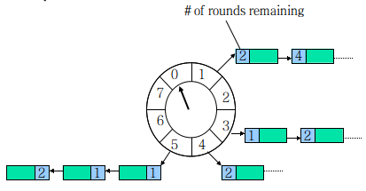

在[Redisson分布式锁的实现][1]一文中，我们说到Redisson会调用`scheduleExpirationRenewal`方法创建一个定时任务来刷新锁的过期时间，防止任务执行完毕前锁就过期释放了。在那篇文章中，我们没有详述这个定时任务的原理，本文中我们来探究一番定时任务的原理。

<!-- more -->

# 定时任务的本质

一个Timer本质上是这样的一个数据结构：deadline越近的任务拥有越高优先级，提供以下3中基本操作：

1. `schedule`新增
2. `cancel`删除
3. `expire`执行到期的任务
4. `updateDeadline`更行到期时间（可选）

`expire`通常有两种工作方式：

1. 轮询

    每隔一个时间片就去查找哪些任务已经到期

2. 睡眠/唤醒

    1. 不停地查找deadline最近的任务，如到期则执行；否则sleep直到其到期
    2. 在sleep期间，如果有任务被`cancel`或`schedule`，则deadline最近的任务有可能改变，线程会被唤醒并重新进行1的逻辑

具体实现的数据结构可以有很多选择：（假设任务持有自己在总体任务集合中对应的节点，`cancel`时不需要查找的过程）

1. 有序链表

    - `schedule`：O(n)
    - `cancel`：O(1) //双向链表的节点删除
    - `expire`：O(1) //不停地查看第一个就可以了

2. 堆heap

    - `schedule`：O(log2N)   //调整heap
    - `cancel`：O(log2N)     //调整heap
    - `expire`：O(1)

# HashedWheelTimer

`Redisson`使用的定时任务是`Netty`提供的`HashedWheelTimer`。



`Hash Wheel Timer`是一个环形结构，可以想象成时钟，分为很多格子，一个格子代表一段时间（越短Timer精度越高），并用一个List保存在该格子上到期的所有任务。同时一个指针随着时间流逝一格一格转动，并执行对应List中所有到期的任务。任务通过**取模**决定应该放入哪个格子。

以上图为例，假设一个格子是1秒，则整个wheel能表示的时间段为8s，假设当前指针指向2，此时需要调度一个3s后执行的任务，显然应该加入到(2+3=5)的方格中，指针再走3次就可以执行了；如果任务要在10s后执行，应该等指针走完一个round零2格再执行，因此应放入4，同时将round(1)保存到任务中。检查到期任务应当只执行round为0的，格子上其他任务的round应减1.

- `schedule`：O(1)
- `cancel`：O(1)
- `expire`：最坏情况O(n)，平均O(1)  //显然格子越多每个格子对应的List就越短，越接近O(1)；最坏情况下所有的任务都在一个格子中，O(n)

## 使用

`HashedWheelTimer`的使用如下所示：

```java
@Test
public void test01() throws IOException {
    HashedWheelTimer timer = new HashedWheelTimer();    //使用默认参数
    logger.info("start");
    timer.newTimeout(timeout -> logger.info("running"), 3, TimeUnit.SECONDS);   //延时3秒后开始执行

    System.in.read();
}
```

执行结果如下：

```
14:16:50.743 [main] INFO love.wangqi.timer.TimerTest - start
14:16:53.888 [pool-1-thread-1] INFO love.wangqi.timer.TimerTest - running
```

从日志的打印时间，我们看到程序运行的大概3秒钟之后，我们定义的`TimerTask`开始执行。

我们知道，`HashedWheelTimer`以一个固定的时间间隔前进一个格子，并且激活对应格子里面的任务，但是这里有个缺陷，就是任务是串行的，也就是所有的任务是依次执行，如果调度的任务耗时比较长的话，容易出现调度超时的情况，因此很可能产生任务堆集的情况出现。

以如下代码所示：

```java
@Test
public void test02() throws IOException {
    HashedWheelTimer timer = new HashedWheelTimer();
    logger.info("start");
    timer.newTimeout(timeout -> {
        logger.info("running");
        Thread.sleep(2000);
        logger.info("end");
    }, 1, TimeUnit.SECONDS);

    timer.newTimeout(timeout -> {
        logger.info("running");
        Thread.sleep(2000);
        logger.info("end");
    }, 1, TimeUnit.SECONDS);

    System.in.read();
}
```

执行结果如下：

```
14:24:02.872 [main] INFO love.wangqi.timer.TimerTest - start
14:24:04.020 [pool-1-thread-1] INFO love.wangqi.timer.TimerTest - running
14:24:06.023 [pool-1-thread-1] INFO love.wangqi.timer.TimerTest - end
14:24:06.023 [pool-1-thread-1] INFO love.wangqi.timer.TimerTest - running
14:24:08.025 [pool-1-thread-1] INFO love.wangqi.timer.TimerTest - end
```

我们的本意其实是程序执行后延时1秒，然后两个任务同时开始执行。但实际的执行结果显示`task2`被`task1`阻塞了，直到`task1`执行结束`task2`才开始执行。这就导致了串行化的任务调度延时，因此，应该避免耗时比较长的任务在同一个线程中执行。

## 源码解读

### 关键的成员变量

```java
// 指针转动以及任务执行的线程
private final Worker worker = new Worker();
private final Thread workerThread;

public static final int WORKER_STATE_INIT = 0;
public static final int WORKER_STATE_STARTED = 1;
public static final int WORKER_STATE_SHUTDOWN = 2;
// 工作线程的状态
private volatile int workerState;

// 每个tick所需的时间
private final long tickDuration;

// 时间轮的结构
private final HashedWheelBucket[] wheel;
```

### 构造方法

```java
public HashedWheelTimer(
        ThreadFactory threadFactory,    // 用于创建worker线程的线程工厂
        long tickDuration,              // tick的时长，也就是指针多久转一格
        TimeUnit unit,                  // tickDuration的时间单位
        int ticksPerWheel,              // 一圈有几个格子
        boolean leakDetection,          // 是否开启内存泄露检测
        long maxPendingTimeouts         // 任务的超时等待时间
        ) {
    // 一些参数校验
    if (threadFactory == null) {
        throw new NullPointerException("threadFactory");
    }
    if (unit == null) {
        throw new NullPointerException("unit");
    }
    if (tickDuration <= 0) {
        throw new IllegalArgumentException("tickDuration must be greater than 0: " + tickDuration);
    }
    if (ticksPerWheel <= 0) {
        throw new IllegalArgumentException("ticksPerWheel must be greater than 0: " + ticksPerWheel);
    }

    // 创建时间轮基本的数据结构，一个数组。长度为不小于ticksPerWheel的最小2的n次方
    wheel = createWheel(ticksPerWheel);
    // 掩码，用于计算某个任务落在哪个格子上。
    // 因为wheel.length为2的n次方，mask = 2^n - 1低位将全部是1，所以任务的deadline&mast == 任务的deadline&wheel.length
    mask = wheel.length - 1;

    // 转换成纳秒
    this.tickDuration = unit.toNanos(tickDuration);

    // 检验是否存在溢出。即指针转动的时间间隔不能太长而导致tickDuration*wheel.length>Long.MAX_VALUE
    if (this.tickDuration >= Long.MAX_VALUE / wheel.length) {
        throw new IllegalArgumentException(String.format(
                "tickDuration: %d (expected: 0 < tickDuration in nanos < %d",
                tickDuration, Long.MAX_VALUE / wheel.length));
    }
    // 创建worker线程
    workerThread = threadFactory.newThread(worker);
    // 这里默认是启动内存泄露检测：当HashedWheelTimer实例超过当前CPU可用核数*4的时候，将发出警告
    leak = leakDetection || !workerThread.isDaemon() ? leakDetector.track(this) : null;
    // 最大的任务数量。当HashedWheelTimer实例上的任务超出这个数量时会抛出错误
    this.maxPendingTimeouts = maxPendingTimeouts;

    // 如果HashedWheelTimer实例数超过了64，会报警。
    // 因为时间轮是一个非常消耗资源的结构所以实例数目不能太高
    if (INSTANCE_COUNTER.incrementAndGet() > INSTANCE_COUNT_LIMIT &&
        WARNED_TOO_MANY_INSTANCES.compareAndSet(false, true)) {
        reportTooManyInstances();
    }
}
```

### 添加定时任务

在前面的实例中，我们看到使用`newTimeout`方法来添加定时任务。`newTimeout`方法的代码如下：

```java
@Override
public Timeout newTimeout(TimerTask task, long delay, TimeUnit unit) {
    // 参数校验
    if (task == null) {
        throw new NullPointerException("task");
    }
    if (unit == null) {
        throw new NullPointerException("unit");
    }
    // 增加任务数量
    long pendingTimeoutsCount = pendingTimeouts.incrementAndGet();
    // 如果设置了最大任务数，且任务数量超过最大任务数，抛出异常
    if (maxPendingTimeouts > 0 && pendingTimeoutsCount > maxPendingTimeouts) {
        pendingTimeouts.decrementAndGet();
        throw new RejectedExecutionException("Number of pending timeouts ("
            + pendingTimeoutsCount + ") is greater than or equal to maximum allowed pending "
            + "timeouts (" + maxPendingTimeouts + ")");
    }
    // 如果没有启动时间轮，则启动
    start();

    // Add the timeout to the timeout queue which will be processed on the next tick.
    // During processing all the queued HashedWheelTimeouts will be added to the correct HashedWheelBucket.
    // 计算任务的deadline
    long deadline = System.nanoTime() + unit.toNanos(delay) - startTime;

    // Guard against overflow.
    if (delay > 0 && deadline < 0) {
        deadline = Long.MAX_VALUE;
    }
    // 这里定时任务不是直接加到对应的格子中，而是先加入到一个队列里，然后等到下一个tick的时候，会从队列里取出最多100000个任务加入到指定的格子中
    HashedWheelTimeout timeout = new HashedWheelTimeout(this, task, deadline);
    timeouts.add(timeout);
    return timeout;
}
```

这里使用的Queue不是普通Java自带的Queue的实现，而是使用`JCTool`——一个高性能的并发Queue实现包。

### 启动时间轮

```java
// 这个方法不需要用户显式地调用。因为在添加定时任务(newTimeout方法)的时候会自动调用此方法
// 如果没有定时任务，时间轮就不需要启动
public void start() {
    // 判断当前时间轮的状态。
    // 如果是初始化状态，则采用CAS的方法将状态修改为开始状态，然后启动时间轮线程。
    switch (WORKER_STATE_UPDATER.get(this)) {
        case WORKER_STATE_INIT:
            if (WORKER_STATE_UPDATER.compareAndSet(this, WORKER_STATE_INIT, WORKER_STATE_STARTED)) {
                workerThread.start();
            }
            break;
        case WORKER_STATE_STARTED:
            break;
        case WORKER_STATE_SHUTDOWN:
            throw new IllegalStateException("cannot be started once stopped");
        default:
            throw new Error("Invalid WorkerState");
    }

    // Wait until the startTime is initialized by the worker.
    // 等待woker线程初始化时间轮的启动时间
    while (startTime == 0) {
        try {
            startTimeInitialized.await();
        } catch (InterruptedException ignore) {
            // Ignore - it will be ready very soon.
        }
    }
}
```

`AtomicIntegerFieldUpdater`是JUC里面的类，原理是利用安全的反射进行原子操作，来获取实例的本身的属性。有比`AtomicInteger`更好的性能和更低的内存占用。

### 停止时间轮

```java
@Override
public Set<Timeout> stop() {
    // worker线程不能停止时间轮，也就是加入的定时任务不能调用这个方法。不然会有恶意的定时任务调用这个方法而造成大量定时任务失效
    if (Thread.currentThread() == workerThread) {
        throw new IllegalStateException(
                HashedWheelTimer.class.getSimpleName() +
                        ".stop() cannot be called from " +
                        TimerTask.class.getSimpleName());
    }
    
    // CAS的方式尝试将当前状态替换为WORKER_STATE_SHUTDOWN。
    // 如果替换失败，则当前状态只能是WORKER_STATE_STARTED或者WORKER_STATE_SHUTDOWN。直接将当前状态设置为WORKER_STATE_SHUTDOWN
    if (!WORKER_STATE_UPDATER.compareAndSet(this, WORKER_STATE_STARTED, WORKER_STATE_SHUTDOWN)) {
        // workerState can be 0 or 2 at this moment - let it always be 2.
        if (WORKER_STATE_UPDATER.getAndSet(this, WORKER_STATE_SHUTDOWN) != WORKER_STATE_SHUTDOWN) {
            INSTANCE_COUNTER.decrementAndGet();
            if (leak != null) {
                boolean closed = leak.close(this);
                assert closed;
            }
        }

        return Collections.emptySet();
    }

    try {
        // 中断worker线程，尝试把正在进行任务的线程中断掉。
        // 如果某些任务正在执行则会抛出InterruptedException异常，并且任务会尝试立即中断
        boolean interrupted = false;
        while (workerThread.isAlive()) {
            workerThread.interrupt();
            try {
                workerThread.join(100);
            } catch (InterruptedException ignored) {
                interrupted = true;
            }
        }
        // 如果中断掉了所有工作的线程，那么当前时间轮调度的线程会在随后关闭
        if (interrupted) {
            Thread.currentThread().interrupt();
        }
    } finally {
        INSTANCE_COUNTER.decrementAndGet();
        if (leak != null) {
            boolean closed = leak.close(this);
            assert closed;
        }
    }
    // 返回未处理的任务
    return worker.unprocessedTimeouts();
}
```

### HashedWheelTimeout

`newTimeout`方法中会将我们的`TimerTask`包装成一个`HashedWheelTimeout`对象，然后添加到`Queue<HashedWheelTimeout> timeouts`队列中。

`HashedWheelTimeout`是一个定时任务的内部包装类，双向链表结构。保存定时任务到期执行的任务、deadline、round等信息。

```java
private static final class HashedWheelTimeout implements Timeout {
    // 定义定时任务的3个状态：初始化、取消、过期
    private static final int ST_INIT = 0;
    private static final int ST_CANCELLED = 1;
    private static final int ST_EXPIRED = 2;
    // CAS方式更新定时任务状态
    private static final AtomicIntegerFieldUpdater<HashedWheelTimeout> STATE_UPDATER =
            AtomicIntegerFieldUpdater.newUpdater(HashedWheelTimeout.class, "state");

    // 时间轮引用
    private final HashedWheelTimer timer;
    // 到期需要执行的任务
    private final TimerTask task;
    private final long deadline;

    @SuppressWarnings({"unused", "FieldMayBeFinal", "RedundantFieldInitialization" })
    private volatile int state = ST_INIT;

    // 离任务执行的轮数，当将任务加入到格子中时计算该值，每过一轮，该值减1
    long remainingRounds;

    // 双向链表结构，由于只有worker线程会访问，这里不需要synchronization/volatile
    HashedWheelTimeout next;
    HashedWheelTimeout prev;

    // 定时任务所在的格子
    HashedWheelBucket bucket;

    HashedWheelTimeout(HashedWheelTimer timer, TimerTask task, long deadline) {
        this.timer = timer;
        this.task = task;
        this.deadline = deadline;
    }

    @Override
    public Timer timer() {
        return timer;
    }

    @Override
    public TimerTask task() {
        return task;
    }

    @Override
    public boolean cancel() {
        // 这里只是修改状态为ST_CANCELLED，会在下次tick时从格子中移除
        if (!compareAndSetState(ST_INIT, ST_CANCELLED)) {
            return false;
        }
        // 加入到时间轮的待取消队列，并在每次tick的时候，从相应格子中移除
        timer.cancelledTimeouts.add(this);
        return true;
    }

    // 从格子中移除自身
    void remove() {
        HashedWheelBucket bucket = this.bucket;
        if (bucket != null) {
            bucket.remove(this);
        } else {
            timer.pendingTimeouts.decrementAndGet();
        }
    }

    public boolean compareAndSetState(int expected, int state) {
        return STATE_UPDATER.compareAndSet(this, expected, state);
    }

    public int state() {
        return state;
    }

    @Override
    public boolean isCancelled() {
        return state() == ST_CANCELLED;
    }

    @Override
    public boolean isExpired() {
        return state() == ST_EXPIRED;
    }
    
    // 过期并执行任务
    public void expire() {
        if (!compareAndSetState(ST_INIT, ST_EXPIRED)) {
            return;
        }

        try {
            task.run(this);
        } catch (Throwable t) {
            if (logger.isWarnEnabled()) {
                logger.warn("An exception was thrown by " + TimerTask.class.getSimpleName() + '.', t);
            }
        }
    }
}
```

### HashedWheelBucket

`HashedWheelBucket`用来存放`HashedWheelTimeout`，结构类似于`LinkedList`。提供了`expireTimeouts`方法来执行格子中的过期任务

```java
private static final class HashedWheelBucket {
    // 指向格子中任务的首尾
    private HashedWheelTimeout head;
    private HashedWheelTimeout tail;

    // 添加到链表的末尾
    public void addTimeout(HashedWheelTimeout timeout) {
        assert timeout.bucket == null;
        timeout.bucket = this;
        if (head == null) {
            head = tail = timeout;
        } else {
            tail.next = timeout;
            timeout.prev = tail;
            tail = timeout;
        }
    }

    // 执行格子中的过期任务，tick到该格子的时候，worker线程会调用这个方法
    // 根据deadline和remainingRounds判断任务是否过期
    public void expireTimeouts(long deadline) {
        HashedWheelTimeout timeout = head;

        // 遍历格子中的所有定时任务
        while (timeout != null) {
            HashedWheelTimeout next = timeout.next;
            if (timeout.remainingRounds <= 0) {     // 定时任务到期
                next = remove(timeout);             // 从链表中移除到期任务
                if (timeout.deadline <= deadline) {
                    timeout.expire();               // 执行到期的任务
                } else {
                    // The timeout was placed into a wrong slot. This should never happen.
                    throw new IllegalStateException(String.format(
                            "timeout.deadline (%d) > deadline (%d)", timeout.deadline, deadline));
                }
            } else if (timeout.isCancelled()) {     // 如果任务被取消，从链表中移除
                next = remove(timeout);
            } else {
                timeout.remainingRounds --;         // 没有到期，轮数-1
            }
            timeout = next;
        }
    }

    // 从链表中移除到期任务
    public HashedWheelTimeout remove(HashedWheelTimeout timeout) {
        HashedWheelTimeout next = timeout.next;
        // remove timeout that was either processed or cancelled by updating the linked-list
        if (timeout.prev != null) {
            timeout.prev.next = next;
        }
        if (timeout.next != null) {
            timeout.next.prev = timeout.prev;
        }

        if (timeout == head) {
            // if timeout is also the tail we need to adjust the entry too
            if (timeout == tail) {
                tail = null;
                head = null;
            } else {
                head = next;
            }
        } else if (timeout == tail) {
            // if the timeout is the tail modify the tail to be the prev node.
            tail = timeout.prev;
        }
        // null out prev, next and bucket to allow for GC.
        timeout.prev = null;
        timeout.next = null;
        timeout.bucket = null;
        timeout.timer.pendingTimeouts.decrementAndGet();
        return next;
    }

    // 清空这个格子，将没有过期或者是已经取消的任务保存在set中
    public void clearTimeouts(Set<Timeout> set) {
        for (;;) {
            HashedWheelTimeout timeout = pollTimeout();
            if (timeout == null) {
                return;
            }
            if (timeout.isExpired() || timeout.isCancelled()) {
                continue;
            }
            set.add(timeout);
        }
    }

    // 从链表中取得最头上的任务
    private HashedWheelTimeout pollTimeout() {
        HashedWheelTimeout head = this.head;
        if (head == null) {
            return null;
        }
        HashedWheelTimeout next = head.next;
        if (next == null) {
            tail = this.head =  null;
        } else {
            this.head = next;
            next.prev = null;
        }

        // null out prev and next to allow for GC.
        head.next = null;
        head.prev = null;
        head.bucket = null;
        return head;
    }
}
```

### Worker

前面我们看到时间轮启动时启动`Worker`线程。`Worker`是时间轮的核心线程类。tick的转动，过期任务的处理都是在这个线程中处理的。

```java
private final class Worker implements Runnable {
    private final Set<Timeout> unprocessedTimeouts = new HashSet<Timeout>();

    private long tick;

    @Override
    public void run() {
        // 初始化startTime，所有任务的deadline都是相对于这个时间点的
        startTime = System.nanoTime();
        // 由于System.nanoTime()可能返回0，甚至负数。0是一个标示符，用来判断startTime是否被初始化，所以当startTime=0的时候，重新赋值为1
        if (startTime == 0) {
            startTime = 1;
        }

        // 唤醒阻塞在start()的线程
        startTimeInitialized.countDown();
        
        // 只要时间轮的状态为WORKER_STATE_STARTED，就循环地转动tick，判断响应格子中的到期任务
        do {
            // waitForNextTick方法主要是计算下次tick的时间，然后sleep到下次tick
            // 返回值是System.nanoTime() - startTime，也就是Timer启动后到这次tick所过去的时间
            final long deadline = waitForNextTick();
            if (deadline > 0) { // 溢出或者被中断的时候会返回负数，所以小于等于0不管
                // 获取tick对应的格子索引
                int idx = (int) (tick & mask);
                // 移除被取消的任务
                processCancelledTasks();
                HashedWheelBucket bucket = wheel[idx];
                // 从任务队列中取出任务加入到对应的格子中
                transferTimeoutsToBuckets();
                // 执行格子中的任务
                bucket.expireTimeouts(deadline);
                tick++;
            }
        } while (WORKER_STATE_UPDATER.get(HashedWheelTimer.this) == WORKER_STATE_STARTED);

        // 时间轮停止了。
        // 清除所有格子中的任务，并加入到未处理任务列表，以供stop()方法返回
        for (HashedWheelBucket bucket: wheel) {
            bucket.clearTimeouts(unprocessedTimeouts);
        }
        // 将还没有加入到格子中的待处理定时任务队列中的任务取出，如果是未取消任务，则加入到未处理任务列表，以供stop()方法返回
        for (;;) {
            HashedWheelTimeout timeout = timeouts.poll();
            if (timeout == null) {
                break;
            }
            if (!timeout.isCancelled()) {
                unprocessedTimeouts.add(timeout);
            }
        }
        // 处理取消的任务
        processCancelledTasks();
    }

    // 将newTimeout()方法中加入到待处理定时任务队列中的任务加入到指定的格子中
    private void transferTimeoutsToBuckets() {
        // 每次tick只处理10w个任务，以免阻塞worker线程
        for (int i = 0; i < 100000; i++) {
            HashedWheelTimeout timeout = timeouts.poll();
            // 如果没有任务了，直接跳出循环
            if (timeout == null) {
                // all processed
                break;
            }
            // 还没有放入到格子中就取消了，直接略过
            if (timeout.state() == HashedWheelTimeout.ST_CANCELLED) {
                // Was cancelled in the meantime.
                continue;
            }
            
            // 计算任务需要经过多少个tick
            long calculated = timeout.deadline / tickDuration;
            // 计算任务的轮数
            timeout.remainingRounds = (calculated - tick) / wheel.length;

            // 如果任务在timeouts队列中放久了，以至于已经过了执行时间，这个时候就使用当前tick，也就是放到当前bucket中。此方法调用完后就会被执行。
            final long ticks = Math.max(calculated, tick); // Ensure we don't schedule for past.
            int stopIndex = (int) (ticks & mask);

            // 将任务加入到相应的格子中
            HashedWheelBucket bucket = wheel[stopIndex];
            bucket.addTimeout(timeout);
        }
    }

    // 将取消的任务取出，并从格子中移除
    private void processCancelledTasks() {
        for (;;) {
            HashedWheelTimeout timeout = cancelledTimeouts.poll();
            if (timeout == null) {
                // all processed
                break;
            }
            try {
                timeout.remove();
            } catch (Throwable t) {
                if (logger.isWarnEnabled()) {
                    logger.warn("An exception was thrown while process a cancellation task", t);
                }
            }
        }
    }

    // sleep，直到下次tick到来，然后返回该次tick和启动时间之间的时长
    private long waitForNextTick() {
        // 下次tick的时间点，用于计算需要sleep的时间
        long deadline = tickDuration * (tick + 1);

        for (;;) {
            // 计算需要sleep的时间
            final long currentTime = System.nanoTime() - startTime;
            long sleepTimeMs = (deadline - currentTime + 999999) / 1000000;

            if (sleepTimeMs <= 0) {
                if (currentTime == Long.MIN_VALUE) {
                    return -Long.MAX_VALUE;
                } else {
                    return currentTime;
                }
            }

            // 因为windows平台的定时调度最小单位为10ms，如果不是10ms的倍数，可能会引起sleep时间不准确
            if (PlatformDependent.isWindows()) {
                sleepTimeMs = sleepTimeMs / 10 * 10;
            }

            try {
                Thread.sleep(sleepTimeMs);
            } catch (InterruptedException ignored) {
                // 调用HashedWheelTimer.stop()时优雅退出
                if (WORKER_STATE_UPDATER.get(HashedWheelTimer.this) == WORKER_STATE_SHUTDOWN) {
                    return Long.MIN_VALUE;
                }
            }
        }
    }

    public Set<Timeout> unprocessedTimeouts() {
        return Collections.unmodifiableSet(unprocessedTimeouts);
    }
}
```

## 总结

总体来说，`HashedWheelTimer`使用的是一个比较朴素的算法，要点有两个：

1. 添加定时任务
    
    1. 如果worker线程没有执行则启动worker线程。
    2. 将定时任务task包装成`HashedWheelTimeout`，然后添加到`Queue<HashedWheelTimeout> timeouts`队列中

2. worker线程的执行

    1. 调用`waitForNextTick`方法等待直到下一个tick
    2. 调用`processCancelledTasks`方法处理被取消的任务。从`Queue<HashedWheelTimeout> cancelledTimeouts`队列（调用`cancel`方法取消任务时会将任务添加到该队列中）中取出被取消的任务，然后将其从格子的任务列表中移除。
    3. 计算当前tick所在的格子(`bucket`)
    4. 调用`transferTimeoutsToBuckets`方法将`timeouts`队列中新建的任务转移到所在格子的链表中
    5. 调用`HashedWheelBucket.expireTimeouts`方法执行到期的任务

这里有几个值的注意的数据结构：

1. 任务并不是直接放在格子中的，而是维护了一个双向链表，这种数据结构非常便于插入和移除。
2. 新添加的任务并不直接放入格子，而是先放入一个队列中，这是为了避免多线程插入任务的冲突。在每个tick运行任务之前由worker线程自动对任务进行归集和分类，插入到对应的槽位里面。


[1]: /articles/redis/Redisson分布式锁的实现.html


> http://novoland.github.io/并发/2014/07/26/定时器（Timer）的实现.html
> https://zhuanlan.zhihu.com/p/32906730

