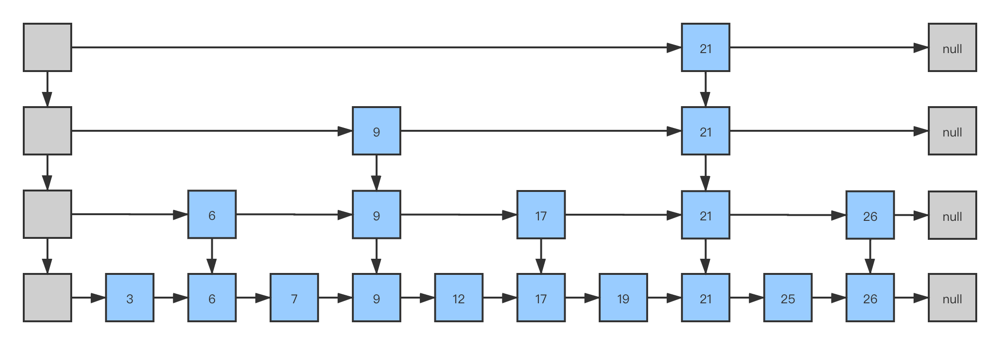

日常编程中，对`ConcurrentSkipListMap`使用得比较少，因此对它的了解程度也不足，趁着今天复习容器的机会学习一下`ConcurrentSkipListMap`。

<!-- more -->

JDK的容器中Map对应的有`HashMap`、`TreeMap`、`ConcurrentHashMap`、`ConcurrentSkipListMap`等。其中`HashMap`是基于哈希的容器，插入与查找性能为`O(1)`；`TreeMap`是基于红黑树的容器，其中的元素有有序的，插入与查找性能为`O(logN)`；`ConcurrentHashMap`是线程安全的`HashMap`；`ConcurrentSkipListMap`也是线程安全的，插入与查找性能为`O(logN)`，其基于`skip list`数据结构，有着不低于红黑树的效率，但是其原理和实现的复杂度要比红黑树简单。

## 跳表

跳表(`skip list`)是一种对标平衡树的数据结构，插入/删除/搜索操作性能都是`O(logN)`。其最大的优势是原理简单、容易实现、方便扩展、效率更高。

假设有如下一个有序的链表：


这个链表中，如果要搜索一个数，需要从头到尾比较每个元素是否匹配，直到找到匹配的数为止，即时间复杂度为`O(n)`。同理，插入一个数并保持链表有序，需要先找到合适的插入位置，在执行插入，总计也是`O(n)`的时间。

为了提高性能，我们需要对链表加上索引：


如上图，在链表的上层加了索引层，它包含的元素为前一个链表的偶数个元素。这样在搜索一个元素时，我们先在索引层进行搜索，当元素未找到时再到下层链表中搜索。例如搜索数据`19`时的路径如下：


先在上层中搜索，到达节点`17`时发现下一个节点为`21`，已经大于`19`，于是转到下一层搜索，找到目标数字`19`。

我们知道上层的节点数目为`n/2`，因此，有了这层索引，我们搜索的时间复杂度降为了`O(n/2)`。同理，我们可以不断地增加层数，来减少搜索的时间：



在上面的4层链表中搜索`25`，在最上层搜索时就可以直接跳过`21`之前的所有节点，因此十分高效。

上面的结构是"静态"的，即我们先拥有了一个链表，再在之上建了多层的索引。但是在实际使用中，我们的链表是通过多次插入/删除形成的，换句话说是"动态"的。上面的结构要求上层相邻节点与对应下层节点间的个数比是`1:2`，随意插入/删除一个节点，这个要求就被破坏了。

因此跳表(`skip list`)表示，我们不强制要求`1:2`，一个节点要不要被索引，建几层的索引，都在节点插入时由抛硬币决定。当然，虽然索引的节点、索引的层数是随机的，为了保证搜索的效率，要大致保证每层的节点数目与上面的结构相当。

## ConcurrentSkipListMap

`ConcurrentSkipListMap`采用的就是跳表的数据结构，它提供了3个内部类来构建这样的数据结构：`Node`、`Index`、`HeadIndex`。

`Node`表示最底层的单链表有序节点：

```java
static final class Node<K,V> {
    final K key;
    volatile Object value;
    volatile Node<K,V> next;
    
    ...
}
```

`Node`的结构就是一个单链表的节点，包含一个`key`、一个`value`、一个指向下一个节点的`next`。

`Index`表示基于`Node`的索引层：

```java
static class Index<K,V> {
    final Node<K,V> node;
    final Index<K,V> down;
    volatile Index<K,V> right;
    
    ...
}
```

`Index`包含链表的节点`Node`，以及一个指向下一个`Index`的`right`、一个指向下层索引的`down`。

`HeadIndex`用来维护索引层次：

```java
static final class HeadIndex<K,V> extends Index<K,V> {
    final int level;
    HeadIndex(Node<K,V> node, Index<K,V> down, Index<K,V> right, int level) {
        super(node, down, right);
        this.level = level;
    }
}
```

`HeadIndex`扩展了`Index`，增加了一个`level`变量来定义层级。

还有一个`head`变量来表示最上层的`HeadIndex`：

```java
private transient volatile HeadIndex<K,V> head;
```

### put方法

`put`方法代码如下：

```java
public V put(K key, V value) {
    if (value == null)
        throw new NullPointerException();
    return doPut(key, value, false);
}
```

首先判断`value`不为`null`，接着调用`doPut`方法。`doPut`方法分为3个部分。

**第一部分**


第一部分要做的是将数据插入到最底层的链表中。主要的步骤就是找到数据该插入的前置节点，使用传入的数据建立一个新节点，将新节点插入到前置节点的后面。

`ConcurrentSkipListMap`使用cas无锁的方式来保证并发情况下的线程安全性，因此这些操作都是在一个大循环中执行的，检测到数据有并发修改时从循环的开头重新执行。jdk的并发容器中很多类都采用这样的方式来保证线程安全性。为了理解的方便，我们可以忽略这些代码，专注于主要的操作流程。

首先调用`findPredecessor`方法找到`key`插入的前置节点，代码如下：

```java
private Node<K,V> findPredecessor(Object key, Comparator<? super K> cmp) {
    if (key == null)
        throw new NullPointerException(); // don't postpone errors
    for (;;) {
        for (Index<K,V> q = head, r = q.right, d;;) {
            if (r != null) {
                Node<K,V> n = r.node;
                K k = n.key;
                if (n.value == null) {
                    if (!q.unlink(r))
                        break;           // restart
                    r = q.right;         // reread r
                    continue;
                }
                if (cpr(cmp, key, k) > 0) {
                    q = r;
                    r = r.right;
                    continue;
                }
            }
            if ((d = q.down) == null)
                return q.node;
            q = d;
            r = d.right;
        }
    }
}
```

步骤如下：

1. 从`head`位置开始遍历，`q`指向当前节点，`r`指向当前节点右边的（下一个）节点。
2. 如果`r`指向的节点`value`为`null`，表示该节点已经被删除了，通过调用`unlink()`方法删除该节点。
3. 调用`cpr`比较`r`节点与当前`key`的大小，直到当前`key`小于`r`节点。这一层的遍历就已经完成了
4. 接着向下走一层。如果已经走到最下层，直接返回该节点。否则在这一层重复遍历的过程，直到走到最下层。

`findPredecessor`方法结束之后返回插入位置的前置节点，回到`doPut`方法，`b`指向该前置节点，`n`指向前置节点的后置节点：

1. 比较插入的`key`与后置节点的`key`，如果相等则需要进一步判断：如果传入的`onlyIfAbsent`参数为`false`则替换后置节点的`value`值，并返回原来的`value`值；否则不做替换，直接返回原来的`value`值。
2. 根据传入的`key`和`value`参数新建一个`Node`节点，它的`next`指向原来的后置节点（`n`）。
3. 前置节点（`b`）的`next`指向该新插入的节点。

至此，新节点已经插入到合适的位置了。

**第二部分**


在新节点插入完成后，下一步的工作就是为这个节点新建索引。前面我们说过，采用抛硬币的方式来决定新节点搜索的层次。

第一步，使用`ThreadLocalRandom.nextSecondarySeed()`来生成随机数，通过`if ((rnd & 0x80000001) == 0)`来判断最高位和最低位，只有随机数的最高位和最低位都不为1（即正偶数）才执行后面的操作

第二部，通过下面的代码来得到索引的层数：

```java
int level = 1, max;
while (((rnd >>>= 1) & 1) != 0)
    ++level;
```

从随机数最低位的第二位开始计算，有几个连续的`1`则`level`加几。比如`1100110`，`level`就加2。注意这里的`level`初始值为`1`，也就是代码执行到这里就至少会建立一层索引。

确定了`level`之后，根据`level`与当前最高层次的比较执行不同的操作。

如果`level`小于或等于当前的最高层次：从最底层开始，每一层都初始化一个`Index`，每个`Index`都指向刚刚新加入的`Node`，`down`指向下一层的`Index`，`right`全部指向`null`。

如果`level`大于当前的最高层次：

1. `level`在当前最高层次的基础上加1
2. 新建`level+1`个`Index`，每个`Index`都指向刚刚新加入的`Node`，`down`指向下一层的`Index`，`right`全部指向`null`。
3. 为新增的层次新建`HeadIndex`，`down`指向原先的`HeadIndex`，`right`指向上一步骤新增的`Index`
4. 通过CAS将`head`指向新的`HeadIndex`

至此，我们为新增的节点确定了层次并生成了相应的`Index`，但是这些`Index`还没有插入到相应的层次中。所以第三部分就是将`Index`插入到相对应的层次中。

**第三部分**


1. 从上到下遍历，首先通过`key`与节点的比较找到插入的位置
2. 如果当前层次是`Index`所在的层次，则通过`link()`方法将新的`Index`关联到这一层
3. 然后下移一层，继续关联新加入的`Index`

至此，`doPut`方法就结束了，总结一下，它主要分为3个步骤：

1. 通过`findPredecessor`方法找到插入位置的前置节点，根据传入的`key`和`value`新建节点，然后在前置节点后插入新建的节点
2. 根据抛硬币的方式决定插入节点索引的层次，根据层次新建索引`Index`
3. 最后将新增的`Index`插入到整个`skip list`结构中

### get方法

相比于`put()`方法，`get()`方法简单很多，其过程就只相当于`put()`方法的第一步

1. 调用`findPredecessor()`方法找到前置节点
2. 然后顺着`next`一直往下寻找，直到找到并返回相同`key`的节点，或者返回`null`

### remove方法

`remove`方法为删除指定`key`的节点，其直接调用`doRemove`方法：

```java
public V remove(Object key) {
    return doRemove(key, null);
}
```

可以看到`doRemove`方法有两个参数，一个是`key`，另一个是`value`，所以`doRemove`可以保证节点中的`key`和`value`同时和传入的数据相等时才删除元素。

不过`remove`方法传入的`value`为`null`，即只需要找到对应的`key`删除即可。


步骤如下：

1. 调用`findPredecessor`方法找到前置节点`b`，`n`为前置节点的下一个节点，`f`为下下个节点
2. 调用`cpr`方法比较节点的`key`值，遍历链表，找到需要删除的节点
3. 如果`value`不为空且不等于找到元素的`value`，不需要删除，退出外层循环
4. 通过CAS将待删除节点`n`的`value`设置为`null`
5. 删除`n`节点：

    1. 第一步调用`n.appendMarker(f)`将`n`节点标记为可以被删除，如果标记成功再执行第二步`b.casNext(n, f)`将`b`的下个节点指向下下个节点。
    2. 如果第一步执行失败或者第二步执行失败，调用`findNode()`重试删除
    3. 只有第一步和第二部都执行成功，才会进入`else`方法块。代码走到这里说明节点已经成功删除了，于是调用`findPredecessor`方法删除节点的索引。`head.right == null`判断最高层的头索引节点没有右节点，说明这一层没有索引节点了，于是调用`tryReduceLevel`降低跳表的高度。

### size方法

`ConcurrentSkipListMap`的`size()`方法并没有维护一个全局的变量来统计元素的个数，而是每次调用方法时去遍历统计元素的个数：

```java
public int size() {
    long count = 0;
    for (Node<K,V> n = findFirst(); n != null; n = n.next) {
        if (n.getValidValue() != null)
            ++count;
    }
    return (count >= Integer.MAX_VALUE) ? Integer.MAX_VALUE : (int) count;
}
```

调用`findFirst()`方法找到链表的第一个节点，然后向后遍历链表统计链表中元素的个数。


> https://juejin.im/post/5d9beab85188251d805f3f6c
> https://lotabout.me/2018/skip-list/
> https://zhuanlan.zhihu.com/p/53975333
> https://segmentfault.com/a/1190000020601226