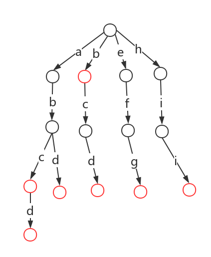

去年做过一个简单的敏感词过滤的程序，最近又需要用到这个功能，复习并整理一下敏感词过滤的相关技术。

<!-- more -->

最简单来说，敏感词过滤最简单的方式就是循环敏感词，然后去输入的文本中从头到尾搜索一遍，看是否存在此敏感词，有则做相应的处理。这种方法的效率显然是无法满足实际应用的。文本我们来看看满足实际使用的算法。

# DFA

`DFA`即`Deterministic Finite Automaton`，也就是确定有限状态自动机。它通过event和当前state得到下一个state，即`event + state = nextstate`。

Trie树，即字典树，是一种树形结构，是一种哈希树的变种。典型应用是用于统计和排序大量的字符串（但不仅限于字符串），所以经常被搜索引擎用于文本词频统计。它的优点是最大限度地减少无畏的字符串比较，查询效率比哈希表高。

比如我们有以下几个敏感词：`b`、`abc`、`bcd`、`abcd`、`efg`、`hii`。我们构建的数如下所示：



在Java中将此图翻译成一个map：

```
a: {
    isEnd: 0
    b: {
        isEnd: 0
        c: {
            isEnd: 1
            d: {
                isEnd: 1
            }
        }
        d: {
            isEnd: 1
        }
    }
}

b: {
    isEnd: 1
    c: {
        isEnd: 0
        d: {
            isEnd: 1
        }
    }
}

e: {
    isEnd: 0
    f: {
        isEnd: 0
        g: {
            isEnd: 1
        }
    }
}

h: {
    isEnd: 0
    i: {
        isEnd: 0
        i: {
            isEnd: 1
        }
    }
}
```

DFA实现的第一步是初始化一个包含所有敏感词的树。下面是针对每个敏感词字符的处理顺序（以`abc`为例）：

1. 在hashmap中查询`a`，如果不存在，则新建一个hashmap
2. 如果在hashmap中查询到了`a`，则设置`hashmap = hashmap.get("a")`，然后跳转至第一步，匹配`b`
3. 判断该字符是否是最后一个。是，则在hashmap中加入`isEnd=1`；否，则在hashmap中加入`isEnd=0`

有了所有敏感词组成的树，我们就可以来检测一个字符串是否包含敏感词。流程如下：

1. 遍历待检测的字符串的每个字符
2. 如果一个字符在树中不存在，则返回步骤1取下一个字符进行检测
3. 如果一个字符在树中存在，则从树的该节点开始，检测从该字符开始的字符串是否有敏感词。如果遇到了`isEnd=1`，则表示包含了一个完整的敏感词。

完整代码请参考：[SensitiveWordsFilter.java](https://github.com/wangqifox/wordfilter/blob/master/src/main/java/love/wangqi/SensitiveWordsFilter.java)

# 基于倒排索引的组合敏感词查找

组合敏感词指的是：一组敏感词必须同时出现才属于敏感词，单个敏感词并不属于敏感词。

比如我们有三组敏感词：`A B`、`A C`、`D`。我们使用DFA检测出三个单个的敏感词：`A`、`B`、`D`。我们怎么确定包含哪些单个敏感词和组合敏感词呢？

一种方法是遍历给定的组合敏感词，如果我们找到的单个敏感词(`A`、`B`、`D`)完全包含某个给定的敏感词词组(`A B`)，说明敏感词`A B`为组合敏感词。时间复杂度为O(x*y)，其中x为文本中的敏感词数量，y为组合敏感词的数量。

遍历所有组合敏感词的方法显然时间复杂度太高，不适合实际环境使用。于是我们找到了一个基于倒排索引的组合敏感词查找。

首先，对于组合敏感词中出现的每个单个敏感词建立倒排索引。以上面的三组敏感词为例，倒排索引如下：

```
A: A,B A,C
B: A,B
C: A,C
D: D
```

当我们找到的单个敏感词为`A`、`B`、`D`之后，根据倒排索引找到它们对应的组合敏感词：`A B`、`A C`、`D`。再根据组合敏感词是否同时出现在单个敏感词中来判断是否是真正的组合敏感词。

完整代码请参考：[CombinationSensitiveWordsFilter.java](https://github.com/wangqifox/wordfilter/blob/master/src/main/java/love/wangqi/CombinationSensitiveWordsFilter.java)


> http://www.yunliaoim.com/im/1149.html
> https://blog.csdn.net/hitxiaoyin/article/details/72634409


