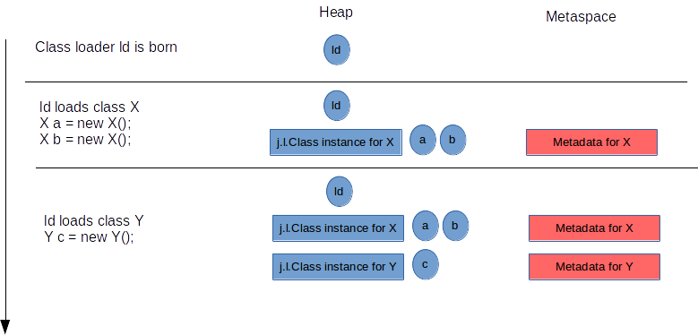
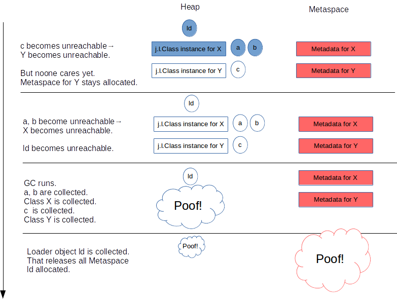
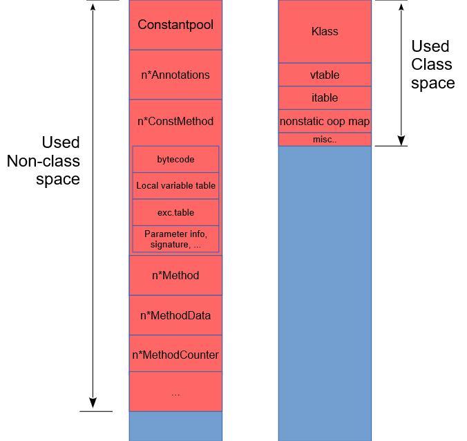
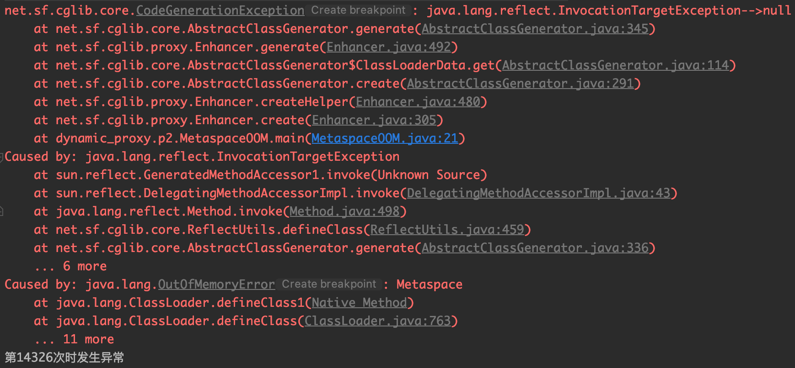
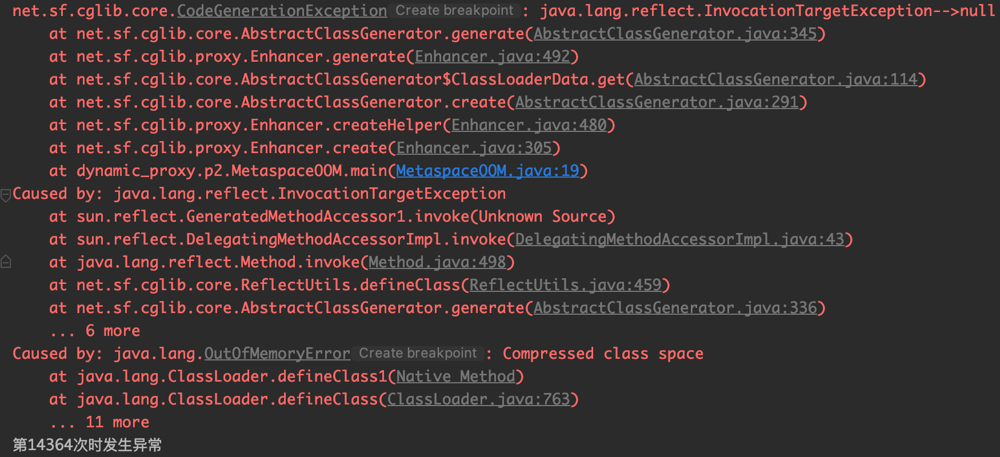

方法区是Java虚拟机在运行时管理的一块数据区域。方法区的数据在日常开发中需要关注的情况比较少，因此对它的了解总是处于一知半解的状态。趁着这次对JVM相关知识的复习，重新梳理一下方法区的知识。

<!-- more -->

## 方法区

方法区（Method Area）与Java堆一样，是各个线程共享的内存区域。它用于存储类的元数据(class metadata)。

方法区是Java虚拟机规范中定义的一个区域。注意方法区只是规范中的一个定义，抽象地规定了这是一块存储类元数据的空间，之所以我总是对它的理解模模糊糊，正是因为没有明白这一点。至于具体的实现是由各个Java虚拟机自己定的。

对于HotSpot虚拟机，在`JDK1.8`之前，方法区的实现是“永久代”（`Permanent Generation`）。

永久代与Java堆的关系非常密切，他们之间在内存上是连续的。虚拟机把GC分代收集扩展至永久代，将永久代和老年代的垃圾收集器进行了捆绑，在永久代上也使用老年代的垃圾回收算法。这样一来，HotSpot的垃圾收集器可以像管理Java堆一样管理这部分内存，能够省去专门为方法区编写内存管理代码的工作。

使用永久代来实现方法区并不是一个好主意，因为这样更容易遇到内存溢出的问题（永久代有`-XX:MaxPermSize`的上限）。

到了`JDK1.8`，HotSpot虚拟机完全移除了永久代，`Metaspace`取而代之，即`Metaspace`是方法区新的实现。

## Metaspace

`Metaspace`与永久代最大的区别就是`Metaspace`不位于堆中，而是位于堆外。所以它的最大内存大小取决于系统内存，而不是堆大小。

对于`Metaspace`的配置只需要调节两个参数：

- `-XX:MaxMetaspaceSize`：`Metaspace`总空间最大允许使用的内存，默认是不做限制。
- `-XX:CompressedClassSpaceSize`：`Metaspace`中`Compressed Class Space`（关于这部分内存可以参考上文[Java指针压缩][1]）的最大允许内存，默认值是`1G`，这部分会在JVM启动的时候向操作系统申请1G的虚拟地址映射，但不是真的就用了操作系统的1G内存。

`Metaspace`是用于存放`class metadata`(类元数据)的区域。

`Class metadata`是Java类在JVM中运行时的表示形式，本质上是JVM处理Java类所需的信息。包括但不限于`JVM class file format`形式的运行时数据。比如：

- `Klass`结构。Java类在虚拟机内部的运行时表示，包括`vtable`和`itable`。
- `Method metadata`方法元数据。Java类文件中`method_info`结构在虚拟机内部的运行时表示，包括`bytecode`（字节码）、`exception table`（异常表）、`constants`（常量）等。
- `constant pool`常量池。
- `Annotations`注解。
- 方法计数器。记录方法执行的次数，用于辅助JIT的决策。
- 其他。

虚拟机对Java类在完成加载阶段后，Java类的二进制数据就按照虚拟机所需的格式存储在方法区之中，对于HotSpot（JDK1.8之后）来说，就是存储在`Metaspace`中。

之后虚拟机会实例化一个`java.lang.Class`对象，这个对象将作为程序访问方法区中的这些类型数据的外部接口。`java.lang.Class`保存在Java堆中，但是`class metadata`（类的元数据）并不是Java对象，它们保存在`Metaspace`中。

> 关于`java.lang.Class`对象是在方法区还是在堆中可以参考[hotpot java虚拟机Class对象是放在 方法区 还是堆中](https://www.zhihu.com/question/38496907/answer/156793201)。

### 分配Metaspace的空间

`Metaspace`中空间的分配由类加载器负责。当一个类被加载且其元数据已经生成，它的类加载器会在`Metaspace`中分配空间用于存放这个类的元数据。




如上图所示，类加载器`Id`在第一次加载类`X`和`Y`的时候，在`Metaspace`中开辟空间存放`X`和`Y`的元信息。

### 释放Metaspace的空间

`Metaspace`中分配给某个类的空间是由加载这个类的类加载器所有的，只有当类加载器本身被卸载的时候，这些空间才可能被释放。

`Metaspace`空间被释放需要满足三个条件：

1. 这个类加载器加载的所有类都没有存活的对象
2. 不存在对这些类和类加载器的引用
3. 发生GC

如下图所示：



`Metaspace`只有在GC发生的时候才会尝试释放空间。但是在某些情况下，`Metaspace`会主动触发GC来回收一些没有用的`class metadata`，即使这个时候Java堆空间还达不到GC的条件。`Metaspace`在两种情况下会触发GC：

1. 在`Metaspace`中分配空间。

    虚拟机维护了一个阈值，当`Metaspace`的空间大小超过这个阈值时，`Metaspace`不会立刻扩大空间，而是尝试触发GC来达到复用空间的目的。这个阈值会上下调整，和`Metaspace`已经占用的操作系统内存保持一个距离。
    
    一个阈值的初始值可以通过`-XX:MetaspaceSize=size`参数来指定。

2. 遇到`Metaspace OOM`。

    当`Metaspace`使用的空间达到了`MaxMetaspaceSize`设置的阈值，或者`Compressed Class Space`被用光了，就会执行GC来腾出空间。
    
    如果GC真的通过卸载类加载器腾出了很多的空间，程序能正常运行。否则，就会进入一个糟糕的GC循环，尽管这个时候还有足够的堆空间。

    因此，千万不要把`MaxMetaspaceSize`设置得太小。

注意：

`Metaspace`的空间被释放，并不意味着这部分内存会还给操作系统。一部分或者所有的内存都会由JVM保留下来，用于接下来的类加载。

至于保留多达的空间，取决于`Metaspace`的碎片化程度。另外，`Metaspace`中的`Compressed Class Space`一定不会还给操作系统。

### Metaspace的组成

上文[Java指针压缩][1]说过，`Metaspace`分为两个区域：`class`和`non-class`空间。如下图所示：



- Class Space

    最大的一部分是Klass结构，它是固定大小的。
    
    紧接着两个可变大小的`vtable`和`itable`，前者由类中方法的数量决定，后者由这个类所实现接口的方法数量决定。`vtable`和`itable`通常很小，但是对于一些巨大的类，它们也可以很大，一个有300000个方法的类，`vtable`的大小会达到`240k`，如果类派生自一个拥有30000个方法的接口，也是同理。但是这些都是测试案例，除了自动生成的代码，从来不会看到这样的类。
    
    随后是一个`map`，记录了类中引用的Java对象的地址，尽管该结构一般都很小，不过也是可变的。

- Non-Class Space

    这个区域有很多东西，下面这些占用了最多的空间：
    
    - 常量池，可变大小
    - 类成员方法的`metadata`。`ConstMethod`结构，包含了好几个可变大小的内部结构，如方法字节码、局部变量表、异常表、参数信息、方法签名等
    - 运行时数据，用来控制JIT的行为
    - 注解

## 代码示例

前面说了很多`Metaspace`的组成，接下来看看什么情况`Metaspace`会发生溢出。

第一种情况是限制了`Metaspace`的最大值，并且加载的类太多：

为了产生大量的类，我们使用动态代理来生成。参考：[动态代理][2]。

```java
public class MetaspaceOOM {
    public static void main(String[] args) {
        int i = 0;
        try {
            for (; ; i++) {
                Enhancer enhancer = new Enhancer();
                enhancer.setSuperclass(HelloConcrete.class);
                enhancer.setUseCache(false);
                enhancer.setCallback(new MyMethodInterceptor());

                enhancer.create();
            }
        } catch (Exception e) {
            e.printStackTrace();
            System.out.println("第" + i + "次时发生异常");
        }
    }
}
```

使用`-XX:MaxMetaspaceSize=128m`来限制`Metaspace`的最大值为`128m`。

运行结果为:



可以看到，当把`Metaspace`限制的`128m`时，大概加载了14326个类之后就发生了`Metaspace`区域的溢出。

另一种情况是限制了`class`区域的大小，`Metaspace`的最大值不做限制：

使用`-XX:CompressedClassSpaceSize=10m`来限制`class`区域的大小为`10m`。

运行结果为：



可以看到，虽然`Metaspace`的大小没有限制，但是如果`class`区域很小，也会发生内存溢出的错误。

不过，`class`区域默认情况下`1G`的大小已经可以满足绝大多数的情况，除非发生了动态代理不停生成代理类的异常，这种情况大概率应该是代码中的bug了。


[1]: /articles/Java/Java指针压缩.html
[2]: /articles/Java/动态代理.html

> 深入理解Java虚拟机——JVM高级特性与最佳实践
> https://www.javadoop.com/post/metaspace
> https://stuefe.de/posts/metaspace/what-is-metaspace/
> https://blog.csdn.net/Xu_JL1997/article/details/89433916
> https://www.cnblogs.com/xrq730/p/8688203.html