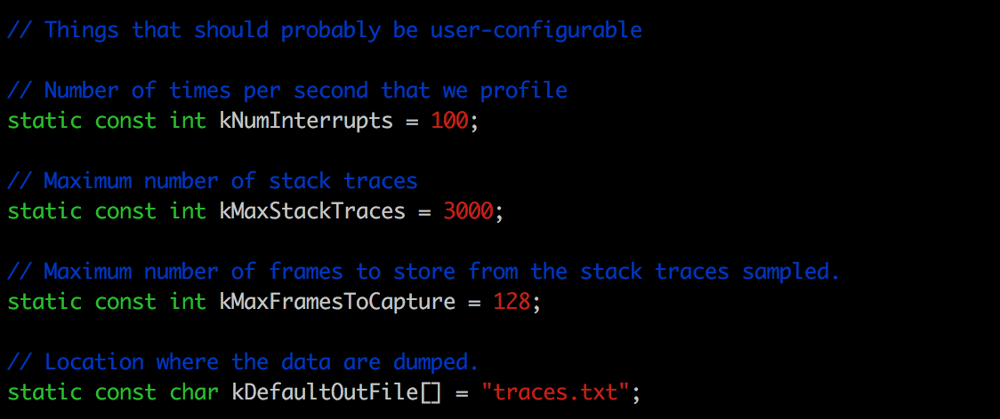
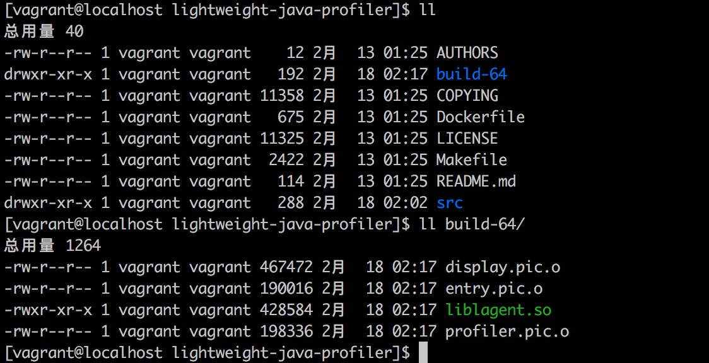
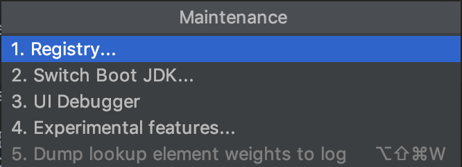
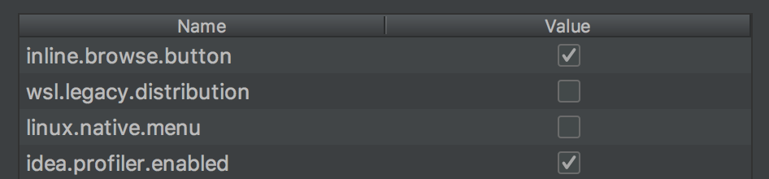
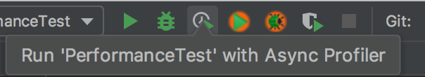
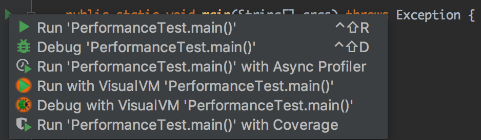
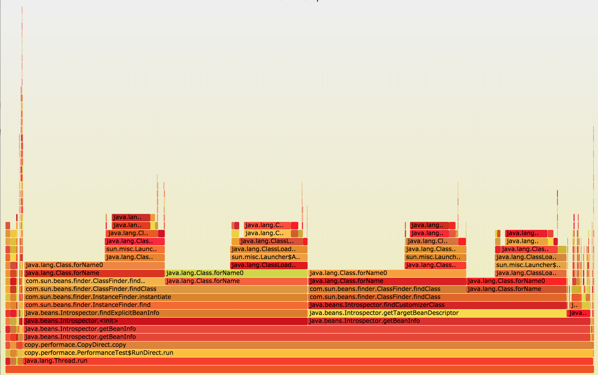

火焰图是程序性能分析的一款工具，借助火焰图我们可以比较直观地分析出CPU耗时，了解瓶颈在哪里。

<!-- more -->

本文中，我介绍如何在Java程序执行的过程中生成火焰图，以及使用火焰图来排查[复制bean属性兼谈本地缓存的作用][1]文章中提到的bean属性复制性能问题。

## 生成火焰图

### 在Linux中生成火焰图

首先，我们需要使用[lightweight-java-profiler](https://github.com/pandening/lightweight-java-profiler)来收集Java代码运行时的profile数据。步骤如下：

1. 将`lightweight-java-profiler`代码clone到本地，在编译之前可以进行一些数据收集的方案定制



上面的参数设定在`golbals.h`文件中可以找到，可以根据实际情况进行设定，比如`kNumInterrupts`的意思就是每秒钟进行数据收集的次数，默认输出profile数据的文件的名字为`traces.txt`这些都可以做自定义修改。

2. 修改完之后就可以进行编译了，在64位机器上编译可以使用下面的命令：

`make BITS=64 all`



如果顺利的话，可以看到会生成一个`build-64`的文件夹，里面有一个`liblagent.so`文件，这就是我们需要的收集profile数据的`.so`文件。现在你可以在启动Java应用的时候加上下面的参数：

```
-agentpath:${path}/lightweight-java-profiler/build-64/liblagent.so
```

3. 生成火焰图。

程序执行完之后，就可以获取到`trace.txt`文件。接下来，就需要将Java应用的运行时profile数据转换为可视化的火焰图来进行性能分析了，使用[FlameGraph](https://github.com/brendangregg/FlameGraph)将profile数据转化为火焰图。命令如下：

```
cd FlameGraph
./stackcollapse-ljp.awk < ${path}/traces.txt | ./flamegraph.pl > {$path}/traces.svg
```

执行完之后可以得到一个火焰图的svg文件，在浏览器中打开就可以看到火焰图的细节。

### 在IntelliJ Idea中生成火焰图

如果你在Linux和Mac平台（Windows暂未支持）上使用IntelliJ Idea，除了使用`lightweight-java-profiler`来生成火焰图之外，还可以使用`IntelliJ Idea`来更加方便地生成火焰图。

在`IntelliJ Idea 2018.3`版本之后，作为实验特性引入了火焰图。因此默认该功能没有开启，我们需要手动开启。

1. 使用`Cmd-Alt-Shift-/`快捷键：



2. 选择`4. Experimental features...`



将`idea.profiler.enabled`打钩。

`profiler`开启之后，我们就可以使用`Async Profiler`来启动程序。





同时，可以执行`Run | Attach Profiler to Local Process…`来将`profiler`关联到一个正在执行的程序。也可以执行`Run | Import Profiler Dump`导入一个`profiler`生成的结果。

## 分析火焰图

得到的图片示例如下，像一团火焰，因此得名火焰图：



图片文件如下：

[traces_direct](media/traces_direct.svg)

[traces_cache](media/traces_cache.svg)

火焰图是一个SVG图片，用来展示CPU的调用栈。

y轴表示调用栈，每一层都是一个函数。调用栈越深，火焰就越高，顶部就是正在执行的函数，下方都是它的父函数。

x轴表示抽样数，如果一个函数在x轴占据的宽度越宽，就表示它被抽到的次数多，即执行的时间长。注意，x轴不代表时间，而是所有的调用栈合并后，按字母顺序排列的。

火焰图就是看顶层的哪个函数占据的宽度最大。只要有"平顶"(plateaus)，就表示该函数可能存在性能问题。

以[复制bean属性兼谈本地缓存的作用][1]文章中的两个属性复制方式为例，我们看到`CopyDirect.copy`方法占用的宽度极大，其中几乎全部是`java.beans.Introspector.getBeanInfo`方法耗费了cpu。减少该方法的调用对于提高性能意义重大。在`CopyCache.copy`方法的火焰图中我们就可以看到，`java.beans.Introspector.getBeanInfo`方法的占用比例减少了很多，因此，极大地提升了属性复制的性能。


[1]: /articles/Java/复制bean属性兼谈本地缓存的作用.html

> https://www.jianshu.com/p/3d67d4eaf649
> https://blog.jetbrains.com/idea/2018/09/intellij-idea-2018-3-eap-git-submodules-jvm-profiler-macos-and-linux-and-more/
> http://www.ruanyifeng.com/blog/2017/09/flame-graph.html

