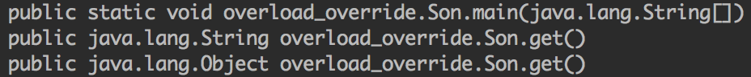
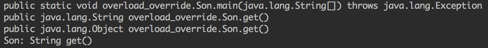

重载(overload)与重写(override)是Java中两个重要的概念。本文对这两个概念区别进行整理以及对原理进行学习。

<!-- more -->

# 重载与重写规则

## 重载

重载发生在一个类里面，方法名字相同，而参数不同。最常用的地方就是构造器的重载。

重载规则如下：

- 必须改变参数列表（参数个数或类型不一样）
- 可以改变返回类型
- 可以改变访问修饰符
- 可以声明新的或更广的检查异常
- 发生在同一个类或同一个子类
- 无法以返回值类型作为重载函数的区分标准

换句话说，只要方法名字相同，参数不同，其他的方面比如返回类型、访问修饰符、异常都可以改变或者不变。

## 重写

重写发生在子类与父类之间，是子类对父类允许访问的方法进行重新编写，返回值和形参都不能改变。即**外壳不变，核心重写**

重写的好处在于子类可以根据需要，定义特定于自己的行为。也就是说子类能够根据需要实现父类的方法。

重写规则如下：

- 方法名字、参数列表必须完全与被重写方法相同
- 方法的返回类型必须和被重写方法的返回类型相同或者是被重写方法返回类型的子类
- 访问权限不能比父类中被重写的方法的访问权限更低。例如：如果父类的一个方法被声明为public，那么在子类中重写该方法就不能声明为protected
- 重写的方法能够抛出任何非强制异常，无论被重写的方法是否抛出异常。但是，重写的方法不能抛出新的强制性异常，或者比被重写方法声明的更广泛的强制性异常，反之则可以。
- 父类的成员方法只能被它的子类重写
- 声明为final的方法不能被重写
- 声明为static的方法不能被重写，但是能够被再次声明
- 子类和父类在同一个包中，那么子类可以重写父类所有方法，除了声明为private和final的方法
- 子类和父类不在同一个包中，那么子类只能够重写父类的声明为public和protected的非final方法
- 构造方法不能被重写
- 如果不能继承一个方法，则不能重写这个方法

重载与重写的区别如下表所示：

|区别点|重载|重写|
|-----|---|----|
|参数列表|不一样|一样|
|返回类型|可以不一样|可以缩小|
|异常|可以不一样|可以缩小|
|访问权限|可以不一样|可以放大|

# 原理

## 方法特征签名

为什么方法重载必须保证参数列表不一样？

这涉及到方法特征签名的概念。Java用方法特征签名来区分两个不同的方法。

有两个不同层面的方法特征签名：

- Java语言层面：特征签名 = 方法名 + 参数类型 + 参数顺序
- JVM层面：特征签名 = 方法名 + 参数类型 + 参数顺序 + 返回值类型。如果存在类型变量或参数化类型，还包括类型变量或参数化类型编译未擦除类型前的信息（FormalTypeParametersopt），和抛出的异常信息（ThrowsSignature），即方法名+签名。

Java语言重载一个方法，需要Java语言层面的方法特征签名不同，即不包括方法返回值；而Class文件中有两个同名同参数（类型、顺序都相同），但返回值类型不一样，也是允许的，可以正常运行，因为JVM层面的方法特征签名包括返回值类型。同样的，对字段来说，Java语言规定字段无法重载，名称必须不一样；但对Class文件来说，只要两个字段描述（类型）不一样，名称一样也是可以的。

经过上面的描述，可以这样说，重载实际上是Java语言层面的概念，就是两个相同名称的不同方法。因为对于编译之后的字节码来说，实际上就是两个完全不同的方法。

## 重写方法返回值缩小的秘密

前面我们说到，方法重写之后返回值可以缩小，如下代码所示：

```java
public class Father {
    public Object get() {
        return null;
    }
}

public class Son extends Father {
    @Override
    public String get() {
        return "";
    }

    public static void main(String[] args) {
        Father father = new Son();
        String a = (String) father.get();
        Method[] methods = father.getClass().getDeclaredMethods();
        for (Method method : methods) {
            System.out.println(method);
        }
    }
}
```

`Son`中的`get`方法是对`Father`中`get`方法的重写。

它的执行结果如下：



可以看到当我们调用`getDeclaredMethods`方法时，返回的方法中居然包含一个`Object get()`方法。这是一个很奇怪的地方，因为我们知道`getDeclaredMethods`方法获取的是类自身声明的所有方法，包含public、protected和private方法，但是不包含从基类继承的、从接口实现的方法。

于是我们再来查看一下两个类编译之后的字节码：

`Father`类字节码：

```
public java.lang.Object get();
    descriptor: ()Ljava/lang/Object;
    flags: ACC_PUBLIC
    Code:
      stack=1, locals=1, args_size=1
         0: aconst_null
         1: areturn
      LineNumberTable:
        line 10: 0
```

`Son`类字节码：

```
public java.lang.String get();
    descriptor: ()Ljava/lang/String;
    flags: ACC_PUBLIC
    Code:
      stack=1, locals=1, args_size=1
         0: ldc           #2                  // String
         2: areturn
      LineNumberTable:
        line 13: 0
    
public java.lang.Object get();
    descriptor: ()Ljava/lang/Object;
    flags: ACC_PUBLIC, ACC_BRIDGE, ACC_SYNTHETIC
    Code:
      stack=1, locals=1, args_size=1
         0: aload_0
         1: invokevirtual #11                 // Method get:()Ljava/lang/String;
         4: areturn
      LineNumberTable:
        line 10: 0
```

为了方便，省去了其他无关的字节码。从字节码中可以看出`Son`经过编译后确实多了一个`Object get()`方法，这个方法在`Son`源代码中并不存在，是编译器为了解决多台问题而自动生成的方法，称为`桥方法`。可以看到`Object get()`方法的flags中多了`ACC_BRIDGE`和`ACC_SYNTHETIC`两个标记，其中`ACC_BRIDGE`说明这个方法是由编译生成的桥接方法，`ACC_SYNTHETIC`说明这个方法是由编译器生成的，并且不会在源代码中出现。

其实`Son`里面真正重写`Father`中`Object get()`方法的是编译器生成的`Object get()`方法，`String get()`方法其实是对`Object get()`方法的重载。虽然它们的方法名和参数列表相同，在代码中是不能重载的，但是前面提到JVM层面是支持这种重载的，因为它将返回值也作为方法签名的一部分。

编译器生成的`Object get()`方法功能很简单，就是调用我们"重写"的方法。我们可以通过反射来调用这个自动生成的`Object get()`方法：

```java
public class Son extends Father {
    @Override
    public String get() {
        System.out.println("Son: String get()");
        return "";
    }

    public static void main(String[] args) throws Exception {
        Father father = new Son();
        Method[] methods = father.getClass().getDeclaredMethods();
        for (Method method : methods) {
            System.out.println(method);
        }
        methods[1].invoke(father);
    }
}
```

执行结果为：



## 方法调用

方法调用并不等同于方法执行，方法调用阶段唯一的任务就是确定被调用方法的版本（即调用哪一个方法），暂时还不涉及方法内部的具体运行过程。在程序运行时，进行方法调用是最普遍、最频繁的操作，但Class文件的编译过程中部包含传统编译中的连接步骤，一切方法调用在Class文件里面存储的都只是符号引用，而不是方法在实际运行时内存布局中的入口地址（相当于之前说的直接引用）。这个特性给Java带来了更强大的动态扩展能力，但也使得Java方法调用过程变得相对复杂起来，需要在类加载期间，甚至到运行期间才能确定目标方法的直接引用。

### 解析

所有方法调用中的目标方法在Class文件里面都是一个常量池中的符号引用，在类加载的解析阶段，会将其中的一部分符号引用转化为直接引用，这种解析能成立的前提是：方法在程序真正运行之前就有一个可确定的调用版本，并且这个方法的调用版本在运行期间是不可改变的。换句话说，调用目标在程序代码写好、编译器进行编译时就必须确定下来。这类方法的调动称为解析（Resolution）。

在Java语言中符合"编译期可知，运行期不可变"这个要求的方法，主要包括静态方法和私有方法两大类，前者与类型直接关联，后者在外部不可被访问，这两种方法各自的特点决定了它们都不可能通过继承或别的方式重写其他版本，因此它们都适合在类加载阶段进行解析。

与之相对应的是，在Java虚拟机里面提供了5条方法调用字节码指令，分别如下：

- `invokestatic`：调用静态方法
- `invokespecial`：调用实例构造器<init>方法、私有方法和父类方法
- `invokevirtual`：调用所有的虚方法
- `invokeinterface`：调用接口方法，会在运行时再确定一个实现此接口的对象
- `invokedynamic`：先在运行时动态解析出调用点限定符所引用的方法，然后再执行该方法，在此之前的4条调用指令，分派逻辑是固化在Java虚拟机内部的，而`invokedynamic`指令的分派逻辑是由用户所设定的引导方法决定的。

只要能被`invokestatic`和`invokespecial`指令调用的方法，都可以在解析阶段中确定唯一的调用版本，符合这个条件的有静态方法、私有方法、实例构造器、父类方法4类，它们在类加载的时候就会把符号引用解析为该方法的直接引用。这些方法可以被称为非虚方法，与之相反，其他方法称为虚方法（除去final方法）。

下面来看看解析调用的例子：

```java
public class Resolution {
    protected void say() {
        System.out.println("say something");
    }
}

public class StaticResolution extends Resolution {
    public static void sayHello() {
        System.out.println("hello");
    }

    public void sayWorld() {
        System.out.println("world");
    }

    private void sayGood() {
        System.out.println("good");
    }

    public final void sayBye() {
        super.say();
        sayGood();
        System.out.println("bye");
    }

    public static void main(String[] args) {
        StaticResolution.sayHello();
        StaticResolution resolution = new StaticResolution();
        resolution.sayWorld();
        resolution.sayBye();
    }
}
```

编译后的字节码如下：

```
public final void sayBye();
    descriptor: ()V
    flags: ACC_PUBLIC, ACC_FINAL
    Code:
      stack=2, locals=1, args_size=1
         0: aload_0
         1: invokespecial #7                  // Method overload_override/Resolution.say:()V
         4: aload_0
         5: invokespecial #8                  // Method sayGood:()V
         8: getstatic     #2                  // Field java/lang/System.out:Ljava/io/PrintStream;
        11: ldc           #9                  // String bye
        13: invokevirtual #4                  // Method java/io/PrintStream.println:(Ljava/lang/String;)V
        16: return
      LineNumberTable:
        line 22: 0
        line 23: 4
        line 24: 8
        line 25: 16

  public static void main(java.lang.String[]);
    descriptor: ([Ljava/lang/String;)V
    flags: ACC_PUBLIC, ACC_STATIC
    Code:
      stack=2, locals=2, args_size=1
         0: invokestatic  #10                 // Method sayHello:()V
         3: new           #11                 // class overload_override/StaticResolution
         6: dup
         7: invokespecial #12                 // Method "<init>":()V
        10: astore_1
        11: aload_1
        12: invokevirtual #13                 // Method sayWorld:()V
        15: aload_1
        16: invokevirtual #14                 // Method sayBye:()V
        19: return
```

在`sayBye`方法中，我们可以看到：

- 对父类方法`say`的调用使用`invokespecial`指令
- 对私有方法`sayGood`的调用使用`invokespecial`指令

在`main`方法中，我们可以看到：

- 对静态方法`sayHello`的调用使用`invokestatic`指令
- 对实例构造器`<init>`的调用使用`invokespecial`指令
- 对实例方法（即虚方法）的调用使用`invokevirtual`指令
- 对final方法的调用使用`invokevirtual`指令

Java中的非虚方法除了使用`invokestatic`、`invokespecial`调用的方法之外还有一种，就是被final修饰的方法。虽然final方法是使用`invokevirtual`指令来调用的，但是由于它无法被覆盖，没有其他版本，所以也无须对方法接收者进行多态选择，又或者说多态选择的结果肯定是唯一的。在Java语言规范中明确说明了final方法是一种非虚方法。

解析调用一定是个静态的过程，在编译期间就完全确定，在类装载的解析阶段就会把涉及的符号引用全部转变为可确定的直接引用，不会延迟到运行期再去完成。

### 分派

#### 静态分派

静态分派是"重载"的基础。

静态分派示例如下：

```java
public class StaticDispatch {
    static abstract class Human {

    }

    static class Man extends Human {

    }

    static class Woman extends Human {

    }

    public void sayHello(Human guy) {
        System.out.println("hello, guy!");
    }

    public void sayHello(Man guy) {
        System.out.println("hello, gentleman!");
    }

    public void sayHello(Woman guy) {
        System.out.println("hello, lady!");
    }

    public static void main(String[] args) {
        Human man = new Man();
        Human woman = new Woman();
        StaticDispatch sr = new StaticDispatch();
        sr.sayHello(man);
        sr.sayHello(woman);
    }
}
```

其执行结果如下：

```
hello, guy!
hello, guy!
```

其编译后的字节码如下：

```
public static void main(java.lang.String[]);
    descriptor: ([Ljava/lang/String;)V
    flags: ACC_PUBLIC, ACC_STATIC
    Code:
      stack=2, locals=4, args_size=1
         0: new           #7                  // class overload_override/StaticDispatch$Man
         3: dup
         4: invokespecial #8                  // Method overload_override/StaticDispatch$Man."<init>":()V
         7: astore_1
         8: new           #9                  // class overload_override/StaticDispatch$Woman
        11: dup
        12: invokespecial #10                 // Method overload_override/StaticDispatch$Woman."<init>":()V
        15: astore_2
        16: new           #11                 // class overload_override/StaticDispatch
        19: dup
        20: invokespecial #12                 // Method "<init>":()V
        23: astore_3
        24: aload_3
        25: aload_1
        26: invokevirtual #13                 // Method sayHello:(Loverload_override/StaticDispatch$Human;)V
        29: aload_3
        30: aload_2
        31: invokevirtual #13                 // Method sayHello:(Loverload_override/StaticDispatch$Human;)V
        34: return
```

从字节码中我们可以看到两次调用选择执行的都是`public void sayHello(Human guy)`方法。

但为什么会选择执行参数类型为`Human`的重载呢？在解决这个问题之前，我们先按如下代码定义两个重要的概念。

```java
Human man = new Man();
```

我们把上面代码中的"Human"称为变量的静态类型(Static Type)，或者叫做外观类型(Apparent Type)，后面的"Man"则被称为变量的实际类型(Actual Type)，静态类型和实际类型在程序中都可以发生一些变化，区别是静态类型的变化仅仅在使用时发生，变量本身的静态类型不会被改变，并且最终的静态类型是在编译期可知的；而实际类型变化的结果在运行期才可确定，编译器在编译程序的时候并不知道一个对象的实际类型是什么。例如下面的代码：

```java
// 实际类型变化
Human man = new Man();
Human woman = new Woman();
// 静态类型变化
sr.sayHello((Man)man);
sr.sayHello((Woman)woman);
```

再回到示例代码中。`main()`里面的两次`sayHello()`方法调用，在方法接收者已经确定是对象`sr`的前提下，使用哪个重载版本，就完全取决于传入参数的数量和数据类型。代码中刻意地定义了两个静态类型相同但实际类型不同的变量，但虚拟机（准确地说是编译器）在重载时是通过参数的静态类型而不是实际类型作为判定依据的。并且静态类型是编译期可知的，因此，在编译阶段，Javac编译器会根据参数的静态类型决定使用哪个重载版本，所以选择了`sayHello(Human)`作为调用目标，并把这个方法的符号引用写到`main()`方法里的两条`invokevirtual`指令的参数中。

所有依赖静态类型来定位方法执行版本的分派动作称为静态分派。静态分派的典型应用是方法重载。静态分派发生在编译阶段，因此确定静态分派的动作实际上不是由虚拟机来执行的。

#### 动态分派

动态分派是"重写"的基础。

动态分派示例如下：

```java
public class DynamicDispatch {
    static abstract class Human {
        protected abstract void sayHello();
    }

    static class Man extends Human {
        @Override
        protected void sayHello() {
            System.out.println("man say hello");
        }
    }

    static class Woman extends Human {
        @Override
        protected void sayHello() {
            System.out.println("woman say hello");
        }
    }

    public static void main(String[] args) {
        Human man = new Man();
        Human woman = new Woman();
        man.sayHello();
        woman.sayHello();
        man = new Woman();
        man.sayHello();
    }
}
```

执行结果：

```
man say hello
woman say hello
woman say hello
```

从结果中我们可以看到，这里不可能再根据静态类型来决定执行的方法，因为静态类型同样都是Human的两个变量man和woman在调用sayHello方法时执行了不同的行为，并且变量man在两次调用中执行了不同的方法。导致这个现象的原因很明显，是这两个变量的实际类型不同，Java虚拟机根据实际类型来分派方法执行版本。

编译后的字节码如下：

```
public static void main(java.lang.String[]);
    descriptor: ([Ljava/lang/String;)V
    flags: ACC_PUBLIC, ACC_STATIC
    Code:
      stack=2, locals=3, args_size=1
         0: new           #2                  // class overload_override/DynamicDispatch$Man
         3: dup
         4: invokespecial #3                  // Method overload_override/DynamicDispatch$Man."<init>":()V
         7: astore_1
         8: new           #4                  // class overload_override/DynamicDispatch$Woman
        11: dup
        12: invokespecial #5                  // Method overload_override/DynamicDispatch$Woman."<init>":()V
        15: astore_2
        16: aload_1
        17: invokevirtual #6                  // Method overload_override/DynamicDispatch$Human.sayHello:()V
        20: aload_2
        21: invokevirtual #6                  // Method overload_override/DynamicDispatch$Human.sayHello:()V
        24: new           #4                  // class overload_override/DynamicDispatch$Woman
        27: dup
        28: invokespecial #5                  // Method overload_override/DynamicDispatch$Woman."<init>":()V
        31: astore_1
        32: aload_1
        33: invokevirtual #6                  // Method overload_override/DynamicDispatch$Human.sayHello:()V
        36: return
```

`0~15`行的字节码是准备动作，作用是建立man和woman的内存空间，调用Man和Woman类型的实例构造器，将这两个实例的引用存放在第1、2个局部变量表Slot之中，这个动作也就对应了代码中的这两句：

```java
Human man = new Man();
Human woman = new Woman();
```

接下来的16~21句是关键部分，16、20两句分别把刚刚创建的两个对象的引用压到栈顶，这两个对象是将要执行的`sayHello`方法的所有者，称为接收者(`Receiver`)；17和21句是方法调用指令，这两条调用指令单从字节码角度来看，无论是指令（都是`invokevirtual`）还是参数（都是常量池中第6项的常量，注释显示了这个常量是`Human.sayHello()`的符号引用）完全一样的，但是这两句指令最终执行的目标方法并不相同。原因就需要从`invokevirtual`指令的多态查找开始说起，`invokevirtual`指令的运行时解析过程大致分为以下几个步骤：

1. 找到操作数栈顶的第一个元素所指向的对象的实际类型，记作C
2. 如果在类型C中找到与常量中的描述符和简单名称都相符的方法，则进行访问权限校验，如果通过则返回这个方法的直接引用，查找过程结束；如果不通过，则返回`java.lang.IllegalAccessError`异常
3. 否则，按照继承关系从下往上依次对C的各个父类进行第2步的搜索和验证过程
4. 如果始终没有找到合适的方法，则抛出`java.lang.AbstractMethodError`异常。

由于`invokevirtual`指令执行的第一步就是在运行期确定接收者的实际类型，所以两次调用中的`invokevirtual`指令把常量池中的类方法符号引用解析到了不同的直接引用上，这个过程就是Java语言中方法重写的本质。我们把这种在运行期根据实际类型确定方法执行版本的分派过程称为动态分派。

### 单分派与多分派

方法的接收者与方法的参数统称为方法的宗量。根据分派基于多少种宗量，可以将分派划分为单分派和多分派两种。单分派是根据一个宗量对目标方法进行选择，多分派则是根据多于一个宗量对目标方法进行选择。

但分派和多分配的示例如下：

```java
public class Dispatch {
    static class QQ {}
    static class _360 {}

    public static class Father {
        public void hardChoice(QQ arg) {
            System.out.println("father choose qq");
        }

        public void hardChoice(_360 arg) {
            System.out.println("father choose 360");
        }
    }

    public static class Son extends Father {
        @Override
        public void hardChoice(QQ arg) {
            System.out.println("son choose qq");
        }

        @Override
        public void hardChoice(_360 arg) {
            System.out.println("son choose 360");
        }
    }

    public static void main(String[] args) {
        Father father = new Father();
        Father son = new Son();
        father.hardChoice(new _360());
        son.hardChoice(new QQ());
    }
}
```

运行结果：

```
father choose 360
son choose qq
```

编译后的字节码如下：

```
public static void main(java.lang.String[]);
    descriptor: ([Ljava/lang/String;)V
    flags: ACC_PUBLIC, ACC_STATIC
    Code:
      stack=3, locals=3, args_size=1
         0: new           #2                  // class overload_override/Dispatch$Father
         3: dup
         4: invokespecial #3                  // Method overload_override/Dispatch$Father."<init>":()V
         7: astore_1
         8: new           #4                  // class overload_override/Dispatch$Son
        11: dup
        12: invokespecial #5                  // Method overload_override/Dispatch$Son."<init>":()V
        15: astore_2
        16: aload_1
        17: new           #6                  // class overload_override/Dispatch$_360
        20: dup
        21: invokespecial #7                  // Method overload_override/Dispatch$_360."<init>":()V
        24: invokevirtual #8                  // Method overload_override/Dispatch$Father.hardChoice:(Loverload_override/Dispatch$_360;)V
        27: aload_2
        28: new           #9                  // class overload_override/Dispatch$QQ
        31: dup
        32: invokespecial #10                 // Method overload_override/Dispatch$QQ."<init>":()V
        35: invokevirtual #11                 // Method overload_override/Dispatch$Father.hardChoice:(Loverload_override/Dispatch$QQ;)V
        38: return
```

先来看看静态分派的过程，这时选择目标方法的依据有两点：一是静态类型是Father还是Son，二是方法参数是QQ还是360。这次选择结果的最终产物是产生了两条`invokevirtual`指令，两条指令的参数分别为常量池中指向`Father.hardChoice(360)`及`Father.hardChoice(QQ)`方法的符号引用。因为是根据两个宗量进行选择，所以Java语言的静态分派属于多分派类型。

再看看动态分派的过程。在执行`son.hardChoice(new QQ())`这句代码时，更准确地说，是在执行这句代码所对应的`invokevirtual`指令时，由于编译期已经决定目标方法的签名必须为`hardChoice(QQ)`，虚拟机此时不会关心传递过来的参数"QQ"到底是"腾讯QQ"还是"奇瑞QQ"，因为这时参数的静态类型、实际类型都对方法的选择不会构成任何影响，唯一可以影响虚拟机选择的因素只有方法的接收者的实际类型是Father还是Son。因为只有一个宗量作为选择依据，所以Java语言的动态分派属于单分派类型。

### 虚拟机动态分派的实现

由于动态分派是非常频繁的动作，而且动态分派的方法版本选择过程需要运行时再类的方法元数据中搜索合适的目标方法，因此在虚拟机的实际实现中基于性能的考虑，大部分实现都不会真正地进行如此频繁的搜索。面对这种情况，最常用的"稳定优化"手段就是为类在方法区中建立一个虚方法表（Virtual Method Table，也称为vtable，与此对应的，在invokeinterface执行时也会用到接口方法表——Interface Method Table，简称itable），使用虚方法表索引来代替元数据查找以提高性能。

虚方法表中存放着各个方法的实际入口地址。如果某个方法在子类中没有被重写，那子类的虚方法表里面的地址入口和父类相同方法的地址入口是一致的，都指向父类的实现入口。如果子类中重写了这个方法，子类方法表中的地址将会替换为指向子类实现版本的入口地址。

为了程序实现上的方便，具有相同签名的方法，在父类、子类的虚方法表中都应当具有一样的索引序号，这样当类型变换时，仅需要变更查找的方法表，就可以从不同的虚方法表中按索引转换出所需的入口地址。

方法表一般在类加载的连接阶段进行初始化，准备了类的变量初始值后，虚拟机会把该类的方法表也初始化完毕。


> 深入理解Java虚拟机
> http://www.runoob.com/java/java-override-overload.html
> https://forgkan.gitee.io/2018/02/20/java/java-method-signature/
> https://allenwu.itscoder.com/poly-in-java

