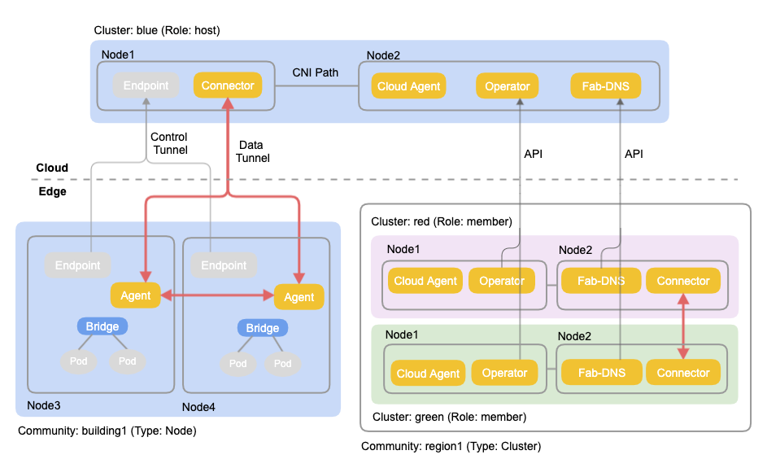
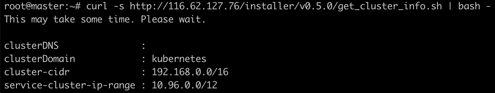
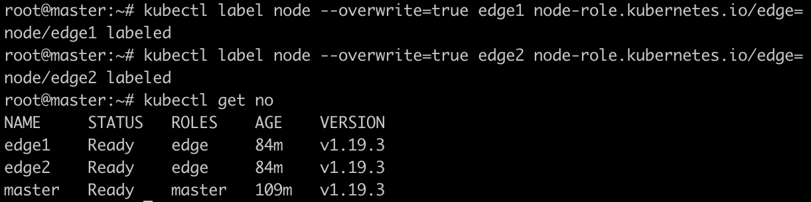
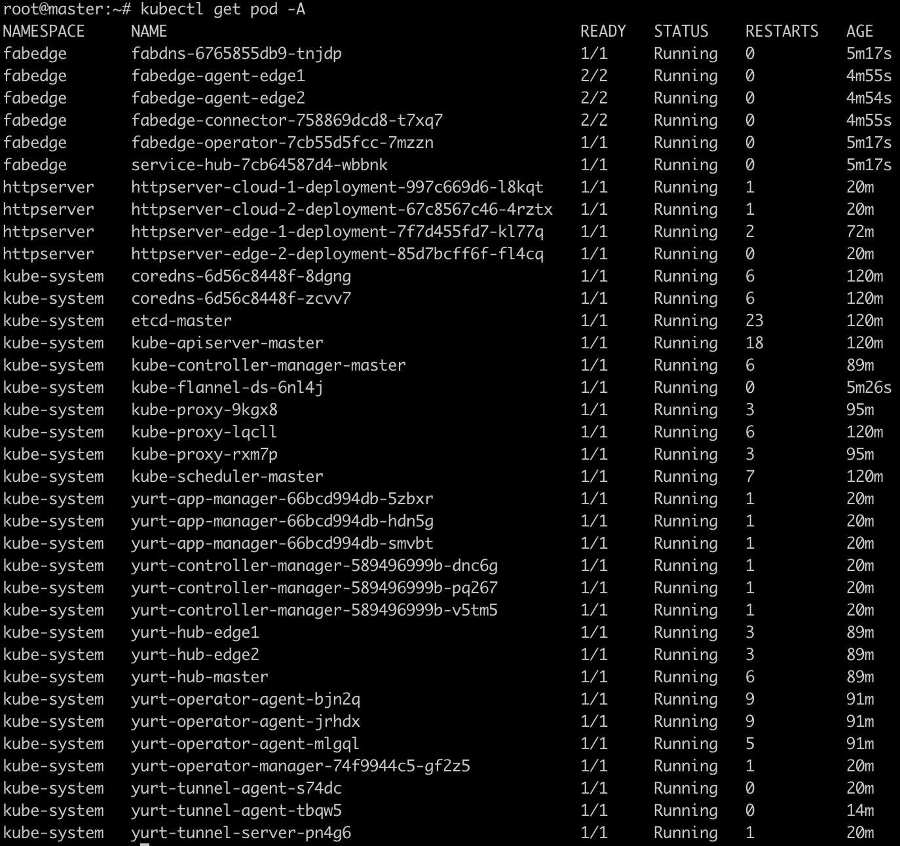
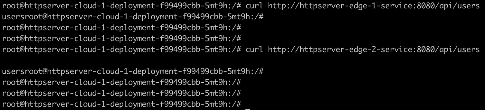
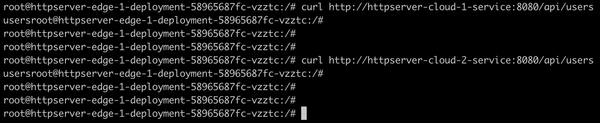

FabEdge是一个基于kubernetes构建的，专注于边缘计算的容器网络方案，支持KubeEdge/SuperEdge/OpenYurt等主流边缘计算框架。 FabEdge旨在解决边缘计算场景下网络管理复杂，跨集群通信困难，缺少能自动感知网络拓扑的服务发现等问题，使能云边、边边业务协同。FabEdge支持4/5G，WiFi等弱网环境，适用于物联网，车联网、智慧城市等场景。

<!-- more -->

FabEdge不仅支持边缘节点（通过KubeEdge等边缘计算框架加入集群的远程节点），还支持边缘集群（独立的K8S集群）。

FabEdge是托管在CNCF下的沙箱项目。

# 特性

- **自动地址管理**：自动管理边缘节点网段，自动管理边缘容器IP地址。
- **云边、边边协同**: 建立云边，边边安全隧道，使能云边，边边之间的业务协同。
- **灵活的隧道管理**: 使用自定义资源“社区”，可以根据业务需要灵活控制边边隧道。
- **拓扑感知路由**: 使用最近的可用服务端点，减少服务访问延时。

# 工作原理



- KubeEdge等边缘计算框架建立了控制面，把边缘节点加入云端K8S集群，使得可以在边缘节点上下发Pod等资源；FabEdge在此基础上建立了一个三层的数据转发面，使得Pod和Pod之间可以直接通讯。
- 云端可以是任何K8S集群，目前支持的CNI包括Calico， Flannel。
- FabEdge使用安全隧道技术，目前支持IPSec。
- FabEdge包括的组件：Operators, Connector，Agent和Cloud-Agent。
- Operator运行在云端任意的节点，通过监听节点，服务等K8S资源，为每个Agent维护一个ConfigMap，包括了本Agent需要的路由信息，比如子网，端点，负载均衡规则等，同时为每个Agent维护一个Secret，包括CA证书，节点证书等。Operator也负责Agent自身的管理，包括创建，更新，删除等。
- Connector运行在云端选定的节点，负责管理从边缘节点发起的隧道，在边缘节点和云端集群之间转发流量。从Connector节点到云端其它非Connector节点的流量转发仍然依靠云端CNI。
- Cloud-Agent运行在集群中所有非边缘，非Connector的节点，它负责管理本节点到远端的路由。
- Agent运行在每个边缘节点上， 它使用自己的ConfigMap和Secret的信息，发起到云端Connector和其它边缘节点的隧道，负责本节点的路由，负载均衡，iptables规则的管理。
- Fab-DNS运行在所有FabEdge的集群里，它通过截获DNS请求，提供拓扑感知的跨集群服务发现能力。


# 安装

## 环境准备

确保防火墙或安全组允许以下协议和端口

```Bash
ESP(50)，UDP/500，UDP/4500
```

获取集群配置信息，供后面使用

```Bash
curl -s http://116.62.127.76/installer/v0.5.0/get_cluster_info.sh | bash -
```




## 在主集群部署FabEdge

为**所有边缘节点**添加标签

```Bash
kubectl label node --overwrite=true edge1 node-role.kubernetes.io/edge=
kubectl label node --overwrite=true edge2 node-role.kubernetes.io/edge=

```



安装FabEdge

```Bash
curl 116.62.127.76/installer/v0.5.0/install.sh | bash -s -- --cluster-name hangzhou  --cluster-role host --cluster-zone hangzhou  --cluster-region china --connectors master --connector-public-addresses 110.42.181.25 --chart http://116.62.127.76/fabedge-0.5.0.tgz
```

说明：

**--cluster-name**: 集群名称

**--cluster-role**: 集群角色

**--cluster-zone：** 集群所在的区

**--cluster-region：**集群所在的区域

**--connectors**: connectors所在节点主机名

**--connector-public-addresses**: connectors所在节点的ip地址，从边缘节点必须网络可达


确认部署正常




为需要通讯的边缘节点创建Community

```Bash
cat > node-community.yaml << EOF
apiVersion: fabedge.io/v1alpha1
kind: Community
metadata:
  name: hangzhou-edge-nodes
spec:
  members:
    - hangzhou.edge1
    - hangzhou.edge2  
EOF
```


```Bash
kubectl apply -f node-community.yaml
```

## 测试结果

以SuperEdge集群来测试

1. 云端访问边端



2. 边端访问云端




