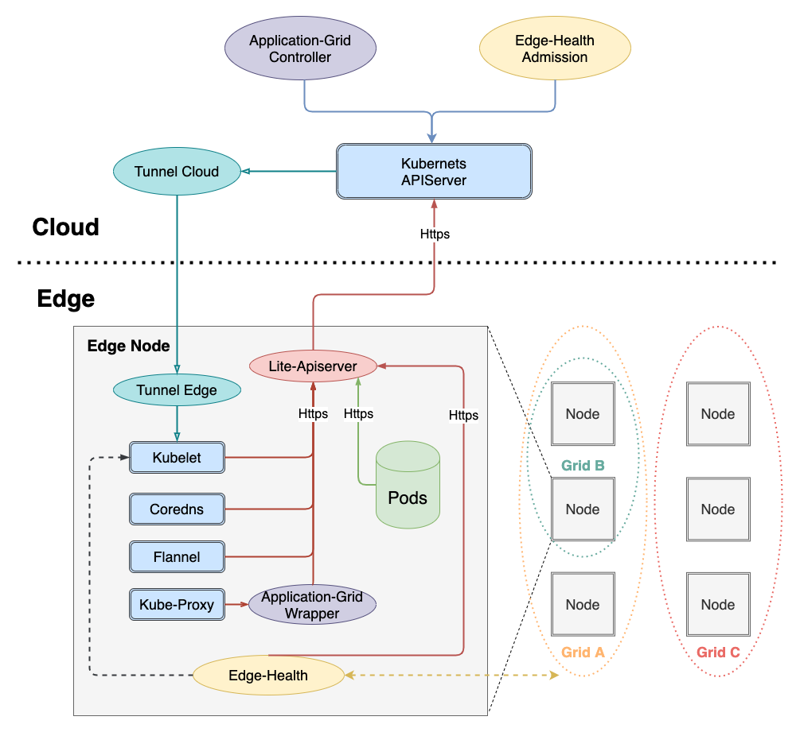
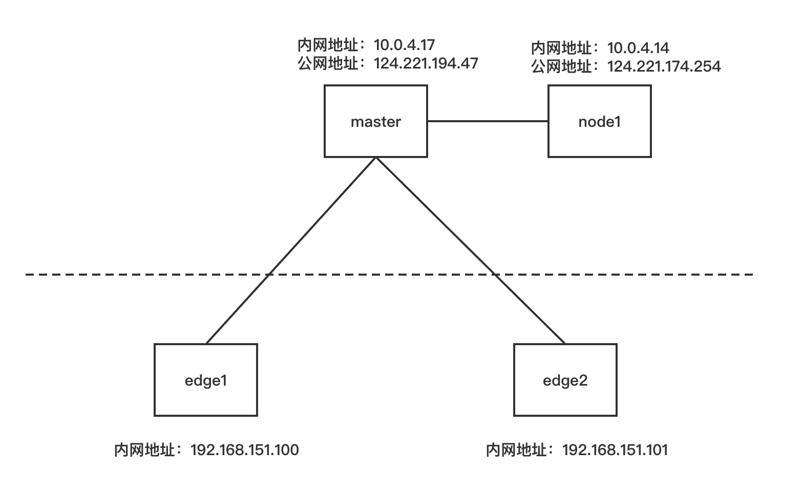
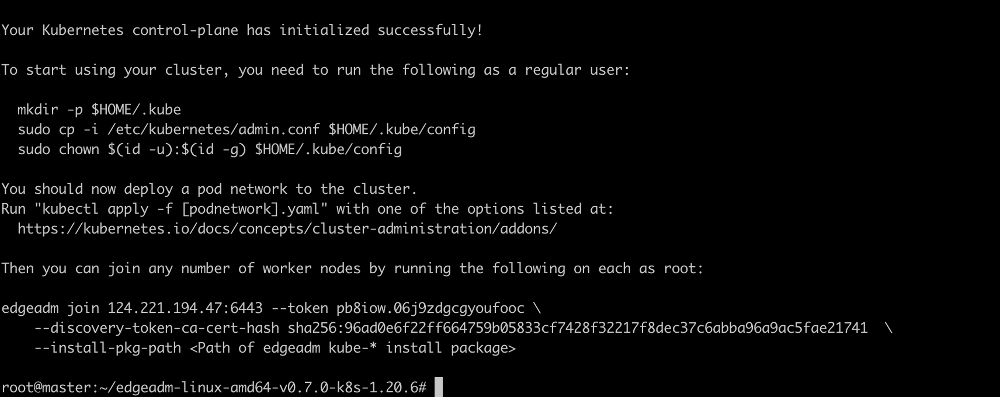
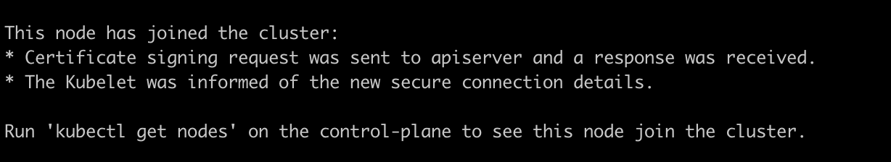
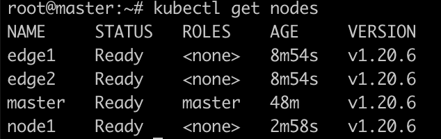
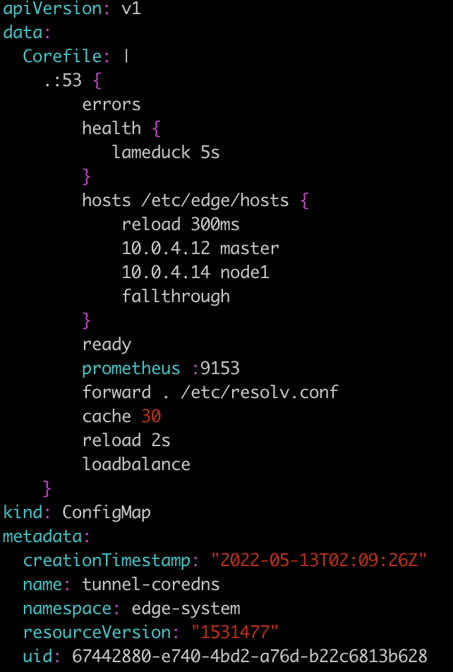

SuperEdge是腾讯开源的Kubernetes原生的边缘容器方案，本文是在学习安装过程中的记录。

<!-- more -->

SuperEdge是Kubernetes原生的边缘容器方案，它将Kubernetes强大的容器管理能力扩展到边缘计算场景中，针对边缘计算场景中常见的技术挑战提供了解决方案，如：单集群节点跨地域、云边网络不可靠、边缘节点位于NAT网络等。这些能力可以让应用很容易地部署到边缘计算节点上，并且可靠地运行。

# 架构



## 云端组件

云端除了边缘集群部署的原生Kubernetes master组件（cloud-kube-APIServer，cloud-kube-controller，cloud-kube-scheduler）外，主要管控组件还包括：

1. tunnel-cloud：负责维持与边缘节点的tunnel-edge的网络隧道，目前支持TCP/HTTP/HTTPS协议。
2. application-grid controller：服务访问控制ServiceGroup对应Kubernetes Controller，负责管理DeploymentGrids以及ServiceGrids CRDs，并由这两种CR生成对应的Kubernetes deployment以及Service，同时自研实现服务拓扑感知，使得服务闭环访问。
3. edge-admission：通过边端节点分布式健康检查的状态报告决定节点是否健康，并协助cloud-kube-controller执行相关处理动作(打taint)。


## 边缘组件

边端除了原生Kubernetes worker节点需要部署的kubelet，kube-proxy外，还添加了如下边缘计算组件：

1. lite-apiserver：边缘自治的核心组件，是cloud-kube-apiserver的代理服务，缓存了边缘节点组件对APIServer的某些请求，当遇到这些请求而且与cloud-kube-apiserver网络存在网络问题的时候会直接返回给client端。
2. edge-health：边缘分布式健康检查服务，负责执行具体的监控和探测操作，并进行投票选举判断节点是否健康。
3. tunnel-dege：负责建立与云端边缘集群tunnel-cloud的网络隧道，并接受API请求，转发给边缘节点组件(kubelet)
4. application-grid wrapper：与application-grid controller结合完成ServiceGrid内的闭环服务访问（服务拓扑感知）


# 安装

## 安装前准备



如上所示准备4台机器：

- `master`节点是云服务商提供的云主机，它同时具有内网地址以及公网地址，是集群中的master角色。
- `node1`节点是云服务商提供的云主机，它同时具有内网地址以及公网地址，是集群中的worker角色。
- `edge1`和`edge2`是内网中的两台虚拟机，因此它没有公网地址，是集群中边缘计算节点。


## 配置机器的hostname

为了便于识别节点，使用`hostnamectl`命令修改节点的hostname：


### 安装socat conntrack

```YAML
apt install socat conntrack
```

## 下载SuperEdge安装包

在**4个节点**中执行以下的命令，下载edgeadmin的静态安装包

```Bash
arch=amd64 version=v0.7.0 kubernetesVersion=1.20.6 && \
rm -rf edgeadm-linux-* && \
wget https://superedge-1253687700.cos.ap-guangzhou.myqcloud.com/$version/$arch/edgeadm-linux-$arch-$version-k8s-$kubernetesVersion.tgz && \
tar -xzvf edgeadm-linux-* && \
cd edgeadm-linux-$arch-$version-k8s-$kubernetesVersion && \
./edgeadm
```

`arch`表示机器的CPU架构，目前支持amd64和arm64。`version`表示安装的SuperEdge版本。

## 安装SuperEdge

### 初始化master节点

```Bash
./edgeadm init \
--kubernetes-version=1.20.6 \
--image-repository superedge.tencentcloudcr.com/superedge \
--service-cidr=10.96.0.0/12 \
--pod-network-cidr=192.168.0.0/16 \
--install-pkg-path ./kube-linux-*.tar.gz \
--apiserver-cert-extra-sans=<Master节点外网IP> \
--apiserver-advertise-address=<Master节点内网IP> \
--enable-edge=true
```

其中：

- —enable-edge=true：是否部署边缘能力，默认true。设置为false表示安装原始Kubernetes集群，和kubeadm搭建的集群完全一样
- —install-pkg-path：Kubernetes静态安装包地址。可以为机器上的路径，也可以为网络地址，能免密wget到就可以，注意使用和机器体系匹配的Kubernetes静态安装包
- —apiserver-cert-extra-sans：kube-apiserver的证书扩展地址。
    - 推荐签订Master节点外网IP或者域名，只要签订的Master节点的IP或者域名能被边缘节点访问到就可以，当然内网IP也被允许，前提是边缘节点可以通过此IP访问访问kube-apiserver。自定义域名的话可以自行在所有Master和Node节点配置hosts
    - 签订外网IP和域名，是因为边缘节点一般和Master节点不在同一局域网，需要通过外网来加入和访问Master
- —image-repository：镜像仓库地址。要是superedge.tencentcloudcr.com/superedge比较慢，可换成其他加速镜像仓库，只要能Pull下来kube-apiserver，kube-controller-manager，kube-scheduler，kube-proxy，etcd， pause……镜像就可以。
- —runtime：节点安装的容器运行时。如果需要安装containerd运行时则需要替换添加—`runtime=containerd`参数，且替换连接为`https://superedge-1253687700.cos.ap-guangzhou.myqcloud.com/$version/$arch/edgeadm-linux-containerd-$arch-$version.tgz`

其他参数和kubeadm含义完全相同，可按kubeadm的要求进行配置。


要是执行过程中没有问题，集群成功初始化，会输出如下内容：


```Bash
Your Kubernetes control-plane has initialized successfully!

To start using your cluster, you need to run the following as a regular user:

  mkdir -p $HOME/.kube
  sudo cp -i /etc/kubernetes/admin.conf $HOME/.kube/config
  sudo chown $(id -u):$(id -g) $HOME/.kube/config

You should now deploy a pod network to the cluster.
Run "kubectl apply -f [podnetwork].yaml" with one of the options listed at:
  https://kubernetes.io/docs/concepts/cluster-administration/addons/

Then you can join any number of worker nodes by running the following on each as root:

edgeadm join 110.40.211.197:6443 --token 0kgzoa.ew0ew8ervb0jmgdl \
    --discovery-token-ca-cert-hash sha256:d83c5906efc501ef128399c01cb02a05727e121fde4cc0677e2a6d1c52cac016  \
    --install-pkg-path <Path of edgeadm kube-* install package>
```


执行过程中如果出现问题会直接返回相应的错误信息，并中断集群的初始化，可使用`./edgeadm reset`命令回滚集群的初始化操作。

#### 设置master kube-config文件

按照edgeadm init命令的提示，执行以下命令：

```Bash
mkdir -p $HOME/.kube
sudo cp -i /etc/kubernetes/admin.conf $HOME/.kube/config
sudo chown $(id -u):$(id -g) $HOME/.kube/config
```

注意保存edgeadm init命令输出的edgeadm join命令，后面添加node节点是会用到。

其中token的有效期和kubeadm一样`24h`，过期之后可以用`./edgeadm token create`创建新的token。

`--discovery-token-ca-cert-hash`的值生成也同kubeadm，可在Master节点执行下面命令生成：

```Bash
openssl x509 -pubkey -in /etc/kubernetes/pki/ca.crt | openssl rsa -pubin -outform der 2>/dev/null | openssl dgst -sha256 -hex | sed 's/^.* //'
```

### join边缘节点

在两个边缘节点执行以下命令：

```Bash
./edgeadm join <Master节点外网IP/Master节点内网IP/域名>:Port --token xxxx \
     --discovery-token-ca-cert-hash sha256:xxxxxxxxxx \
     --install-pkg-path <edgeadm Kube-*静态安装包地址/FTP路径> \
     --enable-edge=true
```

其中：

- <Master节点外网IP/Master节点内网IP/域名>:Port 是节点访问Kube-apiserver服务的地址
- —enable-edge=true：加入的节点是否作为边缘节点（是否部署边缘能力组件），默认true。

要是执行过程中没有问题，新的边缘节点成功加入集群，会输出如下内容：



执行过程中如果出现问题会直接返回相应的错误信息，并中断节点的添加，可使用`./edgeadm reset`命令回滚加入节点的操作，重新join。

要是join的边缘节点，边缘节点join成功后都会给边缘节点打一个label: `superedge.io/node-edge=enable`，方便后续应用用nodeSelector选择应用调度到边缘节点；

### join云端节点

在node1节点执行以下命令：

```Bash
./edgeadm join <Master节点外网IP/Master节点内网IP/域名>:Port --token xxxx \
     --discovery-token-ca-cert-hash sha256:xxxxxxxxxx 
     --install-pkg-path <edgeadm Kube-*静态安装包地址/FTP路径> --enable-edge=false
```


安装完成后4个节点都处于Ready状态：



安装完成后如果发现对云端节点无法使用logs命令，可以编辑tunnel-coredns的配置文件：kubectl edit cm tunnel-coredns -n edge-system，在hosts中添加IP与节点名称的对应关系：


