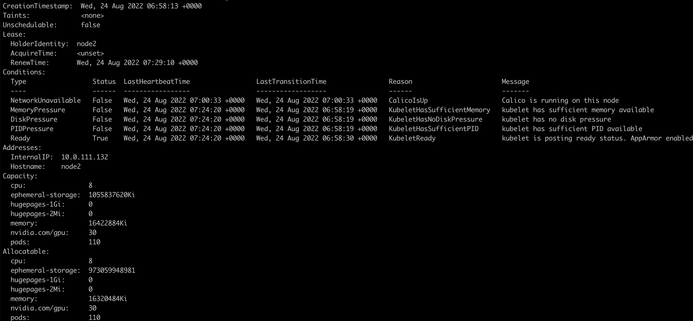

k8s-device-plugin用于是Kubernetes调用GPU的插件。

<!-- more -->

nvidia的k8s插件安装之后作为daemonset在每个节点上运行，插件运行之后会向master汇报每个节点的GPU数量，运行需要GPU的POD。

安装k8s-device-plugin的前提条件如下：

1. Nvidia的驱动版本 ~= 384.81
2. nvidia-docker >= 2.0 || nvidia-container-toolkit >= 1.7.0
3. 配置nvidia-container-runtime 为默认的运行时
4. Kubernetes的版本≥1.10


## 安装驱动

在每个节点上nvidia驱动。


## 安装nvidia-container-toolkit

首先安装`nvidia-container-toolkit`：

```Bash
distribution=$(. /etc/os-release;echo $ID$VERSION_ID)
curl -s -L https://nvidia.github.io/libnvidia-container/gpgkey | sudo apt-key add -
curl -s -L https://nvidia.github.io/libnvidia-container/$distribution/libnvidia-container.list | sudo tee /etc/apt/sources.list.d/libnvidia-container.list

sudo apt-get update && sudo apt-get install -y nvidia-container-toolkit
```

将docker的默认运行时改成`nvidia-container-runtime`，新建`/etc/docker/daemon.json`文件，添加以下内容：

```Bash
{
    "default-runtime": "nvidia",
    "runtimes": {
        "nvidia": {
            "path": "/usr/bin/nvidia-container-runtime",
            "runtimeArgs": []
        }
    }
}
```

之后重启docker：

```Bash
sudo systemctl daemon-reload
sudo systemctl restart docker

```

## 安装k8s-device-plugin

安装k8s-device-plugin有两种方式：

### 使用yaml文件安装

执行以下命令，以daemonset的方式运行nvidia-device-plugin

```Bash
$ kubectl create -f https://raw.githubusercontent.com/NVIDIA/k8s-device-plugin/v0.12.2/nvidia-device-plugin.yml
```

这种方式的nvidia-device-plugin只是简单的静态daemonset，只能使用nvidia-device-plugin最基础的功能。

### 使用helm安装

nvidia-device-plugin的一些参数可供配置：

|Flag|Envvar|Default Value|作用|
|-|-|-|-|
|--mig-strategy|$MIG_STRATEGY|"none"||
|--fail-on-init-error|$FAIL_ON_INIT_ERROR|true||
|--nvidia-driver-root|$NVIDIA_DRIVER_ROOT|"/"||
|--pass-device-specs|$PASS_DEVICE_SPECS|false||
|--device-list-strategy|$DEVICE_LIST_STRATEGY|"envvar"||
|--device-id-strategy|$DEVICE_ID_STRATEGY|"uuid"||
|--config-file|$CONFIG_FILE|""||


在使用helm来部署nvidia-device-plugin时可以设置这些参数，按下面的配置文件所示：

```Bash
version: v1
flags:
  migStrategy: "none"
  failOnInitError: true
  nvidiaDriverRoot: "/"
  plugin:
    passDeviceSpecs: false
    deviceListStrategy: "envvar"
    deviceIDStrategy: "uuid"
```


#### 基于时间片共享GPU

nvidia-device-plugin允许GPU超额订阅，使多个进程共享同一个GPU。但是GPU并没有对进程进行计算资源和显存方面的隔离，不同的进程运行在相同的故障域。这意味着如果一个workload崩溃，所有的workload都会崩溃。

配置文件模块如下：

```Bash
version: v1
sharing:
  timeSlicing:
    renameByDefault: <bool>
    failRequestsGreaterThanOne: <bool>
    resources:
    - name: <resource-name>
      replicas: <num-replicas>
    ...
```

当resources中配置了`replicas`，就可以为一个GPU指定多个副本，这样多个进程就可以共享同一个GPU。

如果`renameByDefault`设置为`true`，每个资源的名字都会变成`<resource-name>.shared`，而不是简单的`<resource-name>`。

如果`failRequestsGreaterThanOne`设置为`true`，插件将无法为请求大于1个GPU的容器分配资源。容器的 pod 将失败并出现 `UnexpectedAdmissionError`，需要手动删除、更新和重新部署。


配置示例如下：

```Bash
version: v1
sharing:
  timeSlicing:
    resources:
    - name: nvidia.com/gpu
      replicas: 10
```

当该配置被应用后，一个拥有1个GPU的节点会出现10个[`nvidia.com/gpu`](http://nvidia.com/gpu)资源。插件简单地为每个GPU创建了10个引用，然后不加选择地将它们分配给容器。


#### 部署插件

首先安装helm

```Bash
curl https://baltocdn.com/helm/signing.asc | gpg --dearmor | sudo tee /usr/share/keyrings/helm.gpg > /dev/null
sudo apt-get install apt-transport-https --yes
echo "deb [arch=$(dpkg --print-architecture) signed-by=/usr/share/keyrings/helm.gpg] https://baltocdn.com/helm/stable/debian/ all main" | sudo tee /etc/apt/sources.list.d/helm-stable-debian.list
sudo apt-get update
sudo apt-get install helm
```

配置插件的helm仓库

```Bash
$ helm repo add nvdp https://nvidia.github.io/k8s-device-plugin
$ helm repo update
```

检验插件是否可用

```Bash
$ helm search repo nvdp --devel
NAME                         CHART VERSION  APP VERSION  DESCRIPTION
nvdp/nvidia-device-plugin    0.12.2         0.12.2         A Helm chart for ...
```

简单部署插件


```Bash
helm upgrade -i nvdp nvdp/nvidia-device-plugin \
  --namespace nvidia-device-plugin \
  --create-namespace \
  --version 0.12.2
```


**配置time-slicing**

新建配置文件：

```Bash
cat << EOF > dp-config.yaml
version: v1
sharing:
  timeSlicing:
    resources:
    - name: nvidia.com/gpu
      replicas: 10
EOF
```


使用配置文件部署插件：

```Bash
helm upgrade -i nvdp nvdp/nvidia-device-plugin \
  --namespace nvidia-device-plugin \
  --create-namespace \
  --version 0.12.2 \
  --set-file config.map.config=dp-config.yaml
```

安装之后，我们发现一个拥有3个GPU的节点可以看到有30个[`nvidia.com/gpu`](http://nvidia.com/gpu)资源




## 运行GPU任务

当nvidia-device-plugin的daemonset部署之后，kubernetes就可以下发使用gpu的pod：


```Bash
$ cat <<EOF | kubectl apply -f -
apiVersion: v1
kind: Pod
metadata:
  name: gpu-pod
spec:
  restartPolicy: Never
  containers:
    - name: cuda-container
      image: nvcr.io/nvidia/k8s/cuda-sample:vectoradd-cuda10.2
      resources:
        limits:
          nvidia.com/gpu: 1 # requesting 1 GPU
  tolerations:
  - key: nvidia.com/gpu
    operator: Exists
    effect: NoSchedule
EOF
```

查看pod的日志：

```Bash
$ kubectl logs gpu-pod
[Vector addition of 50000 elements]
Copy input data from the host memory to the CUDA device
CUDA kernel launch with 196 blocks of 256 threads
Copy output data from the CUDA device to the host memory
Test PASSED
Done
```

证明gpu已经可以使用。

> 如果使用nvidia镜像时不请求gpu资源，则所有的GPU都会暴露在容器中

