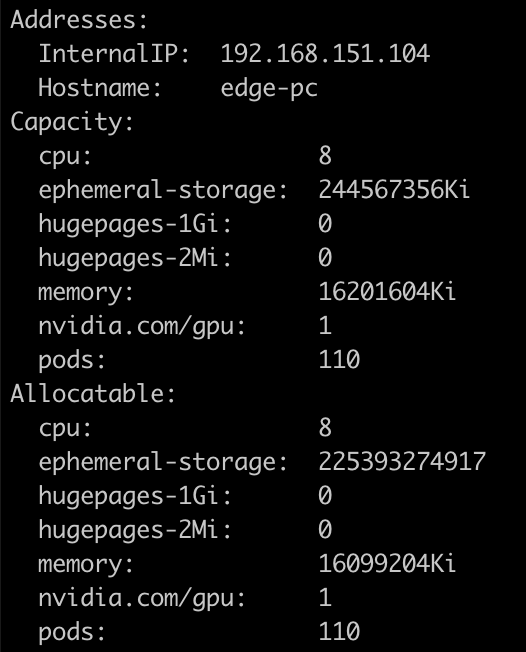
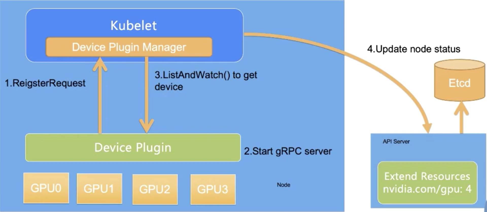
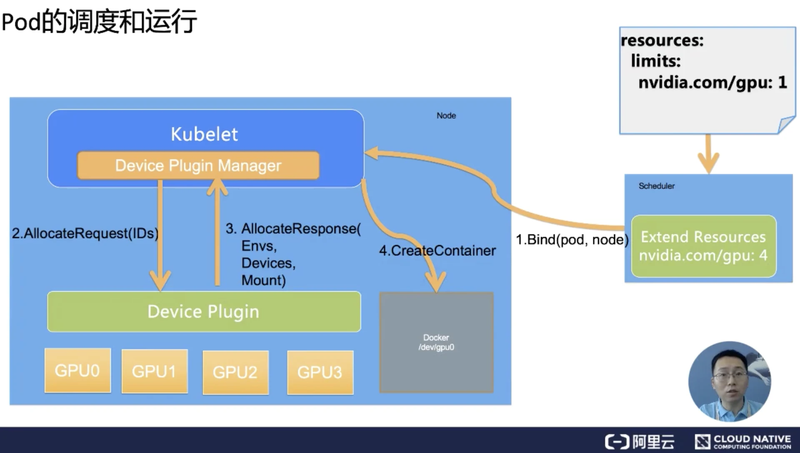

在Kubernetes中部署AI算法，最关键的一步是在Kubernetes中调用GPU，本文是对Kubernetes调用GPU机制的一个记录。

<!-- more -->

在kubernetes中调用gpu的前提如下：

1. 正确安装gpu驱动
2. 安装nvidia-docker2
3. docker的runtime配置为`nvidia-container-runtime`


为了能够在kubernetes中管理和调度GPU，Nvidia提供了Nvidia GPU的Device Plugin。


### 在kubernetes中安装插件

```Bash
kubectl create -f https://raw.githubusercontent.com/NVIDIA/k8s-device-plugin/v0.11.0/nvidia-device-plugin.yml
```


执行`kubectl describe noes {nodename}`，如果在资源中看到gpu信息，说明k8s-device-plugin安装完成



`k8s-device-plugin`实现了k8s提供的`DevicePluginServer`接口：

```Go
// DevicePluginServer is the server API for DevicePlugin service.
type DevicePluginServer interface {
  // GetDevicePluginOptions returns options to be communicated with Device
  // Manager
  GetDevicePluginOptions(context.Context, *Empty) (*DevicePluginOptions, error)
  // ListAndWatch returns a stream of List of Devices
  // Whenever a Device state change or a Device disappears, ListAndWatch
  // returns the new list
  ListAndWatch(*Empty, DevicePlugin_ListAndWatchServer) error
  // GetPreferredAllocation returns a preferred set of devices to allocate
  // from a list of available ones. The resulting preferred allocation is not
  // guaranteed to be the allocation ultimately performed by the
  // devicemanager. It is only designed to help the devicemanager make a more
  // informed allocation decision when possible.
  GetPreferredAllocation(context.Context, *PreferredAllocationRequest) (*PreferredAllocationResponse, error)
  // Allocate is called during container creation so that the Device
  // Plugin can run device specific operations and instruct Kubelet
  // of the steps to make the Device available in the container
  Allocate(context.Context, *AllocateRequest) (*AllocateResponse, error)
  // PreStartContainer is called, if indicated by Device Plugin during registeration phase,
  // before each container start. Device plugin can run device specific operations
  // such as resetting the device before making devices available to the container
  PreStartContainer(context.Context, *PreStartContainerRequest) (*PreStartContainerResponse, error)
}
```


整个Kubernetes调度GPU的过程如下：

- GPU Device plugin 部署到GPU节点上，通过ListAndWatch接口，上报注册节点的GPU信息和对应的DeviceID。 
- 当有声明 [nvidia.com/gpu](http://nvidia.com/gpu)  的GPU Pod创建出现，调度器会综合考虑GPU设备的空闲情况，将Pod调度到有充足GPU设备的节点上。
- 节点上的kubelet 启动Pod时，根据request中的声明调用各个Device plugin 的 allocate接口， 由于容器声明了GPU。 kubelet 根据之前 ListAndWatch 接口收到的Device信息，选取合适的设备，DeviceID 作为参数，调用GPU DevicePlugin的 Allocate 接口。
- GPU DevicePlugin接收到调用，将DeviceID 转换为 NVIDIA_VISIBLE_DEVICES 环境变量，返回kubelet
- kubelet将环境变量注入到Pod， 启动容器
- 容器启动时， gpu-container-runtime 调用 gpu-containers-runtime-hook 
- gpu-containers-runtime-hook  根据容器的 NVIDIA_VISIBLE_DEVICES 环境变量，转换为 --devices 参数，调用 nvidia-container-cli prestart  
- nvidia-container-cli 根据 --devices ，将GPU设备映射到容器中。 并且将宿主机的Nvidia Driver Lib 的so文件也映射到容器中。 此时容器可以通过这些so文件，调用宿主机的Nvidia Driver。


## Device Plugin工作机制

整个Device Plugin的工作流程可以分成两个部分：

- 一个是启动时刻的资源上报。其中ListAndWatch对应资源的上报，同时还提供健康检查的机制。当设备不健康的时候，可以上报给Kubernetes不健康设备的ID，让Device Plugin Framework将这个设备从可调度设备中移除
- 另一个是用户使用时刻的调度和运行。Allocate会被Device Plugin在部署容器时调用，传入的参数核心就是容器会使用的设备ID，返回的参数是容器启动时，需要的设备、数据卷以及环境变量。


### 资源上报和监控

对于每一个硬件设备，都需要它所对应的Device Plugin进行管理，这些Device Plugin以客户端的身份通过GRPC的方式对kubelet中的Device Plugin Manager进行连接，并且将自己监听的Unix Socket api的版本号和设备名称比如GPU上报给kubelet。



整个过程分为四步，其中前三步都是发生在节点上，第四步是kubelet和api-server的交互。

1. 第一步是Device Plugin的注册，需要Kubernetes知道要跟哪个Device Plugin进行交互。这是因为一个节点上可能有多个设备，需要Device Plugin以客户端的身份向kubelet汇报三件事情：我是谁？就是Device Plugin所管理的设备名称，是GPU还是RDMA；我在哪？就是插件自身监听的unix socket所在的文件位置，让kubelet能够调用自己；交互协议，即API的版本号
2. 第二步是服务启动，Device Plugin会启动一个GRPC的server。在此之后Device Plugin一直以这个服务器的身份提供服务让kubelet来访问，而监听地址和提供API的版本就已经在第一步完成了
3. 第三步，当该GRPC server启动之后，kubelet会建立一个到Device Plugin的ListAndWatch的长连接，用来发现设备ID以及设备的健康状态。当Device Plugin检测到某个设备不健康的时候，就会主动通知kubelet。而此时如果这个设备处于空闲状态，kubelet会将其移除可分配的列表。但是当这个设备已经被某个Pod所使用的时候，kubelet就不会做任何事情，如果此时杀掉这个Pod是一个很危险的操作。
4. 第四步，kubelet会将这些设备暴露到Node节点的状态中，把设备数量发送到Kubernetes的api-server中。后续调度器可以根据这些信息进行调度。


需要注意的是，kubelet在向api-server进行汇报的时候，只会汇报该GPU对应的数量。而kubelet自身的Device Plugin Manager会对这个GPU的ID列表进行保存，并用来具体的设备分配。而这个对于Kubernetes全局调度器来说，它不掌握这个GPU的ID列表，它只知道GPU的数量。

这就意味着在现有的 Device Plugin 工作机制下，Kubernetes 的全局调度器无法进行更复杂的调度。比如说想做两个 GPU 的亲和性调度，同一个节点两个 GPU 可能需要进行通过 NVLINK 通讯而不是 PCIe 通讯，才能达到更好的数据传输效果。在这种需求下，目前的 Device Plugin 调度机制中是无法实现的。


### Pod的调度和运行的过程



Pod想使用一个GPU的时候，它只需要向之前的例子一样，在Pod的Resource下limits字段中声明GPU资源和对应的数量（比如`nvidia.com/gpu:1`）。Kubernetes会找到满足数量条件的节点，然后将该节点的GPU数量减1，并且完成Pod与Node的绑定。

绑定成功后，自然就会被对应节点的kubelet拿来创建容器。而当kubelet发现这个Pod的容器请求的资源是一个GPU的时候，kubelet就会委托自己内部的Device Plugin Manager模块，从自己持有的GPU的ID列表中选择一个可用的GPU分配给该容器。

此时kubelet就会向本机的Device Plugin发起一个Allocate请求，这个请求所携带的参数，正是即将分配给该容器的设备ID列表。

Device Plugin收到Allocate Request请求之后，它就会根据kubelet传过来的设备ID，去寻找这个设备ID对应的设备路径、驱动目录以及环境变量，并且以Allocate Response的形式返还给kubelet。

Allocate Response中所携带的设备路径和驱动目录信息，一旦返回给kubelet之后，kubelet就会根据这些信息执行为容器分配GPU的操作，这样Docker就会根据kubelet的指令去创建容器，而这个容器中就会出现GPU设备。并且把它所需要的驱动目录给挂载进来，至此Kubernetes为Pod分配一个GPU的流程就结束了。


### Device Plugin机制的缺陷

最后我们来思考一个问题，现在的 Device Plugin 是否完美无缺？

需要指出的是 Device Plugin 整个工作机制和流程上，实际上跟学术界和工业界的真实场景有比较大的差异。这里最大的问题在于 GPU 资源的调度工作，实际上都是在 kubelet 上完成的。

而作为全局的调度器对这个参与是非常有限的，作为传统的 Kubernetes 调度器来说，它只能处理 GPU 数量。一旦你的设备是异构的，不能简单地使用数目去描述需求的时候，比如我的 Pod 想运行在两个有 nvlink 的 GPU 上，这个 Device Plugin 就完全不能处理。

更不用说在许多场景上，我们希望调度器进行调度的时候，是根据整个集群的设备进行全局调度，这种场景是目前的 Device Plugin 无法满足的。

更为棘手的是在 Device Plugin 的设计和实现中，像 Allocate 和 ListAndWatch 的 API 去增加可扩展的参数也是没有作用的。这就是当我们使用一些比较复杂的设备使用需求的时候，实际上是无法通过 Device Plugin 来扩展 API 实现的。

因此目前的 Device Plugin 设计涵盖的场景其实是非常单一的， 是一个可用但是不好用的状态。这就能解释为什么像 Nvidia 这些厂商都实现了一个基于 Kubernetes 上游代码进行 fork 了自己解决方案，也是不得已而为之。


> https://segmentfault.com/a/1190000018460795
> https://www.infoq.cn/article/tdfgiikxh9bcgknywl6s
> https://codeantenna.com/a/0Wjhf8YQP9


