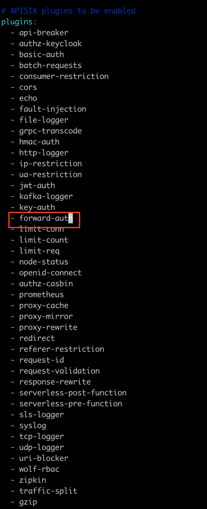
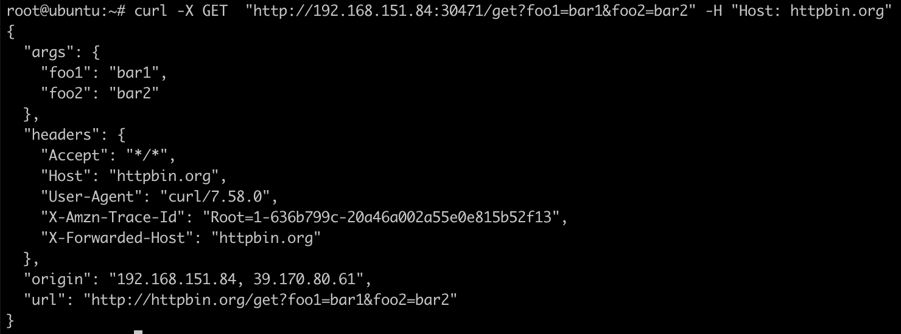
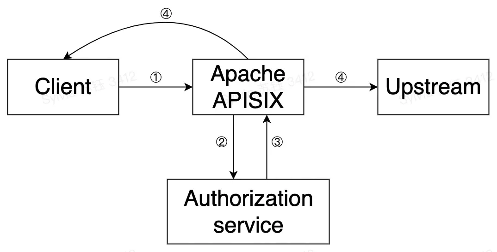
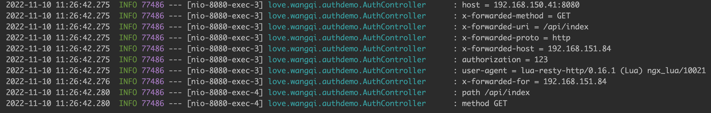

Apache APISIX 是一个动态、实时、高性能的云原生 API 网关，提供了负载均衡、动态上游、灰度发布、服务熔断、身份认证、可观测性等丰富的流量管理功能。

<!-- more -->


## 安装

新建pv：

```Bash
apiVersion: v1
kind: PersistentVolume
metadata:
  name: etcd-pv-0
  namespace: apisix
  labels:
    type: local
spec:
  nodeAffinity:
    required:
      nodeSelectorTerms:
      - matchExpressions:
        - key: kubernetes.io/hostname
          operator: In
          values:
          - ubuntu
  capacity:
    storage: 50Gi
  accessModes:
    - ReadWriteOnce
  hostPath:
    path: "/root/data/etcd-pv-0"
```


```Bash
apiVersion: v1
kind: PersistentVolume
metadata:
  name: etcd-pv-1
  namespace: apisix
  labels:
    type: local
spec:
  nodeAffinity:
    required:
      nodeSelectorTerms:
      - matchExpressions:
        - key: kubernetes.io/hostname
          operator: In
          values:
          - ubuntu
  capacity:
    storage: 50Gi
  accessModes:
    - ReadWriteOnce
  hostPath:
    path: "/root/data/etcd-pv-1"
```


```Bash
apiVersion: v1
kind: PersistentVolume
metadata:
  name: etcd-pv-2
  namespace: apisix
  labels:
    type: local
spec:
  nodeAffinity:
    required:
      nodeSelectorTerms:
      - matchExpressions:
        - key: kubernetes.io/hostname
          operator: In
          values:
          - ubuntu
  capacity:
    storage: 50Gi
  accessModes:
    - ReadWriteOnce
  hostPath:
    path: "/root/data/etcd-pv-2"
```


下载`apisix-helm-chart`：

```Bash
git clone https://github.com/apache/apisix-helm-chart.git
```


切换到`apisix-helm-chart/charts/apisix`目录，修改`values.yaml`文件，添加`forward-auth`插件：



执行以下命令安装`apisix`：

```Bash
helm upgrade --install apisix --set admin.allow.ipList="" --set etcd.volumePermissions.enabled=true --namespace apisix -f values.yaml .

```


执行以下命令转发apisix-admin的9180端口：

```Bash
kubectl port-forward service/apisix-admin -n apisix 9080:9180

```


## 测试apisix

新建upstream

```Bash
curl "http://127.0.0.1:9080/apisix/admin/upstreams/1" -H "X-API-KEY: edd1c9f034335f136f87ad84b625c8f1" -X PUT -d '
{
  "type": "roundrobin",
  "nodes": {
    "httpbin.org:80": 1
  }
}'
```


新建route

```Bash
curl "http://127.0.0.1:9080/apisix/admin/routes/1" -H "X-API-KEY: edd1c9f034335f136f87ad84b625c8f1" -X PUT -d '
{
  "uri": "/get",
  "host": "httpbin.org",
  "upstream_id": "1"
}'
```


访问apisix-gateway的NodePort端口测试效果：

```Bash
curl -X GET  "http://192.168.151.84:30471/get?foo1=bar1&foo2=bar2" -H "Host: httpbin.org"
```



## forward-auth插件

[https://apisix.apache.org/zh/docs/apisix/plugins/forward-auth/](https://apisix.apache.org/zh/docs/apisix/plugins/forward-auth/)

Forward Auth插件能巧妙地将认证与授权逻辑转移至专门的外部服务中，网关会将用户的请求转发至认证服务中，并在认证服务响应非20X状态时，阻止原有请求并替换结果。通过这样的方式，就可以实现认证为通过时，返回自定义报错或用户重定向至认证页面。



关于forward-auth插件在Apache APISIX中的运行原理与流程如上图所示，具体总结为以下几步：

1. 由客户端向APISIX发起请求
2. 由APISIX向用户配置的认证服务发起请求
3. 认证服务响应（2xx或异常状态）
4. APISIX会根据认证服务响应，决定向上游转发请求或直接向客户端发送拒绝响应


属性

|名称|类型|必选项|默认值|有效值|描述|
|-|-|-|-|-|-|
|uri|string|是|||设置authorization服务的地址|
|ssl_verify|boolean|否|true|[true,false]|当设置为true是，验证SSL证书|
|request_method|string|否|GET|["GET","POST"]|客户端向authorization服务发送请求的方法。当设置为POST时，会将request body转发至authorization服务|
|request_headers|array[string]|否|||设置需要由客户端转发到authorization服务的请求头。如果没有设置，则只发送APISIX提供的headers（例如：X-Forwarded-XXX）|
|upstream_headers|array[string]|否|||认证通过时，设置authorization服务转发至upstream的请求头。如果不设置则不转发任何请求头|
|client_headers|array[string]|否|||认证失败时，由authorization服务向client发送的响应头。如果不设置则不转发任何响应头。|
|timeout|integer|否|3000ms|[1, 60000]ms|authorization服务请求超时时间|
|keepalive|boolean|否|true|[true, false]|HTTP长连接|
|keepalive_timeout|integer|否|60000ms|[1000, ...]ms|长连接超时时间|
|keepalive_pool|integer|否|5|[1, ...]ms|长连接池大小|


APISIX将生成并发送如下所示的请求头到认证服务：

|Scheme|HTTP Method|Host|URI|Source IP|
|-|-|-|-|-|
|X-Forwarded-Proto|X-Forwarded-Method|X-Forwarded-Host|X-Forwarded-Uri|X-Forwarded-For|


### 官方示例

使用Apache APISIX无服务器插件模拟服务:

```Bash
curl -X PUT 'http://127.0.0.1:9080/apisix/admin/routes/auth' \
    -H 'X-API-KEY: edd1c9f034335f136f87ad84b625c8f1' \
    -H 'Content-Type: application/json' \
    -d '{
    "uri": "/auth",
    "plugins": {
        "serverless-pre-function": {
            "phase": "rewrite",
            "functions": [
                "return function (conf, ctx)
                    local core = require(\"apisix.core\");
                    local authorization = core.request.header(ctx, \"Authorization\");
                    if authorization == \"123\" then
                        core.response.exit(200);
                    elseif authorization == \"321\" then
                        core.response.set_header(\"X-User-ID\", \"i-am-user\");
                        core.response.exit(200);
                    else core.response.set_header(\"Location\", \"http://example.com/auth\");
                        core.response.exit(403);
                    end
                end"
            ]
        }
    }
}'
```


在指定 Route 上启用 `forward-auth` 插件：

```Bash
curl -X PUT 'http://127.0.0.1:9080/apisix/admin/routes/1' \
    -H 'X-API-KEY: edd1c9f034335f136f87ad84b625c8f1' \
    -d '{
    "uri": "/headers",
    "plugins": {
        "forward-auth": {
            "uri": "http://127.0.0.1:9080/auth",
            "request_headers": ["Authorization"],
            "upstream_headers": ["X-User-ID"],
            "client_headers": ["Location"]
        }
    },
    "upstream": {
        "nodes": {
            "httpbin.org:80": 1
        },
        "type": "roundrobin"
    }
}'
```


完成上述配置后，可通过以下三种方式进行测试：

- 在请求头中发送认证的详细信息：

```Bash
curl http://192.168.151.84:30471/headers -H 'Authorization: 123'

{
  "headers": {
    "Accept": "*/*",
    "Authorization": "123",
    "Host": "192.168.151.84",
    "User-Agent": "curl/7.58.0",
    "X-Amzn-Trace-Id": "Root=1-636b7ad7-6d7b9bf83d77298e77f7e3d2",
    "X-Forwarded-Host": "192.168.151.84"
  }
}

```
- 转发认证服务响应头到 Upstream

```Bash
curl http://192.168.151.84:30471/headers -H 'Authorization: 321'

{
  "headers": {
    "Accept": "*/*",
    "Authorization": "321",
    "Host": "192.168.151.84",
    "User-Agent": "curl/7.58.0",
    "X-Amzn-Trace-Id": "Root=1-636b7afc-3e17213619a515541afab2fd",
    "X-Forwarded-Host": "192.168.151.84",
    "X-User-Id": "i-am-user"
  }
}

```
- 当授权失败时，认证服务可以向用户发送自定义响应：

```Bash
curl -i http://192.168.151.84:30471/headers

HTTP/1.1 403 Forbidden
Date: Wed, 09 Nov 2022 10:03:48 GMT
Content-Type: text/plain; charset=utf-8
Transfer-Encoding: chunked
Connection: keep-alive
Location: http://example.com/auth
Server: APISIX/2.15.0

<html>
<head><title>403 Forbidden</title></head>
<body>
<center><h1>403 Forbidden</h1></center>
<hr><center>openresty</center>
</body>
</html>

```


### 测试示例

创建如下认证服务：

```Java
@RestController
@Slf4j
public class AuthController {
    @Autowired
    HttpServletRequest request;

    @RequestMapping("/**")
    public ResponseEntity<String> api() {
        log.info("path {}", request.getServletPath());
        log.info("method {}", request.getMethod());
        return new ResponseEntity<>("api", HttpStatus.OK);
    }


    @RequestMapping("/auth")
    public ResponseEntity<String> auth() {
        final Enumeration<String> headerNames = request.getHeaderNames();
        while (headerNames.hasMoreElements()) {
            final String key = headerNames.nextElement();
            final String value = request.getHeader(key);
            log.info("{} = {}", key, value);
        }
        return new ResponseEntity<>("auth", HttpStatus.OK);
    }
}

```


设置测试路由：

```Bash
curl -X PUT 'http://127.0.0.1:9080/apisix/admin/routes/1' \
    -H 'X-API-KEY: edd1c9f034335f136f87ad84b625c8f1' \
    -d '{
    "uri": "/prod-api/*",
    "plugins": {
        "forward-auth": {
            "uri": "http://192.168.151.23:18080/prod-api/admin-api/system/resource/verify",
            "request_headers": ["Authorization"],
            "upstream_headers": ["X-User-ID"],
            "client_headers": ["Location"]
        }
    },
    "upstream": {
        "nodes": {
            "192.168.151.23:18080": 1
        },
        "type": "roundrobin"
    }
}'

```


访问接口，测试认证服务

```Bash
curl http://192.168.151.84:30471/api/index -H 'Authorization: 123'

api
```

认证服务打印如下信息：



如果auth接口返回`HttpStatus.UNAUTHORIZED`，解耦返回auth。


当接口认证通过时返回upstream的内容，接口认证失败时返回认证接口的内容。


## 鉴权接口开发

1. 提供`/auth`接口。
2. 接口通过http请求头中的`x-forwarded-method`、`x-forwarded-uri`、 `x-forwarded-proto`、`x-forwarded-host`、`x-forwarded-for`等参数（可以添加自定义参数）来判断接口是否有权限。
3. 如果有权限返回状态200
4. 没有权限返回非2xx的状态，并返回用户提示内容（比如提示用户没有权限，重定向到登录页面）

