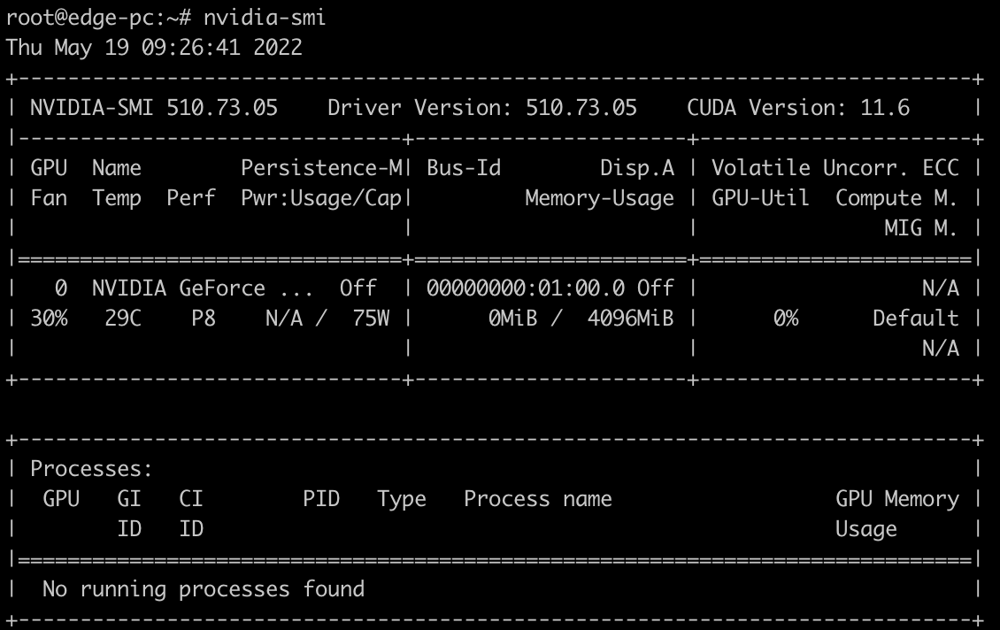
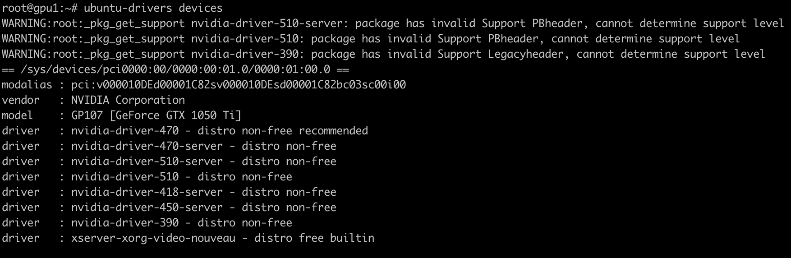

要在程序中使用GPU，首先需要安装GPU驱动。在ubuntu 18.04中安装驱动，只需遵循以下的步骤

<!-- more -->

## 禁用nouveau驱动

1.使用下述命令可以查看 nouveau 驱动是否运行：

```Bash
lsmod | grep nouveau  
```

若出现下述结果：

```Bash
nouveau              1863680  9  
video                  49152  1 nouveau  
ttm                   102400  1 nouveau  
mxm_wmi                16384  1 nouveau  
drm_kms_helper        180224  1 nouveau  
drm                   479232  12 drm_kms_helper,ttm,nouveau  
i2c_algo_bit           16384  2 igb,nouveau  
wmi                    28672  4 intel_wmi_thunderbolt,wmi_bmof,mxm_wmi,nouveau  
```

说明 nouveau 驱动正在运行。

2.运行下述命令禁用该驱动：

```Bash
sudo bash -c "echo blacklist nouveau > /etc/modprobe.d/blacklist-nvidia-nouveau.conf"  
sudo bash -c "echo options nouveau modeset=0 >> /etc/modprobe.d/blacklist-nvidia-nouveau.conf"  
```

检查命令是否正确：

```Bash
cat /etc/modprobe.d/blacklist-nvidia-nouveau.conf  
```

若出现下述结果说明命令正确：

```Bash
blacklist nouveau  
options nouveau modeset=0  
```

3.更新设置并重启：

```Bash
sudo update-initramfs -u  
sudo reboot  
```

4.重启后重新输入下述命令：

```Bash
lsmod | grep nouveau  
```

若没有任何输出说明禁用 nouveau 驱动成功

## 手动安装驱动

### 查看显卡型号

```Bash
lspci | grep VGA
```

### 下载显卡驱动

访问[`https://www.nvidia.cn/Download/index.aspx?lang=cn`](https://www.nvidia.cn/Download/index.aspx?lang=cn)下载nvidia驱动


### 安装NVIDIA显卡驱动

安装依赖

```Bash
apt install build-essential
```

安装驱动

```Bash
chmod +x NVIDIA-Linux-x86_64-510.73.05.run
./NVIDIA-Linux-x86_64-510.73.05.run
```

安装成功后输入 `nvidia-smi`，若有类似下述输出证明显卡安装成功



## 自动安装驱动

在终端输入：`ubuntu-drivers devices`，可以看到如下界面：



可以看到，显卡型号是`GeForce GTX 1050 Ti`，推荐安装的版本是：`nvidia-driver-470 - distro non-free recommended`

如果同意安装推荐版本，我们只需要输入：`sudo ubuntu-drivers autoinstall` 就可以自动安装了。

如果想要使用`apt`命令，执行`apt install nvidia-driver-450-server`