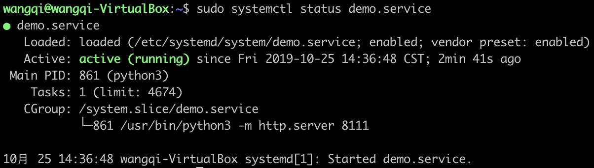
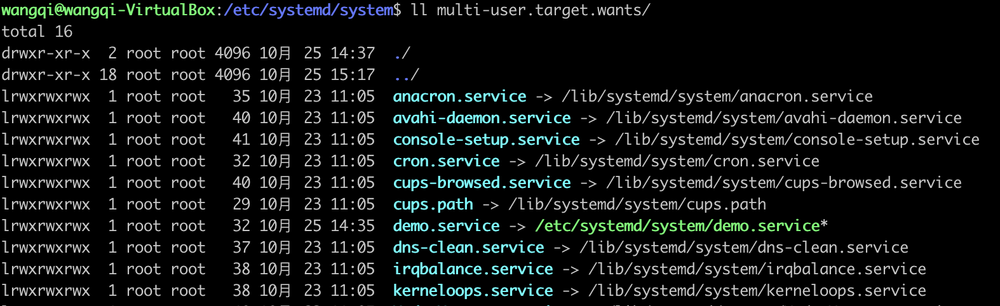
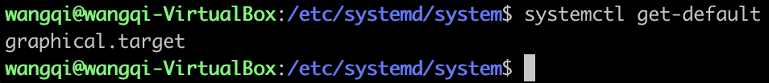
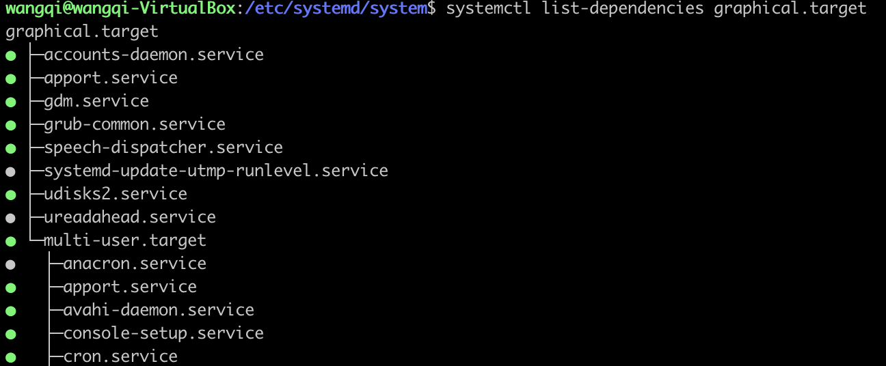

最近在服务器上部署程序的时候，接到一个重启之后能自动启动所有服务的需求。这个操作居然不会，之前重启之后都是手动启动服务的，于是赶紧学习并记录一下。详细教程请查看[http://www.ruanyifeng.com/blog/2016/03/systemd-tutorial-commands.html](http://www.ruanyifeng.com/blog/2016/03/systemd-tutorial-commands.html)

<!-- more -->

设置开机启动有两种方式：一种是在`/etc/init.d/`目录下增加程序控制的脚本，然后使用`chkconfig`命令设置服务开机启动。另一种是使用`Systemd`。

前一种方式依赖Linux的`init`进程，因为各种缺陷，现在慢慢被`Systemd`所代替。

`Systemd`的设计目标是，为系统的启动和管理提供一套完整的解决方案。

`Systemd`将管理的系统资源统称为`Unit`。`Unit`一共分为12种：

```

* Service unit：系统服务
* Target unit：多个 Unit 构成的一个组
* Device Unit：硬件设备
* Mount Unit：文件系统的挂载点
* Automount Unit：自动挂载点
* Path Unit：文件或路径
* Scope Unit：不是由 Systemd 启动的外部进程
* Slice Unit：进程组
* Snapshot Unit：Systemd 快照，可以切回某个快照
* Socket Unit：进程间通信的 socket
* Swap Unit：swap 文件
* Timer Unit：定时器

```

其中对于管理我们自己的服务来说，使用的`Service unit`。

## Unit配置文件

`Systemd`默认从目录`/etc/systemd/system`中读取Unit的配置文件。

Unit配置文件分为3个区块。

`[Unit]`区块通常是配置文件的第一个区块，用来定义Unit的元数据，以及配置与其他Unit的关系。它的主要字段如下：

```
* Description：简短描述
* Documentation：文档地址
* Requires：当前 Unit 依赖的其他 Unit，如果它们没有运行，当前 Unit 会启动失败
* Wants：与当前 Unit 配合的其他 Unit，如果它们没有运行，当前 Unit 不会启动失败
* BindsTo：与Requires类似，它指定的 Unit 如果退出，会导致当前 Unit 停止运行
* Before：如果该字段指定的 Unit 也要启动，那么必须在当前 Unit 之后启动
* After：如果该字段指定的 Unit 也要启动，那么必须在当前 Unit 之前启动
* Conflicts：这里指定的 Unit 不能与当前 Unit 同时运行
* Condition...：当前 Unit 运行必须满足的条件，否则不会运行
* Assert...：当前 Unit 运行必须满足的条件，否则会报启动失败
```

`[Install]`通常是配置文件的最后一个区块，用来定义如何启动，以及是否开机启动。它的主要字段如下：

```
* WantedBy：它的值是一个或多个 Target，当前 Unit 激活时（enable）符号链接会放入/etc/systemd/system目录下面以 Target 名 + .wants后缀构成的子目录中
* RequiredBy：它的值是一个或多个 Target，当前 Unit 激活时，符号链接会放入/etc/systemd/system目录下面以 Target 名 + .required后缀构成的子目录中
* Alias：当前 Unit 可用于启动的别名
* Also：当前 Unit 激活（enable）时，会被同时激活的其他 Unit
```

`[Service]`区块用来Service的配置，只有Service类型的Unit才有这个区块。它的主要字段如下：

```
* Type：定义启动时的进程行为。它有以下几种值。
* Type=simple：默认值，执行ExecStart指定的命令，启动主进程
* Type=forking：以 fork 方式从父进程创建子进程，创建后父进程会立即退出
* Type=oneshot：一次性进程，Systemd 会等当前服务退出，再继续往下执行
* Type=dbus：当前服务通过D-Bus启动
* Type=notify：当前服务启动完毕，会通知Systemd，再继续往下执行
* Type=idle：若有其他任务执行完毕，当前服务才会运行
* ExecStart：启动当前服务的命令
* ExecStartPre：启动当前服务之前执行的命令
* ExecStartPost：启动当前服务之后执行的命令
* ExecReload：重启当前服务时执行的命令
* ExecStop：停止当前服务时执行的命令
* ExecStopPost：停止当其服务之后执行的命令
* RestartSec：自动重启当前服务间隔的秒数
* Restart：定义何种情况 Systemd 会自动重启当前服务，可能的值包括always（总是重启）、on-success、on-failure、on-abnormal、on-abort、on-watchdog
* TimeoutSec：定义 Systemd 停止当前服务之前等待的秒数
* Environment：指定环境变量
```

## Unit配置示例

下面是一个最简单的Unit配置：

```
[Unit]
Requires=network.target
After=network.target

[Service]
Type=simple
ExecStart=/usr/bin/python3 -m http.server 8111
Restart=on-abnormal

[Install]
WantedBy=multi-user.target
```

当我们执行`sudo systemctl start demo.service`启动demo服务时，就会执行`/usr/bin/python3 -m http.server 8111`启动一个http服务。

现在，执行以下命令就可以实现demo服务的开机启动：

```
sudo systemctl enable demo.service
```

重启之后，执行`sudo systemctl status demo.service`查看demo服务的状态：



我们发现demo服务已经在运行了。

上面的输出结果含义如下：

```
Loaded行：配置文件的位置，是否设为开机启动
Active行：表示正在运行
Main PID行：主进程ID
CGroup块：应用的所有子进程
日志块：应用的日志
```

Unit示例配置说明：

`[Unit]`区块，表示启动顺序与依赖关系。

`After`字段表示：如果`network.target`需要启动，那么`demo.service`应该在他们之后启动。相应还有一个`Before`字段，定义`demo.service`应该在哪些服务之前启动。

`Requires`字段表示"强依赖"关系，即如果`network.target`服务启动失败或异常退出，那么`demo.service`也必须退出。相应还有一个`Wants`字段，表示`network.target`和`demo.service`之间存在"弱依赖"关系，即如果`network.target`启动失败或停止运行，不影响`demo.service`继续运行。

`[Service]`区块，定义如何启动当前服务。

`ExecStart`字段：定义启动进程时执行的命令。与之作用相似的还有如下字段：

```
* ExecReload字段：重启服务时执行的命令
* ExecStop字段：停止服务时执行的命令
* ExecStartPre字段：启动服务之前执行的命令
* ExecStartPost字段：启动服务之后执行的命令
* ExecStopPost字段：停止服务之后执行的命令
```

`Type`字段定义启动类型。它可以设置的值如下：

```
* simple（默认值）：ExecStart字段启动的进程为主进程
* forking：ExecStart字段将以fork()方式启动，此时父进程将会退出，子进程将成为主进程
* oneshot：类似于simple，但只执行一次，Systemd 会等它执行完，才启动其他服务
* dbus：类似于simple，但会等待 D-Bus 信号后启动
* notify：类似于simple，启动结束后会发出通知信号，然后 Systemd 再启动其他服务
* idle：类似于simple，但是要等到其他任务都执行完，才会启动该服务。一种使用场合是为让该服务的输出，不与其他服务的输出相混合
```

`KillMode`字段：定义了Systemd如何停止sshd服务。可以设置的值如下：

```
* control-group（默认值）：当前控制组里面的所有子进程，都会被杀掉
* process：只杀主进程
* mixed：主进程将收到 SIGTERM 信号，子进程收到 SIGKILL 信号
* none：没有进程会被杀掉，只是执行服务的 stop 命令。
```

`Restart`字段：定义了服务退出后，Systemd的重启方式。可以设置的值如下：

```
* no（默认值）：退出后不会重启
* on-success：只有正常退出时（退出状态码为0），才会重启
* on-failure：非正常退出时（退出状态码非0），包括被信号终止和超时，才会重启
* on-abnormal：只有被信号终止和超时，才会重启
* on-abort：只有在收到没有捕捉到的信号终止时，才会重启
* on-watchdog：超时退出，才会重启
* always：不管是什么退出原因，总是重启
```

`RestartSec`字段：表示Systemd重启服务之前，需要等待的秒数。

`[Install]`区块：定义如何安装这个配置文件，即怎样做到开机启动。

`WantedBy`字段，表示该服务所在的`Target`。

`Target`的含义是服务组，表示一组服务。`WantedBy=multi-user.target`指的是，`demo`服务所在的`Target`是`multi-user.target`。

这个设置非常重要，因为执行`systemctl enable demo.service`命令时，`demo.service`的一个符号链接，会放在`/etc/systemd/system`目录下面的`multi-user.target.wants`子目录中：



Systemd默认启动的Target是`graphical.target`



在`graphical.target`组里的所有服务，都将开机启动。而`multi-user.target`包含在`graphical.target`中：



因此`demo.service`就会随着`multi-user.target`开机启动。

修改配置文件后，需要执行`sudo systemctl daemon-reload`命令重新加载配置文件。

## 几个真实Unit配置示例

**zookeeper**

```
[Unit]
Requires=network.target remote-fs.target
After=network.target remote-fs.target

[Service]
Type=forking
User=root
Environment=ZOO_LOG_DIR=/tmp
Environment=JAVA_HOME=/home/wangqi/jdk1.8.0_211
ExecStart=/home/wangqi/demo/zookeeper-3.4.14/bin/zkServer.sh start
ExecStop=/home/wangqi/demo/zookeeper-3.4.14/bin/zkServer.sh stop
ExecReload=/home/wangqi/demo/zookeeper-3.4.14/bin/zkServer.sh restart
Restart=on-failure

[Install]
WantedBy=multi-user.target
```

**kafka**

```
[Unit]
Requires=network.target remote-fs.target zookeeper.service
After=network.target remote-fs.target zookeeper.service

[Service]
Type=forking
User=root
Environment=JAVA_HOME=/home/wangqi/jdk1.8.0_211
ExecStart=/home/wangqi/demo/kafka_2.12-2.2.0/bin/kafka-server-start.sh -daemon /home/wangqi/demo/kafka_2.12-2.2.0/config/server.properties
ExecStop=/home/wangqi/demo/kafka_2.12-2.2.0/bin/kafka-server-stop.sh
Restart=on-failure

[Install]
WantedBy=multi-user.target
```

**elasticsearch**

```
[Unit]
Requires=network.target remote-fs.target
After=network.target remote-fs.target

[Service]
User=wangqi
Group=wangqi
Type=simple
Environment=JAVA_HOME=/home/wangqi/jdk1.8.0_211
ExecStart=/home/wangqi/demo/elasticsearch-7.2.0/bin/elasticsearch
LimitNOFILE=65536
Restart=on-failure

[Install]
WantedBy=multi-user.target
```


> http://www.ruanyifeng.com/blog/2016/03/systemd-tutorial-commands.html
> http://www.ruanyifeng.com/blog/2016/03/systemd-tutorial-part-two.html
> https://blog.csdn.net/lineuman/article/details/52578399