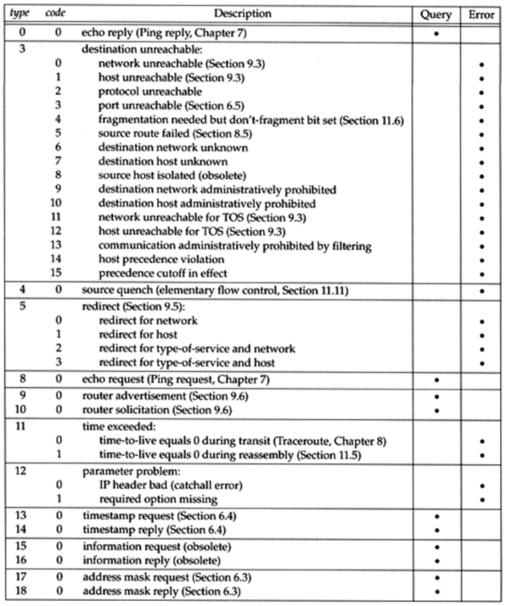
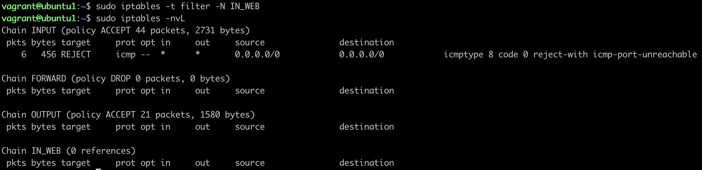
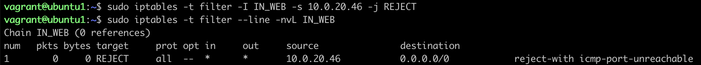
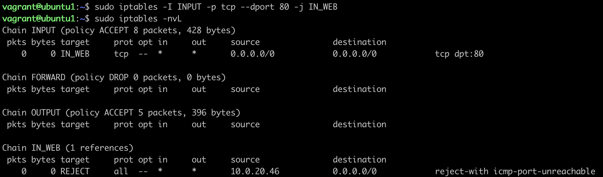
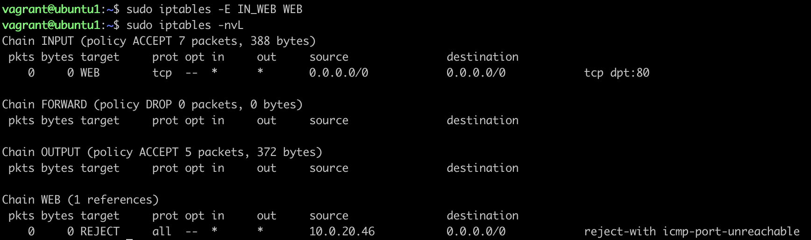
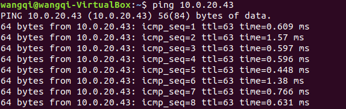
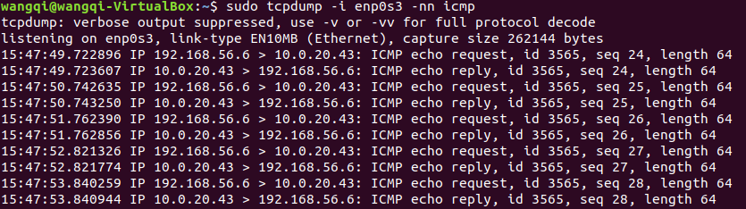
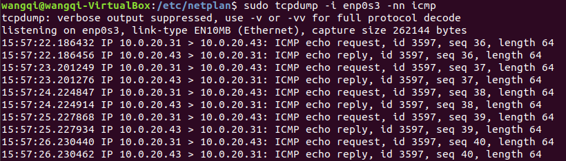

本文是对[http://www.zsythink.net/archives/tag/iptables/](http://www.zsythink.net/archives/tag/iptables/)博客的学习整理

<!-- more -->

# iptables概念

当我们启动了防火墙功能时，报文需要经过如下关卡。也就是说，根据实际情况的不同，报文经过"链"可能不同。如果报文需要转发，那么报文则不会经过`input`链发往用户空间，而是直接在内核空间中经过`forward`和`postrouting`链转发出去。


每个经过"链"的报文，都要将"链"上的所有规则匹配一遍，如果有符合条件的规则，则执行规则对应的动作。

iptables把具有相同功能的规则集合成"表"，不同规则的功能放置在不同的表中进行管理。iptables已经定义了4种表，每种表对应不同的功能：

1. `filter`表：负责过滤功能，防火墙；内核模块：`iptables_filter`
2. `nat`表：network address translation，网络地址转换功能；内核模块：`iptable_nat`
3. `mangle`表：拆解报文，做出修改，并重新封装；内核模块：`iptable_mangle`
4. `raw`表：关闭`nat`表上启用的连接追踪机制；内核模块：`iptable_raw`

## 表链关系

不同的链所包含的规则是不同的，因此每个链的规则存在于不同的表中。下面展示了链的规则存在于哪些表中：

1. `PREROUTING`中的规则可以存在于：raw、mangle、nat
2. `INPUT`中的规则可以存在于：mangle、filter（centos7中还有nat表，centos6中没有）
3. `FORWARD`中的规则可以存在于：mangle、filter
4. `OUTPUT`中的规则可以存在于：raw、mangle、nat、filter
5. `POSTROUTING`中的规则可以存在于：mangle、nat

我们在实际的使用过程中，往往是通过"表"作为操作入口，对规则进行定义的。下面展示了"表"与"链"的关系：

1. `raw`表中的规则可以被哪些链使用：`PREROUTING`、`OUTPUT`
2. `mangle`表中的规则可以被哪些链使用：`PREROUTING`、`INPUT`、`FORWARD`、`OUTPUT`、`POSTROUTING`
3. `nat`表中的规则可以被哪些链使用：`PREROUTING`、`OUTPUT`、`POSTROUTING`（centos7中还有INPUT，centos6中没有）
4. `filter`表中的规则可以被哪些链使用：`INPUT`、`FORWARD`、`OUTPUT`

如下图所示


因为数据包经过一个链的时候，会将当前链的所有规则都匹配一遍，但是匹配总归是要有顺序，iptables为我们定义了4张表，当他们处于同一条链时，执行的优先级如下：

`raw -> mangle -> nat -> filter`

## 数据经过防火墙的流程


## 规则的概念

规则指的是：根据指定的匹配条件来尝试匹配每个流经此处的报文，一旦匹配成功，则由规则后面指定的处理动作进行处理。

规则由匹配条件和处理动作组成。

**匹配条件**

匹配条件分为基本匹配条件和扩展匹配条件

基本匹配条件：源地址Source IP，目标地址Destination IP。上述内容都可以作为基本匹配条件

扩展匹配条件：除了上述的条件可以用于匹配，还有很多其他的条件可以用于匹配，这些条件泛称为扩展条件，这些扩展条件其实也是netfilter中的一部分，只是以模块的形式存在，如果想要使用这些条件，则需要依赖对应的扩展模块。源端口Source Port，目标地址Destination Port。上述内容都可以作为扩展匹配条件

**处理动作**

处理动作也可以分为基本动作和扩展动作，下面是一些常用的动作：

- ACCEPT：允许数据包通过
- DROP：直接丢弃数据包，不给任何回应信息，这时候客户端会感觉自己的请求泥牛入海了，过了超时时间才会有反应
- REJECT：拒绝数据包通过，必要时会给数据发送端一个响应的信息，客户端刚请求就会收到拒绝的信息
- SNAT：源地址转换，解决内网用户用同一个公网地址上网的问题
- MASQUERADE：是SNAT的一种特殊形式，适用于动态的、临时会变的ip上
- DNAT：目标地址转换
- REDIRECT：在本机做端口映射
- LOG：在`/var/log/messages`文件中记录日志信息，然后将数据包传递给下一条规则，也就是说除了记录以外不对数据包做任何其他操作，仍然让下一条规则去匹配

# iptables实际操作之规则查询

查看filter表中的规则：

`iptables -t filter -L`

`-t`选项指定要操作的表，使用`-L`选项查看`-t`选项对应的表的规则，`-L`选项的意思是，列出规则。

所以，上述命令的含义为列出filter表的所有规则。举一反三，我们也可以查看其它表中规则：

```
iptables -t raw -L
iptables -t mangle -L
iptables -t nat -L
```

我们可以省略`-t filter`，当没有使用`-t`选项指定表时，默认为操作`filter`表，即`iptables -L`表示列出`filter`表中的所有规则。

我们还可以只查看指定表中的指定链的规则，比如只查看filter表中INPUT链的规则：

`iptables -t filter -L INPUT`


还可以使用`-v`选项，查看更多的、更详细的信息：


其中的字段就是规则对应的属性，说白了就是规则的各种信息，下面是这些字段的含义：

- `pkts`：对应规则匹配到的报文的个数
- `bytes`：对应匹配到的报文包的大小综合
- `target`：规则对应的target，往往表示规则对应的"动作"，即规则匹配成功后需要采取的措施
- `prot`：表示规则对应的协议，是否只针对某些协议应用此规则
- `opt`：表示规则对应的选项
- `in`：表示数据包由哪个接口（网卡）流入，我们可以设置通过哪块网卡流入的报文需要匹配当前规则
- `out`：表示数据包由哪个接口（网卡）流出，我们可以设置通过哪块网卡流出的报文需要匹配当前规则
- `source`：表示规则对应的源头地址。可以是一个IP，也可以是一个网段
- `destination`：表示规则对应的目标地址。可以是一个IP，也可以是一个网段

iptables默认为我们进行了名称解析，但是在规则非常多的情况下如果进行名称解析，效率会比较低。所以，在没有此需求的情况下，我们可以使用`-n`选项，表示不对IP地址进行名称反解，直接显示IP地址。

使用`--line-numbers`即可显示规则的编号。

上图中INPUT链后面的括号中包含了`policy ACCEPT`、`76751 packets`、`7656K bytes`三部分。

`policy`表示当前链的默认策略，`policy ACCEPT`表示上图中INPUT的链的默认动作为ACCEPT，换句话说就是，默认接受通过INPUT关卡的所有请求，所以我们在配置INPUT链的具体规则时，应该将需要拒绝的请求配置到规则中，说白了就是"黑名单"机制。

`packets`表示当前链默认策略匹配到的包的数量。

`bytes`表示当前链默认策略匹配到的所有包的大小总和。如果想要查看精确的计数值，可以使用`-x`选项。

每张表中的每条链都有自己的计数器，链中的每个规则也都有自己的计数器。

# iptables规则管理

## 拒绝192.168.1.146上的所有报文访问当前机器

```
iptables -t filter -I INPUT -s 192.168.1.146 -j DROP
```

- `-t`选项：指定了要操作的表，不使用`-t`选项指定表时，默认为操作filter表
- `-I`选项：指明将"规则"插入至哪个链中，`-I`表示insert，即插入的意思
- `-s`选项：指明"匹配条件"中的源地址，即如果报文的源地址属于`-s`对应的地址，那么报文满足匹配条件，`-s`为source之意，表示源地址
- `-j`选项：指明当"匹配条件"被满足时，所对应的动作

## 追加规则

```
iptables -A INPUT -s 192.168.1.146 -j ACCEPT
```
    
- `-A`选项：表述在对应的链中"追加规则"，`-A`为append之意。`-I`和`-A`本意都是添加一条规则，`-A`表示在链的尾部追加规则，`-I`表示在链的首部插入规则。

如果报文已经被前面的规则匹配到，iptables则会对报文执行对应的动作，即使后面的规则也能匹配到当前报文，很有可能也没有机会再对报文执行相应的动作了。

## 添加规则时指定新增规则的编号

```
iptables -t filter -I INPUT 2 -s 192.168.1.146 -j ACCEPT
```

`-I INPUT 2`表示在INPUT链中新增规则，新增的规则编号为2

## 删除规则

### 根据规则的编号去删除规则

删除filter表中INPUT链的第3条规则：

`iptables -t filter -D INPUT 3`

`-D`选项表示删除指定链中的某条规则，`-D INPUT 3`表示删除INPUT链中的第3条规则

### 根据具体的匹配条件与动作删除规则

删除源地址为`192.168.1.146`，动作为ACCEPT的规则：

`iptables -D INPUT -s 192.168.1.146 -j ACCEPT`

`-D INPUT`表示删除INPUT链中的规则，剩下的选项与添加规则时一模一样。

### 删除指定表中某条链中的所有规则

`iptables -t 表名 -F 链名`

`-F`选项为flush之意，即冲刷指定的链，即删除指定链中的所有规则。

`-F`选项不仅仅能清空指定链上的规则，还能清空整个表中所有链上的规则，不指定链名，只指定表名即可删除表中的所有规则，命令如下：`iptables -t 表名 -F`

## 修改规则

将规则中的动作从DROP改为REJECT：

`iptables -t filter -R INPUT 1 -s 192.168.1.146 -j REJECT`

`-R`选项表示修改指定的链，使用`-R INPUT 1`表示修改INPUT链的第1条规则，使用`-j REJECT`表示将INPUT链中的第一条规则的动作修改为REJECT，注意`-s`选项以及对应的源地址不可省略，即使我们已经指定了规则对应的编号，但是在使用`-R`选项修改某个规则时，必须指定队则对应的原本的匹配条件（如果有多个匹配条件，都需要指定）

所以，如果想要修改某条规则，还不如先将这条规则删除，然后在同样位置再插入一条新规则。

### 修改链的默认策略

`iptables -t filter -P FORWARD DROP`

`-P`选项指定要修改的链，`-P FORWARD DROP`表示将表中`FORWARD`链的默认策略改为`DROP`

## 保存规则

### 通用方法 iptables-save命令

`iptables-save`命令并不能保存当前的iptables规则，但是可以将当前的iptables规则以"保存后的格式"输出到屏幕上。

所以，可以使用`iptables-save`命令，再配合重定向，将规则重定向到文件中保存：

`iptables-save > /etc/sysconfig/iptables`

使用`iptables-restore`命令可以从指定文件中重载规则：

`iptables-restore < /etc/sysconfig/iptables`

# iptables匹配条件总结

## 源地址

指定源地址时，一次可以指定多个，用"逗号"隔开即可：

`iptables -t filter -I INPUT -s 192.168.1.111,192.168.1.112 -j DROP`

除了能指定具体的IP地址，还能指定某个网段：

`iptables -t filter -I INPUT -s 10.6.0.0/16 -j DROP`

还可以对匹配条件取反：

`iptables -t filter -A INPUT ! -s 192.168.1.146 -j ACCEPT`

上述规则表达的意思是，只要发往本机报文的源地址不是`192.168.1.146`，就接受报文。注意，这条规则的含义并不等价于源地址是`192.168.1.146`就不接受此报文。换句话说，报文的源IP不是`192.168.1.146`时会被接收，并不代表源IP是`192.168.1.146`会被拒绝。当不匹配这条规则时，报文就继续匹配后面的规则。如果没有其他可以匹配的规则，报文就会去匹配当前链的默认策略。

## 目标地址

可以使用`-d`选项来指定"目标地址"作为匹配条件

`iptables -t filter -I INPUT -s 192.168.1.146 -d 192.168.1.156 -j DROP`

上述规则表示只丢弃从146发往156这个IP的报文，但是146发往101的报文不会被丢弃。如果我们不指定任何目标地址，则目标地址默认为`0.0.0.0/0`，同理，如果我们不指定源地址，源地址默认为`0.0.0.0/0`，`0.0.0.0/0`表示所有IP。

与`-s`选项一样，`-d`选项也可以使用"叹号"进行取反，也能够同时指定多个IP地址，使用"逗号"隔开即可。

注意，不管是`-s`选项还是`-d`选项，取反操作与同时指定多个IP的操作不能同时使用。

当一条规则中存在多个匹配条件时，报文必须同时满足这些条件，才算做被规则匹配。

## 协议类型

使用`-p`选项，指定需要匹配的报文的协议类型。

`iptables -I INPUT -s 192.168.1.146 -d 192.168.1.156 -p tcp -j REJECT`

上述规则表示：拒绝来自146的tcp报文发往156这个IP。

于是从146向156的ssh连接被拒绝了，但是在146可以向156发送ping请求。证明`icmp`协议并没有被匹配到，只有`tcp`类型的报文被匹配到了。

centos6中，`-p`选项支持如下协议：

`tcp, udp, udplite, icmp, esp, ah, sctp`

centos7中，`-p`选项支持如下协议类型：

`tcp, udp, udplite, icmp, icmpv6, esp, ah, sctp, mh`

当不使用`-p`指定协议类型时，默认表示所有类型的协议都会被匹配到，与使用`-p all`的效果相同。


## 网卡接口

`-i`选项匹配报文是通过哪块网卡流入本机的

`iptables -t filter -I INPUT -i eth4 -p icmp -j DROP`

上述规则表示拒绝由eth4网卡流入的ping请求报文


既然`-i`选项是用于判断报文是从哪个网卡流入的，那么`-i`选项只能用于上图中的`PREROUTING`链、`INPUT`链、`FORWARD`链，这是`-i`选项的特殊性，因为它只是用于判断报文是从哪个网卡流入的，所以只能在上图中"数据流入流向"的链中与`FORWARD`链中存在，而上图的"数据发出流向"经过的链中，是不可能使用`-i`选项的，比如上图中的`OUTPUT`链与`POSTROUTING`链，它们都不能使用`-i`选项。

当主机有多块网卡是，可以使用`-o`选项，匹配报文将由哪块网卡流出。`-o`选项只能用于`FORWARD`链、`OUTPUT`链、`POSTROUTING`链。

## 扩展匹配条件

基本匹配条件我们可以直接使用。而如果想要使用扩展匹配条件，需要依赖一些扩展模块，或者说，在使用扩展匹配条件之前，需要指定相应的扩展模块才行。

`iptables -t filter -I INPUT -s 192.168.1.146 -p tcp -m tcp --dport 22 -j REJECT`

上述命令的含义是拒绝来自`192.168.1.146`的对本机22端口的`tcp`请求。

`--dport`意为`destination-port`，即表示目标端口，可以匹配报文的目标端口。

使用`--dport`选项时，必须事先指定使用哪种协议，即必须先使用`-p`选项。

在使用`--dport`之前，我们使用`-m`选项，指定对应的扩展模块为`tcp`，也就是说，如果想要使用`--dport`这个扩展匹配条件，则必须依靠某个扩展模块完成。上面的命令我们使用的是`tcp`扩展模块中的`dport`扩展匹配条件。

`-p tcp`表示匹配的协议为tcp，`-m tcp`表示扩展模块为tcp，`--dport 22`表示tcp扩展模块中匹配目标端口为22。

当使用`-p`选项指定了报文的协议，如果在没有`-m`指定对应扩展模块名称的情况下，使用了扩展匹配条件，iptables默认会调用与`-p`选项对应的协议名称相同的模块。

`--sport`表示source-port，表示源端口之意。用于判断报文是否从指定的端口发出。

扩展匹配条件同样可以使用`!`进行取反，比如`! --dport 22`表示目标端口不是22的报文将会被匹配到。

`--sport`和`--dport`都能够指定一个端口范围。比如`--dport 22:25`表示目标端口为22到25之间的所有端口。`--dport :22`表示0到22号之间的所有端口，`--dport 80:`表示80号端口以及以后的所有端口（直到65535）。

如果想要同时指定多个离散的端口，需要借助另一个扩展模块，`multiport`模块：

`iptables -t filter -I INPUT -s 192.168.1.146 -p tcp -m multiport --dports 22,36,80 -j DROP`

上述规则表示禁止来自146的tcp报文访问本机的22、36、80端口。

使用`multiport`模块的`--sports`与`--dports`，能够在指定连续端口范围的同时指定离散的端口号。比如`-m multiport --dports 22,80:88`。

不过需要注意的是，`multiport`扩展只能用于tcp协议与udp协议，即配合`-p tcp`或者`-p udp`使用。

# iptables常用扩展模块

## iprange扩展模块

使用`-s`选项或者`-d`选项可匹配报文的源地址与目标地址，并且可以同时指定多个IP地址，每个IP地址用"逗号"隔开。但是，`-s`与`-d`选项并不能一次性指定一段连续的IP地址范围。

使用`iprange`扩展模块可以指定"一段连续的IP地址范围"，用于匹配报文的源地址或者目标地址。

- `--src-range`：匹配报文的源地址所在范围
- `--dst-range`：匹配报文的目标地址所在范围

`iptables -t filter -I INPUT -m iprange --src-range 192.168.1.127-192.168.1.146 -j DROP`

上例表示如果报文的源IP地址如果在`192.168.1.127`到`192.168.1.146`之间，则丢弃报文，IP段的始末IP使用"横杆"连接，`--src-range`与`--dst-range`和其他匹配条件一样，能够使用`!`取反。

## string扩展模块

使用`string`扩展模块，可以指定要匹配的字符串，如果报文中包含对应的字符串，则符合匹配条件。

`iptables -t filter -I INPUT -m string --algo bm --string "OOXX" -j REJECT`

`-m string`表示使用`string`模块，`--algo bm`表示使用bm算法去匹配指定的字符串，`--string "OOXX"`则表示匹配字符串"OOXX"。

- `--algo`：用于指定匹配算法，可选的算法有bm与kmp
- `--string`：用于指定需要匹配的字符串

## time扩展模块

每天上午9点到下午6点不能通过80端口浏览网页：

`iptables -t filter -I OUTPUT -p tcp --dport 80 -m time --timestart 09:00:00 --timestop 18:00:00 -j REJECT`

`-m time`表示使用`time`扩展模块，`--timestart`选项用于指定起始时间，`--timestop`选项用于指定结束时间。

周六日不能浏览网页：

`iptables -t filter -I OUTPUT -p tcp -dport 80 -m time --weekdays 6,7 -j REJECT`

`--weekdays`选项可以指定每个星期的具体哪一天，可以同时指定多个，用逗号隔开。除了能够数字表示"星期几"，还能用缩写表示，例如：`Mon`、`Tue`、`Wed`、`Thu`、`Fri`、`Sat`、`Sun`。

指明每月的22号、23号：

`iptables -t filter -I OUTPUT -p tcp --dport 80 -m time --monthdays 22,23 -j REJECT`

`--monthdays`选项可以具体指定每个月的哪一天。

指定日期范围为2017.12.24到2017.12.27：

`iptables -t filter -I OUTPUT -p tcp --dport 80 -m time --datestart 2017-12-24 --datestop 2017-12-27 -j REJECT`

`--monthdays`与`--weekdays`可以使用`!`取反，其他选项不能取反。

## connlimit扩展模块

connlimit扩展模块，限制每个IP地址同时链接到server端的链接数量。如果不指定IP，其默认就是针对"每个客户端IP"，即对单IP的并发连接数限制。

`iptables -I INPUT -p tcp --dport 22 -m connlimit --connlimit-above 2 -j REJECT`

上述规则表示：每个IP地址最多只能占用两个ssh链接远程到server端。

`-m connlimit`指定使用`connlimmt`扩展，`--connlimit-above 2`表示限制每个IP的链接数量上限为2，再配合`-p tcp --dport 22`表示限制每个客户端IP的ssh并发链接数量不能高于2。

还可以配合`--connlimit-mask`选项，限制"某类网段"的链接数量：

`iptables -I INPUT -p tcp --dport 22 -m connlimit --connlimit-above 2 --connlimit-mask 24 -j REJECT`

`--connlimit-mask 24`表示某个C类网段，mask为掩码之意，所以将24转换成点分十进制就表示`255.255.255.0`。因此上述规则表示，一个最多包含254个IP地址的C类网络中，同时最多只能有2个ssh客户端连接到当前服务器。

在不使用`--conlimmit-mash`的情况下，连接数量的限制是针对"每个IP"而言的，当使用了`--connlimit-mask`选项之后，则可以针对"某类IP段内的一定数量的IP"进行连接数量的限制。

## limit扩展模块

`connlimit`模块是对连接数量进行限制的，`limit`模块是对"报文到达速率"进行限制的。如果要限制单位时间内流入的包的数量，就能用limit模块。

我们可以以秒为单位进行限制，也可以以分钟、小时、天作为单位进行限制。

`iptables -t filter -I INPUT -p icmp -m limit --limit 10/minute -j ACCEPT`

上述规则表示，外部主机对本机进行ping操作时，本机最多每6秒放行一个ping包。

`-p icmp`表示我们针对ping请求添加一条规则，`-m limit`表示使用limit模块，`--limit 10/minute -j ACCEPT`表示每分钟最多放行10个包，相当于每6秒中最多放行一个包。

只有这样一条规则还不足以限制ping的速率，因为无法被这条规则匹配的报文会被默认策略匹配到，因为默认策略为ACCEPT，相当于所有的ping报文都被放行了。

我们只要在后面再加入一条规则，匹配到"漏网之鱼：`iptables -t filter -A INPUT -p icmp -j REJECT`。

这样操作之后，我们发现，前5个ping包没有收到规则的限制，之后的ping包差不多每6秒才能ping通一次。这是因为limit模块使用了令牌通算法来限制报文的速率，默认令牌桶中最大的令牌数为5，因此前5个ping包没有受到任何速率限制，之后的包才受到规则的限制。

可以使用`--limit-burst`选项来指定放行包的数量，默认值为5。

```
iptables -t filter -I INPUT -p icmp -m limit --limit-burst 3 --limit 10/minute -j ACCEPT
iptables -t filter -A INPUT -p icmp -j REJECT
```

上述规则表示，令牌桶中最多存放3个令牌，每分钟生成10个令牌。

使用`--limit`选项是，可以选择的时间单位有多重：

- `/second`
- `/minute`
- `/hour`
- `/day`

比如，`3/second`表示每秒生成3个令牌，`30/minute`表示每分钟生成30个令牌。

# iptables扩展匹配条件之--tcp-flags

`--tcp-flags`指的是tcp头中的标志位，看来，在使用iptables时，我们可以通过此扩展匹配条件，去匹配tcp报文的头部标识位，然后根据标识位的实际情况实现访问控制功能。

匹配"第一次握手"的报文：

`iptables -t filter -I INPUT -p tcp -m tcp --dport 22 --tcp-flags SYN,ACK,FIN,RST,URG,PSH SYN -j REJECT`

`-m tcp --dport 22`表示使用tcp扩展模块，指定目标端口22号端口，`--tcp-flags`用于匹配报文tcp头部的标志位，`SYN,ACK,FIN,RST,URG,PSH SYN`可以拆成两部分去理解，第一部分为`SYN,ACK,FIN,RST,URG,PSH`，第二部分为`SYN`。

第一部分表示我们需要匹配报文tcp头中的哪些标志位。上例表示我们需要匹配报文tcp头中的6个标志位，这6个标志位分别为`SYN,ACK,FIN,RST,URG,PSH`，我们可以把这一部分理解成需要匹配的标志位列表。

第二部分表示第一部分的标志列表中，哪些标志位必须为1，上例中，第二部分为SYN，表示第一部分需要匹配的标志位列表中，SYN标志位的值必须为1，其他标志位必须为0。

`iptables -t filter -I OUTPUT -p tcp -m tcp --sport 22 --tcp-flags SYN,ACK,FIN,RST,URG,PSH SYN,ACK -j REJECT`

上述规则匹配第二次握手的报文。

上述命令还可以简写成：

```
iptables -t filter -I INPUT -p tcp -m tcp --dport 22 --tcp-flags ALL SYN -j REJECT
iptables -t filter -I OUTPUT -p tcp -m tcp --sport 22 --tcp-flags ALL SYN,ACK -j REJECT
```

可以用`ALL`表示`SYN,ACK,FIN,RST,URG,PSH`

tcp扩展模块还为我们专门提供了一个选项，可以匹配"第一次握手"，那就是`--syn`选项。`--syn`选项相当于使用`--tcp-flags SYN,RST,ACK,FIN SYN`，可就是说，可以使用`--syn`选项去匹配tcp新建连接的请求报文：

`iptables -t filter -I INPUT -p tcp -m tcp --dport 22 --syn -j REJECT`

# iptables扩展之udp扩展与icmp扩展

## udp扩展

udp扩展模块能用的匹配条件比较少，只有两个，就是`--sport`与`--dport`，即匹配报文的源端口与目标端口。

`--sport`和`--dport`与tcp模块中的用法差不多。

可以使用`--sport 137`和`--dport 137`匹配指定的端口，也可以使用`--sport 137:157`和`--dport 137:157`指定一个连续的端口范围。

如果想要一次性指定多个离散的端口，可以使用`multiport`扩展模块。

## icmp扩展

ping命令使用的就是icmp协议。ICMP协议的全称是`Internet Control Message Protocol`，翻译为互联网控制报文协议，它主要用于探测网络上的主机是否可用，目标是否可达，网络是否通畅，路由是否可用等。

icmp报文被细分为如下各种类型：



常用的类型：发出的请求属于类型8的icmp报文，对方主机的ping回应报文属于类型0的icmp报文。

想要禁止所有icmp类型的报文进入本机，我们可以进行如下设置：

`iptables -t filter -I INPUT -p icmp -j REJECT`

`-p icmp`选项匹配所有icmp协议类型的报文。这样一来，我们既无法ping通别人，别人也无法ping通我们。

如果只想要ping通别人，但是不想让别人ping通我们，可以进行如下设置：

`iptables -t filter -I INPUT -p icmp -m icmp --icmp-type 8/0 -j REJECT`

`-m icmp`选项表示使用icmp扩展，`--icmp-type`选项表示根据具体的type和code去匹配对应的icmp报文。`--icmp-type 8/0`表示icmp报文的type为8，code为0才会被匹配到，也就是只有ping请求类型的报文才能被匹配到。

除了能够使用对应的`type/code`匹配到具体类型的icmp报文以外，我们还能用icmp报文的描述名称去匹配对应类型的报文：

`iptables -t filter -I INPUT -p icmp --icmp-type "echo-request" -j REJECT`

# iptables扩展模块之state扩展

对于state模块的连接而言，"连接"其中的报文可以分为5种状态：

- `NEW`：连接中的第一个包，状态就是NEW，我们可以理解为新连接的第一个包的状态为NEW
- `ESTABLISHED`：我们可以把NEW状态包后面的包的状态理解为ESTABLISHED，表示连接已建立
- `RELATED`：如果FTP服务端会建立两个进程，一个命令进程和一个数据进程。"数据连接"中的报文与"命令连接"是有"关系"的，"数据连接"中的报文可能就是RELATED状态。
- `INVALID`：如果一个包没有办法被识别，或者这个包没有任何状态，那么这个包的状态就是INVALID。
- `UNTRACKED`：报文的状态为UNTRACKED时，表示报文未被追踪，通常表示无法找到相关的连接。

怎样判断报文是否为了回应之前发出的报文？我们只要放行状态为`ESTABLISHED`的报文即可，因为如果报文的状态为`ESTABLISHED`，那么报文肯定是之前发出的报文的回应，如果还不放心，可以将状态为`RELATED`或`ESTABLISHED`的报文都放行。这样就只有回应我们的报文能够通过防火墙，如果是别人主动发送过来的新的报文，则无法通过防火墙。

`iptables -t filter -I INPUT -m state --state RELATED,ESTABLISHED -j ACCEPT`

# iptables的黑白名单机制

当链的默认策略为ACCEPT时，链中的规则对应的动作应该为DROP或者REJECT，表示只有匹配到规则的报文才会被拒绝，没有被规则匹配到的报文都会被默认接受，这就是"黑名单"机制。

当链的默认策略为DROP时，链中的规则对应的动作应该为ACCEPT，表示只有匹配到规则的报文才会被放行，没有被规则匹配到的报文都会被默认拒绝，这就是"白名单"机制。

一般来说，我们在使用白名单机制时，不会将DROP设置为默认策略。因为如果我们不小心使用`iptables -F`清空规则时，放行规则被删除，此时所有数据包都无法进入，这时候管理员的操作就成问题了。所以当使用白名单机制时，最好将链的默认策略保持为ACCEPT，然后将"拒绝所有请求"的这条规则放在链的尾部，将"放行规则"放在前面。这样做，既能实现白名单机制，又能保证在规则被清空时，管理员还有机会连接到主机。

当所有放行规则设置完成后，在INPUT链的尾部，设置一条拒绝所有请求的规则：

```
iptables -P INPUT ACCEPT
iptables -I INPUT -p tcp --dport 22 -j ACCEPT
iptables -I INPUT -p tcp --dport 80 -j ACCEPT
iptables -A INPUT -j REJECT
```

既将INPUT链的默认策略设置为了ACCEPT，同时又使用了白名单机制，因为如果报文符合放行条件，则会被前面的放行规则匹配到，如果报文不符合放行条件，则会被最后一条拒绝规则匹配到。此刻，即使我们误操作，执行了`iptables -F`操作，也能保证管理员能够远程到主机上进行维护，因为默认策略仍然是ACCEPT。

# iptables自定义链

之前我们一直在iptables的默认链中定义规则，为什么还需要自定义链？

原因是当默认链中的规则非常多时，不方便我们管理。

如果INPUT链中存放了200条规则，这200条规则有针对httpd服务的，有针对sshd服务的，有针对私网IP的，有针对公网IP的。假如，我们突然想要修改针对httd服务的相关规则，从这200条规则中找出哪些规则是针对httpd的非常困难。

自定义链就是来解决上述问题的。比如，我们可以自定义一条链，链名为IN_WEB，我们可以将所有针对80端口的入站规则都写入到这条自定义链中，当以后想要修改针对web服务的入站规则时，就直接修改IN_WEB链中规则就好了。再也不用担心找不到规则在哪里了。

需要注意的是，自定义链并不能直接使用，而是需要被默认链引用才能够使用。

使用`-N`选项可以创建自定义链：

`iptables -t filter -N IN_WEB`



`-N IN_WEB`表示创建一个自定义链，自定义链的名称为"IN_WEB"。

自定义链创建完成后，查看filter表中的链，如上图所示，自定义链已经被创建，而且可以看到，这条自定义链的引用计数为0，也就是说，这条自定义链还没有被任何默认链所引用，所以，即使IN_WEB配置了规则，也不会生效。

接下来，可以在自定义链中配置规则：



如上图所示，对自定义链的操作与对默认链的操作没有什么不同。

接下来，我们可以用INPUT链去引用它，这样这些IN_WEB中的规则才能生效。



如上图所示，我们在INPUT链中添加了一条规则，访问本机80端口的tcp报文将会被IN_WEB中的规则匹配到。可以看到IN_WEB链的引用计数已经变为1，表示这条自定义链已经被引用了1次。自定义链还可以引用其他的自定义链。

使用`-E`选项可以修改自定义链名。如下图所示，引用自定义链处的名称会自动发生改变。



如果想删除自定义链，可以使用`-X`选项。但是删除自定义链时，需要满足两个条件：

1. 自定义链没有被任何默认链引用，即自定义链的引用计数为0
2. 自定义链中没有任何规则，即自定义链为空

因此，如果我们要删除自定义链WEB，需要以下3步：

1. 执行`iptables -D INPUT 1`命令，删除INPUT链对于自定义链WEB的引用
2. 执行`iptables -F WEB`命令，清空自定义链WEB中的规则。
3. 执行`iptables -X WEB`命令，删除引用计数为0，规则为空的自定义链

# iptables之网络防火墙

防火墙从逻辑上讲，可以分为主机防火墙与网络防火墙：

- 主机防火墙：针对单个主机进行防护
- 网络防火墙：往往处于网络入口或边缘，针对网络入口进行防护，服务于防火墙背后的本地局域网。

如果想要使用iptables充当网络防火墙，iptables所在的主机则需要处于网络入口处。


橘黄色主机为iptables所在主机，此时iptables充当的角色即为网络防火墙，浅蓝色圆形表示网络防火墙所防护的网络区域，圆形内的蓝色矩形表示网络内的主机。

当外部网络中的主机与网络内部主机通讯时，不管是由外部主机发往内部主机的报文，还是由内部主机发往外部主机的报文，都需要经过iptables所在的主机，由iptables所在的主机进行"过滤并转发"。所以，防火墙主机的主要工作就是"过滤并转发"。

拥有"过滤功能"的链只有3条：INPUT、OUTPUT、FORWARD。当报文发往本机时，如果想要过滤，只能在INPUT链与OUTPUT链中实现，而如果想要转发，报文只会经过FORWARD链。所以，当iptables变为"网络防火墙"时，规则只能定义在FORWARD链中。

## 环境准备

为了创造内外部网络的环境，我使用virtual box启动3台虚拟机：A、B、C。

其中虚拟机A添加网卡1（连接方式：桥接网卡），虚拟机B添加网卡1（连接方式：桥接网卡）、网卡2（连接方式：仅主机网络），虚拟机C添加网卡1（连接方式：仅主机网络）。

虚拟机A网络配置如下：


虚拟机B网络配置如下：


虚拟机C网络配置如下：


其中虚拟机A具有一个外部IP(`10.0.20.43`)，虚拟机B具有一个外部IP(`10.0.20.31`)以及一个内部IP(`192.168.56.5`)，虚拟机C具有一个内部IP(`192.168.56.6`)。

由于虚拟机B现在是`192.168.56.0`中的"网络防火墙"，所以我们将虚拟机C的网关指向虚拟机B的内部IP。

然后将虚拟机A访问`192.168.56.0`网络时的网关指向虚拟机B的外部IP。


经过如上配置，虚拟机A还不能访问虚拟机C。这是因为虚拟机A通过路由表得知，发往`192.168.56.0/23`网段的报文的网关为B主机，当报文达到虚拟机B时，虚拟机B发现虚拟机A的目标为`192.168.56.6`，而自己的IP是`192.168.56.5`，这时，虚拟机B需要将这个报文转发给`192.168.56.6`（也就是虚拟机C）。但是Linux主机默认情况下并不会转发报文，如果想要让Linux主机能够转发报文，需要额外的设置。

虚拟机A可以访问虚拟机B。这时因为`10.0.20.31`和`192.168.56.5`都属于虚拟机B，当虚拟机A的报文到达虚拟机B时，虚拟机B发现自己既是`10.0.20.31`又是`192.168.56.5`，所以虚拟机B直接回应了虚拟机A。

通过以下命令设置主机支持核心转发功能：

```
echo 1 > /proc/sys/net/ipv4/ip_forward
sysctl -w net.ipv4.ip_forward=1
```

上述命令只能临时生效，想要永久生效需要设置`/etc/sysctl.conf`文件，添加配置项：

`net.ipv4.ip_forward = 1`

经过上面的配置，虚拟机A可以ping通虚拟机C，虚拟机C也可以ping通虚拟机A。

## 网络防火墙配置

在虚拟机B中`FORWARD`链的末端添加一条默认拒绝的规则：

`iptables -A FORWARD -j REJECT`

因为虚拟机B拒绝转发所有的文档，因此，虚拟机A与虚拟机C已经无法通信的了。

想要使内部主机能够访问外部主机，添加下面的规则，在`FORWARD`链中放行内部主机对外部主机的请求：

`iptables -I FORWARD -s 192.168.56.0/23 -p tcp --dport 80 -j ACCEPT`

此时主机C仍然无法访问主机A上的web服务。因为主机B上只放行了内部主机访问80端口的请求，但是并没有放行外部主机的回应报文，虽然内部主机的请求能够通过防火墙B转发出去，但是回应的报文无法进入防火墙，在主机B上添加如下规则，放行主机A返回的回应报文：

`iptables -I FORWARD -d 192.168.56.0/23 -p tcp --sport 80 -j ACCEPT`

此时，主机C可以正常访问主机A的web服务。

我们可以将上述规则进行优化，不管是由内而外，还是由外而内，只要是"响应报文"，通通放行：

```
# 删除放行响应报文的规则
iptables -D FORWARD 1
# 放行ESTABLISHED和RELATED状态的报文
iptables -I FORWARD -m state --state ESTABLISHED,RELATED -j ACCEPT
```

上述规则可以将绝大多数的响应报文放行，我们只要考虑请求报文的方向就行了。

# iptables动作总结

"动作"与"匹配条件"一样，也有"基础"与"扩展"之分。使用扩展动作也需要借助扩展模块，但是，扩展动作可以直接使用，不用像使用"扩展匹配条件"那样指定特定的模块。

## REJECT

REJECT动作的常用选项为`--reject-with`。使用`--reject-with`选项，可以设置提示信息，当对方被拒绝时，会提示对方为什么被拒绝。

可用值如下：

- icmp-net-unreachable
- icmp-host-unreachable
- icmp-port-unreachable
- icmp-proto-unreachable
- icmp-net-prohibited
- icmp-host-pro-hibited
- icmp-admin-prohibited

当不设置任何值时，默认值为`icmp-port-unreachable`。

## LOG

使用LOG动作，可以将符合条件的报文的相关信息记录到日志中，但当前报文具体是被"接受"，还是被"拒绝"，都由后面的规则控制。换句话说，LOG动作只负责记录匹配到的报文的相关信息，不负责对报文的其他处理，如果想要对报文进行进一步的处理，可以在之后设置具体规则，进行进一步的处理。

`iptables -I INPUT -p tcp -dport 22 -j LOG`

上述规则表示所有发往22端口的tcp报文信息都记录在日志中。查看`/var/log/messages`即可看到对应报文的相关信息。

LOG动作会将报文的相关信息记录在`/var/log/message`文件中。可以将相关信息记录在指定的文件中：修改`/etc/rsyslog.conf`文件，在rsyslog配置文件中添加如下配置：

```
#vim /etc/rsyslog.conf
kern.warning /var/log/iptables.log
```

加入上述配置后，报文的相关信息将会被记录到`/var/log/iptables.log`文件中。执行`service rsyslog restart`重启rsyslog服务配置即可生效。

LOG动作的常用选项如下：

- `--log-level`选项可以指定记录日志的日志级别，可用级别有`emerg`,`alert`,`crit`,`error`,`warning`,`notice`,`info`,`debug`。
- `--log-prefix`选项可以给记录到的相关信息添加"标签"之类的信息，以便区分各种记录到的报文信息，方便在分析时进行过滤。

`iptables -I INPUT -p tcp --dport 22 -m state --state NEW -j LOG --log-prefix "want-in-from-port-22"`

上述配置会将主动连接22号端口的报文的相关信息都记录到日志中，并且把这类记录命名为"want-in-from-port-22"。

## NAT

NAT是Network Address Translationg的缩写，译为"网络地址转换"，NAT说白了就是修改报文的IP地址，NAT功能通常会被集成到路由器、防火墙、或独立的NAT设备中。

NAT可以隐藏网络内部主机的IP地址，还能够让局域网内的主机共享公网IP，让使用私网IP的主机能够访问互联网。

当网络内部的主机向网络外部主机发送报文时，报文会经过防火墙或路由器，当报文经过防火墙或路由器时，将报文的源IP修改为防火墙或者路由器的IP地址，当其他网络中的主机收到这些报文时，显示的源IP地址则是路由器或者防火墙的。当网络内部主机的报文经过路由器时，路由器会维护一张NAT表，表中记录了报文来自于哪个内部主机的哪个进程（内部主机IP+端口），当报文经过路由器时，路由器会将报文的内部主机源IP替换为路由器的IP地址，把源端口也映射为某个端口，NAT表会把这种对应关系记录下来。


于是，外部主机收到报文时，源IP与源端口显示的都是路由的IP与端口，当外部网络中的主机进行回应时，外部主机将响应报文发送给路由器，路由器根据刚才NAT表的映射记录，将响应报文中的目标IP与目标端口再改为内部主机的IP与端口号，然后再将响应报文发送给内部网络中的主机。

刚才描述的过程中，"IP地址的转换"一共发生了两次。

- 内部网络的报文发送出去时，报文的源IP会被修改，也就是源地址转换：Source Network Address Translation，缩写为SNAT
- 外部网络的报文响应时，响应报文的目标IP会再次被修改，也就是目标地址转换：Destinationnetwork address translation，缩写为DNAT

上述"整个过程"被称为SNAT，因为"整个过程"的前半段使用了SNAT。如果上述"整个过程"的前半段使用了DNAT，则整个过程被称为DNAT。也就是说，整个过程被称为SNAT还是DNAT，取决于整个过程的前半段使用了SNAT还是DNAT。

### 环境准备

我们准备4台虚拟机：A、B、C、D。

其中虚拟机A具有一个外部IP(`10.0.20.43`)，虚拟机B具有一个外部IP(`10.0.20.31`)以及一个内部IP(`192.168.56.5`)，虚拟机C具有一个内部IP(`192.168.56.6`)，虚拟机D具有一个内部IP(`192.168.56.7`)。

主机C与主机D的网关都指向主机B的私网IP，主机B开启核心转发功能。

此时A是公网主机，B既是公网主机又是私网主机，C、D是私网主机。A是不可能访问到D的。

### SNAT

在主机B中添加如下规则：

`iptables -t nat -A POSTROUTING -s 192.168.56.0/23 -j SNAT --to-source 10.0.20.31`

上述规则表示将来自于192.168.56.0/23网段报文的源地址改为公司的公网IP地址。

`-t nat`表示操作nat表，filter表的功能是过滤，nat表的功能是地址转换，所以我们需要在nat表中定义nat规则。

`-A POSTROUTING`表示将SNAT规则添加到POSTROUTING链的末尾。POSTROUTING链是iptables中报文发出的最后一个"关卡"，我们应该在报文马上发出之前，修改报文的源地址，否则就再也没有机会修改报文的源地址了。

`-s 192.168.56.0/23`表示报文来自于`192.168.56.0`网段。

`-j SNAT`表示使用SNAT动作，对匹配到的报文进行处理，对匹配到的报文进行源地址转换

`--to-source 10.0.20.31`表示将匹配到的报文的源IP修改为`10.0.20.31`。`--to-source`用于指定SNAT需要将报文的源IP修改为哪个IP地址。

经过上面的配置，在主机C上可以向A发送ping请求：



在主机C上使用tcpdump命令对指定的网卡抓取icmp协议的包：



可以看到，`192.168.56.6`发出ping包，`10.0.20.43`进行回应，正式主机A的IP地址。

看来，只是用于配置SNAT的话，并不用手动进行DNAT的设置，iptables会自动维护NAT表，并将响应报文的目标地址转换回来。

在主机A上进行抓包操作：



可以看到，主机C向主机A发送ping请求时得到了回应，但是在主机A上，并不知道是主机C发来的ping请求，主机A认为是主机B发来的请求，而主机A也将响应报文回应给了B主机。

我们可以在主机D上向主机A发送ping请求，在主机A上抓包，我们看到的仍然是主机B的IP。

### DNAT

使用DNAT，我们可以在外部网络访问内部网络的各种服务。

在主机B中配置如下规则：

`iptables -t nat -I PREROUTING -d 10.0.20.31 -p tcp --dport 8080 -j DNAT --to-destination 192.168.56.6:9999`

`-t nat -I PREROUTING`表示在nat表中的PREROUTING链中配置DNAT规则，DNAT规则只配置在PREROUTING链与OUTPUT链中。

`-d 10.0.20.31 -p tcp --dport 8080`表示报文的目标地址为防火墙的公网IP地址，目标端口为tcp的8080端口。当外部主机访问防火墙的8080端口时，报文符合匹配条件。

`-j DNAT --to-destination 192.168.56.6:9999`表示将符合条件的报文进行DNAT，也就是目标地址转换，将符合条件的报文的目标地址与目标端口修改为`192.168.56.6:9999`。

上述规则表示，当外网主机访问防火墙的8080端口时，其报文的目标地址与端口将被映射到`192.168.56.6:9999`上。

## MASQUERADE

当我们拨号上网是，每次分配的IP地址往往不同，不会长期分给我们一个固定的IP地址。如果这时，我们想要让内网主机共享公网IP上网，就会很麻烦，因为每次IP地址发生变化以后，我们都要重新配置SNAT规则。我们可以通过MASQUERADE即可解决这个问题，MASQUERADE会动态的将源地址转换为可用的IP地址，其实与SNAT实现的功能完全一致，都是修改源地址，只不过SNAT需要指明将报文的源地址改为哪个IP，而MASQUERADE则不用指定明确的IP，会动态的将报文的源地址修改为指定网卡上可用的IP地址。

示例如下：

`iptables -t nat -A POSTROUTING -s 192.168.56.0/23 -o enp03 -j MASQUERADE`

通过外网网卡出去的报文在经过POSTROUTING链时，会自动将报文的源地址修改为外网网卡上可用的IP地址。这时，即使外网网卡中的公网IP地址发生了改变，也能够正常的、动态地将内部主机报文的源IP映射为对应的公网IP。

## REDIRECT

使用REDIRECT动作可以在本机上进行端口映射。

比如，将本机的80端口映射到本机的8080端口上：

`iptables -t nat -A PREROUTING -p tcp --dport 80 -j REDIRECT --to-ports 8080`

REDIRECT规则只能定义在PREROUTING链或者OUTPUT链中。


> http://www.zsythink.net/archives/tag/iptables/

