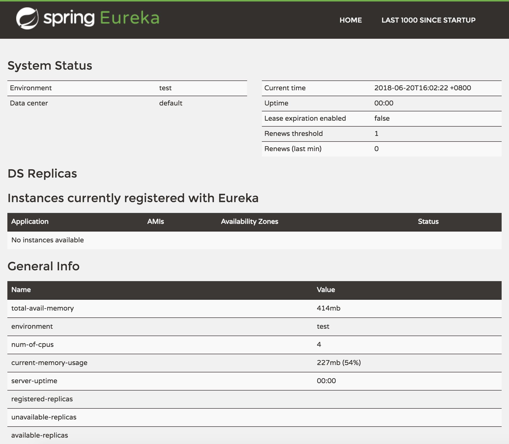
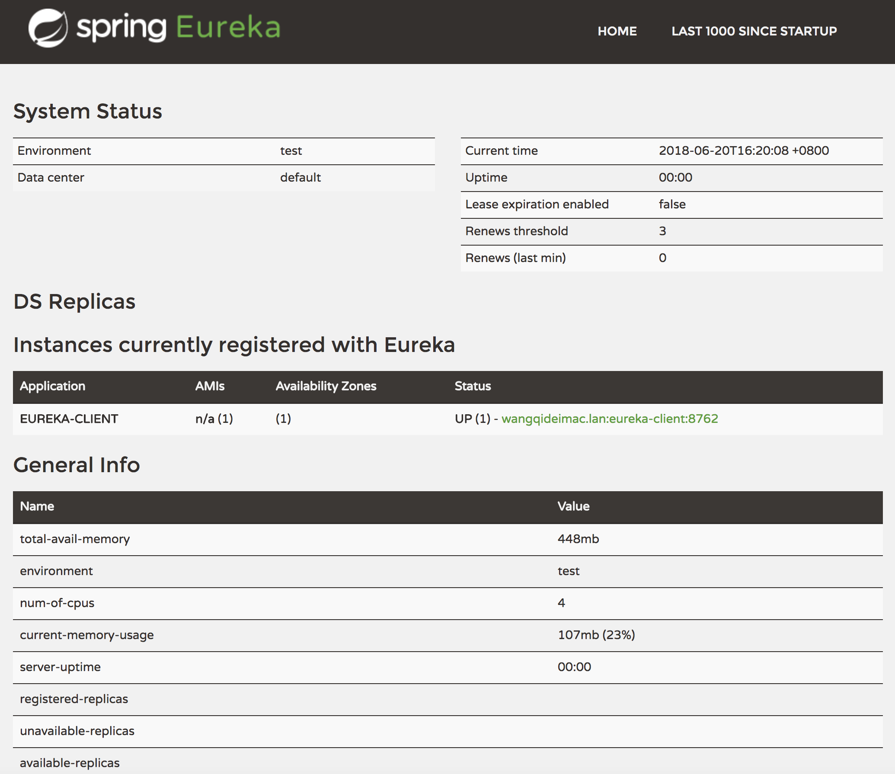

微服务架构就是将一个完整的应用从一个完整的应用从数据存储开始垂直拆分成多个不同的服务，每个服务都能独立部署、独立维护、独立扩展，服务与服务间通过诸如RESTful API的方式互相调用。

服务注册与发现是微服务架构的核心功能，本文将尝试实现一个简单的服务注册与发现的demo。

**Spring Cloud的系列博客使用的Spring-boot版本为2.0.1.RELEASE，Spring-cloud版本为Finchley.RC1**

<!-- more -->

## 服务注册中心

我们使用`Eureka`作为服务注册中心。

创建一个基础的Spring Boot工程，并在`pom.xml`中引入需要的依赖内容：

```
<parent>
    <groupId>org.springframework.boot</groupId>
    <artifactId>spring-boot-starter-parent</artifactId>
    <version>2.0.1.RELEASE</version>
</parent>

<properties>
    <project.build.sourceEncoding>UTF-8</project.build.sourceEncoding>
    <project.reporting.outputEncoding>UTF-8</project.reporting.outputEncoding>
    <java.version>1.8</java.version>
    <spring-cloud.version>Finchley.RC1</spring-cloud.version>
</properties>

<dependencies>
    <dependency>
        <groupId>org.springframework.cloud</groupId>
        <artifactId>spring-cloud-starter-netflix-eureka-server</artifactId>
    </dependency>
</dependencies>

<dependencyManagement>
    <dependencies>
        <dependency>
            <groupId>org.springframework.cloud</groupId>
            <artifactId>spring-cloud-dependencies</artifactId>
            <version>${spring-cloud.version}</version>
            <type>pom</type>
            <scope>import</scope>
        </dependency>
    </dependencies>
</dependencyManagement>

<repositories>
    <repository>
        <id>spring-milestones</id>
        <name>Spring Milestones</name>
        <url>https://repo.spring.io/libs-milestone</url>
        <snapshots>
            <enabled>false</enabled>
        </snapshots>
    </repository>
</repositories>
```

通过`@EnableEurekaServer`注解启动一个服务注册中心提供给其他应用进行对话。这一步非常简单，只需要在一个普通的Spring Boot应用中添加这个注解就能开启此功能：

```java
@EnableEurekaServer
@SpringBootApplication
public class EurekaServerApplication {
    public static void main(String[] args) {
        SpringApplication.run(EurekaServerApplication.class, args);
    }
}
```

默认设置下，该服务注册中心也会将自己作为客户端来尝试注册它自己，所以我们需要禁用它的客户端注册行为，只需要在`application.yml`中增加如下配置：

```
spring:
  application:
    name: eureka-server

server:
  port: 8761

eureka:
  instance:
    hostname: localhost
  client:
    registerWithEureka: false #该实例是否向Eureka服务器注册自己，以供外部应用发现自己。在某些情况下，你可能不希望当前的应用被外部的其他应用发现，而只是想从服务器发现其他服务的实例，此时你可以将此值设为false
    fetchRegistry: false      #该实例是否向Eureka服务器获取所有的注册信息表
    serviceUrl:
      defaultZone: http://${eureka.instance.hostname}:${server.port}/eureka/  #该实例与Eureka服务器通讯的URL地址列表。如果Eureka服务器地址不止一个，则使用英文的逗号分隔
```

启动工程后，访问: [http://localhost:8761/](http://localhost:8761/)

可以看到以下页面，其中还没有发现任何服务：



## 服务提供方

下面我们创建提供服务的客户端，并向服务注册中心注册自己。

假设我们有一个提供计算功能的微服务模块，我们实现一个RESTful API，通过传入两个参数a和b，最后返回`a + b`的结果。

首先，创建一个基本的Spring Boot应用，在`pom.xml`中，加入如下配置：

```
<parent>
    <groupId>org.springframework.boot</groupId>
    <artifactId>spring-boot-starter-parent</artifactId>
    <version>2.0.1.RELEASE</version>
</parent>

<properties>
    <project.build.sourceEncoding>UTF-8</project.build.sourceEncoding>
    <project.reporting.outputEncoding>UTF-8</project.reporting.outputEncoding>
    <java.version>1.8</java.version>
    <spring-cloud.version>Finchley.RC1</spring-cloud.version>
</properties>

<dependencies>
    <dependency>
        <groupId>org.springframework.cloud</groupId>
        <artifactId>spring-cloud-starter-netflix-eureka-client</artifactId>
    </dependency>
</dependencies>

<dependencyManagement>
    <dependencies>
        <dependency>
            <groupId>org.springframework.cloud</groupId>
            <artifactId>spring-cloud-dependencies</artifactId>
            <version>${spring-cloud.version}</version>
            <type>pom</type>
            <scope>import</scope>
        </dependency>
    </dependencies>
</dependencyManagement>

<repositories>
    <repository>
        <id>spring-milestones</id>
        <name>Spring Milestones</name>
        <url>https://repo.spring.io/libs-milestone</url>
        <snapshots>
            <enabled>false</enabled>
        </snapshots>
    </repository>
</repositories>
```

其次，实现`/add`请求处理接口：

```java
@RestController
public class ComputeController {
    @RequestMapping(value = "/add", method = RequestMethod.GET)
    public Integer add(@RequestParam Integer a, @RequestParam Integer b) {
        return a + b;
    }
}
```

最后在主类中通过加上`@EnableDiscoveryClient`注解，该注解能激活Eureka中的`DiscoveryClient`实现，才能实现Controller中对服务信息的输出。

```java
@EnableDiscoveryClient
@SpringBootApplication
public class EurekaClientApplication {
    public static void main(String[] args) {
        SpringApplication.run(EurekaClientApplication.class, args);
    }
}
```

继续对`application.yml`做一些配置工作，具体如下：

```
spring:
  application:
    name: eureka-client

server:
  port: 8762

eureka:
  instance:
    hostname: localhost
  client:
    serviceUrl:
      defaultZone: http://${eureka.instance.hostname}:8761/eureka/
```

通过`spring.application.name`属性，我们可以指定微服务的名称，后续在调用的时候只需要使用该名称就可以进行服务的访问。

`eureka.client.serviceUrl.defaultZone`属性对应服务注册中心的配置内容，指定服务注册中心的位置。

为了在本机上测试区分服务提供方和服务注册中心，使用`server.port`属性设置不同的端口

启动该工程后，再次访问：[http://localhost:8761/](http://localhost:8761/)

可以看到，我们定义的服务被注册了。




> http://blog.didispace.com/springcloud1/


