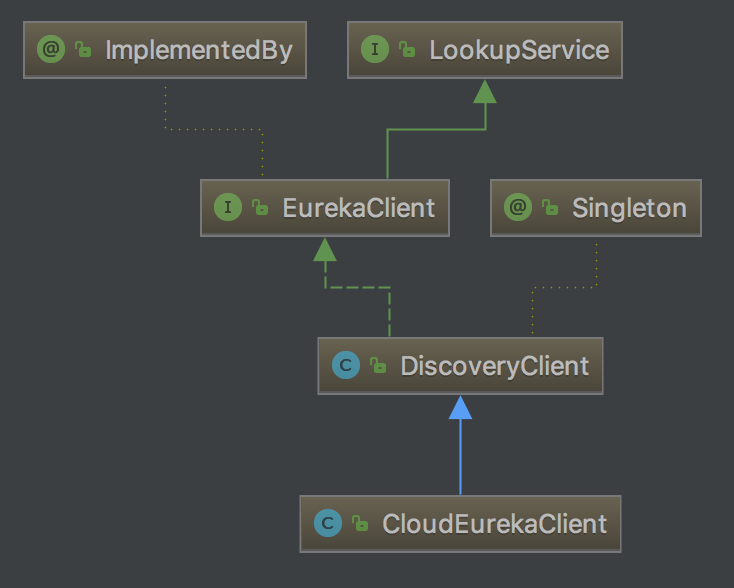

服务注册是Spring Cloud的关键功能，本文着重来分析eureka-client服务注册的过程。

<!-- more -->

# 服务注册

要想将一个服务注册到Eureka Server非常简单：

1. 在pom.xml文件中加入Eureka Server依赖

    ```
    <dependency>
        <groupId>org.springframework.cloud</groupId>
        <artifactId>spring-cloud-starter-netflix-eureka-client</artifactId>
    </dependency>
    ```

2. 在启动类上添加注解`@EnableDiscoveryClient`或`@EnableEurekaClient`

    ```java
    @EnableDiscoveryClient
    @SpringBootApplication
    public class EurekaClientApplication {
        public static void main(String[] args) {
            SpringApplication.run(EurekaClientApplication.class, args);
        }
    }
    ```

3. 配置

    ```
    spring:
      application:
        name: eureka-client
    
    server:
      port: 8762
    
    eureka:
      instance:
        hostname: localhost
      client:
        serviceUrl:
          defaultZone: http://${eureka.instance.hostname}:8761/eureka/
    ```

从Spring Cloud Edgware开始，注解`@EnableDiscoveryClient`或`@EnableEurekaClient`可省略。只需加上相关依赖，并进行相应配置，即可将微服务注册到服务发现组件上。

# Eureka-client注册服务的原理

我们知道，在初始化过程中，SpringBoot会扫描`spring.factories`，加载其中的配置类。Eureka-client的`spring.factories`如下所示：

```
org.springframework.boot.autoconfigure.EnableAutoConfiguration=\
org.springframework.cloud.netflix.eureka.config.EurekaClientConfigServerAutoConfiguration,\
org.springframework.cloud.netflix.eureka.config.EurekaDiscoveryClientConfigServiceAutoConfiguration,\
org.springframework.cloud.netflix.eureka.EurekaClientAutoConfiguration,\
org.springframework.cloud.netflix.ribbon.eureka.RibbonEurekaAutoConfiguration,\
org.springframework.cloud.netflix.eureka.EurekaDiscoveryClientConfiguration

org.springframework.cloud.bootstrap.BootstrapConfiguration=\
org.springframework.cloud.netflix.eureka.config.EurekaDiscoveryClientConfigServiceBootstrapConfiguration
```

我们重点关注两个类：`EurekaDiscoveryClientConfiguration`和`EurekaClientAutoConfiguration`。

因为在`EurekaClientAutoConfiguration`有如下条件：

```java
@ConditionalOnBean(EurekaDiscoveryClientConfiguration.Marker.class)
@AutoConfigureAfter(name = {"org.springframework.cloud.autoconfigure.RefreshAutoConfiguration",
        "org.springframework.cloud.netflix.eureka.EurekaDiscoveryClientConfiguration",
        "org.springframework.cloud.client.serviceregistry.AutoServiceRegistrationAutoConfiguration"})
```

因此首先执行`EurekaDiscoveryClientConfiguration`配置类，加载其中的配置，然后再去执行`EurekaClientAutoConfiguration`。

## EurekaClientAutoConfiguration

EurekaClientAutoConfiguration类的主要功能是配置EurekaClient。其中有个关键的内部类`RefreshableEurekaClientConfiguration`：

```java
@Configuration
@ConditionalOnRefreshScope
protected static class RefreshableEurekaClientConfiguration {

    @Autowired
    private ApplicationContext context;

    @Autowired
    private AbstractDiscoveryClientOptionalArgs<?> optionalArgs;

    @Bean(destroyMethod = "shutdown")
    @ConditionalOnMissingBean(value = EurekaClient.class, search = SearchStrategy.CURRENT)
    @org.springframework.cloud.context.config.annotation.RefreshScope
    @Lazy
    public EurekaClient eurekaClient(ApplicationInfoManager manager, EurekaClientConfig config, EurekaInstanceConfig instance) {
        manager.getInfo(); // force initialization
        return new CloudEurekaClient(manager, config, this.optionalArgs,
                this.context);
    }

    @Bean
    @ConditionalOnMissingBean(value = ApplicationInfoManager.class, search = SearchStrategy.CURRENT)
    @org.springframework.cloud.context.config.annotation.RefreshScope
    @Lazy
    public ApplicationInfoManager eurekaApplicationInfoManager(EurekaInstanceConfig config) {
        InstanceInfo instanceInfo = new InstanceInfoFactory().create(config);
        return new ApplicationInfoManager(config, instanceInfo);
    }

}
```

`RefreshableEurekaClientConfiguration`的注释`@ConditionOnRefreshScope`定义如下：

```java
@Target({ ElementType.TYPE, ElementType.METHOD })
@Retention(RetentionPolicy.RUNTIME)
@Documented
@ConditionalOnClass(RefreshScope.class)
@ConditionalOnBean(RefreshAutoConfiguration.class)
@interface ConditionalOnRefreshScope {

}
```

因为在`spring-cloud-context`包的`spring.factories`中有这样的配置：

```
org.springframework.boot.autoconfigure.EnableAutoConfiguration=\
org.springframework.cloud.autoconfigure.ConfigurationPropertiesRebinderAutoConfiguration,\
org.springframework.cloud.autoconfigure.LifecycleMvcEndpointAutoConfiguration,\
org.springframework.cloud.autoconfigure.RefreshAutoConfiguration,\
org.springframework.cloud.autoconfigure.RefreshEndpointAutoConfiguration,\
org.springframework.cloud.autoconfigure.WritableEnvironmentEndpointAutoConfiguration
```

其中包含了`RefreshAutoConfiguration`，所以`@ConditionalOnRefreshScope`注释上的`@ConditionalOnBean(RefreshAutoConfiguration.class)`是生效的。因此Spring会创建`RefreshableEurekaClientConfiguration`，包括其中的`EurekaClient`，其实例为`CloudEurekaClient`。

### CloudEurekaClient

CloudEurekaClient的继承关系如下：




它继承了`com.netflix.discovery.DiscoveryClient`。在构造方法中调用了`initScheduledTasks()`方法来初始化各种定时任务：

```java
public class DiscoveryClient implements EurekaClient {
    ...
    /**
     * Initializes all scheduled tasks.
     */
    private void initScheduledTasks() {
        if (clientConfig.shouldFetchRegistry()) {
            // registry cache refresh timer
            int registryFetchIntervalSeconds = clientConfig.getRegistryFetchIntervalSeconds();
            int expBackOffBound = clientConfig.getCacheRefreshExecutorExponentialBackOffBound();
            // 拉取服务清单的定时任务
            scheduler.schedule(
                    new TimedSupervisorTask(
                            "cacheRefresh",
                            scheduler,
                            cacheRefreshExecutor,
                            registryFetchIntervalSeconds,
                            TimeUnit.SECONDS,
                            expBackOffBound,
                            new CacheRefreshThread()
                    ),
                    registryFetchIntervalSeconds, TimeUnit.SECONDS);
        }

        if (clientConfig.shouldRegisterWithEureka()) {
            int renewalIntervalInSecs = instanceInfo.getLeaseInfo().getRenewalIntervalInSecs();
            int expBackOffBound = clientConfig.getHeartbeatExecutorExponentialBackOffBound();
            logger.info("Starting heartbeat executor: " + "renew interval is: {}", renewalIntervalInSecs);

            // Heartbeat timer
            // 创建服务续约的定时任务（心跳）
            scheduler.schedule(
                    new TimedSupervisorTask(
                            "heartbeat",
                            scheduler,
                            heartbeatExecutor,
                            renewalIntervalInSecs,
                            TimeUnit.SECONDS,
                            expBackOffBound,
                            new HeartbeatThread()
                    ),
                    renewalIntervalInSecs, TimeUnit.SECONDS);

            // InstanceInfo replicator
            // InstanceInfoReplicator是一个Runnable接口实现类，服务注册的逻辑在run方法中。它的功能是检查服务状态，向Server中注册服务
            instanceInfoReplicator = new InstanceInfoReplicator(
                    this,
                    instanceInfo,
                    clientConfig.getInstanceInfoReplicationIntervalSeconds(),
                    2); // burstSize

            // 服务实例状态监听器
            statusChangeListener = new ApplicationInfoManager.StatusChangeListener() {
                @Override
                public String getId() {
                    return "statusChangeListener";
                }

                @Override
                public void notify(StatusChangeEvent statusChangeEvent) {
                    if (InstanceStatus.DOWN == statusChangeEvent.getStatus() ||
                            InstanceStatus.DOWN == statusChangeEvent.getPreviousStatus()) {
                        // log at warn level if DOWN was involved
                        logger.warn("Saw local status change event {}", statusChangeEvent);
                    } else {
                        logger.info("Saw local status change event {}", statusChangeEvent);
                    }
                    // 如果状态发生改变，重新将实例信息注册到注册中心
                    instanceInfoReplicator.onDemandUpdate();
                }
            };
            // 判断配置中是否设置了注册服务实例状态监听器
            if (clientConfig.shouldOnDemandUpdateStatusChange()) {
                applicationInfoManager.registerStatusChangeListener(statusChangeListener);
            }
            // 启动InstanceInfoReplicator
            instanceInfoReplicator.start(clientConfig.getInitialInstanceInfoReplicationIntervalSeconds());
        } else {
            logger.info("Not registering with Eureka server per configuration");
        }
    }
    ...
}
```

#### InstanceInfoReplicator服务注册的定时任务

`InstanceInfoReplicator`类的功能是更新本地的服务实例信息，并将本地的服务实例信息复制到注册服务中。其定时周期由`EurekaClientConfig.getInstanceInfoReplicationIntervalSeconds()`控制，默认为30秒。

`DiscoveryClient.initScheduledTasks()`方法中调用`InstanceInfoReplicator.start()`方法启动`InstanceInfoReplicator`：

```java
public void start(int initialDelayMs) {
    if (started.compareAndSet(false, true)) {
        instanceInfo.setIsDirty();  // for initial register
        Future next = scheduler.schedule(this, initialDelayMs, TimeUnit.SECONDS);
        scheduledPeriodicRef.set(next);
    }
}
```

流程如下：

1. 调用`compareAndSet`确保只有InstanceInfoReplicator只启动一个定时任务。
2. 调用`setIsDirty`将本地的实例信息设置为脏数据，这是为了向注册中心注册服务。
3. 然后调用`schedule`启动延时任务

延时任务的执行逻辑在`run`方法中：

```java
public void run() {
    try {
        discoveryClient.refreshInstanceInfo();

        Long dirtyTimestamp = instanceInfo.isDirtyWithTime();
        if (dirtyTimestamp != null) {
            discoveryClient.register();
            instanceInfo.unsetIsDirty(dirtyTimestamp);
        }
    } catch (Throwable t) {
        logger.warn("There was a problem with the instance info replicator", t);
    } finally {
        Future next = scheduler.schedule(this, replicationIntervalSeconds, TimeUnit.SECONDS);
        scheduledPeriodicRef.set(next);
    }
}
```

流程如下：

1. 调用`DiscoveryClient.refreshInstanceInfo`刷新当前本地的实例信息。如果发生了改变，实例信息中的`isDirty`标记会被设置为`true`
2. 检查实例信息是否发生了改变，如果发生改变则调用`DiscoveryClient.register`方法将实例信息注册到注册中心
3. 再次调用`schedule`启用延时任务，相当于周期性的执行InstanceInfoReplicator任务

##### 刷新实例信息

刷新实例信息的任务在`DiscoveryClient.refreshInstanceInfo`方法中，主要流程如下：

1. 调用`ApplicationInfoManager.refreshDataCenterInfoIfRequired`检查Server的hostname是否发生了修改
2. 调用`ApplicationInfoManager.refreshLeaseInfoIfRequired`检查`lease.duration`和`lease.renewalInterval`两个续约配置是否发生了修改
3. 调用`HealthCheckCallbackToHandlerBridge.getStatus`获取服务实例的状态，并设置服务实例的状态

##### 注册服务实例信息

注册服务实例信息的任务在`DiscoveryClient.register`方法中，其最终调用的方法是`AbstractJerseyEurekaHttpClient.register(InstanceInfo info)`。该方法向Eureka Server发送POST请求，请求的urlPath是`apps/EUREKA-CLIENT`，`EUREKA-CLIENT`是服务实例的名称，在本例中完整的请求地址是`http://localhost:8761/eureka/apps/EUREKA-CLIENT`。将服务实例信息InstanceInfo通过POST请求发送给Eureka Server完成注册。

#### 刷新服务列表缓存的定时任务

刷新服务列表缓存的定时任务由以下代码启动:

```java
scheduler.schedule(
        new TimedSupervisorTask(
                "cacheRefresh",
                scheduler,
                cacheRefreshExecutor,
                registryFetchIntervalSeconds,
                TimeUnit.SECONDS,
                expBackOffBound,
                new CacheRefreshThread()
        ),
        registryFetchIntervalSeconds, TimeUnit.SECONDS);
```

其定时周期由`EurekaClientConfig.getRegistryFetchIntervalSeconds()`控制，默认为30秒。

在`TimedSupervisorTask`中也是通过循环调用`schedule`的方式形成一个周期任务，以定时执行`CacheRefreshThread`线程。

`CacheRefreshThread`的任务就是调用`refreshRegistry`方法：

```java
class CacheRefreshThread implements Runnable {
    public void run() {
        refreshRegistry();
    }
}
```

##### refreshRegistry

`refreshRegistry`的任务是获取注册的所有服务，主要的流程如下：

1. 调用`EurekaClientConfig.fetchRegistryForRemoteRegions`重新获取注册中心的地址，因为这些配置有可能发生动态修改。
2. 调用`DiscoveryClient.fetchRegistry`获取注册信息

##### fetchRegistry

`fetchRegistry`的任务是获取注册信息，主要流程如下：

1. 调用`DiscoveryClient.getApplications`方法获取本地保存的所有注册信息
2. 判断是否需要获取全量注册信息，分别调用`DiscoveryClient.getAndStoreFullRegistry`和`DiscoveryClient.getAndUpdateDelta`方法
3. 对注册信息设置HashCode
4. 调用`onCacheRefreshed`广播`CacheRefreshedEvent`事件通知服务发生改变。例如Ribbon收到事件后会更新它保存的服务信息
5. 调用`updateInstanceRemoteStatus`更新实例的状态

##### getAndStoreFullRegistry

`DiscoveryClient.getAndStoreFullRegistry`的任务是从Eureka Server中获取所有的注册信息，然后保存在本地。主要流程如下：

1. 调用`EurekaHttpClientDecorator.getApplications`方法，返回EurekaHttpResponse<Applications>

    最终调用的是`AbstractJerseyEurekaHttpClient.getApplicationsInternal`，该方法向Eureka Server发送请求，请求的urlPath是`apps/`，在本例中完整的请求地址是`http://localhost:8761/eureka/apps/`。根据返回的数据生成`Applications`实例。
    
2. 如果返回的`Applications`不为null，将其保存到`DiscoveryClient.localRegionApps`变量中

##### getAndUpdateDelta

`DiscoveryClient.getAndUpdateDelta`的任务是从Eureka Server中获取增量注册信息，更新本地保存的信息。主要流程如下：

1. 调用`EurekaHttpClientDecorator.getDelta`方法，

    最终调用的是`AbstractJerseyEurekaHttpClient.getApplicationsInternal`，该方法向Eureka Server发送请求，请求的urlPath是`apps/delta`，在本例中完整的请求地址是`http://localhost:8761/eureka/apps/delta`。根据返回的数据生成`Applications`实例。
    
2. 如果返回的delta为null，则调用`getAndStoreFullRegistry`获取全量的数据
3. 调用`Discovery.updateDelta`更新增量服务信息

    遍历增量服务信息，根据服务信息的操作类型（新增、修改、删除）进行相应的处理

#### 服务续约的定时任务

服务续约的定时任务由以下代码启动:

```java
scheduler.schedule(
        new TimedSupervisorTask(
                "heartbeat",
                scheduler,
                heartbeatExecutor,
                renewalIntervalInSecs,
                TimeUnit.SECONDS,
                expBackOffBound,
                new HeartbeatThread()
        ),
        renewalIntervalInSecs, TimeUnit.SECONDS);
```

在`TimedSupervisorTask`中也是通过循环调用`schedule`的方式形成一个周期任务，以定时执行`HeartbeatThread`线程。其定时周期由`LeaseInfo.renewalIntervalInSecs`变量控制，默认为`DEFAULT_LEASE_RENEWAL_INTERVAL`，即30秒。

`HeartbeatThread`的任务就是调用`renew`方法：

```java
private class HeartbeatThread implements Runnable {
    public void run() {
        if (renew()) {
            lastSuccessfulHeartbeatTimestamp = System.currentTimeMillis();
        }
    }
}
```

##### renew

`DiscoveryClient.renew`方法的任务是向Eureka Server发送服务续约请求，流程如下：

1. 调用`EurekaHttpClientDecorator.sendHeartBeat`发送心跳请求
    
    最终调用的是`AbstractJerseyEurekaHttpClient.sendHeartBeat`，该方法向Eureka Server发送心跳请求，请求的urlPath是`apps/EUREKA-CLIENT/wangqideimac.lan:eureka-client:8762`，在本例中完整的请求地址是`http://localhost:8761/eureka/apps/EUREKA-CLIENT/wangqideimac.lan:eureka-client:8762?status=UP&lastDirtyTimestamp=1530096210220`。其中`EUREEKA-CLIENT`表示服务名称，`wangqideimac.lan:eureka-client:8762`表示服务id，`status`表示服务的状态，`lastDirtyTimestamp`表示实例更新的时间。

2. 如果返回的状态是404，表示当前服务还没有注册过，于是调用`register`方法向Eureka Server注册服务。

#### 服务下线

服务下线一般在服务关闭(shut down)的时候调用，用来把自身的服务从Eureka Server中删除，以防客户端调用不存在的服务。

服务下线的任务在`Discovery.unregister`方法中，其最终调用的方法是`AbstractJerseyEurekaHttpClient.cancel(String appName, String id)`。该方法向Eureka Server发送DELETE请求，请求的urlPath是`apps/EUREKA-CLIENT/wangqideimac.lan:eureka-client:8762`，其中`EUREEKA-CLIENT`表示服务名称，`wangqideimac.lan:eureka-client:8762`表示服务id。在本例中完整的请求地址是`http://localhost:8761/eureka/apps/EUREKA-CLIENT/wangqideimac.lan:eureka-client:8762`。

# 总结

经过前文的总结，我们可以看到，服务注册的过程是围绕`CloudEurekaClient`来进行的，它的父类`DiscoveryClient`在初始化的过程中会调用`initScheduledTasks`方法，其中会创建三个定时任务：

- 服务注册。
    
    其定时周期由`EurekaClientConfig.getInstanceInfoReplicationIntervalSeconds()`控制，默认为30秒。
    
    调用`DiscoveryClient.register`方法。向Eureka Server发送请求，请求的urlPath是"apps/{app_name}"，app_name是服务实例的名称。将服务实例信息InstanceInfo通过POST请求发送给Eureka Server完成注册。
    
    本示例完整的请求实例："http://localhost:8761/eureka/apps/EUREKA-CLIENT/"
    
- 服务续约。

    其定时周期由`LeaseInfo.renewalIntervalInSecs`变量控制，默认为`DEFAULT_LEASE_RENEWAL_INTERVAL`，即30秒。

    调用`DiscoveryClient.renew`方法。向Eureka Server发送请求，请求的urlPath是"apps/{app_name}/{id}:8762?status={status}&lastDirtyTimestamp={timestamp}"，其中app_name表示服务名称，id表示服务id，status表示服务的状态，timestamp表示实例更新的时间。
    
    本示例完整的请求实例："http://localhost:8761/eureka/apps/EUREKA-CLIENT/wangqideimac.lan:eureka-client:8762?status=UP&lastDirtyTimestamp=1530096210220"

- 刷新服务列表缓存。调用`DiscoveryClient.fetchRegistry`方法，

    其定时周期由`EurekaClientConfig.getRegistryFetchIntervalSeconds()`控制，默认为30秒。
    
    向Eureka Server发送请求，全量请求的urlPath是"apps/"，增量请求的urlPath是"apps/delta"


> http://blog.didispace.com/spring-cloud-eureka-register-detail/
> https://my.oschina.net/u/3039671/blog/1546168
> http://www.itmuch.com/spring-cloud/edgware-new-optional-enable-discovery-client/
> https://blog.csdn.net/Mr_rain/article/details/78790292

