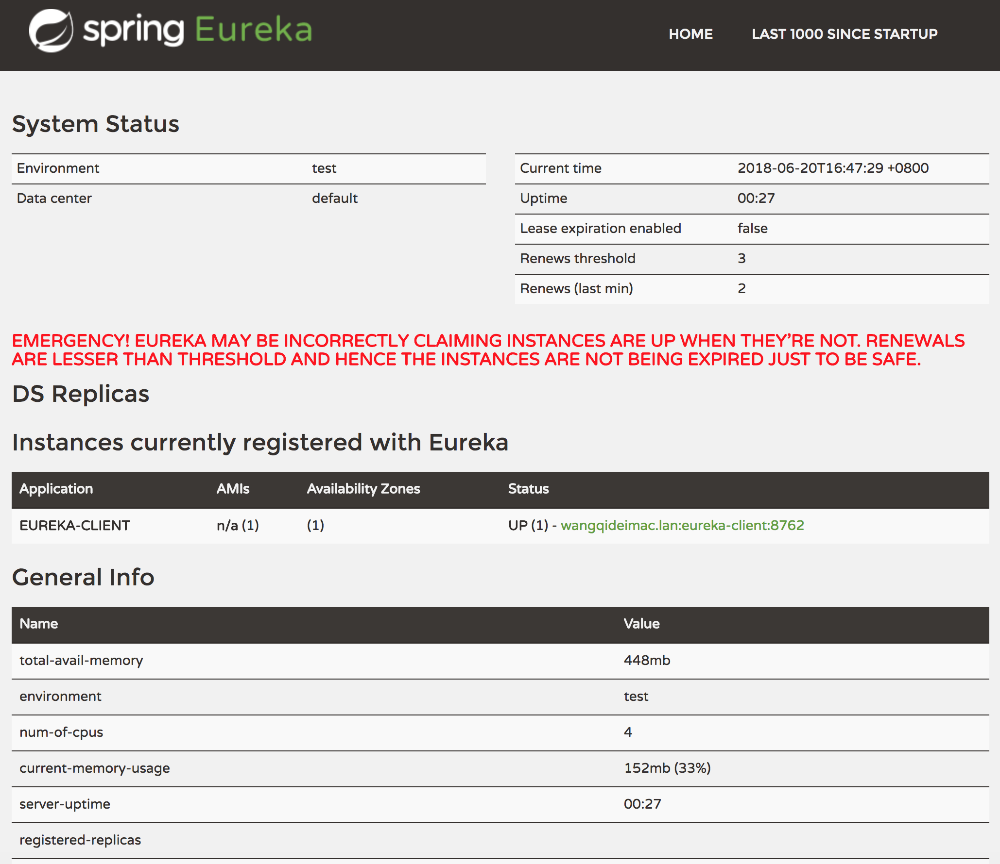

根据[Eureka(一)——服务注册与发现][1]，我们实现了一个服务注册中心和一个服务提供方。经过一段时间，我们发现服务注册中心产生了一个报警：
<!-- more -->


这是因为Eureka进入了自我保护模式。

Eureka默认开启了自我保护模式（可以通过`eureka.server.enable-self.preservation`配置）。该模式被激活的条件是：在1分钟后，`Renews(last min) < Renews threshold`。

**Renews threshold:   Eureka Server期望每分钟收到客户端实例续约的总数
Renews(last min):   Eureka Server最后一分钟收到客户端实例续约的总数**


## 服务器端续约阈值的计算源码（Renews threshold）

`com.netflix.eureka.registry.PeerAwareInstanceRegistryImpl#openForTraffic`

```java
this.expectedNumberOfRenewsPerMin = count * 2;
this.numberOfRenewsPerMinThreshold = (int) (this.expectedNumberOfRenewsPerMin * serverConfig.getRenewalPercentThreshold());
```

其中，count为服务器的数量。数值2表示每30秒1个心跳，每分钟2个心跳的固定频率因子。归纳公式：`2M * renewalPercentThreshold`。其中，M为服务器的个数，计算结果只保留整数位。`renewalPercentThreshold`默认是`0.85`（可以通过`eureka.server.renewal-percent-threshold`配置）。

其实这就是个固定值，因为对于每个Eureka Server来说，M只能取1。这段代码达到的效果是：

1. `expectedNumberOfRenewsPerMin`重置为固定值2
2. `numberOfRenewsPerMinThreshold`的值被设置为1

## 客户端续约阈值的计算源码（Renews threshold）

`com.netflix.eureka.registry.AbstractInstanceRegistry#register`

```java
if (this.expectedNumberOfRenewsPerMin > 0) {
    this.expectedNumberOfRenewsPerMin = this.expectedNumberOfRenewsPerMin + 2;
    this.numberOfRenewsPerMinThreshold = (int) (this.expectedNumberOfRenewsPerMin * serverConfig.getRenewalPercentThreshold());
}
```

上面贴出的`PeerAwareInstanceRegistryImpl`继承自`AbstractInstanceRegistry`。它们共享`expectedNumberOfRenewsPerMin`和`numberOfRenewsPerMinThreshold`属性。

设有N个客户端，服务端先启动，expectedNumberOfRenewsPerMin被重置为固定值2。接着客户端依次启动：

- `N = 1` -> `(2 + 2) * renewalPercentThreshold`
- `N = 2` -> `(2 + 2 + 2) * renewalPercentThreshold`
- `N = 3` -> `(2 + 2 + 2 + 2) * renewalPercentThreshold`

归纳公式：`2(N+1) * renewalPercentThreshold`，计算结果只保留整数位。

即，如果只有1个Eureka Server或者有多个Eureka Server但它们之间没有相互注册：

当N = 0时，只计算服务端。`Renews threshold = 1`。由于没有客户端向服务器发送心跳，`Renews (last min) < Renews threshold`，Eureka自我保护模式被激活。

当N != 0时，服务端的计算结果被客户端覆盖，即只计算客户端

当N = 2时，`Renews threshold` = `2(N + 1) * renewalPercentThreshold` = `2 * 3 * 0.85` = 5。2个客户端以每30秒发送1个心跳，1分钟后总共向服务器发送4个心跳，`Renews (last min)` < `Renews threshold`，Eureka自我保护模式被激活。

所以如果`N < 3`，在1分钟后，服务端收到的客户端实例续约的总数总是小于期望的阈值，因此Eureka的自我保护模式自动被激活。首页会出现警告信息：

```
EMERGENCY! EUREKA MAY BE INCORRECTLY CLAIMING INSTANCES ARE UP WHEN THEY'RE NOT. RENEWALS ARE LESSER THAN THRESHOLD AND HENCE THE INSTANCES ARE NOT BEING EXPIRED JUST TO BE SAFE.
```

这种情况下，由于Eureka Server没有对等的节点，同步不到服务注册信息，默认需等待5分钟（可以通过`eureka.server.wait-time-in-ms-when-sync-empty`）。即5分钟后你应该看到此信息。

为避免这种情况发生，你可以：

- 关闭自我保护模式(`eureka.server.enable-self-preservation`设为false)
- 降低`renewPercentThreshold`的比例(`eureka.server.renewal-percent-threshold`设置为0.5以下，比如0.49)
- 部署多个Eureka Server并开启其客户端行为(`eureka.client.register-with-eureka`不要设为false，默认为true)

如果是采取部署多个Eureka Server并开启其客户端行为使其相互注册。

假设有M个Eureka Server，那么，每个Eureka Server每分钟可以额外收到`2 * (M - 1)`个心跳。例如：

当`M = 1`，`N = 2`时，`Renews threshold` = `2(N + 1) * renewalPercentThreshold` = `2 * 3 * 0.85` = 5，2个客户端以每30秒发送1个心跳，1分钟后总共向服务器发送4个心跳，`Renews (last min)` < `Renews threshold`。

当`M = 2`, `N = 2`时，`Renews threshold` = `2(N + 1) * renewalPercentThreshold` = `2 * 3 * 0.85` = 5，2个客户端以每30秒发送1个心跳，1分钟总共向服务器发送4个心跳，另外还有1个M发来的2个心跳，总共是6个心跳，`Renews (last min)` > `Renews threshold`。

Eureka的自我保护模式是有意义的，该模式被激活后，它不会从注册列表中剔除因长时间没收到心跳导致租期过期的服务，而是等待修复，直到心跳恢复正常之后，它自动退出自我保护模式。这种模式旨在避免因网络分区故障导致服务不可用的问题。例如，两个客户端实例C1和C2的连通性是良好的，但是由于网络故障，C2未能及时向Eureka发送心跳续约，这时候Eureka不能简单地将C2从注册表中剔除。因为如果剔除了，C1就无法从Eureka服务器中获取C2注册的服务，但是这时候C2服务是可用的。所以，Eureka的自我保护模式最好还是开启它。

## Eureka与Zookeeper的区别

Eureka最大程度上保证AP（Availability，可用性；Partition-tolerance，分区容错性），而Zookeeper保证的是CP（Consistency，一致性；Partition-tolerance，分区容错性）。

如果因为网络分区故障导致服务器（master节点）无法与其他节点联系，对于Zookeeper来说，这是不能容忍的。它会对剩下的节点重新进行leader选举，在这期间，整个Zookeeper集群是不可用的，这就直接导致了所有注册服务瘫痪的现象。

而对于Eureka来说，每个节点都是对等的，失去一个节点，就自动切换到其他节点，只要还有一个Eureka节点存在，就能正常对外提供注册服务。Eureka可以很好的应对因网络分区故障而导致的部分节点失去联系的状况。


[1]: /articles/Spring-Cloud/Eureka(一)——服务注册与发现.html


> http://fanlychie.github.io/post/spring-cloud-netflix-eureka.html

