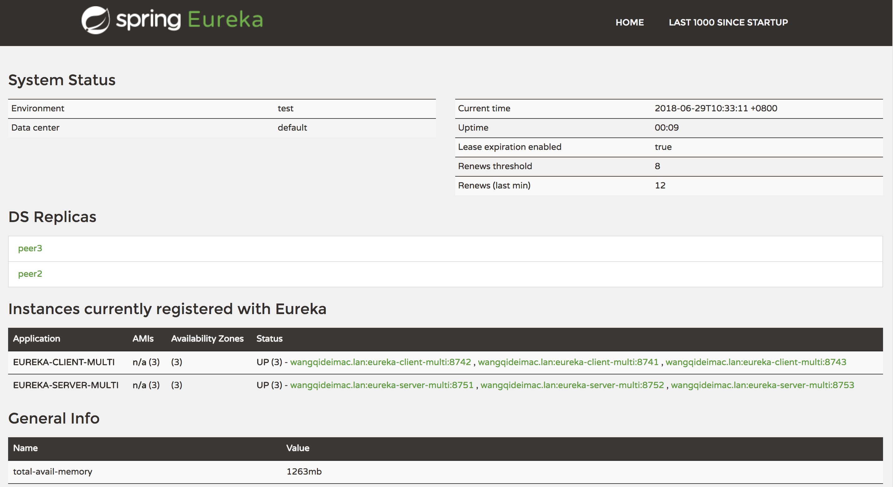

在文章[Eureka(一)——服务注册与发现][1]中，我们举的例子都是单点运行的，不适合于生产环境。

<!-- more -->

Eureka官方给出的应用部署架构图是这样的：


1. Region和Zone

    在Eureka中有Region（区域）和Zone（Availability Zone，可用区）的区分。这是由于Netflix开源的Eureka旨在AWS中运行，因此使用了一些AWS特有的概念术语。
    
    在非AWS的环境下，我们可以简单的将Region理解成大区或地域（如阿里云服务器的华南、华北地区），Zone可以简单的理解成机房。上图是一个Eureka集群的部署架构图，它有3个Zone（us-east-1c, us-east-1d, us-east-1e），它们都属于us-east-1这个Region。

2. Eureka Server

    每个Zone至少有一个Eureka Server，能够对外提供服务发现和处理区域故障。
    
    在Eureka Server集群中（`eureka.client.register-with-eureka`不能设置为`false`），没有Master/Slave的区分，每个Eureka Server都是对等(Peer)的。它们除了可以作为服务注册中心外还可以充当客户端向其他Eureka Server注册自己，并且会从它的对等的节点(由`eureka.client.service-url.defaultZone`配置指定)中Replicate(复制)所有的服务注册表信息以达到同步的目的，如果因为某种原因导致同步失败，默认等待5分钟（可以通过`eureka.server.wait-time-in-ms-when-sync-empt`配置），在这期间，它不向客户端提供服务注册信息。并且默认失败重试5次（可以通过`eureka.server.number-of-replication-retries`配置）。

3. Eureka Client

    Eureka客户端应用分两种，Application Service（服务提供者）和Application Client（服务消费者）。
    
    Application Service（服务提供者）通常需要向给定的serviceUrl对应的Eureka Server来Register（注册）自己，以供外部应用可以发现自己。其注册信息包含主机名和端口信息等元数据。然后默认以每隔30秒的频率向注册的Eureka Server发送一次心跳（可以通过`eureka.instance.lease-renewal-interval-in-seconds`配置）来renew（续约）服务。
    
    Eureka Server默认为90秒内如果没有收到客户端的心跳，则它会将该客户端实例从它的注册表中剔除。以禁止该实例的流量（可以通过`eureka.instance.lease-expiration-duration-in-seconds`配置。注意，如果该值设置的太大，即使实例已经不存在了，流量也可以路由到该实例；如果设置的太小，很可能因为网络问题导致实例被父物体剔除；该值至少应该比发送心跳频率的间隔要大）。
    
    Eureka客户端默认会从注册的Eureka Server中获取所有的服务注册表信息（可以通过`eureka.client.fetch-registry`配置），默认是以每隔30秒的频率去Get Registry（获取注册表）一次（可以通过`eureka.client.registry-fetch-interval-seconds`配置）。
    
    Application Client（服务消费者）可以不向任何Eureka Server注册自己，它可以只从Eureka Server获取注册过的服务列表，通过RESTful API的方式远程调用Application Service（服务提供者）。

# Eureka Server高可用样例

本示例是在同一主机运行多个Eureka Server实例，由于Eureka会过滤同一主机的相同主机名（详见`com.netflix.eureka.cluster.PeerEurekaNodes#isThisMyUrl`），但是它不检查端口，因此需要先行定义至少两个不同的主机名，并使它们映射到`127.0.0.1`。

这里采用修改hosts文件的方法。找到并修改系统的hosts文件，在最后添加如下：

```
127.0.0.1   peer1   peer2   peer3
```

修改eureka-server项目的配置文件：

```
spring:
  application:
    name: eureka-server-multi
  profiles:
    active: peer1

---
spring:
  profiles: peer1

server:
  port: 8751

eureka:
  instance:
    hostname: peer1
  client:
    serviceUrl:
      defaultZone: http://peer2:8752/eureka/,http://peer3:8753/eureka/

---
spring:
  profiles: peer2

server:
  port: 8752

eureka:
  instance:
    hostname: peer2
  client:
    serviceUrl:
      defaultZone: http://peer1:8751/eureka/,http://peer3:8753/eureka/

---
spring:
  profiles: peer3

server:
  port: 8753

eureka:
  instance:
    hostname: peer3
  client:
    serviceUrl:
      defaultZone: http://peer1:8751/eureka/,http://peer2:8752/eureka/
```

这里配置了3个Eureka Server实例，每个实例与其他两个实例分别进行两两的相互注册，关系如图示：


需要注意的是，Eureka Server的服务注册信息不能进行二次传播。如下图的实例关系配置是不可取的：


此图的每个Eureka Server实例是单向的向另外一个实例注册，假如现有一个新的客户端实例C向1注册，那么，1和2中都会有C的注册信息，但是3中是没有C的注册信息的（详见`com.netflix.eureka.registry.PeerAwareInstanceRegistryImpl#replicateToPeers`）。

启动3个Eureka Server实例：

```
java -jar -Dspring.profiles.active=peer1 eureka-server-multi-1.0-SNAPSHOT.jar
java -jar -Dspring.profiles.active=peer2 eureka-server-multi-1.0-SNAPSHOT.jar
java -jar -Dspring.profiles.active=peer3 eureka-server-multi-1.0-SNAPSHOT.jar
```

Eureka Server的dashboard如下所示，可以看到有3个服务节点：


# Eureka Client高可用样例

修改eureka-client项目的配置文件：

```
spring:
  application:
    name: eureka-client-multi
  profiles:
    active: client1

eureka:
  client:
    serviceUrl:
      defaultZone: http://peer1:8751/eureka/,http://peer2:8752/eureka/,http://peer3:8753/eureka/

---
spring:
  profiles: client1

server:
  port: 8741

---
spring:
  profiles: client2

server:
  port: 8742

---
spring:
  profiles: client3

server:
  port: 8743
```

启动3个Eureka Client实例：

```
java -jar -Dspring.profiles.active=client1 eureka-client-multi-1.0-SNAPSHOT.jar
java -jar -Dspring.profiles.active=client2 eureka-client-multi-1.0-SNAPSHOT.jar
java -jar -Dspring.profiles.active=client3 eureka-client-multi-1.0-SNAPSHOT.jar
```

Eureka Server的dashboard如下所示，可以看到注册了3个服务提供节点：




[1]: /articles/Spring-Cloud/Eureka(一)——服务注册与发现.html

> http://fanlychie.github.io/post/spring-cloud-netflix-eureka.html

