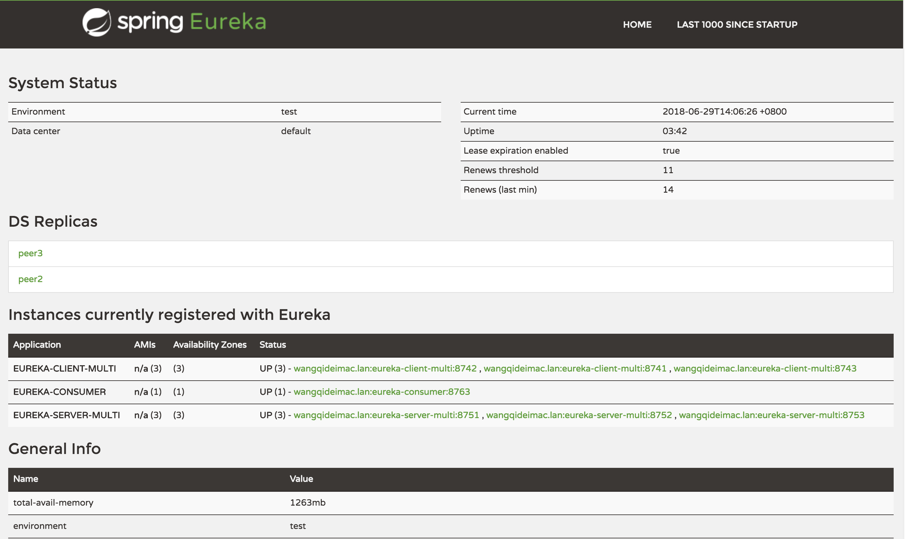
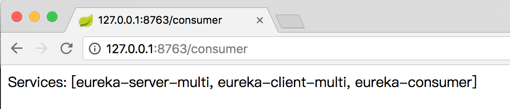
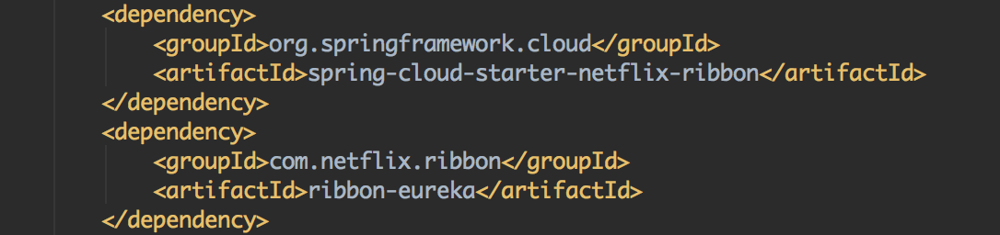
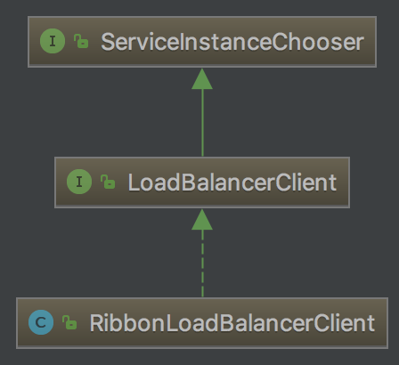
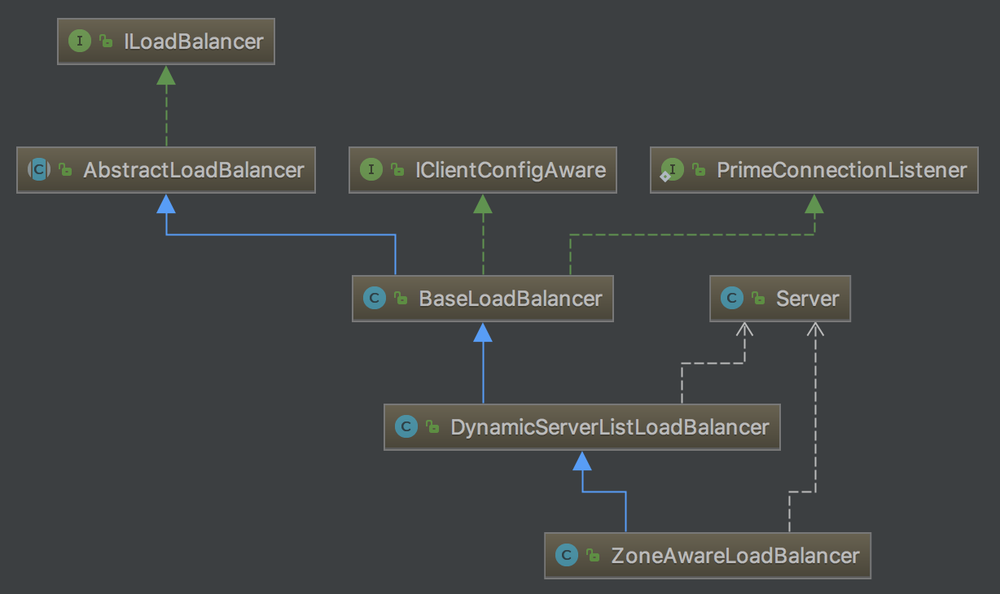
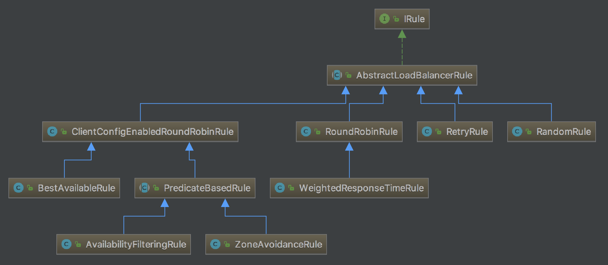

上一篇文章[Eureka(五)——高可用][1]中，我们介绍了如何构建高可用的服务注册中心和服务提供。

本文我们来看看如何去消费服务提供者的接口。

<!-- more -->

# 使用LoadBalancerClient

在Spring Cloud Commons中提供了大量的与服务治理相关的抽象接口，包括`DiscoveryClient`、这里我们即将介绍的`LoadBalancerClient`等。Spring Cloud做这一层抽象，很好的解耦了服务治理体系，使得我们可以轻易的替换不同的服务治理设施。

从`LoadBanacerClient`接口的命名中，我们就知道这是一个负载均衡客户端的抽象定义，下面我们就看看如何使用Spring Cloud提供的负载均衡器客户端接口来实现服务的消费。

首先创建一个服务消费者工程，命名为：`eureka-consumer`。并在`pom.xml`中引入依赖

```xml
<dependencies>
    <dependency>
        <groupId>org.springframework.cloud</groupId>
        <artifactId>spring-cloud-starter-netflix-eureka-client</artifactId>
    </dependency>
    <dependency>
        <groupId>org.springframework.boot</groupId>
        <artifactId>spring-boot-starter-web</artifactId>
    </dependency>
    <dependency>
        <groupId>org.springframework.boot</groupId>
        <artifactId>spring-boot-starter-actuator</artifactId>
    </dependency>
</dependencies>
```

配置`application.yml`，指定eureka注册中心的地址：

```
spring:
  application:
    name: eureka-consumer

server:
  port: 8763

eureka:
  client:
    serviceUrl:
      defaultZone: http://peer1:8751/eureka/,http://peer2:8752/eureka/,http://peer3:8753/eureka/

```

创建应用主类。初始化`RestTemplate`，用来真正发起REST请求。

```java
@EnableDiscoveryClient
@SpringBootApplication
public class EurekaConsumerApplication {
    @Bean
    public RestTemplate restTemplate() {
        return new RestTemplate();
    }

    public static void main(String[] args) {
        SpringApplication.run(EurekaConsumerApplication.class, args);
    }
}
```

创建一个接口用来消费eureka-client-multi提供的接口：

```java
@RestController
public class DcController {
    @Autowired
    LoadBalancerClient loadBalancerClient;
    @Autowired
    RestTemplate restTemplate;

    @GetMapping("/consumer")
    public String dc() {
        ServiceInstance serviceInstance = loadBalancerClient.choose("eureka-client-multi");
        String url = "http://" + serviceInstance.getHost() + ":" + serviceInstance.getPort() + "/dc";
        System.out.println(url);
        return restTemplate.getForObject(url, String.class);
    }
}
```

我们注入了`LoadBalancerClient`和`RestTemplate`，并在`/consumer`接口的实现中，先通过`loadBalancerClient`的`choose`函数来负载均衡地选出一个`eureka-client`的服务实例，这个服务实例的基本信息存储在`ServiceInstance`中，然后通过这些对象中的信息拼接出访问`/dc`接口的详细地址，最后再利用`RestTemplate`对象实现对服务提供者接口的调用。

启动eureka-consumer，这时Eureka Server的dashboard如下所示，我们看到eureka-consumer也被注册到Server中。



访问eureka-consumer的`/consumer`接口：`http://127.0.0.1:8763/consumer`，返回`eureka-client-multi`服务的数据：



查看eureka-consumer输出的日志我们会发现，`loadBalancerClient`在提供服务的三个地址之间切换：

```
http://wangqideimac.lan:8741/dc
http://wangqideimac.lan:8742/dc
http://wangqideimac.lan:8743/dc
```

# LoadBalancerClient的原理

上文我们看到eureka-consumer能够成功以负载均衡的方式访问eureka-client-multi服务，下面我们来看看`LoadBalancerClient`的原理。

## RibbonLoadBalancerClient

首先我们来看看这里`LoadBalancerClient`的实现类是什么，通过加断点的方式发现它的实现类是`RibbonLoadBalancerClient`。为什么？我们明明没有引入ribbon相关的依赖。

仔细看`spring-cloud-starter-netflix-eureka-client`，发现它引入了ribbon的依赖：



进入`spring-cloud-starter-netflix-ribbon`包，其中`spring.factories`文件中定义了`EnableAutoConfiguration`：

```
org.springframework.boot.autoconfigure.EnableAutoConfiguration=\
  org.springframework.cloud.netflix.ribbon.RibbonAutoConfiguration
```

`RibbonAutoConfiguration`是ribbon的配置类，其中定义了`LoadBalancerClient`的实例为`RibbonLoadBalancerClient`：

```java
@Bean
@ConditionalOnMissingBean(LoadBalancerClient.class)
public LoadBalancerClient loadBalancerClient() {
    return new RibbonLoadBalancerClient(springClientFactory());
}
```

下图是`RibbonLoadBalancerClient`类的继承关系：



`RibbonLoadBalancerClient`实现了两个接口`LoadBalancerClient`和`ServiceInstanceChooser`。

`LoadBalancerClient`接口有三个方法，其中`execute()`为执行请求，`reconstructURI()`用来重构url：

```java
public interface LoadBalancerClient extends ServiceInstanceChooser {
    <T> T execute(String serviceId, LoadBalancerRequest<T> request) throws IOException;
    <T> T execute(String serviceId, ServiceInstance serviceInstance, LoadBalancerRequest<T> request) throws IOException;
    URI reconstructURI(ServiceInstance instance, URI original);
}
```

`ServiceInstanceChooser`接口，主要有一个方法，用来根据serviceId来获取`ServiceInstance`，代码如下：

```java
public interface ServiceInstanceChooser {
    ServiceInstance choose(String serviceId);
}
```

## RibbonClientConfiguration

`RibbonClientConfiguration`是一个重要的配置类，它配置了以下接口的实例对象：

- `IClientConfig`: `DefaultClientConfigImpl`
- `IRule`: `ZoneAvoidanceRule`
- `IPing`: `DummyPing`
- `ServerList`: `ConfigurationBasedServerList`
- `ServerListUpdater`: `PollingServerListUpdater`
- `ILoadBalancer`: `ZoneAwareLoadBalancer`
- `ServerListFilter`: `ZonePreferenceServerListFilter`
- `RetryHandler`: `DefaultLoadBalancerRetryHandler`

## RibbonLoadBalancerClient

上文我们知道了`LoadBalancerClient`的实现类是`RibbonLoadBalancerClient`，这个类是非常重要的一个类，最终的负载均衡由它来执行。

### choose

现在我们来看看它是如何选择具体服务实例并获取到服务信息的。

```java
public ServiceInstance choose(String serviceId) {
    Server server = getServer(serviceId);
    if (server == null) {
        return null;
    }
    return new RibbonServer(serviceId, server, isSecure(server, serviceId),
            serverIntrospector(serviceId).getMetadata(server));
}
```

`choose`方法调用`getServer`去获取实例：

```java
protected Server getServer(String serviceId) {
    return getServer(getLoadBalancer(serviceId));
}
```

1. 调用`getLoadBalancer()`方法从Spring Context中获取`ILoadBalancer`的实例
2. 然后在`getServer()`方法中调用这个`ILoadBalancer`实例的`chooseServer`方法选择服务实例。传入的key固定为"default"。
3. 新建一个`RibbonServer`实例返回。

## ILoadBalancer

`ILoadBalancer`在ribbon-loadbalancer包下，它是定义了实现软件负载均衡的一个接口，它需要一组可供选择的服务注册列表信息，以及根据特定方法区选择服务：

```java
public interface ILoadBalancer {
    // 添加一个Server集合
    public void addServers(List<Server> newServers);
    // 根据key去获取Server
    public Server chooseServer(Object key);
    // 标记某个服务下线
    public void markServerDown(Server server);
    // 获取可用的Server集合
    public List<Server> getReachableServers();
    // 获取所有的Server集合
    public List<Server> getAllServers();
}
```

### ZoneAwareLoadBalancer

`RibbonClientConfiguration`配置类中新建了`ILoadBalancer`的实例`ZoneAwareLoadBalancer`：

```java
@Bean
@ConditionalOnMissingBean
public ILoadBalancer ribbonLoadBalancer(IClientConfig config,
        ServerList<Server> serverList, ServerListFilter<Server> serverListFilter,
        IRule rule, IPing ping, ServerListUpdater serverListUpdater) {
    if (this.propertiesFactory.isSet(ILoadBalancer.class, name)) {
        return this.propertiesFactory.get(ILoadBalancer.class, config, name);
    }
    return new ZoneAwareLoadBalancer<>(config, rule, ping, serverList,
            serverListFilter, serverListUpdater);
}
```

这是一个比较核心的类。可以看到，`ZoneAwareLoadBalancer`新建的时候传入了`RibbonClientConfiguration`配置类中新建的各类参数：`IClientConfig`、`IRule`、`IPing`、`ServerList`、`ServerListFilter`、`ServerListUpdater`。

`ZoneAwareLoadBalancer`的继承关系如下：



跟踪`ZoneAwareLoadBalancer`的构造函数，由于`ZoneAwareLoadBalancer`继承了`DynamicServerListLoadBalancer`和`BaseLoadBalancer`，因此它会首先构造`BaseLoadBalancer`和`DynamicServerListLoadBalancer`。

`DynamicServerListLoadBalancer`的构造函数执行流程如下：

1. 经过一系列的初始化配置
2. 执行`restOfInit()`方法
3. `restOfInit()`方法中，有一个`updateListOfServers()`方法，该方法用来获取所有的ServerList
4. `updateListOfServers()`方法首先调用`serverListImpl.getUpdatedListOfServers()`获取所有的服务列表。`serverListImpl`是ServerList接口的具体实现`DomainExtractingServerList`。

    1. `DomainExtractingServerList.getUpdatedListOfServers`方法调用`DiscoveryEnableNIWSServerList.getUpdatedListOfServers`方法
    2. `DiscoveryEnableNIWSServerList.getUpdatedListOfServers`方法最终调用`obtainServersViaDiscovery()`方法返回相应服务所有的服务实例信息。

5. `updateListOfServers()`方法最后调用`updateAllServerList`方法更新服务实例

#### DiscoveryEnabledNIWSServerList.obtainServersViaDiscovery

`obtainServersViaDiscovery`方法中首先通过`eurekaClientProvider`获取`EurekaClient`。`eurekaClientProvider`的实现类是`DefaultListableBeanFactory#Jsr330DependencyProvider`，它返回Spring容器类中相应类的实例。

`EurekaClient`的实现类为`CloudEurekaClient`，它具有服务注册、获取服务注册列表的等全部功能。调用其`getInstancesByVipAddress`方法返回相应服务所有的服务实例信息。

#### 更新注册信息

前文我们看到，LoadBalancer从EurekaClient中获取服务信息，这里我们看看LoadBalancer如何判断服务的可用性，如何更新服务注册信息。

前面我们说到，`ZoneAwareLoadBalancer`继承了`BaseLoadBalancer`，它在实例化中也会执行`BaseLoadBalancer`的构造函数。

在`BaseLoadBalancer`的构造函数中调用`setupPingTask()`开启一个PingTask任务，代码如下：

```java
void setupPingTask() {
    if (canSkipPing()) {
        return;
    }
    if (lbTimer != null) {
        lbTimer.cancel();
    }
    lbTimer = new ShutdownEnabledTimer("NFLoadBalancer-PingTimer-" + name,
            true);
    lbTimer.schedule(new PingTask(), 0, pingIntervalSeconds * 1000);
    forceQuickPing();
}
```

默认情况下`pingIntervalSeconds`为10，即每10秒执行一次`PingTask`。

`PingTask`任务主体中新建一个`Pinger`对象，调用其`runPinger`方法，流程如下：

1. 执行`results = pingerStrategy.pingServers(ping, allServers)`，获取服务的可用性。其中`pingerStrategy`的实际类型为`BaseLoadBalancer#SerialPingStrategy`。`ping`的类型为`IPing`，它有一个`isAlive`方法判断server是否可用，这里的实际类型为`NIWSDiscoveryPing`。

    `SerialPingStrategy`的`pingServers`方法中遍历所有的服务实例，调用`NIWSDiscoveryPing.isAlive`方法获取服务实例的可用性。`NIWSDiscoveryPing.isAlive`方法获取服务实例的状态，如果状态为`UP`，说明服务可用；否则该服务不可用。

2. 将可用的服务实例保存在`List<Server> upServerList`中。
3. 如果服务可用性发生了改变，则调用`ServerStatusChangeListener.serverStatusChanged`进行相应的通知。

##### PollingServerListUpdater

Server List的更新在PollingServerListUpdater定时任务中执行。它在`RibbonClientConfiguration`中新建：

```java
@Bean
@ConditionalOnMissingBean
public ServerListUpdater ribbonServerListUpdater(IClientConfig config) {
	return new PollingServerListUpdater(config);
}
```

它在定时任务中调用`DynamicServerListLoadBalancer.updateListOfServers`方法，从本地的缓存（`virtualHostNameAppMap`）中获取服务列表，最后调用`updateAllServerList`方法更新服务实例，保存在`BaseLoadBalancer`实例的`allServerList`变量中。

### chooseServer

`ZoneAwareLoadBalancer`的`chooseServer`方法代码如下：

```java
public Server chooseServer(Object key) {
    if (!ENABLED.get() || getLoadBalancerStats().getAvailableZones().size() <= 1) {
        logger.debug("Zone aware logic disabled or there is only one zone");
        return super.chooseServer(key);
    }
    Server server = null;
    try {
        LoadBalancerStats lbStats = getLoadBalancerStats();
        Map<String, ZoneSnapshot> zoneSnapshot = ZoneAvoidanceRule.createSnapshot(lbStats);
        logger.debug("Zone snapshots: {}", zoneSnapshot);
        if (triggeringLoad == null) {
            triggeringLoad = DynamicPropertyFactory.getInstance().getDoubleProperty(
                    "ZoneAwareNIWSDiscoveryLoadBalancer." + this.getName() + ".triggeringLoadPerServerThreshold", 0.2d);
        }

        if (triggeringBlackoutPercentage == null) {
            triggeringBlackoutPercentage = DynamicPropertyFactory.getInstance().getDoubleProperty(
                    "ZoneAwareNIWSDiscoveryLoadBalancer." + this.getName() + ".avoidZoneWithBlackoutPercetage", 0.99999d);
        }
        Set<String> availableZones = ZoneAvoidanceRule.getAvailableZones(zoneSnapshot, triggeringLoad.get(), triggeringBlackoutPercentage.get());
        logger.debug("Available zones: {}", availableZones);
        if (availableZones != null &&  availableZones.size() < zoneSnapshot.keySet().size()) {
            String zone = ZoneAvoidanceRule.randomChooseZone(zoneSnapshot, availableZones);
            logger.debug("Zone chosen: {}", zone);
            if (zone != null) {
                BaseLoadBalancer zoneLoadBalancer = getLoadBalancer(zone);
                server = zoneLoadBalancer.chooseServer(key);
            }
        }
    } catch (Exception e) {
        logger.error("Error choosing server using zone aware logic for load balancer={}", name, e);
    }
    if (server != null) {
        return server;
    } else {
        logger.debug("Zone avoidance logic is not invoked.");
        return super.chooseServer(key);
    }
}
```

调用`getLoadBalancerStats()`方法获取`LoadBalancerStats`，`LoadBalancerStats`类保存了LoadBalancer每个节点的操作特征和统计信息。然后调用`getAvailableZones`方法获取可用的Zone，

根据可用Zone的不同，`chooseServer`方法选择不同的执行流程。本地中我们配置了`defaultZone: http://peer1:8751/eureka/,http://peer2:8752/eureka/,http://peer3:8753/eureka/`，因此可用的Zone只有一个。我们先看看可用Zone只有一个的情况。

#### 可用Zone只有一个

如果可用Zone只有一个，调用父类`BaseLoadBalancer`的`chooseServer`方法。

`chooseServer`方法中调用`IRule`的`choose`方法选择一个Server。

##### IRule

IRule用于复杂均衡的策略，它有三个方法：

```java
public interface IRule{
    public Server choose(Object key);
    public void setLoadBalancer(ILoadBalancer lb);
    public ILoadBalancer getLoadBalancer();    
}
```

其中`choose()`是根据key来获取server，`setLoadBalancer()`和`getLoadBalancer()`是用来设置和获取ILoadBalancer的。

IRule有很多默认的实现类，这些实现类根据不同的算法和逻辑来处理负载均衡。Ribbon实现的IRule如下图所示：



1. BeastAvailableRule
2. ClientConfigEnableRoundRobinRule
2. AvailabilityFilteringRule
3. ZoneAvoidanceRule
4. RoundRobinRule
4. WeightedResponseTimeRule
5. RetryRule
6. RandomRule

###### ZoneAvoidanceRule

默认选择的`ZoneAvoidanceRule`，根据server的zone区域和可用性来轮询选择。其`choose`方法如下：

```java
public Server choose(Object key) {
    ILoadBalancer lb = getLoadBalancer();
    Optional<Server> server = getPredicate().chooseRoundRobinAfterFiltering(lb.getAllServers(), key);
    if (server.isPresent()) {
        return server.get();
    } else {
        return null;
    }       
}
```

1. 首先调用`getLoadBalancer()`方法获取`ZoneAwareLoadBalancer`
2. 调用`getPredicate()`方法获取`CompositePredicate`实例
3. 调用`CompositePredicate`的父类`AbstractServerPredicate`的`chooseRoundRobinAfterFiltering`方法。传入调用`ZoneAwareLoadBalancer.getAllServers()`方法获得的服务列表，该列表从`BaseLoadBalancer`实例的`allServerList`属性中获取。

`chooseRoundRobinAfterFiltering`方法如下：

```java
public Optional<Server> chooseRoundRobinAfterFiltering(List<Server> servers, Object loadBalancerKey) {
    List<Server> eligible = getEligibleServers(servers, loadBalancerKey);
    if (eligible.size() == 0) {
        return Optional.absent();
    }
    return Optional.of(eligible.get(incrementAndGetModulo(eligible.size())));
}
```

1. 调用`getEligibleServers`方法获取适合的Server列表，判断是否合适的方法为`ZoneAvoidanceRule.apply`方法
2. 然后调用`incrementAndGetModulo`方法获取Server的index，该方法就是在modulo范围内轮询获取下一个index
3. 最后通过index获取Server

#### 可用Zone大于一个

修改eureka-consumer的`application.yml`：

```java
spring:
  application:
    name: eureka-consumer
  profiles:
      active: consumer1

server:
  port: 8761

eureka:
  instance:
    prefer-ip-address: true
    instance-id: ${spring.cloud.client.ip-address}:${server.port}
  client:
    availability-zones:
      region-1: zone1,zone2,zone3
    service-url:
      zone1: http://peer1:8751/eureka/
      zone2: http://peer2:8752/eureka/
      zone3: http://peer3:8753/eureka/
    region: region-1

---
spring:
  profiles: consumer1

server:
  port: 8761

eureka:
  instance:
    metadata-map.zone: zone1,zone2,zone3

---
spring:
  profiles: consumer2

server:
  port: 8762

eureka:
  instance:
    metadata-map.zone: zone1,zone2,zone3

---
spring:
  profiles: consumer3

server:
  port: 8763

eureka:
  instance:
    metadata-map.zone: zone1,zone2,zone3
```

如果可用Zone大于一个，流程如下：

1. 调用`getLoadBalancerStats()`方法获取`LoadBalancerStats`
2. 调用`ZoneAvoidanceRule.createSnapsot`保存关于zone的快照
3. 调用`ZoneAvoidance.getAvailableZones`返回可用的Zones
4. 如果可用的Zones数量小于刚才zone快照里保存的数量

    1. 调用`ZoneAvoidanceRule.randomChooseZone`从可用的Zones中随机选择一个zone
    2. 根据选择的zone，调用`getLoadBalancer`方法获取`BaseLoadBalancer`
    3. 调用`BaseLoadBalancer.chooseServer`方法选择服务实例
  
5. 否则，和可用Zone只有一个的情况一样，调用父类`BaseLoadBalancer`的`chooseServer`方法。

# @LoadBalanced

LoadBalancerClient有一种更简单的使用方法：

```java
@Bean
@LoadBalanced
public RestTemplate restTemplate() {
    return new RestTemplate();
}
```

在创建`RestTemplate`bean的时候加上`@LoadBalanced`注解，我们就可以直接使用`restTemplate`：

```java
@GetMapping("/consumer")
public String dc() {
    return restTemplate.getForObject("http://eureka-client/dc", String.class);
}
```

## 原理

Spring为加`@LoadBalanced`注解的方法加入了拦截器，其配置在`LoadBalancerAutoConfiguration`类中。

```java
@LoadBalanced
@Autowired(required = false)
private List<RestTemplate> restTemplates = Collections.emptyList();

@Bean
public SmartInitializingSingleton loadBalancedRestTemplateInitializerDeprecated(
        final ObjectProvider<List<RestTemplateCustomizer>> restTemplateCustomizers) {
    return () -> restTemplateCustomizers.ifAvailable(customizers -> {
        for (RestTemplate restTemplate : LoadBalancerAutoConfiguration.this.restTemplates) {
            for (RestTemplateCustomizer customizer : customizers) {
                customizer.customize(restTemplate);
            }
        }
    });
}

@Bean
@ConditionalOnMissingBean
public LoadBalancerRequestFactory loadBalancerRequestFactory(
        LoadBalancerClient loadBalancerClient) {
    return new LoadBalancerRequestFactory(loadBalancerClient, transformers);
}

@Configuration
@ConditionalOnMissingClass("org.springframework.retry.support.RetryTemplate")
static class LoadBalancerInterceptorConfig {
    @Bean
    public LoadBalancerInterceptor ribbonInterceptor(
            LoadBalancerClient loadBalancerClient,
            LoadBalancerRequestFactory requestFactory) {
        return new LoadBalancerInterceptor(loadBalancerClient, requestFactory);
    }

    @Bean
    @ConditionalOnMissingBean
    public RestTemplateCustomizer restTemplateCustomizer(
            final LoadBalancerInterceptor loadBalancerInterceptor) {
        return restTemplate -> {
            List<ClientHttpRequestInterceptor> list = new ArrayList<>(
                    restTemplate.getInterceptors());
            list.add(loadBalancerInterceptor);
            restTemplate.setInterceptors(list);
        };
    }
}
```

该类首先维护了一个被`@LoadBalanced`修饰的`RestTemplate`对象的List，在初始化过程中，通过调用`customizer.customize(restTemplate)`方法来给`RestTemplate`增加拦截器`LoadBalancerInterceptor`。

拦截器`LoadBalancerInterceptor`的拦截方法如下：

```java
public ClientHttpResponse intercept(final HttpRequest request, final byte[] body,
        final ClientHttpRequestExecution execution) throws IOException {
    final URI originalUri = request.getURI();
    String serviceName = originalUri.getHost();
    Assert.state(serviceName != null, "Request URI does not contain a valid hostname: " + originalUri);
    return this.loadBalancer.execute(serviceName, requestFactory.createRequest(request, body, execution));
}
```

首先根据url获取服务名称，然后调用`RibbonLoadBalancerClient.execute`方法。

``RibbonLoadBalancerClient.execute``方法和`choose`方法非常类似：

```java
public <T> T execute(String serviceId, LoadBalancerRequest<T> request) throws IOException {
    ILoadBalancer loadBalancer = getLoadBalancer(serviceId);
    Server server = getServer(loadBalancer);
    if (server == null) {
        throw new IllegalStateException("No instances available for " + serviceId);
    }
    RibbonServer ribbonServer = new RibbonServer(serviceId, server, isSecure(server,
            serviceId), serverIntrospector(serviceId).getMetadata(server));

    return execute(serviceId, ribbonServer, request);
}
```

1. 调用`getLoadBalancer()`方法从Spring Context中获取`ILoadBalancer`的实例
2. 然后在`getServer()`方法中调用这个`ILoadBalancer`实例的`chooseServer`方法选择服务实例。传入的key固定为"default"。
3. 新建一个`RibbonServer`实例。
4. 最后调用获得的服务并返回结果


[1]: /articles/Spring-Cloud/Eureka(五)——高可用.html

> http://blog.didispace.com/spring-cloud-starter-dalston-2-1/
> https://blog.csdn.net/forezp/article/details/74820899

