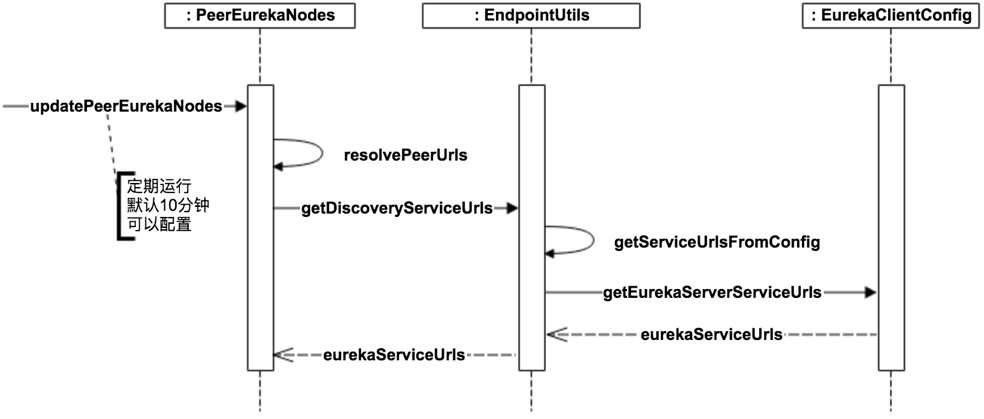

上一篇文章[Eureka(三)——client注册过程][1]中，我们详述了Eureka Client是如何完成注册、续约、获取服务、下线等操作的。本篇文章，我们来记述Eureka Server是如何工作的。

<!-- more -->

# Eureka基本架构


如果上图所示，Eureka的基本架构由3个角色组成：

1. Eureka Server

    提供服务注册和发现。它们之间会做注册服务的同步，从而保证状态一致
    
2. Service Provider

    服务提供方，将自身服务注册到Eureka，从而使服务消费方能够找到。它会向Eureka Server做Register（服务注册）、Renew（服务续约）、Cancel（服务下线）等操作

3. Service Consumer

    服务消费方，从Eureka获取服务列表，从而能够消费服务。它会向Eureka Server获取注册服务列表，并消费服务。

# Eureka Server启动过程

首先从SpringBoot的入口开始，@EnableEurekaServer的注解如下：

```java
@Target(ElementType.TYPE)
@Retention(RetentionPolicy.RUNTIME)
@Documented
@Import(EurekaServerMarkerConfiguration.class)
public @interface EnableEurekaServer {

}
```

它导入了另一个配置类`EurekaServerMarkerConfiguration`，这个类功能上没有任何用处，仅仅是添加了一个Marker bean，用来激活`EurekaServerAutoConfiguration`。

我们看到在`spring-cloud-netflix-eureka-server`的`spring.factories`文件中有如下配置：

```
org.springframework.boot.autoconfigure.EnableAutoConfiguration=\
  org.springframework.cloud.netflix.eureka.server.EurekaServerAutoConfiguration
```

`EurekaServerAutoConfiguraion`上加了`@ConditionalOnBean(EurekaServerMarkerConfiguration.Marker.class)`这样的配置，只有`EurekaServerMarkerConfiguration.Marker`存在的情况下它才能被激活。

## EurekaServerAutoConfiguration

在`EurekaServerAutoConfiguration`中会完成大部分Bean的新建：

1. EurekaServerConfig。服务配置
2. EurekaController。一个简单的Controller，负责eureka dashboard的显示，包括Node自身的信息，以及在该节点上保存的注册信息。
3. ServerCodecs。提供对json和xml的解析器
4. InstanceRegistry。它是注册服务的关键，继承`PeerAwareInstanceRegistryImpl`，提供了服务注册、续约、下线等操作。
5. PeerEurekaNodes。维护当前Eureka Server要同步的Peer Node，并通过一个定时任务维护Peer Node的信息。
6. EurekaServerContext
7. EurekaServerBootstrap
8. JerseyApplication
9. FilterRegistrationBean。把JerseyApplication作为一个Filter，设置最低优先级并过滤Eureka Context下面所有的请求。

## EurekaServerInitializerConfiguration

`EurekaServerAutoConfiguration`通过`@Import(EurekaServerInitializerConfiguration.class)`导入`EurekaServerInitializerConfiguration`。

`EurekaServerInitializerConfiguration`实现了`SmartLifecycle`接口的start方法，会在所有Spring bean都初始化完成后调用该方法。在start方法中调用`EurekaServerBootstrap.contextInitialized`来初始化Eureka Server：

## EurekaServerBootstrap

`EurekaServerInitializerConfiguration`的`start`方法中调用`EurekaServerBootstrap`的`contextInitialized`方法：

```java
public void contextInitialized(ServletContext context) {
    try {
        // 初始化eureka环境
        initEurekaEnvironment();
        // 初始化eureka上下文
        initEurekaServerContext();

        context.setAttribute(EurekaServerContext.class.getName(), this.serverContext);
    }
    catch (Throwable e) {
        log.error("Cannot bootstrap eureka server :", e);
        throw new RuntimeException("Cannot bootstrap eureka server :", e);
    }
}
```

- `initEurekaEnvironment`方法中初始化数据中心的信息以及eureka的运行环境
- `initEurekaServerContext`方法有如下步骤：

    1. 注册状态转化器，保持向后兼容
    2. 判断是否是亚马逊的数据中心
    3. 调用`EurekaServerContextHolder.initialize`初始化Eureka Server上下文
    4. 调用`PeerAwareInstanceRegistryImpl.syncUp`从相邻的eureka节点复制注册表。遍历获取到的服务注册信息，调用`AbstractInstanceRegistry.register`方法将服务注册到本地。
    5. 调用`PeerAwareInstanceRegistryImpl.openForTraffic`设置`expectedNumberOfRenewsPerMin`和`numberOfRenewsPerMinThreshold`的值，并将eureka的状态设为`UP`
    6. 调用`EurekaMonitors.registerAllStats`注册所有的监控

### PeerAwareInstanceRegistryImpl.syncUp

`PeerAwareInstanceRegistryImpl.syncUp`方法调用`getApplications()`从相邻的eureka节点复制注册表。然后遍历获取到的服务注册信息，调用`AbstractInstanceRegistry.register`方法将服务注册到本地。流程如下：


# Eureka Server实现细节

## InstanceRegistry

上文我们提高，`InstanceRegistry`类是注册服务的关键，提供了服务注册、续约、下线等操作。下图是它的继承关系：


我们再来看看Eureka Server几个对外接口的实现

## 服务注册

服务注册(register)接口接收Eureka Client的注册请求，其流程如下：


1. `ApplicationResource`类接收Http请求，调用`InstanceRegistry.register`方法
2. `InstanceRegistry.register`方法中记录日志并广播`EurekaInstanceRegisteredEvent`事件，接着调用父类`PeerAwareInstanceRegistryImpl`的`register`方法。
3. `PeerAwareInstanceRegistryImpl.register`方法有两步：

    1. 调用父类`AbstractInstanceRegistry`的`register`方法注册服务
    2. 调用`replicateToPeers`方法向其他Eureka Server节点(Peer)做状态同步

### AbstractInstanceRegistry.register

`AbstractInstanceRegistry.register`方法是服务注册最终发生的位置，代码（删除日志代码）如下：

```java
public void register(InstanceInfo registrant, int leaseDuration, boolean isReplication) {
    try {
        // 整个注册过程加读锁
        read.lock();
        // 从注册表中获取保存服务信息的map
        Map<String, Lease<InstanceInfo>> gMap = registry.get(registrant.getAppName());
        REGISTER.increment(isReplication);
        // 如果registry中不存在该服务的信息，则在registry中新建一个保存该服务信息的map
        if (gMap == null) {
            final ConcurrentHashMap<String, Lease<InstanceInfo>> gNewMap = new ConcurrentHashMap<String, Lease<InstanceInfo>>();
            gMap = registry.putIfAbsent(registrant.getAppName(), gNewMap);
            if (gMap == null) {
                gMap = gNewMap;
            }
        }
        // 获取该服务的注册信息，注册信息保存在Lease<InstanceInfo>中
        Lease<InstanceInfo> existingLease = gMap.get(registrant.getId());
        if (existingLease != null && (existingLease.getHolder() != null)) {
            // 如果该服务已经被注册过了，则比较已存在服务的lastDirtyTimestamp（existingLastDirtyTimestamp）和当前注册服务的lastDirtyTimestamp（registrationLastDirtyTimestamp）。
            // 如果existingLastDirtyTimestamp > registrationLastDirtyTimestamp，说明当前已存在的服务比要注册的服务新。将要注册的服务替换成已存在的服务
            Long existingLastDirtyTimestamp = existingLease.getHolder().getLastDirtyTimestamp();
            Long registrationLastDirtyTimestamp = registrant.getLastDirtyTimestamp();
            
            if (existingLastDirtyTimestamp > registrationLastDirtyTimestamp) {
                registrant = existingLease.getHolder();
            }
        } else {
            // 该服务之前没有被注册过
            synchronized (lock) {
                // 计算expectedNumberOfRenewsPerMin和numberOfRenewsPerMinThreshold
                if (this.expectedNumberOfRenewsPerMin > 0) {
                    this.expectedNumberOfRenewsPerMin = this.expectedNumberOfRenewsPerMin + 2;
                    this.numberOfRenewsPerMinThreshold =
                            (int) (this.expectedNumberOfRenewsPerMin * serverConfig.getRenewalPercentThreshold());
                }
            }
        }
        // 根据要注册的服务新建服务的注册信息
        Lease<InstanceInfo> lease = new Lease<InstanceInfo>(registrant, leaseDuration);
        if (existingLease != null) {
            // 如果服务之前已经注册过，保留服务注册的时间
            lease.setServiceUpTimestamp(existingLease.getServiceUpTimestamp());
        }
        // 保存服务注册信息
        gMap.put(registrant.getId(), lease);
        synchronized (recentRegisteredQueue) {
            recentRegisteredQueue.add(new Pair<Long, String>(
                    System.currentTimeMillis(),
                    registrant.getAppName() + "(" + registrant.getId() + ")"));
        }
        if (!InstanceStatus.UNKNOWN.equals(registrant.getOverriddenStatus())) {
            if (!overriddenInstanceStatusMap.containsKey(registrant.getId())) {
                overriddenInstanceStatusMap.put(registrant.getId(), registrant.getOverriddenStatus());
            }
        }
        InstanceStatus overriddenStatusFromMap = overriddenInstanceStatusMap.get(registrant.getId());
        if (overriddenStatusFromMap != null) {
            registrant.setOverriddenStatus(overriddenStatusFromMap);
        }

        InstanceStatus overriddenInstanceStatus = getOverriddenInstanceStatus(registrant, existingLease, isReplication);
        registrant.setStatusWithoutDirty(overriddenInstanceStatus);

        if (InstanceStatus.UP.equals(registrant.getStatus())) {
            // 设置服务状态变为UP的时间
            lease.serviceUp();
        }
        registrant.setActionType(ActionType.ADDED);
        recentlyChangedQueue.add(new RecentlyChangedItem(lease));
        registrant.setLastUpdatedTimestamp();
        invalidateCache(registrant.getAppName(), registrant.getVIPAddress(), registrant.getSecureVipAddress());
    } finally {
        read.unlock();
    }
}
```

注册的服务列表保存在registry变量中，它是一个嵌套的hashmap：

```java
private final ConcurrentHashMap<String, Map<String, Lease<InstanceInfo>>> registry
            = new ConcurrentHashMap<String, Map<String, Lease<InstanceInfo>>>();
```

- 第一层hash map的key是app name，也就是服务的应用名字。本例中为`EUREKA-CLIENT`
- 第二层hash map的key是instance id，也就是实例的id。本例中为`wangqideimac.lan:eureka-client:8762`

### PeerAwareInstanceRegistryImpl.replicateToPeers

`PeerAwareInstanceRegistryImpl.replicateToPeers`方法将服务复制到另外的Eureka Server节点上，其主要功能代码如下：

```java
for (final PeerEurekaNode node : peerEurekaNodes.getPeerEurekaNodes()) {
    // If the url represents this host, do not replicate to yourself.
    if (peerEurekaNodes.isThisMyUrl(node.getServiceUrl())) {
        continue;
    }
    replicateInstanceActionsToPeers(action, appName, id, info, newStatus, node);
}
```

遍历Eureka Server节点(`peerEurekaNodes.getPeerEurekaNodes()`)，排除自身节点，调用`replicateInstanceActionsToPeers`方法将服务同步到Eureka Server节点。

#### PeerEurekaNodes

`PeerEurekaNodes`类中保存Eureka Server的节点，以及相应的其他信息。其获取流程如下：

1. EurekaBootStrap.contextInitialized
2. EurekaBootStrap.initEurekaServerContext
3. DefaultEurekaServerContext.initialize
4. PeerEurekaNodes.start

##### peersUpdateTask

在`PeerEurekaNodes.start`方法中启动一个周期性的任务来更新Eureka Server的节点：

```java
taskExecutor.scheduleWithFixedDelay(
        peersUpdateTask,
        serverConfig.getPeerEurekaNodesUpdateIntervalMs(),
        serverConfig.getPeerEurekaNodesUpdateIntervalMs(),
        TimeUnit.MILLISECONDS
);
```

更新频率可以通过`eureka.server.peerEurekaNodesUpdateIntervalMs`来配置

peersUpdateTask是一个线程：

```java
Runnable peersUpdateTask = new Runnable() {
    @Override
    public void run() {
        try {
            updatePeerEurekaNodes(resolvePeerUrls());
        } catch (Throwable e) {
            logger.error("Cannot update the replica Nodes", e);
        }

    }
};
```

##### updatePeerEurekaNodes

peersUpdateTask线程体中调用`updatePeerEurekaNodes(resolvePeerUrls())`方法更新Eureka Server节点。流程如下：




`resolvePeerUrls()`方法调用`EndpointUtils.getDiscoveryServiceUrls`来获取所有Eureka Server节点的地址。该方法默认从配置文件中读取。

`updatePeerEurekaNodes`方法移除失效的节点，增加新的节点。

#### PeerAwareInstanceRegistryImpl.replicateInstanceActionsToPeers

`PeerAwareInstanceRegistryImpl.replicateInstanceActionsToPeers`方法的功能是将服务信息复制到另一个Eureka Server节点中。

它根据节点的不同操作：`Cancel`、`Heartbeat`、`Register`、`StatusUpdate`、`DeleteStatusOverride`，调用`PeerEurekaNode`的不同方法来完成服务信息的复制。这里实际上和Eureka Client对Eureka Server的操作是一样的。

## 服务续约

服务续约(renew)接口接收Eureka Client的续约请求，其流程如下：


1. `InstanceResource`接收服务续约请求，处理方法为`renewLease`。

    它调用`InstanceRegistry.renew`方法，然后判断`renew`方法返回的结果：

    1. 如果返回`true`：创建一个状态为200的响应返回
    2. 如果返回`false`：说明该服务并没有被注册，创建一个状态为404的响应返回，Client收到这个响应后注册该服务。
 
2. `InstanceRegistry.renew`方法首先广播`EurekaInstanceRenewedEvent`事件，然后调用父类`PeerAwareInstanceRegistryImpl`的`renew`方法
3. `PeerAwareInstanceRegistryImpl.renew`方法有两步：

    1. 首先调用父类`AbstractInstanceRegistry`的`renew`方法，
    2. 调用`replicateToPeers`方法将服务信息同步到另外的节点上。

### AbstractInstanceRegistry.renew

`AbstractInstanceRegistry.renew`方法是服务续约最终发生的位置，代码（删除日志代码）如下：

```java
public boolean renew(String appName, String id, boolean isReplication) {
    RENEW.increment(isReplication);
    Map<String, Lease<InstanceInfo>> gMap = registry.get(appName);
    Lease<InstanceInfo> leaseToRenew = null;
    if (gMap != null) {
        leaseToRenew = gMap.get(id);
    }
    if (leaseToRenew == null) {
        // 如果leaseToRenew为null，说明本地服务注册表里没有该服务的信息，即该服务之前没有被注册
        // 返回false，让Client先为该服务进行注册
        RENEW_NOT_FOUND.increment(isReplication);
        return false;
    } else {
        InstanceInfo instanceInfo = leaseToRenew.getHolder();
        if (instanceInfo != null) {
            InstanceStatus overriddenInstanceStatus = this.getOverriddenInstanceStatus(
                    instanceInfo, leaseToRenew, isReplication);
            if (overriddenInstanceStatus == InstanceStatus.UNKNOWN) {
                RENEW_NOT_FOUND.increment(isReplication);
                return false;
            }
            if (!instanceInfo.getStatus().equals(overriddenInstanceStatus)) {
                instanceInfo.setStatusWithoutDirty(overriddenInstanceStatus);
            }
        }
        renewsLastMin.increment();
        // 调用Lease.renew方法，更新lastUpdateTimestamp（最近续约的时间）
        leaseToRenew.renew();
        return true;
    }
}
```

## 服务下线

服务下线(cancel)接口接收Eureka Client的下线请求，其流程如下：


1. `InstanceResource`接收服务下线请求，处理方法为`cancelLease`。

    它调用`InstanceRegistry.cancel`方法，然后判断`cancel`方法返回的结果：

    1. 如果返回`true`：创建一个状态为200的响应返回
    2. 如果返回`false`：说明该服务并没有被注册，创建一个状态为404的响应返回。

2. `InstanceRegistry.cancel`方法首先广播`EurekaInstanceCanceledEvent`事件，然后调用父类`PeerAwareInstanceRegistryImpl`的`cancel`方法
3. `PeerAwareInstanceRegistryImpl.cancel`方法有两步：

    1. 首先调用父类`AbstractInstanceRegistry`的`cancel`方法，
    2. 调用`replicateToPeers`方法将服务信息同步到另外的节点上。
    3. 重新计算`expectedNumberOfRenewsPerMin`和`numberOfRenewsPerMinThreshold`

4. `AbstractInstanceRegistry.cancel`方法调用`InstanceRegistry.internalCancel`方法。
5. `InstanceRegistry.internalCancel`方法首先广播`EurekaInstanceCanceledEvent`事件，然后调用父类`AbstractInstanceRegistry`的`internalCancel`方法

### AbstractInstanceRegistry.internalCancel

`AbstractInstanceRegistry.internalCancel`方法用于下线任务，其流程如下：

1. 从服务注册表`registry`中将相应的服务删除
2. 如果服务注册表中不存在相应的服务，则返回`false`
3. 否则调用`Lease.cancel`方法，将`evictionTimestamp`设置为当前时间。然后返回`true`

## 服务获取

服务获取(fetch registries)接口接收Eureka Client的获取服务请求，其流程如下：


1. 调用`PeerAwareInstanceRegistryImpl.shouldAllowAccess`方法判断是否有权限获取服务信息
2. 根据请求生成`Key`
3. 使用`Key`从`ResponseCacheImpl`中获取服务信息。

    `ResponseCacheImpl`中的`readWriteCacheMap`是一个`LoadingCache`类型的变量，其中保存服务信息的缓存。如果`readWriteCacheMap`中没有保存某个key的值，或者某个key的值失效了，则调用`generatePayload`方法生成这个key的值。
4. 返回经过压缩的服务信息。

## 失效服务剔除

失效服务剔除(Eviction)用来定期在Eureka Server检测失效的服务，检测标准就是超过一定时间没有renew的服务。其流程如下：


失效服务剔除在`AbstractInstanceRegistry#EvictionTask`类中完成。它的启动流程如下：

1. PeerAwareInstanceRegistry.openForTraffic
2. AbstractInstanceRegistry.postInit，在postInit中启动EvictionTask，其执行的间隔周期默认为60秒
3. EvictionTask代码如下：

```java
public void run() {
    try {
        long compensationTimeMs = getCompensationTimeMs();
        logger.info("Running the evict task with compensationTime {}ms", compensationTimeMs);
        evict(compensationTimeMs);
    } catch (Throwable e) {
        logger.error("Could not run the evict task", e);
    }
}
```

1. 首先调用`getCompensationTimeMs()`方法获取补偿时间（毫秒）
2. 然后调用`evict`方法检测失效的服务。

### getCompensationTimeMs

```java
long getCompensationTimeMs() {
    long currNanos = getCurrentTimeNano();
    long lastNanos = lastExecutionNanosRef.getAndSet(currNanos);
    if (lastNanos == 0l) {
        return 0l;
    }

    long elapsedMs = TimeUnit.NANOSECONDS.toMillis(currNanos - lastNanos);
    long compensationTime = elapsedMs - serverConfig.getEvictionIntervalTimerInMs();
    return compensationTime <= 0l ? 0l : compensationTime;
}
```

补偿时间的计算公式为：当前时间 - 最后eviction任务执行时间 - eviction任务的执行间隔

### evict

```java
public void evict(long additionalLeaseMs) {
    logger.debug("Running the evict task");

    if (!isLeaseExpirationEnabled()) {
        logger.debug("DS: lease expiration is currently disabled.");
        return;
    }

    // 获取所有过期的租约
    // We collect first all expired items, to evict them in random order. For large eviction sets,
    // if we do not that, we might wipe out whole apps before self preservation kicks in. By randomizing it,
    // the impact should be evenly distributed across all applications.
    List<Lease<InstanceInfo>> expiredLeases = new ArrayList<>();
    for (Entry<String, Map<String, Lease<InstanceInfo>>> groupEntry : registry.entrySet()) {
        Map<String, Lease<InstanceInfo>> leaseMap = groupEntry.getValue();
        if (leaseMap != null) {
            for (Entry<String, Lease<InstanceInfo>> leaseEntry : leaseMap.entrySet()) {
                Lease<InstanceInfo> lease = leaseEntry.getValue();
                if (lease.isExpired(additionalLeaseMs) && lease.getHolder() != null) {
                    expiredLeases.add(lease);
                }
            }
        }
    }

    // To compensate for GC pauses or drifting local time, we need to use current registry size as a base for
    // triggering self-preservation. Without that we would wipe out full registry.
    // 计算最大允许请求租约的数量
    // 租约总数
    int registrySize = (int) getLocalRegistrySize();
    int registrySizeThreshold = (int) (registrySize * serverConfig.getRenewalPercentThreshold());
    // 最大允许清理的数量
    int evictionLimit = registrySize - registrySizeThreshold;

    // 清算清理租约数量
    int toEvict = Math.min(expiredLeases.size(), evictionLimit);
    if (toEvict > 0) {
        logger.info("Evicting {} items (expired={}, evictionLimit={})", toEvict, expiredLeases.size(), evictionLimit);

        // 逐个过期
        Random random = new Random(System.currentTimeMillis());
        for (int i = 0; i < toEvict; i++) {
            // Pick a random item (Knuth shuffle algorithm)
            int next = i + random.nextInt(expiredLeases.size() - i);
            Collections.swap(expiredLeases, i, next);
            Lease<InstanceInfo> lease = expiredLeases.get(i);

            String appName = lease.getHolder().getAppName();
            String id = lease.getHolder().getId();
            EXPIRED.increment();
            logger.warn("DS: Registry: expired lease for {}/{}", appName, id);
            internalCancel(appName, id, false);
        }
    }
}
```

1. 调用`PeerAwareInstanceRegistry.isLeaseExpirationEnabled`方法判断是否允许剔除失效服务。

```java
@Override
public boolean isLeaseExpirationEnabled() {
    if (!isSelfPreservationModeEnabled()) {
        // The self preservation mode is disabled, hence allowing the instances to expire.
        return true;
    }
    return numberOfRenewsPerMinThreshold > 0 && getNumOfRenewsInLastMin() > numberOfRenewsPerMinThreshold;
}
```

该方法和自我保护机制有关，如果`Renews(last min) < Renews threshold`，表示Eureka Server进入了自我保护模式，这时Eureka Server不再剔除失效服务。
    
2. 遍历整个服务注册表，调用`Lease.isExpired`方法判断租约是否过期，将过期的租约加入`expiredLeases`  

```java
public boolean isExpired(long additionalLeaseMs) {
    return (evictionTimestamp > 0 || System.currentTimeMillis() > (lastUpdateTimestamp + duration + additionalLeaseMs));
}
```

3. 计算最大允许清理租约的数量，以及允许清理租约的数量

    即使Eureka Server关闭自我保护机制，如果使用`renewalPercentThreshold = 0.85`默认配置，结果会是分批逐步过期，举个例子：
    
```
// 假设 20 个租约，其中有 10 个租约过期。

// 第一轮执行开始
int registrySize = 20;
int registrySizeThreshold = (int) (20 * 0.85) = 17;
int evictionLimit = 20 - 17 = 3;
int toEvict = Math.min(10, 3) = 3;
// 第一轮执行结束，剩余 17 个租约，其中有 7 个租约过期。
    
// 第二轮执行开始
int registrySize = 17;
int registrySizeThreshold = (int) (17 * 0.85) = 14;
int evictionLimit = 17 - 14 = 3;
int toEvict = Math.min(7, 3) = 3;
// 第二轮执行结束，剩余 14 个租约，其中有 4 个租约过期。
    
// 第三轮执行开始
int registrySize = 14;
int registrySizeThreshold = (int) (14 * 0.85) = 11;
int evictionLimit = 14 - 11 = 3;
int toEvict = Math.min(4, 3) = 3;
// 第三轮执行结束，剩余 11 个租约，其中有 1 个租约过期。
    
// 第四轮执行开始
int registrySize = 11;
int registrySizeThreshold = (int) (11 * 0.85) = 9;
int evictionLimit = 11 - 9 = 2;
int toEvict = Math.min(1, 2) = 1;
// 第四轮执行结束，剩余 10 个租约，其中有 0 个租约过期。结束。
```

是否开启自我保护的差别，在于是否执行清理过期租约的逻辑。如果想关闭分批逐步过期，设置`renewalPercentThreshold = 0`

4. 随机清理过期的租约。由于租约是按照应用顺序添加到数据，通过随机的方式，尽量避免单个应用被全部过期。调用`AbstractInstanceRegistry.internalCancel`方法下线过期的服务。

# 总结

Eureka Server中的关键类是`InstanceRegistry`，在其中完成以下的几个关键任务：

- 服务注册

    调用`AbstractInstanceRegistry.register`方法注册服务，再调用`replicateToPeers`方法向其他Eureka Server节点(Peer)做状态同步。
    
    服务列表保存在一个嵌套的ConcurrentHashMap中：`ConcurrentHashMap<String, Map<String, Lease<InstanceInfo>>> registry`：第一层hash map的key是app name，也就是服务的应用名字，本例中为`EUREKA-CLIENT`。第二层hash map的key是instance id，也就是实例的id，本例中为`wangqideimac.lan:eureka-client:8762`

- 服务续约

    调用`AbstractInstanceRegistry.renew`方法续约服务，再调用`replicateToPeers`方法向其他Eureka Server节点(Peer)做状态同步。

    续约的主要操作是更新`registry`中保存的服务实例的续约信息(`Lease`)，刷新其中的最近续约时间。

- 服务下线

    调用`AbstractInstanceRegistry.cancel`方法下线服务（最终调用的是`AbstractInstanceRegistry.internalCancel`方法），再调用`replicateToPeers`方法向其他Eureka Server节点(Peer)做状态同步。

    将相应的服务id从服务注册表`registry`中删除。如果服务注册表中不存在指定的服务id则返回`false`，否则调用`Lease.cancel`方法将`evictionTimestamp`设置为当前时间并返回`true`

- 服务获取

    服务获取功能在`ApplicationsResource.getContainers`方法中执行。它从缓存`ResponseCacheImpl`中获取服务信息。`ResponseCacheImpl`中有一个`LoadingCache`类型的变量`readWriteCacheMap`，其中保存服务信息的缓存。

- 同步服务到其他的Eureka Server节点

    调用`PeerAwareInstanceRegistryImpl.replicateInstanceActionsToPeers`。
    
    将服务信息复制到另一个Eureka Server节点节点中。根据服务不同的操作，向Eureka Server发送不同的HTTP请求。

- 剔除失效服务

    剔除失效服务是一个定时任务，它在`AbstractInstanceRegistry#EvictionTask`类中完成。其间隔时间在`EurekaServerConfig.getEvictionIntervalTimerInMs()`中配置，默认为60s。
    
    遍历服务列表，将失效的服务实例添加到失效服务列表中（失效服务指的是超过一定时间没有再次续约的服务，该时间由`LeaseInfo.durationInSecs`控制。默认为`DEFAULT_LEASE_DURATION`，即90秒），然后从中随机剔除掉一批失效服务（剔除的量由`renewalPercentThreshold`控制，默认为`0.85`）。

[1]: /articles/Spring-Cloud/Eureka(三)——client注册过程.html

> http://nobodyiam.com/2016/06/25/dive-into-eureka/
> http://blog.didispace.com/spring-cloud-eureka-register-detail/
> https://xli1224.github.io/2017/12/31/spring-cloud-eureka-server-analysis/
> http://www.iocoder.cn/Eureka/eureka-server-init-second/
> https://blog.tookbra.com/2017/08/25/Spring-Cloud-Eureka-Server-Source/index.html
> http://www.iocoder.cn/Eureka/instance-registry-evict/

